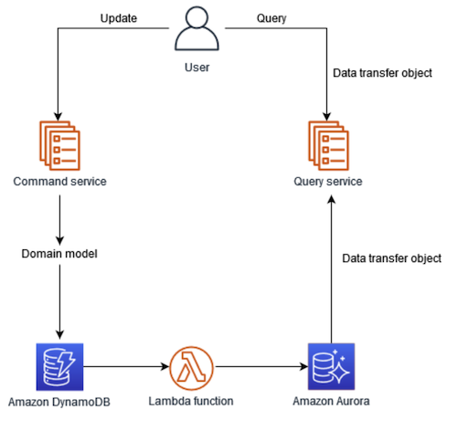

|ToC|
|---|

## Introduction

Most applications work with data. In this post, you will learn about the CQRS and Event Sourcing patterns. Two important patterns that is transforming the way we architect and manage data in modern software systems. In today’s fast-paced and data-driven world, the data tier is often the most common pain point and bottleneck in scaling your application. And, these two patterns are the essential foundations for a reliable, scalable and flexible architecture. We will cover practical tips, common pain points and how to apply these patterns with popular AWS database and analytics services. 

## Transitioning from CRUD to CQRS data pattern

Imagine you're part of a team developing an online store. Initially, a single relational database handles all CRUD (Create, Read, Update, Delete) operations, covering products, orders, customers, and more. As the store grows, challenges arise. Read operations slow down during peak times, and write operations become complex due to an increasing number of business rules.

To address these issues, the team considers adopting the [Command Query Responsibility Segregation (CQRS)](https://docs.aws.amazon.com/prescriptive-guidance/latest/modernization-data-persistence/cqrs-pattern.html) pattern. CQRS separates the handling of write and read operations, adding scalability and performance:

* **Command Model:** Manages write operations like creating or updating records, encapsulating the logic to change the system's state.
* **Query Model:** Manages read operations, optimized for retrieving information and possibly having different data representations for specific views.

This approach adds complexity but brings compelling benefits, making it a suitable solution for the growing needs of the online store.

### Utilising RDS Read Replicas as a simple form of CQRS

In a typical relational database, all read and write requests go to the primary database. By creating read replicas, the read requests can be diverted to one or more copies of the primary database. These replicas are read-only and stay synchronised with the primary database.

Using RDS read replicas represents a practical and relatively simple approach to implementing some aspects of the CQRS pattern. In the context of the online store, it offers an attractive option for enhancing performance and scalability without a complete overhaul of the existing system. While not as comprehensive or flexible as a full CQRS implementation, read replicas can be a valuable step in evolving an application's architecture to better meet growing demands.

Note: if you are leveraging Aurora as your primary database, it has a [local write forwarding](https://aws.amazon.com/blogs/database/local-write-forwarding-with-amazon-aurora/) feature. This means that your implementation can be further simplified, as your writes can be directed at your read replicas without impacting the read performance.

### Moving beyond a single database service

[Amazon DynamoDB](https://aws.amazon.com/dynamodb/), a NoSQL database known for its fast write capabilities, can be utilised as the *Command Model* in the CQRS pattern. By channeling all write operations through DynamoDB, developers can take advantage of its low-latency write performance. This includes actions like adding new products, processing orders, and any other operations that change the system's state.

Conversely, [Amazon Aurora](https://aws.amazon.com/rds/aurora/) can be employed as the *Query Model* to handle read operations. As a relational database engine optimized for read-heavy workloads, Aurora offers a scalable solution for listing products, checking order statuses, and other read tasks.

You can find a sample implementation of this architecture [here on Serverless Land](https://serverlessland.com/repos/cqrs-pattern-sam).

### Variations on CQRS 

#### DynamoDB and Redshift

Building on our exploration of CQRS with DynamoDB and Aurora, let's delve into a slightly different implementation. This variant combines the write capabilities of DynamoDB with the powerful querying strength of Amazon Redshift. It serves as an effective strategy, especially when analytical processing and large-scale querying come into play.

While Aurora is proficient, Amazon Redshift provides a distinct edge for analytical processing:

* **Parallel Querying**: It's tailored to dissect complex queries, ensuring comprehensive analytics isn’t bogged down by large datasets.
* **Columnar Storage:** This mechanism is particularly efficient for analytical query patterns. Read [this article](https://docs.aws.amazon.com/redshift/latest/dg/c_columnar_storage_disk_mem_mgmnt.html) to understand the advantages of columnar storage for analytical workloads.

This variant of the CQRS pattern, leveraging DynamoDB for writes and Redshift for queries, can be the secret sauce for applications that lean heavily on data analytics. While the initial setup demands thoughtful planning, the rewards in scalability, performance, and analytical depth make it a worthy consideration.

#### Amazon S3 and Athena

There is another avenue that's particularly enticing for those dealing with vast amounts of unstructured or semi-structured data and heavy analytical needs: leveraging Amazon S3 and Athena.

Amazon S3, known for its durability and scalability, is an excellent repository for large-scale data storage. This robust storage, combined with Athena's serverless querying capabilities, can help decouple the command model (writes) from the query model (reads) in a unique and compelling way.

Imagine an e-commerce platform. Daily, the platform collects gigabytes of data ranging from user clickstreams, purchase histories, product reviews, to inventory changes. Instead of traditional databases, the platform pours this data into an S3-based data lake.

Now, business analysts, without waiting for time-consuming ETL jobs, can instantly dive into Athena to run ad-hoc queries. They can investigate trends, forecast inventory needs, or even analyse user behavior, all while ensuring that the data ingestion (write operations) remains unaffected.

Amazon S3 and Athena's combination in the context of CQRS offers a paradigm shift for businesses drowning in data and analytical needs. While it may not replace traditional database-driven CQRS for every application, it shines brightly for scenarios demanding agility in data analysis without bogging down the write operations. You can find a [sample implementation](https://github.com/aws-samples/aws-athena-cqrs-pattern) of this pattern in our aws-samples repository.

### Considerations

While the Command Query Responsibility Segregation (CQRS) pattern provides a compelling solution for many architectures, it's essential to navigate its implementation with a keen awareness of the potential challenges. Let's delve into some considerations that may arise when applying CQRS on AWS:

* **Eventual vs Immediate Consistency:** The CQRS pattern, especially in distributed AWS environments, often leans towards eventual consistency. It's pivotal to evaluate whether this model aligns with your application's requirements.

* **Synchronising AWS Services**: If you're leveraging separate AWS services for read and write operations, ensuring consistent data synchronisation becomes crucial. 

* **Cost Impacts**: Operating distinct AWS services for command and query operations might elevate costs. It's essential to evaluate the financial trade-offs against the performance and scalability benefits.

## Using the Event Sourcing pattern to transition from monolith to microservices 

Event Sourcing pattern is also commonly applied alongside CQRS. With Event Sourcing, the application’s state are all stored as a sequence of events. These events are typically sent to a messaging service in order for services to consume the events. This has significant benefits as these events can be consumed by multiple microservices in parallel, and allowing them to be built and deployed independently.  

The event sourcing pattern works effectively with the CQRS pattern. Write operations can be made to the event store, and read operations can be made on views optimized for querying the latest state of the application. The below provides a guide on how to transition applications from a monolith to microservices using the two patterns.

### Understanding events using Domain Driven Design (DDD)

The first step in the transition is to understand events. One method is [Event Storming](https://serverlessland.com/event-driven-architecture/visuals/event-storming),  a workshop-based process which involves domain experts and engineers together. As part of a broader disciplined called [Domain Driven Design (DDD)](https://serverlessland.com/event-driven-architecture/visuals/eda-and-ddd), it can provide teams with guidance to many questions when transitioning to an event-driven microservices architecture. This includes how to organise teams and domains, [handling messages between services](https://serverlessland.com/event-driven-architecture/visuals/messages-between-bounded-context) and [developing a shared language](https://serverlessland.com/event-driven-architecture/visuals/ubiquitous-language).

### Designing an architecture to handle events

In an event-driven architecture, application components are decoupled between event *producers* and *consumers*. These are intermediated by an *event broker*. Here, a publish-subscribe messaging service such as [Amazon SNS](https://aws.amazon.com/sns/) for fan out, and [Amazon SQS](https://aws.amazon.com/sqs/) to reliably and durably communicate the events to microservices. 

In most cases, an *event store* such as Amazon S3 or Amazon DynamoDB is also required. This component stores all historical events which enable replay to the current state.

### Handling event-driven operations using Amazon EventBridge

For a holistic solution, consider [Amazon EventBridge](https://aws.amazon.com/eventbridge/). It provides capabilities designed for operating event-driven architectures. It supports filtering and routing to direct events to the right destination without spinning up infrastructure. It provides a schema registry so that engineering teams can easily search and access event structures on a self-service basis. 

Critically, it provides a replay and archive capability to aid in testing and troubleshooting of issues. Previously, this required creating a complex mechanism for logging and parsing the *event store*, and sending the relevant events back to the *event broker*. Since access to the applications that were producing the events may be difficult, this can provide significant operational challenges.

To learn more, see [event-driven architectures with Amazon EventBridge the AWS Well-Architected Framework: Serverless Lens](https://docs.aws.amazon.com/wellarchitected/latest/serverless-applications-lens/event-driven-architectures.html).

### Producing events 

The existing monolithic application can be updated to publish events to the *event broker*. Another pattern is to capture *Change Data Capture (CDC)* events from transactions that are already happening on your existing database. Here, the implementation varies depending on the database. For example, with Amazon RDS, you can use [AWS Database Migration Service (DMS) and Amazon Kinesis](https://aws.amazon.com/blogs/big-data/stream-change-data-to-amazon-kinesis-data-streams-with-aws-dms/) to stream change data. For Amazon DynamoDB, streams are supported natively with [DynamoDB Streams](https://docs.aws.amazon.com/amazondynamodb/latest/developerguide/Streams.html).

### Consuming events

Once the events are published, multiple services can subsequently consume the events in parallel. They can then replay events from an event store to compute the latest state of the application for their own data stores. Importantly, each service can be built, deployed and scaled independently. 

## Monolith to microservices on AWS

Many AWS customers have successfully used these patterns to grow and drive innovation. Most startups start with a monolith, which suits their needs at the early-stage. 

To scale, engineering teams transition to an event-driven microservices architecture on AWS. One customer example is the Immutable engineering team who authored a [technical blog post](https://engineering.immutable.com/sneak-peek-at-immutables-event-liberation-pipeline-part-1-c646dd6f8b98) outlining their implementation and successful experience with Amazon EventBridge. 

## Conclusion

In conclusion, the CQRS and Event Sourcing patterns are an antidote to common scalability challenges with your application. At its foundation, it is about optimising the way you handle your data reads and writes. At AWS, we often say “the right tool for the right job”. To implement these patterns, we provide a range of database and event-driven services. These provide the ingredients for a reliable, scalable and flexible infrastructure for your use cases and evolving needs. 

To learn more, see prescriptive guidance on the [CQRS](https://docs.aws.amazon.com/prescriptive-guidance/latest/modernization-data-persistence/cqrs-pattern.html) and [event sourcing](https://docs.aws.amazon.com/prescriptive-guidance/latest/modernization-data-persistence/service-per-team.html) patterns. Feel free to share any thoughts on any other implementations of Event Sourcing and CQRS with your AWS account team.