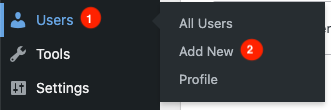

The Wordpress Bitnami deployment on Lightsail is designed to get up and running quickly and easily. However, like leaving your home for a vacation, it's always smart to check that the doors and windows are locked, appliances are turned off, and heating and cooling set appropriately.  When hardening Wordpress on Lightsail, we want to set rules guiding how a client or browser interacts with Wordpress and control administrative access. In this article, we’ll cover both methods by configuring the Apache .htaccess file and creating and managing Wordpress administrator roles.

## Basic Configuration

At it’s simplest, the Apache HTTP server uses .htaccess files tp set access permissions to directories. You can place an .htaccess file in a directory and it will apply to all the subdirectories. We can also add a .htaccess file in a directory that applies only to that directory. The [Apache documentation](https://httpd.apache.org/docs/2.4/howto/htaccess.html) has detailed examples for many use cases and is worth reviewing. However, we’ll focus on a Wordpress specific configuration.

1. Wordpress runs in the Apache web server. This means that securing a Lightsail Wordpress server requires configuring both Apache and Wordpress. The Apache configuration file is `wordpress-vhost.conf` in the `/opt/bitnami/apache/conf/vhosts` directory. Let’s examine this file first, open the file with an editor of your choice.

```shell
<VirtualHost 127.0.0.1:80 _default_:80>
  ServerName www.example.com
  ServerAlias *
DocumentRoot /opt/bitnami/wordpress
  <Directory "/opt/bitnami/wordpress">
    Options -Indexes +FollowSymLinks -MultiViews
    AllowOverride None
    Require all granted
```

A common security recommendation is to disable listing directory contents because it could expose files or code that affect Wordpress or Apache. A typical solution is to add a .htaccess file in each directory that prevents directory browsing.  The good news is that it is unnecessary with the Lightsail Wordpress because the Bitnami Wordpress blueprint is preconfigured to block directory listing. Let's see where this is configured.   

We’re interested in the lines following DocumentRoot in the `wordpress-vhost.conf` file. Note that the directory is set to `/opt/bitnami/wordpress`, and the directives inside the `<Directory>` section apply to that directory. The line `Options -Indexes +FollowSymLinks -MultiViews` configures Apache to disable directory listing with the `-Indexes` option in the `./wordpress` directory. Adding ./htaccess files to disable directory listing is not needed.

The following linse disables .htaccess files or blocks in a configuration file. 

```shell
AllowOverride None
```

However, there are additional changes to secure Wordpress. We want to set it to AllowOverride All to make those changes.

```shell
AllowOverride All
```

At the bottom of the `wordpress-vhost.conf` file, is the following line.

```shell
Include "/opt/bitnami/apache/conf/vhosts/htaccess/wordpress-htaccess.conf"
```

This line points to a file that contains all the .htaccess directives for Wordpress. When the Apache web server starts and reads the `wordpress-vhost.conf` file, it also read this file. Because we set `AllowOverride All`, Apache will use the .htaccess directives set in `wordpress-htacces.conf` file.

## Adding Security Headers

At the beginning of this article, we described checking doors and windows before leaving your house as typical security practice. We can add an extra layer of protection to Wordpress by adding security headers. What are security headers? They’re Wordpress directives that control how web requests are handled by both Wordpress and the client browser. They prevent injection and execution of malicious code such as [cross-site scripting attacks (XSS)](https://owasp.org/www-community/attacks/xss/).

The `wordpress-vhost.conf` file contains all the configuration directives for Wordpress making it easier to maintain. The default file will look similar to this with a directives for the [akismet anti-spam plugin](https://akismet.com/wordpress/). Add the security headers below after akismet configuration.

```shell
<Directory "/opt/bitnami/wordpress/wp-content/plugins/akismet">
  # Only allow direct access to specific Web-available files.
    ...
</Directory>
<Directory "/opt/bitnami/wordpress">
  <IfModule mod_headers.c>
    Header set Strict-Transport-Security "max-age=31536000; includeSubDomains; preload"
    Header set X-XSS-Protection "1; mode=block"
    Header set X-Frame-Options "SAMEORIGIN"
    Header set X-DNS-Prefetch-Control "on"
    Header set X-Content-Type-Options nosniff
    Header set Permissions-Policy "camera=(), microphone=(), geolocation=(), interest-cohort=()"
    Header set Content-Security-Policy "upgrade-insecure-requests; default-src 'none'; script-src 'self'; connect-src 'self'; img-src 'self'; style-src 'self';"0
    Header set Referrer-Policy "same-origin"
  /IfModule>
</Directory>
```

Let’s briefly examine what each directive means.

* **Strict-Transport-Security** allows acces only through HTTPS and HTTP requests are converted to HTTPS.
* **X-XSS-Protection "1; mode=block"** response header is a feature in modern web browsers that blocks pages from loading when they detect cross-site scripting (XSS) attacks. 
* **X-Frame-Options "SAMEORIGIN"** prevents the loading of your content in a frame, iframe, embed, or object on another website. [Clickjacking](https://owasp.org/www-community/attacks/Clickjacking) is an attack that uses iframes to trick a user to clicking on a link that sends them to another page with malicious code.
* **X-DNS-Prefetch-Control "on"** resolves the URL of documents and images and fetches the content to reduce latency when a user clicks on a link. Not all browsers support this directive, but it can decrease load time for Chrome and Edge browsers.
* **X-Content-Type-Options nosniff** blocks requests for styles and the MIME types that are not text/css, or if a script is requested and the MIME type is not a JavaScript MIME type
* **Permissions-Policy** controls which browser features in a document can be accessed. Features such as cameras or microphones are disabled when the `allowlist`, i.e., `()` is empty.
* **Content-Security-Policy** treats HTTP URLs as if they were HTTPS URLs and specifies which resources can be loaded such as JavaScript, WebSocket and HTML requests, images, and style sheets.
* **Referrer-Policy "same-origin"** controls how a script or document from one origin can load with a resource from another origin. Same-origin means that the protocol, host, and port are all the same. For example, `https:/example.com/index.html` is the same origin as `https://example.com/images/image.png`.

These security directives address [Man-In-the-Middle attacks](https://owasp.org/www-community/attacks/Manipulator-in-the-middle_attack) that can alter or expose data such as passwords. They also protect agains Cross-site scripting attacks that can inject malicious code that the application or web server executes.

## Remove Default Credentials

Sign into your Lightsail Wordpress instance with either your SSH client or with the browser-based SSH client in the Lightsail instance console.


When you list the home directory contents, there are two files (`bitnami_application_password` and `bitnami_credentials`) that let you log into Wordpress `/wp-login` page as an administrator.

```bash
$ ls
bitnami_application_password  bitnami_credentials  htdocs  stack

$ cat bitnami_application_password 
Sup3r.S3cr3t-PassW0rd

$ cat bitnami_credentials 
Welcome to the WordPress packaged by Bitnami

******************************************************************************
The default username and password is 'user' and 'Sup3r.S3cr3t-PassW0rd'.
******************************************************************************

You can also use this password to access the databases and any other component the stack includes.

Please refer to https://docs.bitnami.com/ for more details.
```

It is best practice to delete these files. Leaving these credentials on the server could allow an attacker to modify the Wordpress instance with malicious code or install insecure plugins. Before deleting the the files, copy the password. We will use it to sign in as an administrator to manage Wordpress settings and create a new administrative account.

```bash
$ rm bitnami*
```

## Create a Wordpress Administrator Account

Although we’ve deleted the credentials for the Wordpress administrator account, the default user account is still the Wordpress administrator. Removing the default administrator is one step to securing Wordpress. The next step is ton create a new administrator in the Wordpress admin console. To log into the administrator console by opening a browser to `http://<your-ip-address>/wp-login.php`. You can find the IP address of the service in the Lightsail console for the server.


Log into the wp-admin page with the user and bitnami credential.


In the menu on the left choose **Users** and **Add New**.



In the  new **User** form, fill in the fields appropriately, you can use the the generated password or create a new password. Make note of the password, set the `Role` to `Administrator`, and choose **Add New User**.


The new administrator account is displayed in the **Users** screen.


Because we’re logged in as the default admin, `user`, we need to log out of the account and sign in with the new administrator account. We want to delete the deautl `user` account because it's the default account. It's not uncommon to keep the default `user` account and change the password to a weaker but easier to remember password. To delete the default account, choose the user account in the `Users` panel, select **Delet**e, and choose **Apply**.


When you delete the default administrator account, you have the option to delete all it’s content or assign it to another user.


After deleting the default Wordpress administrator, the User page will display one account with the `Adminstrator` role.


## Summary

When first deployed, Wordpress on Lightsail has a basic security posture that prevents directory browsing. We can further harden Wordpress from attacks by controlling the type of requests between the client browser and Wordpress. In addition, we can remove the default administrator account and create a new administrative account not known to potential attackers. 

For more Wordpress best practices on AWS, check out the [AWS reference architecture for WordPress-powered websites](https://d1.awsstatic.com/whitepapers/wordpress-best-practices-on-aws.pdf?sc_channel=el&sc_campaign=post&sc_content=wordpressonlightsail&sc_geo=mult&sc_country=global&sc_outcome=acq&sc_publisher=amazon_media&sc_category=lightsail&sc_medium=body). You can learn more about Wordpress on AWS with these articles, [Create a Load Balanced WordPress Website](https://aws.amazon.com/tutorials/launch-load-balanced-wordpress-website/?sc_channel=el&sc_campaign=post&sc_content=wordpressonlightsail&sc_geo=mult&sc_country=global&sc_outcome=acq&sc_publisher=amazon_media&sc_category=lightsail&sc_medium=body) and [Deploying a high-availability WordPress website with an external Amazon RDS database to Elastic Beanstalk](https://docs.aws.amazon.com/elasticbeanstalk/latest/dg/php-hawordpress-tutorial.html?sc_channel=el&sc_campaign=post&sc_content=wordpressonlightsail&sc_geo=mult&sc_country=global&sc_outcome=acq&sc_publisher=amazon_media&sc_category=lightsail&sc_medium=body).