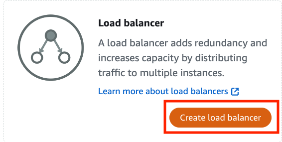

Deploying a Wordpress on AWS Lightsail is a fast and simple way to build a Wordpress site. However, our work is not done and we can harden the instance from malicious code and other attacks. AWS implements a shared responsibility model. Simply put, AWS maintains and secures the infrastructue, and as builders, we maintain and secure our applications and the operating systems.  If you’ve been part of a community garden, you’ll be familiar with the shared responsibility model. The owner of the garden provides the soil, plant beds, water for plants, and fencing to protect the garden. As a member you chose the plants, how they are planted, treat for harmful insects and diseases, and sufficiently water and fertilize the plants. Extending the analogy to the cloud, like the garden owner, AWS provides the infrastructure for applications and services to secure the infrastructure. As cloud builders, like a gardener, we’re responsible for maintaining our applications and protecting from external attacks.


In this article, we’ll tackle securing the Lightsail instance running Wordpress by securing your account, the Lightsail instance, and automating maintenance to keep your instances up to date. 

## Secure Your AWS Account

When you first create an AWS account, you begin with a single sign-in identity that gives you access to all AWS services and resources in your account. This identity is called the AWS account root user. You access it by signing in with the email address and password used to create the account. AWS strongly recommends against using the root user for your everyday tasks, even administrative tasks. Instead, adhere to the best practice of only using the root user to create your first Identity Access Management (IAM) user (see below), and securely lock away the root user credentials.

You can enable an extra layer of protection with [AWS multi-factor authentification (MFA)](https://aws.amazon.com/iam/features/mfa/), which requires a second authentication factor in addition to user name and password sign-in credentials. You can enable MFA at the AWS account level as well as for root and IAM users that you created in your account.

If you haven’t created an IAM user for administering your account follow these instructions.

Start by opening the IAM console, you can find (or any service) by searching for `IAM`.


Create an IAM user, for this example we’ll create an IAM user named Administrator. Choose Users in the menu on the left.


Choose **Create user**.


In the following screen, we’ll configure the user details. First, name the user (e.g., `administrator`) and select **Provide user access to AWS Management Console**. This option lets the user sign into the console and administer resources. For this demonstration, we are creating an account for a person, select **I want to create an IAM user**. We’ll leave the rest of the options, such as **Console password**, with the default values. Choose **Next**, to go to the next step.


We’ll need the autogenerated password to sign into the console for the first time. There are two ways to get the password. We can choose **Show** or **Download .csv file**. After saving the password, choose Return to user list.


Creating a group with administrator privileges is best practice. We can administer an account by adding and removing users from a group. The next step is to create and Administrators group with privileges to manage AWS resources. Choose  **User groups** in the menu on the left.


Choose **Create group**.


In the **Create user group** menu, we’ll name the group `Administrators` and select `administrator` to add to the group.


Next, we’ll attach the policy that allows members of the Administrators group to manage the AWS account. We can find the policy by filtering through the list of policies. First we’ll select **Type**.


Then we’lll select **Type: AWS managed - job function**.


Select the **AdministratorAccess** policy then choose **Create group**.


Sign out as the root user, and sign in as `administrator`. We can now work with the AWS account without exposing the the account owner’s credentials.

## Securing Access to AWS Lightsail Instances

A Lightsail instance is a virtual private server and you can control access to the server through the built-in firewall. The firewall in the Amazon Lightsail console controls the traffic allowed to connect to your instance through its public IP address. Each Lightsail instance has two firewalls: one for public IPv4 and another for public IPv6 addresses. We can edit the firewalls at any time by adding and deleting rules that allow or restrict traffic.

Adding rules to allow outside traffic can open your instances to security vulnerabilities and attacks such as DDoS or address spoofing. Deleting unused rules eliminates threats. As a Lightsail user, you should review open firewall rules and delete them when no longer needed. For example, if we only occasionally sign into the server to make changes, we could remove the SSH rule to prevent access through port 22. We can add the rule if we need need access to a terminal on the server.


A better alternative to removing rules is to restrict connections to a specific IP address. The example below demonstrates restricting SSH access to the IP address 10.10.10.35. 


Controlling access to the server is the first step towards securing the Lightsail instance.

## Encrypt Traffic to AWS Lightsail

Modern browsers expect websites to use HTTPS to secure traffic through encryption. Your Wordpress site should use HTTPS by default, especially if it's an e-commerce site or takes payments in some form. AWS Lightsail supports HTTPS if Wordpress is behind a [load balancer](https://lightsail.aws.amazon.com/ls/docs/en_us/articles/understanding-lightsail-load-balancers) or a [distribution](https://lightsail.aws.amazon.com/ls/docs/en_us/articles/amazon-lightsail-content-delivery-network-distributions) which is a Lightsail Content Distribution Networks (CDN). 

In this example, we’ll attach a load balancer to a Wordpress instance. In the Lightsail console, choose **Networking** in the menu on the left.


Choose **Create load balancer** in the `Load Balancer` page.



In our initial configuration we will have HTTP enabled, we’ll enable HTTPS in a later step.


We’ll name the load balancer and we can optionally add key-only tags and key-value tags that help us identify and logically group resources for billing and management. Choose  **Create load balancer**.

[Create a load balancer](./images/load-balancer-4.png)

After creating the load balancer, we will need it to attach it to our Lightsail Wordpress instance. In the **Target instances** section, select the Wordpress instance from the drop down menu item. Choose **Attach** to connect the load balancer to the Wordpress instance.


The next step is to create a [SSL/TLS (Secure Sockets Layer/Transport Layer Security) certificate](https://aws.amazon.com/what-is/ssl-certificate/) which allows the Wordpress server to create an encrypted connection between a browser and the site. This allows users to sign into a site without exposing their credentials and conduct transactions, such as payments, securely. Additionally, TLS certificates can verify ownership of the website, prevent attackers from creating a fake version of the site, and build trust with website visitors.

SSL/TLS certificates enable HTTPS encryption which ensures the traffic between the web server and the client’s browser remain confidential because these entities are the only two that can decrypt the traffic. Certificates are digital identity cards for securing network communications, and establishing the identity of websites and resources.

We can create and use a Lightsail certificate with these five steps: 

1. Create your Lightsail resource that can use a Lightsail certificate, such as a load balancer, CDN distribution, or container service.
2. Create a certificate for your domain using Lightsail. If you are using the Bitnami WordPress blueprint, you can run the bncert-tool by executing the command: 

```bash
sudo /opt/bitnami/bncert-tool 
```

3. Validate the certificate by adding a canonical name (CNAME) record to the DNS of your domain.
4. Attach the validated certificate to your Lightsail resource.
5. Modify the DNS of your domain to route traffic to your Lightsail resource.

After the certificate is attached to the resource, the traffic that is routed to that resource through the domain is encrypted using HTTPS. To create a certificate for our Wordpress instance, follow the [detailed tutorial for creating a Let’s Encrypt certificate](https://lightsail.aws.amazon.com/ls/docs/en_us/articles/amazon-lightsail-using-lets-encrypt-certificates-with-wordpress#install-certbot-on-your-instance-wordpress) for the server.

## Automate Lightsail Server Maintenance

At the beginning of the article, we introduced the AWS shared responsibility model. In addition to securing your account, controlling access to the server, and encrypting traffic between a client and the Wordpress server, updating the server and applying maintenance patches is part of securing a Lightsail server.

We can perform maintenance manually on a schedule, but if we automate updates, we can ensure that the Lightsail instance will be running the latest patches and security updates. We can configure unattended upgrades by changing the options in the `50unattended-upgrades` file found in `/etc/apt/apt.conf.d/` directory.

Let’s walk through the options for automating upgrades and security patches. By default, the file is configured to only update the security packages. Uncommenting the line below by deleting '//' updates the operating system. Note that this example is for a Debian Linux based operating system used by the Lightsail Wordpress blueprint.

```shell
// "origin=Debian,codename=${distro_codename}-updates";
```

Optionally, if you want to be notified of which packages were upgraded or if the the install encountered any problems uncomment the following line and add an email

```shell
// Send email to this address for problems or packages upgrades
// If empty or unset then no email is sent, make sure that you
// have a working mail setup on your system. A package that provides
// 'mailx' must be installed. E.g. "user@example.com“
Unattended-Upgrade::Mail "admin@example.com";
```

Note that mailx must be installed. To check if mailx is installed type the following command.

```bash
which mailx
```

If it’s installed, the path will be listed, e.g., `/usr/bin/mailx`. If it’s not installed and you want to use this feature, you can install mailx with apt.

```bash
sudo apt install mailutils
```

We can control the email based on the status of the update by uncommenting and changing the value of `Unattended-Upgrade::MailReport`.

```shell
// Set this value to one of:
// "always", "only-on-error" or "on-change"
// If this is not set, then any legacy MailOnlyOnError (boolean) value
// is used to chose between "only-on-error" and "on-change"
Unattended-Upgrade::MailReport "on-change";
```

The notification email will be similar to this example:


> Subject: Unattended upgrades on hostname
> 
> Unattended upgrades were installed on hostname:
> 
> The following packages were automatically installed:
> 
> python3-x2gobroker 0.0.4.3-1 python3-x3dh 0.5.8-2 python3-xapian-haystack 2.1.0-6 python3-xapian 1.4.18-1 python3-xapp 2.0.2-2 python3-xarray 0.16.2-2 python3-xattr 0.9.7-1+b1
> python3-xcbgen 1.14.1-1 python3-xcffib 0.8.1-0.8 python3-xdg 0.27-2 python3-xdmf 3.0+git20190531-7 python3-xdo 0.5-1 python3-xeddsa 0.4.6-2+b1 python3-xgboost 1.2.1-1 python3-xhtml2pdf 0.2.4-1 python3-xkcd 2.4.2-3 python3-xlib 0.29-1 python3-xlrd 1.2.0-2 python3-xlsxwriter 1.1.2-0.2 python3-xlwt 1.3.0-3 python3-xmlschema 1.4.2-1 python3-xmltodict 0.12.0-2 python3-xmmsclient 0.8+dfsg-21 python3-xmodem 0.4.6+dfsg-2 python3-xopen 1.1.0-1 python3-xrayutilities-dbg 1.7.1-1 python3-xrayutilities 1.7.1-1 python3-xrootd 5.0.3-4 python3-xstatic-angular-bootstrap 2.2.0.0-4 python3-xstatic-angular-cookies 1.2.24.1-5 python3-xstatic-angular-fileupload 12.0.4.0+dfsg1-3 python3-xstatic-angular-gettext 2.3.8.0-4 python3-xstatic-angular-lrdragndrop 1.0.2.2-3
> 
> The upgrades were installed automatically and no interaction was required.
> 
> Please check for any potential issues with the upgraded packages and contact the system administrator if any problems are found.
> 
> Unattended Upgrades

Keeping previous versions of kernels can consume disk space and degrade performance. You can delete them by setting the option to `true`.

```shell
// Remove unused automatically installed kernel-related packages
// (kernel images, kernel headers and kernel version locked tools).
Unattended-Upgrade::Remove-Unused-Kernel-Packages "true";
```

Like old kernels, unused dependencies consume disk space and could introduce vulnerabilities from outdated packages. They should be removed for best performance.

```shell
// Do automatic removal of newly unused dependencies after the upgrade
Unattended-Upgrade::Remove-New-Unused-Dependencies "true";
```

A reboot is necessary after a kernel upgrade, uncommenting and setting this option to true will reboot the system. 

```shell
// Automatically reboot WITHOUT CONFIRMATION if
//  the file /var/run/reboot-required is found after the upgrade
Unattended-Upgrade::Automatic-Reboot "true";
```

We can also set the time for the reboot when there is little or no traffic to the site. In the example below., the reboot is set for 2:00 AM.

```shell
// If automatic reboot is enabled and needed, reboot at the specific
// time instead of immediately
// Default: "now"
Unattended-Upgrade::Automatic-Reboot-Time "02:00";
```

Additionaly, We can configure the update frequency by editing the `20auto-upgrades` file. This file is in the same directory as the `50unattended-upgrades` file, i.e., `/etc/apt/apt.conf.d/`. The file sets the default values for updating the package lists and upgrades by setting the optio to `1` or true. We can also set the frequecny of package downloads by setting the number of days and when to clean the package cache.

```shell
APT::Periodic::Update-Package-Lists "1";
APT::Periodic::Unattended-Upgrade "1";
APT::Periodic::Download-Upgradeable-Packages “1”;
APT::Periodic::AutocleanInterval “7”;
```

This configuration updates the Lightsail server operating system and packages daily, and deletes the apt package cache every seven days. We can test our configuration by doing a dry run to find any errors.

```bash
sudo unattended-upgrades —dry-run —debug
```

You can find more information about the UnattendedUpgrades package on the [Debian wiki](https://wiki.debian.org/UnattendedUpgrades).

## Remove Application Logs

A high traffic website, or even a popular article or post, can generate many logs. To reduce the number of log files and conserve disk space, we should periodically delete logs. This script, `deletelogs.sh` removes the oldest three log files for Apache, MySQL, and PHP.

```shell
#!/bin/bash
sudo rm -f $( find /opt/bitnami/apache/logs -maxdepth 1 -iname 'access_log-' -type f | sort -r | tail -n +4 )
sudo rm -f $( find /opt/bitnami/apache/logs -maxdepth 1 -iname 'error_log-' -type f | sort -r | tail -n +4 )
sudo rm -f $( find /opt/bitnami/mysql/logs -maxdepth 1 -iname 'mysqld.log-' -type f | sort -r | tail -n +4 )
sudo rm -f $( find /opt/bitnami/php/logs -maxdepth 1 -iname 'php-fpm.log-' -type f | sort -r | tail -n +4 )
```

We can use the `crontab` utility to schedule the script. To edit `crontab` type the following command.

```bash
crontab -e
```

The crontab format has five fields to set the time and day separated by spaces and followed by the script we want to execute.

> * minute (0-59)
> * hour (0-23)
> * day of the month (1-31)
> * month of the year (1-12)
> * day of the week (0-7) 0 and 7 are both Sunday
> /path/to/script.sh

To schedule the log file deletion at 3:00 AM on Sundays, the crontab entry would be:

```bash
0 3 * * 0 /home/bitnami/scripts/deletelogs.sh
```

## Summary

We can ensure that our Lightsail Wordpress server is running securely and operating efficiently by taking these steps:

* securing our account information by creating an administrative user
* controlling access to the server by configuring the firewall appropriately
* encrypting traffic between browsers and the server by installing a SSL/TLS certificate
* automating operating system and security updates, and removing unnecessary files

These steps can reduce the blast radius of an attack. To learn more about Lightsail and Wordpress, check out the [Wordpress How-To Guides](These steps can reduce the blast radius of an attack. To learn more about Lightsail and Wordpress, check out the [Wordpress How-To Guides](https://aws.amazon.com/getting-started/hands-on/?getting-started-all.sort-by=item.additionalFields.content-latest-publish-date&getting-started-all.sort-order=desc&awsf.getting-started-category=*all&awsf.getting-started-content-type=*all&getting-started-all.q=wordpress&getting-started-all.q_operator=AND&awsm.page-getting-started-all=1?sc_channel=el&sc_campaign=post&sc_content=wordpressonlightsail&sc_geo=mult&sc_country=global&sc_outcome=acq&sc_publisher=amazon_media&sc_category=lightsail&sc_medium=body) in the Getting Started Resource Center.

Learn more about deploying application with Lightsail with these articles - [Deploy a Cloud Database to Scale a LAMP App](https://community.aws/tutorials/practical-cloud-guide/deploy-a-cloud-database-to-scale-lamp-app?sc_channel=el&sc_campaign=post&sc_content=wordpressonlightsail&sc_geo=mult&sc_country=global&sc_outcome=acq&sc_publisher=amazon_media&sc_category=lightsail&sc_medium=body) and [Deploy a Java Application on Linux](https://community.aws/tutorials/practical-cloud-guide/deploy-a-java-application-on-linux?sc_channel=el&sc_campaign=post&sc_content=wordpressonlightsail&sc_geo=mult&sc_country=global&sc_outcome=acq&sc_publisher=amazon_media&sc_category=lightsail&sc_medium=body).