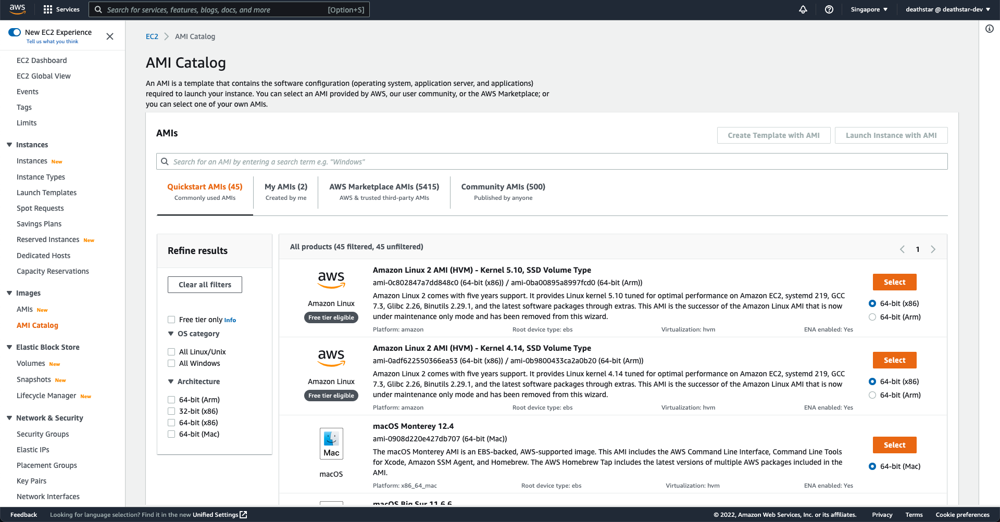
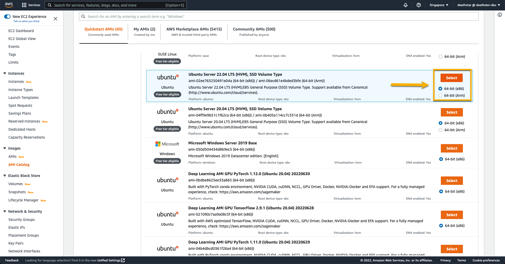
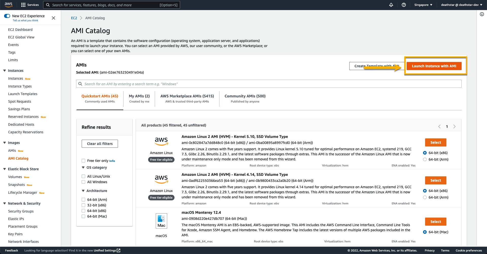
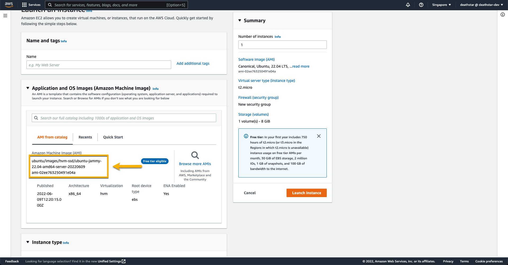
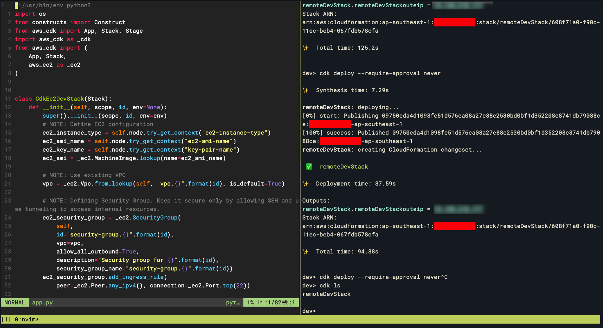
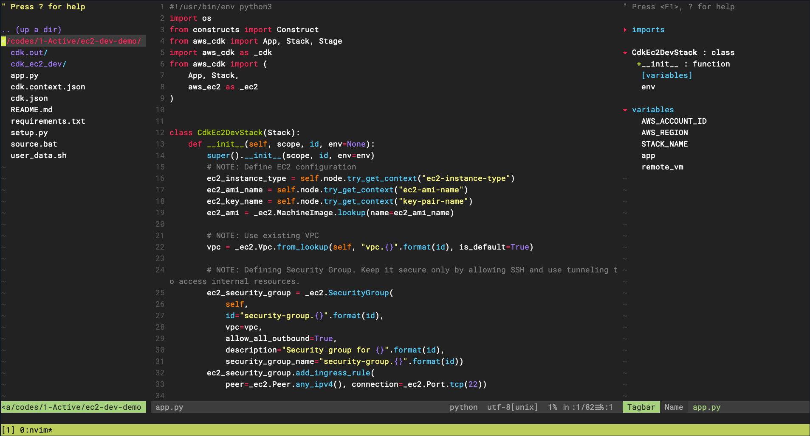
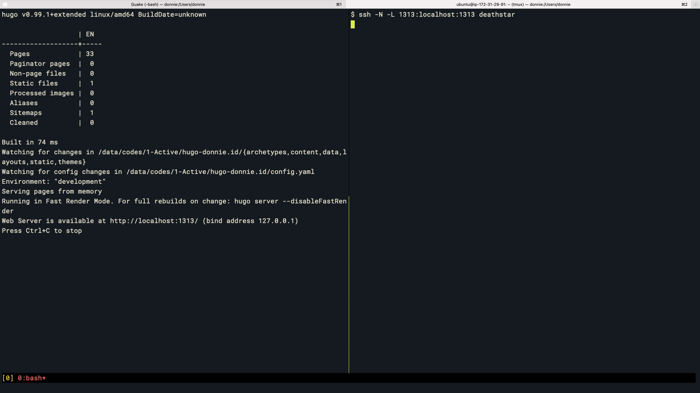
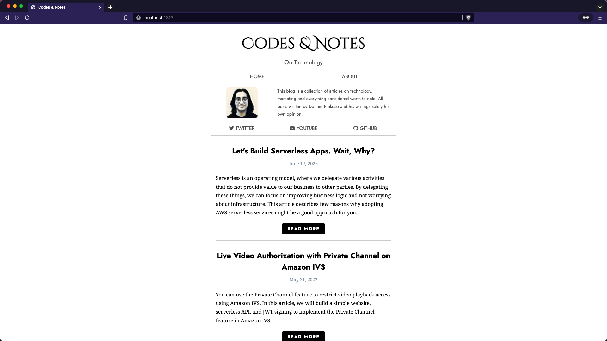
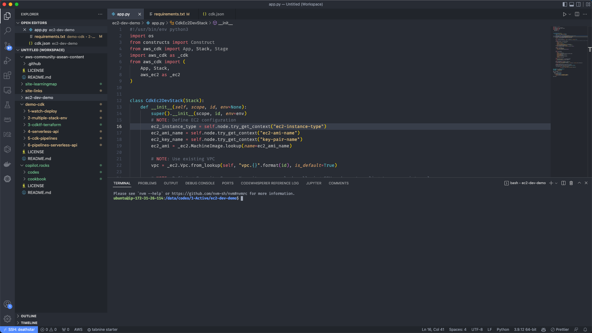

In this article, you will learn how to provision a virtual machine for your development environment. This will give you the freedom to work with any device, and the flexibility to configure the specifications to meet your needs.

## Context

In the last 5 years, I've switched from using a laptop for development to using a cloud VM as a development machine that I can access remotely. Various articles have explained the pros and cons of using a cloud VM as remote development. However, in this article, I will focus on how to deploy a cloud VM, using Amazon EC2 provisioned using AWS CDK.

This switch is for a number of reasons, but my main reason is effectiveness. I need a versatile machine that I can use for coding simple applications to training models for machine learning. With a VM, I can easily increase capacity as needed, and access the machine whenever I need using different devices — i.e. laptop, iPad, etc.

One thing to keep in mind is that there is no one-size-fits-all solution for your development environment. Not every developer can use remote development for various reasons, and it is not the purpose of this article to persuade you to use it. The goal of this article is more on how you can gain insight or ideas to enhance your development workflow.

> You can find the source code for VM provisioning with AWS CDK this GitHub repo: [donnieprakoso/remote-development](https://github.com/donnieprakoso/remote-development).

## Technical Overview

Before we get started, ensure that you have these requirements:

1. Active AWS account — you're going to need this as we provision EC2
2. Properly bootstrapped CDK — this is the main Infrastructure as Code tool we are going to use in this article

If you have them, let's get started!

## Step 1: Create a Key Pair for Amazon EC2

The first step is to create a key pair for EC2 Linux instances. If you haven't got one, you can follow [this tutorial](https://docs.aws.amazon.com/AWSEC2/latest/UserGuide/create-key-pairs.html) that explained clearly how to create a key pair. You need to save this file properly because this is the key to access your EC2.

## Step 2: Specify AMI Image Name and EC2 Type

AMI stands for Amazon Machine Image — a template for/from the EC2 instance, which we can use as the base image for our VM. In this article, we will use Ubuntu 22.04 with AMI image name: `ubuntu/images/hvm-ssd/ubuntu-jammy-22.04-amd64-server-20220609`

"But, wait, what if I want to use another AMI?" Glad that you ask it. Here are the steps that you can follow to get your AMI image:

First open the Amazon EC2 console and navigate to "AMI Catalog"



Select the AMI you will use by clicking on the `Select` button


Then, click the `Launch Instance with AMI` button — don't worry, we won't be launching the instance.



On the left, you can see the Amazon Machine Image (AMI), and this is the name of the AMI image we ordered. Copy this value to use in the next step.



In addition, you also need to define the [EC2 type](https://aws.amazon.com/ec2/instance-types/) that you want to use. Remember, there's no need to start with a high specification machine, until now I still use `t2.micro` and I only need to upgrade when I need more power.

## Step 3: Apply CDK App

Once you have all the information, you can now deploy EC2 with CDK. Of course, you need to do [installation of AWS CDK](https://docs.aws.amazon.com/cdk/v2/guide/getting_started.html#getting_started_install) and do [bootstrapping](https://docs.aws.amazon.com/cdk/v2/guide/getting_started.html#getting_started_bootstrap).

### Code Review

A wise developer once said: "Don't just deploy the CDK app because you can. Review the code first to understand how it impacts your AWS account." With that, let's do a quick code review to make sure you understand what the CDK app does:

#### CDK Context

The first thing we do here is get the value of the context we've defined in `cdk.json`. To define an EC2 AMI, we perform a lookup for a machine image so that we can use it when we define an EC2 instance.

```python
ec2_instance_type = self.node.try_get_context("ec2-instance-type")
ec2_ami_name = self.node.try_get_context("ec2-ami-name")
ec2_key_name = self.node.try_get_context("key-pair-name")
ec2_ami = _ec2.MachineImage.lookup(name=ec2_ami_name)
```

#### VPC

There is no need to isolate this instance from my other workloads, so I'm using the existing default VPC.

```python
vpc = _ec2.Vpc.from_lookup(self, "vpc.{}".format(id), is_default=True)
```

#### SECURITY GROUP

To ensure security access for our VM, only SSH accounts will be allowed. You can open other ports if necessary, but I recommend trying to work through SSH with SSH tunnel. Here's a nice article explaining how you can use [SSH tunnel with AWS Systems Manager](https://aws.amazon.com/premiumsupport/knowledge-center/systems-manager-ssh-vpc-resources/) to access your resources.

```python
ec2_security_group = _ec2.SecurityGroup(
    self,
    id="security-group.{}".format(id),
    vpc=vpc,
    allow_all_outbound=True,
    description="Security group for {}".format(id),
    secure.{}".format(id))
ec2_security_group.add_ingress_rule(
    peer=_ec2.Peer.any_ipv4(), connection=_ec2.Port.tcp(22))
```

#### EBS

Obviously, I'll need a persistent storage. I use Amazon EBS and not `root volume` so I have the flexibility to transfer the files to another VM when needed. Following lines defines EBS with device name `/dev/xvdf` which will be exposed in EC2 instance, with size 100Gb.

```python
ec2_ebs = _ec2.BlockDevice(
    device_name="/dev/xvdf",
    volume=_ec2.BlockDeviceVolume.ebs(100),
)
```

#### EC2

Next, we define the EC2 instance using all the properties we defined above.

```python
ec2 = _ec2.Instance(
    self,
    id="ec2.{}".format(id),
    instance_type=_ec2.InstanceType(ec2_instance_type),
    machine_image=ec2_ami,
    instance_name="ec2.{}".format(id),
    key_name=ec2_key_name,
    security_group=ec2_security_group,
    vpc=vpc,
    block_devices=[ec2_ebs]
)
```

#### USER DATA

You can also define user data — a set of commands typically used to perform common automated configuration tasks after the instance starts. Because I prefer to do manual configuration, I will leave this `user_data.sh` file empty. It's just more fun to start from scratch. Here's an article to learn more on how to [run commands on Linux instances at launch](https://docs.aws.amazon.com/AWSEC2/latest/UserGuide/user-data.html).

```python
with open('user_data.sh', 'r') as file_userdata:
    ec2.add_user_data(file_userdata.read())
```

#### EIP

Then, we need a static IP to access this VM. I use Elastic IP, a public IPv4 address and associate the assigned IP with my EC2 instance. Following lines define how to associate EIP with EC2:

```python
eip = _ec2.CfnEIP(self, id="eip.{}".format(id))
eip_association = _ec2.CfnEIPAssociation(
    self, id="eip-association.{}".format(id), eip=eip.ref, instance_id=ec2.instance_id)
```

### Deployments

There are two steps you need to do for deployment:

1. Define context in cdk.json file

```bash
  "context": {
    "ec2-ami-name": "<YOUR EC2 AMI NAME>",
    "key-pair-name": "<KEY PAIR NAME>",
    "ec2-instance-type": "<EC2 INSTANCE TYPE>"
  }
```

2. After that, run the deployment command:

```bash
cdk deploy
```

And that's it! Now you have EC2 that you can use for remote development and you can connect to the VM using the IP of the output CDK.

## Step 4: Post-deployment

Once you have EC2 up and running, you will still need to configure it for EBS manually.

### Connection with SSH

To configure EBS to be usable by your instances, you need to SSH.

```bash
ssh -i <KEY_PAIR_NAME> ubuntu@<VM IP>
```

### EBS Format

When you attach EBS to an EC2 instance, you need to format and mount it separately. The first thing we need to do here is format it, and you'll only need to do this once.

```bash
sudo mkfs -t xfs /dev/xvdf
```

### Mount EBS

In order to mount the EBS, we need to create a target mounting directory. Here I use `/data`.

```bash
sudo mkdir /data
sudo mount /dev/xvdf /data
```

After that, we need to change the ownership of `/data` to the current user (it should be `ubuntu`).

```bash
sudo chown `whoami` /data
```

### Automatic Mount EBS

At this stage, every time we reboot the instance, we need to remount it manually. I'm not a fan of manual step, we can configure for `/etc/fstab` so that our EBS volume will be mounted automatically in the `/data` folder.

Automatic mounting for EBS will make it easier for us to access data every time we make changes to the EC2 specification — such as from t3.nano to t3.small — because it will be mounted automatically after the `cdk deploy` process is complete.

There are several ways to mount EBS. My favorite approach is using UUID as it persists the right device for mounting. You can read more on this approach [here](https://docs.aws.amazon.com/AWSEC2/latest/UserGuide/ebs-using-volumes.html#ebs-mount-after-reboot).

First, we need to get the UUID of our EBS volume

```bash
sudo blkid | grep /dev/xvdf
/dev/xvdf: UUID="<VOLUME UUID>" BLOCK_SIZE="512" TYPE="xfs"
```

After that, we configure for `/etc/fstab`:

```bash
sudo vim /etc/fstab
UUID=<VOLUME_UUID> /data xfs defaults,nofail 0 2
```

After that we do testing with the following command:

```bash
sudo umount /data
sudo mount -a
```

If successful, you can list files for the `/data` directory:

```bash
ls /data/
```

## What's Next?

VM provisioning is an early part of using EC2 for remote development. At this point, you have a base for remote development and in this section, I'll describe some of the use cases you can do.

I use Homebrew to install various tools. [Homebrew](https://brew.sh/) is my favorite package manager, because it is a painless way to install anything on Linux and Mac. You can easily install Homebrew by running the command:

```bash
/bin/bash -c "$(curl -fsSL https://raw.githubusercontent.com/Homebrew/install/HEAD/install.sh)"
```

### Easy SSH Access

To be able to access your VM from a local laptop using SSH, you can use the following command:

```bash
ssh -i <KEY_PAIR> ubuntu@<EIP ADDRESS>
```

For easy access, you can shorten the following command by configuring it in the `~/.ssh/config` file.

```text
Host <HOST ALIAS>
     HostName <IP ADDRESS>
     ubuntu users
     IdentityFile ~/.ssh/<KEY PAIR FILENAME>
     ServerAliveInterval 120
```

Here's an example of my configuration:

```text
Host remote-dev
        HostName 1.2.3.4
        User ubuntu
        IdentityFile ~/.ssh/remote-dev.pem
        ServerAliveInterval 120
```

Now, you can easily SSH by running the command:

```bash
ssh <HOST ALIAS>
```

### Tmux: Multiple Views in Single Window

Working with remote development of course you will do most of the activities using the terminal. I use [Tmux](https://github.com/tmux/tmux/wiki) to make it easier for me to run various activities. Here's what Tmux looks like for multiple views:



Sometimes I also need to work in other areas and need a mechanism to return to the previous session. With Tmux, I can easily detach and resume sessions, providing a seamless way to switch back and forth.

### Coding with NeoVim

Of course, my primary goal is using the VM for coding. In this example, I am using Neovim. To get started with Neovim, you can install it with Homebrew using the following command:

```bash
brew install neovim
```

And here's how Neovim looks for demo and web development.



You can use Neovim config files which I used in this repo.

### SSH Tunneling for Web Development

Often I need to access the ports opened by my application on the remote VM. Whether it's for testing with Docker, developing a static website with Hugo, or as simple as running a web server with the `python -m http.server` module. To be able to access the port from a local laptop, you can tunnel by running the following command:

```bash
ssh -N -L <LOCAL PORT>:localhost:<REMOTE PORT> ubuntu@<IP ADDRESS>
```

For example, if I wanted to access port 8080 on my remote VM, I would run the following command:

```bash
ssh -N -L 8080:localhost:8080 ubuntu@123.456.78.9
```

And I can do access from my local laptop. Here's an example of me using this method to access my blog Hugo:



And now I can access it from my browser pointing to my `localhost`:



### Remote Coding with Visual Studio Code

You can also use Visual Studio Code to do remote development using the extension pack [Remote Development](https://marketplace.visualstudio.com/items?itemName=ms-vscode-remote.vscode-remote-extensionpack).

With this extension pack, you can use almost all the features in Visual Studio Code, although with a note that not all extensions can be used remotely.

Here's what Visual Studio Code looks like connected to the VM:



### Upgrade VM Specifications

I mentioned earlier in this article that I need the ability to upgrade the VM easily, and this is why I use CDK. Let's say that I want to have more vCPU on my VM, I can change this part on `cdk/cdk.json` file:

```json
"context":{
    ...
      "ec2-instance-type": "c5.xlarge"
}
```

Then, run the following command:

```bash
cdk deploy
```

Once the process is complete, you get a VM that has been upgraded, and still has the data in Amazon EBS.

## Conclusion

There are still many kinds of use cases that you can implement using a VM as remote development. From running mockups for AWS services using [Localstack](https://github.com/localstack/localstack) to using a VM as [GitLab runner](https://docs.gitlab.com/runner/).

The flexibility offered by VMs and configuration using CDK provides a variety of opportunities to implement use cases to support your development workflow remotely.

What's your use case? Or if there's something I forgot, let's discuss it in the comments below.

Happy building!
— Donnie
