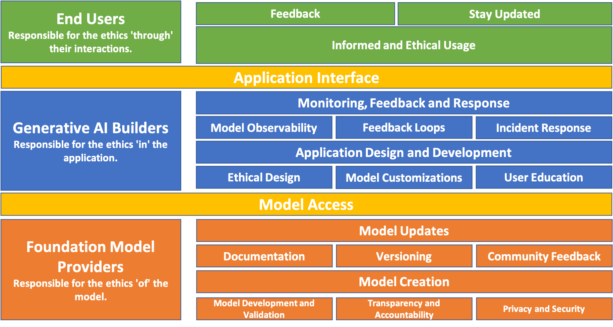
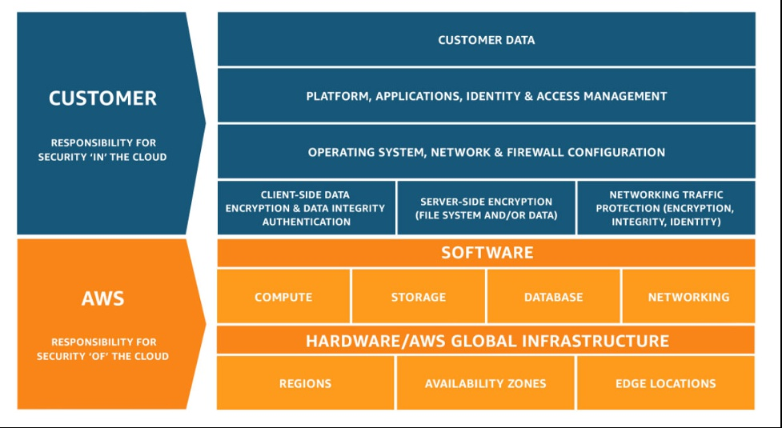

|ToC|
|---|

In our modern, tech-savvy world, Generative AI models are no longer the stuff of science fiction. They're here, transforming our interactions with machines and producing outputs that often feel uncannily human. Reminiscent of the cloud computing boom years ago, we are all eager to tap into the potential of these models. However, as with every powerful tool, they come with their own set of challenges.

Recall the initial days of cloud computing. The potential was enormous, but so were the concerns about security and responsibility. The landscape feels similar with Generative AI today. Navigating ethical usage is challenging. And when things go awry, where does the accountability lie? This territory remains ambiguous, with stakeholders often questioning their ethical responsibilities.

But as usual, history provides us with solutions. The [AWS Shared Responsibility Model](https://aws.amazon.com/compliance/shared-responsibility-model/), which once brought clarity to the world of cloud computing, can be our guiding light. Drawing inspiration from it, I suggest a structured model for Generative AI, aiming to define the roles and responsibilities from the core model providers to the end-users. 

## The Power and Peril of Generative AI
Generative AI stands as one of the most groundbreaking advancements in the realm of artificial intelligence. It represents the culmination of years of research and development, resulting in models that can generate content which, at times, is indistinguishable from human-created outputs. The applications of these models stretch far and wide, and while they hold immense promise, they also present significant challenges.

### The Good: Potential of Generative AI
The transformative power of Generative AI is evident across various domains, from enhancing productivity to fueling artistic creativity. Its capabilities offer solutions to long-standing challenges and open doors to new possibilities:

* **Productivity:** One [study](https://www.oneusefulthing.org/p/centaurs-and-cyborgs-on-the-jagged) found that consultants using AI finished 12.2% more tasks on average, completed tasks 25.1% more quickly, and produced 40% higher quality results than those without.
* **Art & Design:** AI-powered tools, such as Stable Diffusion, can create intriguing and [unique visual arts](https://www.reddit.com/r/StableDiffusion/comments/16ew9fz/spiral_town_different_approach_to_qr_monster/), pushing the boundaries of creativity.
* **Research & Innovation:** [Drug discovery](https://blogs.nvidia.com/blog/2023/06/27/insilico-medicine-uses-generative-ai-to-accelerate-drug-discovery/) and material science have seen AI models propose new compounds or solutions that might have taken humans years to conceptualize.

### The Bad: Risks of Generative AI
However, the very power that makes Generative AI transformative also poses risks when misused or misunderstood:

* **Deepfakes:** Perhaps one of the most notorious applications, deepfakes can create realistic-looking video footage of real people saying or doing things they never did. This poses risks for misinformation, fraud, and privacy invasion.
* **Misinformation:** AI-generated articles or news can spread false information, making it challenging to discern truth from fiction.
* **Bias & Discrimination:** If not trained correctly, Generative AI can perpetuate harmful stereotypes or biases. We've seen [AI models produce racially or gender-biased outputs](https://www.propublica.org/article/machine-bias-risk-assessments-in-criminal-sentencing), leading to public outcry.

As we've seen, Generative AI holds both incredible promise and potential pitfalls. But this duality isn't unique to AI. In fact, another technological realm faced similar challenges and provides a blueprint for navigating this complex landscape.

## Understanding Shared Responsibility in Cloud Computing

Long before the ethical challenges of Generative AI took center stage, the cloud computing industry faced its own maze of complexities. As organizations shifted their operations to the cloud, questions about security, accountability, and responsibility emerged. Who would be held accountable if data was breached? How could one be confident that the underlying infrastructure was secure? The landscape was filled with gray areas and ambiguities.

Enter the AWS Shared Responsibility Model, a framework that brought clarity by distinctly delineating the responsibilities between the cloud provider and the customer.

This clear division was a game-changer. It not only provided clarity but also empowered organizations. They could now harness the power of the cloud with a clear understanding of their role in ensuring security.

### Why It Matters for Generative AI 
Just as cloud computing needed a structured approach to security, Generative AI requires a structured approach to ethics. And while the specifics differ, the underlying principle remains the same: **responsibility is shared**. No single entity holds all the cards; instead, it's a collective effort, where each stakeholder plays a pivotal role.

## Ethics 'Of' the Model
In software development, every great application starts with a solid foundation: clean code, robust architecture, and clear documentation. Similarly, in Generative AI, the foundational models set the tone. These core models, designed, trained, and updated by model providers, are the foundation on which AI applications stand. Just as buggy code can crash an app, ethical lapses in these models can lead to unintended AI behaviors.

### Model Development and Validation
Developing an AI model is like writing a new software application. You pick the right tools, write the code (or in this case, feed the data), and then rigorously test to catch bugs.

* **Diverse and Representative Training:** Picking the right dataset is akin to choosing the right libraries for your app. You want data that's diverse, covers various scenarios, and lacks harmful biases to avoid skewed AI outputs.
* **Rigorous Testing and Validation:** Just as you wouldn't deploy an app without any quality assurance (QA), you shouldn't deploy an AI model without thorough testing. This step catches unintended biases, privacy issues, or security vulnerabilities.

### Transparency and Accountability
Documentation is a developer's best friend. Similarly, understanding how an AI model works and its capabilities is essential for its users and integrators.

* **Openness About Model Mechanics:** Just as good software comes with comprehensive documentation, AI models need clarity about their inner workings, training data, and limitations.
* **Commitment to Redress:** No software is bug-free, and neither is AI. When issues pop up, model providers, like good developers, take ownership, fix the problem, and iterate.

### Privacy and Security
Just as you wouldn't leave your app's database exposed, AI models need to respect user data and be resistant to threats.

* **Data Privacy Protocols:** Handling data during the training phase should be as careful as handling user data in an app — with respect and adherence to privacy standards.
* **Robust Security Measures:** Cybersecurity is as crucial for AI as it is for web applications. Fortifying models against potential threats keeps the AI's integrity intact.

By sticking to these foundational principles, Foundation Model Providers lay a robust and ethical base, much like the clean, efficient code that underpins a stellar software application

### Model Updates
Software developers know that code doesn't stay static. Patches, updates, and complete overhauls are par for the course to address bugs, improve performance, or add features. Similarly, not all AI models are static. As the world shifts and new data surfaces, these models need to adapt and refine. This dynamic nature isn't just about staying relevant; it's also about maintaining an ethical alignment. Here's what this update process should look like for AI:

* **Documentation:** Just as you'd update the README or API docs with a software patch or new release, AI model documentation has to reflect recent changes. This clarity helps developers navigate any alterations, giving them a comprehensive view of the model's capabilities, nuances, and best practices.
* **Versioning:** Navigating through software version histories can be enlightening, showing the evolution of a project. In a similar vein, every AI model update, whether it's minor tweaks or significant changes, needs clear versioning. This transparency lets developers trace the model's evolution and select the version that fits their application best.
* **Community Feedback:** The developer and AI communities teem with insights and expertise. Actively engaging with this community for feedback is invaluable for model providers. Whether it's highlighting overlooked biases, proposing improvements, or pointing out potential challenges, this collective feedback keeps the model both relevant and ethically aligned.

Recognizing the importance of Foundation Model Providers in setting the ethical groundwork for Generative AI, it's evident that a robust foundation is just the start. With this solid base, the next step is crafting applications that integrate seamlessly into our everyday lives.

## Ethics 'In' the Application
Just as a robust framework needs a well-built application to truly shine, foundational AI models require carefully crafted applications to realize their full potential. For developers, this means diving into the code, optimizing performance, and ensuring a smooth user experience. But, much like considering scalability or security, ethics should be a non-negotiable design criterion from the get-go.

### Application Design and Development
Building a Generative AI application is like building any other software product, but with an extra layer of complexity. The decisions you make, from the UI/UX design to the backend logic, have a direct impact on how users will interact with AI. It's not just about building a functional app; it's about building a responsible one. Here's what developers need to focus on:
* **Ethical Design:** Just as you'd architect your software to handle peak loads or secure user data, you need to plan for ethical use cases. Think about the broader implications. Could the AI be misused? How can you guide users towards responsible interactions? Being proactive in design can prevent a lot of ethical pitfalls later on.
* **Model Customizations:** Just as you'd tweak a library or an API to fit your application's needs, sometimes you'll need to adjust AI models. But remember, every tweak can have unintended consequences. It's like refactoring code; be careful not to introduce new bugs—or in this case, biases.
* **User Education:** Think of this as the onboarding process or the tooltips you'd have in your app. Users need to know not just how to use the AI, but also its capabilities and limitations. A well-informed user is less likely to misuse the AI or have unrealistic expectations.

### Monitoring, Feedback, and Response
Think of deploying an AI application like releasing a new software version. You've QA-tested it, maybe even beta-tested it, but once it's out in the wild, unexpected bugs or performance issues might crop up. Similarly, even a well-crafted AI application can behave differently in diverse real-world scenarios. That's where monitoring, feedback, and response come into play, helping developers keep the application aligned with ethical standards and user needs. Here's the breakdown:
* **Model Observability:** Just as you'd use performance monitoring tools to track an app's behavior, you need visibility into how the AI model performs in real-world scenarios. It's not just about flagging outliers; it's about gathering insights into how the model interacts across varied contexts.
* **Feedback Loops:** You know how invaluable user feedback can be for improving software. Similarly, users can shed light on how the AI is performing, revealing any oversights, suggesting tweaks, or pointing out ethical concerns that might have been missed. Having a robust system to collect and analyze this feedback is key.
* **Incident Response:** We've all had to roll out hotfixes for unexpected software bugs. In the AI world, if the model throws a curveball—a biased output or a weird recommendation—you need a game plan. This isn't just about a quick fix but understanding what went wrong and adjusting to prevent future hiccups.

It's clear that building an AI application isn't a "deploy and forget" task. The journey continues post-launch, adjusting and refining based on real-world interactions and feedback. And when users get their hands on the application, another layer of ethical responsibility emerges.

## Ethics 'Through' Interactions
Just as developers are central to the software ecosystem, end-users are at the core of the Generative AI experience. They're not just passive consumers; their interactions, feedback, and choices help shape the AI's behavior and direction. Let's look at the key touchpoints where users influence the ethical landscape of AI:

### Informed and Ethical Usage 
Think of AI tools as you would any software library or framework. Users need a solid grasp of what these tools offer, similar to understanding the functions of a new API or SDK.

* **Understanding Capabilities:** Knowing what AI can achieve is like understanding the features of a new software release. It helps users tap into the AI's strengths without expecting it to solve unsuitable tasks.
* **Recognizing Limitations:** Just as you'd be wary of bugs or limitations in a new software patch, it's essential for users to be aware of AI's potential biases or errors.

### Feedback: 
Remember the last time you appreciated user feedback for your app? AI models benefit similarly from user insights.

* **Voicing Concerns and Insights:** Just as user-reported bugs can lead to software improvements, feedback from AI users can help refine its performance and behavior.
* **Community Collaboration:** The way developers collaborate on open-source projects, AI users can share experiences and insights, collectively influencing the AI's direction.

### Staying Updated 
Similar to keeping your software dependencies updated, it's crucial for users to stay current with AI developments.

* **Embracing Updates:** Just as developers work with the latest software versions, users should interact with the most recent and refined AI iterations.
* **Continuous Learning:** Just as you'd catch up on the latest programming languages or frameworks, users benefit from keeping pace with AI advancements.

From the team developing the backend to the end-user clicking buttons on an interface, everyone has a role in shaping the ethical trajectory of AI. So, where is this journey taking us next in the AI realm?

## The Future of Ethical AI and Our Collective Journey
As we stand on the cusp of an AI-driven future, it's clear that Generative AI will play a pivotal role in shaping our world. Its potential to revolutionize industries, enhance creativity, and offer solutions to age-old problems is undeniable. Yet, as with all powerful tools, here are some of the challenges we must face together:

* **Dynamic Ethics:** The concept of ethics isn't static. What's deemed ethical today might be viewed differently tomorrow. Adapting to these evolving standards while ensuring consistent ethical AI usage will be a challenge.
* **Global Differences:** Ethical norms vary across cultures and regions. Creating AI models and applications that cater to global audiences while respecting local ethical standards will require finesse and understanding.
* **Technological Advancements:** As AI technology advances, new capabilities and potential pitfalls will emerge. Staying ahead of these changes and ensuring that ethics evolve in tandem will be paramount.

However, the challenges are not insurmountable. The shared responsibility model offers a structured approach, ensuring that all stakeholders, from model providers to end-users, play their part in navigating these challenges.

### Let’s Build Responsibly
Generative AI is not just a technological marvel; it's a testament to human ingenuity. But as we harness its power, we must also shoulder the responsibility that comes with it. The shared responsibility model isn't just a framework; it's a **call to action**. It reminds us that ethics in AI isn't the sole responsibility of a select few but a collective commitment.
As we march forward into an exciting AI-driven future, let's do so with purpose, responsibility, and a shared vision. A vision where Generative AI not only transforms industries but does so ethically, benefiting humanity as a whole.

For further reading I recommend you check out the Amazon Science blog on [responsible AI](https://www.amazon.science/blog/responsible-ai-in-the-generative-era?sc_channel=el&sc_campaign=genaiwave&sc_geo=mult&sc_country=mult&sc_outcome=acq&sc_content=shared_resp_gen_ai),[Ethan Mollick's Substack](https://www.oneusefulthing.org/) on how to leverage AI, and [Amazon's Generative AI Hub](https://aws.amazon.com/generative-ai/?sc_channel=el&sc_campaign=genaiwave&sc_geo=mult&sc_country=mult&sc_outcome=acq&sc_content=shared_resp_gen_ai).

## About the Author
Banjo is a Senior Developer Advocate at AWS, where he helps builders get excited about using AWS. Banjo is passionate about operationalizing data and has started a podcast, a meetup, and open-source projects around utilizing data. When not building the next big thing, Banjo likes to relax by playing video games, especially JRPGs, and exploring events happening around him.