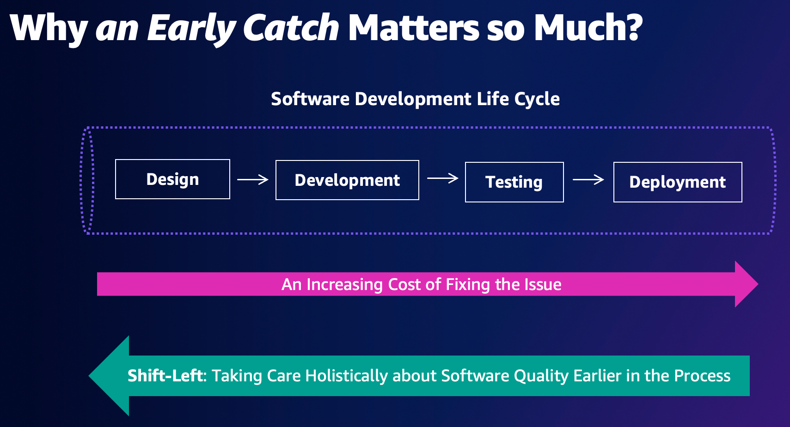
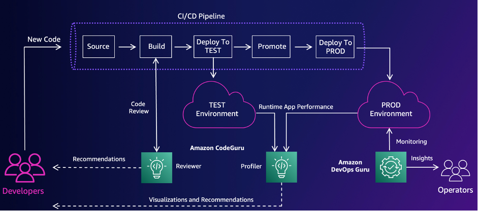
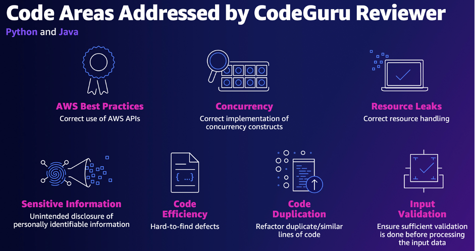

Starting on the 24th of November 2021, people that maintained JVM-based applications were terrified. Rumors that an exploit for a very popular logging library called _[Apache Log4j](https://logging.apache.org/log4j/2.x/)_ turned out to be true. [Log4shell](https://en.wikipedia.org/wiki/Log4Shell) was so severe because it could be easily exploited (even by _script kiddies_) and allowed for _remote code execution_.

It was not the first time such an incident appeared in the news headlines, but recovering from that was pretty usual – many companies spent significant time patching or remediating the issue. Unfortunately, the library's popularity definitely did not help in this case, as not only regular back-end implementations were affected, but many other workloads – like databases, messaging servers, and other critical infrastructure components.

Besides the usual recovery time, our industry asked again: what can we do to protect ourselves from such an impact in the future?

## Why should I shift to the left, though?

We should start from a very simple fact: **we cannot treat security as an afterthought when developing IT systems**. This is why the impact is so severe in such a situation. In other words: we should tackle this topic as early as possible in the software development life cycle (_SDLC_).

One trend in our industry has gained popularity and tackled this challenge. It is called _shift-left_ and refers to the transitioning of tough subjects tackled later in the software development process to the left-hand side – which means we deal with topics’ complexity earlier.



Why is that so important? Because the earlier we catch potential issues in the development process, the cheaper and less problematic fix will eventually be. That is true for common defects and software quality but also for security incidents as well.

An immediate follow-up question is: is it possible to catch everything at the beginning? The answer is more complicated, but it boils down to how much investment we want to make and the risk level with which we’re comfortable. Of course, the more will we invest, the better the security state we achieve – but a question about cost-effectiveness remains open and varies case by case.

You may also ask: how do we know the most problematic threats? That’s a great question, and that’s why approaching such topics from a [threat modeling](https://owasp.org/www-community/Threat_Modeling) perspective. It requires upfront investment (especially considering the time spent on the process) but gives the most significant return in the long run.

So, we know that we can move security topics earlier in the *SDLC* process, we have done threat modeling, and we have performed risk analysis that provided us answers about priorities. Does that mean we are safe and in better shape than previously?

More experienced and tenured people than me already told us that [there are no silver bullets](http://worrydream.com/refs/Brooks-NoSilverBullet.pdf), and the security topic is no different. At least we can strive for the best, but relying on our willpower is naive, to put it mildly. We need something more reliable, and everything boils down to well-understood and consistently executed processes, including those applying **automation** and **code review**.

The more stuff we automate during the software development phase, the more we are confident that the outcome will be predictable. This is a crucial trait for long-term maintainability, but it enables us to do more things. There are available battle-tested best practices that can provide a nice gain right after we introduce them – and we have tools and processes that can do that reliably.

## How to reliably move security to the left?

Speaking about more stuff we can do: we should leverage tools that will give us insights during the code review phase and point out obvious and non-obvious security issues discovered in our implementation.

A well-known technique helping with that is the _SAST_ approach, which stands for _Static Application Security Testing_. It is a testing methodology that analyzes source code to find security vulnerabilities that make your applications susceptible to attack. This is also known as the *white box testing* technique and is often represented as a tool that can be used inside your _SDLC_ process, e.g., in the *CI*/*CD* pipeline. This way, an automated solution will help you to detect problems at a much earlier stage.

As this approach seems relevant, you must be aware of one additional element: _doing the right thing on a security path has to be intuitive and easy_. Convenience is one of the elements that is often overlooked when enforcing security best practices. We can all agree that _peopleware_ (aka _humans_) is always the weakest link in the chain when it comes to security, and that’s not without reason – we tend to work around complicated and cumbersome processes.

To address that, cloud providers often refer to the [shared responsibility model](https://aws.amazon.com/compliance/shared-responsibility-model/), where the provider takes care of the security **of the cloud** and the customer takes care of security **in the cloud**. Providing such a model simplifies the scope, but at the same time, you need more precise recommendations on the implementation details.

AWS also helps with this by providing actionable advice in the form of [AWS Well-Architected Framework](https://docs.aws.amazon.com/wellarchitected/latest/security-pillar/welcome.html), in particular – with its _Security_ pillar. Thanks to that, you can leverage the best practices and knowledge of multiple teams built on AWS. It’s a great way to stand on the shoulder of giants and learn from someone else’s learnings.

## Let’s talk about the tools, finally!

If you look into the _SAST_ tooling landscape, you will see many choices, available as open-source or paid software. Speaking about choice, it is worth remembering that *doing the right thing on the security path should be easy*. However, adding an entirely new tool from an external provider can be challenging for organizations of any size. This is where listening to advice collected in the *AWS Well-Architected Framework* can actually pay off.

If your workloads are deployed on AWS, you can easily add a convenient and fully-managed tool from the _SAST_ landscape called [Amazon CodeGuru](https://aws.amazon.com/codeguru/), which helps with reviewing code of applications written in *Python* and *Java*.



And speaking about specific examples: [Amazon CodeGuru](https://aws.amazon.com/codeguru/) scans your code and provides insights about insecure usage of AWS API and SDKs. It proactively detects secrets and credentials hardcoded inside, common vulnerabilities (like mentioned at the beginning *Log4shell*, a [Log4j log injection attack](https://docs.aws.amazon.com/codeguru/detector-library/java/log-injection/)), and provides insights about the most popular [*OWASP*](https://owasp.org/www-project-top-ten/) security risks. I have not exhausted the list, and the catalog of detected issues is available [here](https://docs.aws.amazon.com/codeguru/detector-library/).



## Talk is cheap. Show me how it works!

If you would like to investigate how to use _CodeGuru_ in practice – I have prepared a _GitHub_ repository for you with the example: [aws-samples/amazon-codeguru-reviewer-github-actions-shift-left-example](https://github.com/aws-samples/amazon-codeguru-reviewer-github-actions-shift-left-example).

The example contains integration with _CI/CD pipeline_ represented in the form of *GitHub Actions* for two services written in _Java_ and _Python_, where we can detect potential security and performance issues with the help of the service mentioned above.

To create this integration, we must establish a relationship between _GitHub Actions_ and _Amazon CodeGuru_. The old-fashioned way would be easy: you can do this by creating _IAM User_, narrowing down the _IAM_ permissions, and creating _Access Key_ to bridge those two worlds.

However, there is a much better way - meaning: *more secure* one. You can use _OpenID Connect_ and _IAM Roles_, which will generate short-lived tokens with the help of _AWS Secure Token Service_ (_STS_) for a particular set of permissions IAM associated with that role.

We need two elements to use a better path – an _IAM Role_ and a custom _OIDC_ provider. They are created via _AWS CDK_ definitions inside the file [infrastructure/lib/infrastructure-shared-stack.ts](https://github.com/aws-samples/amazon-codeguru-reviewer-github-actions-shift-left-example/blob/main/infrastructure/lib/infrastructure-shared-stack.ts):


```typescript
// GitHub OIDC provider.

const oidcProvider = new CfnOIDCProvider(this, "GitHubOIDCProvider", {
  url: "https://token.actions.githubusercontent.com",

  clientIdList: [
    "sts.amazonaws.com"
  ],

  thumbprintList: [
    // This value is taken from here:
    // https://github.blog/changelog/2022-01-13-github-actions-update-on-oidc-based-deployments-to-aws

    "6938fd4d98bab03faadb97b34396831e3780aea1"
  ]
});

// ...

// GitHub OIDC role for Amazon CodeGuru Reviewer.

const roleForAmazonCodeGuruReviewer = new Role(this, "GitHubOIDCRoleForAmazonCodeGuruReviewer", {
  roleName: "amazon-codeguru-reviewer-oidc-web-identity-role",
  assumedBy:
    new WebIdentityPrincipal(
      oidcProvider.ref,
      {
        "StringLike": {
          "token.actions.githubusercontent.com:sub": 
            `repo:${props.organizationName}/${props.repositoryName}:*`
        },
        "StringEquals": {
          "token.actions.githubusercontent.com:aud": 
            "sts.amazonaws.com"
        }
      }
    )
});

roleForAmazonCodeGuruReviewer.addManagedPolicy(
  ManagedPolicy.fromAwsManagedPolicyName("AmazonCodeGuruReviewerFullAccess")
);

// ... and here is where we add more permissions, see the original file.
```

After that, you can create a _GitHub Actions_ pipeline that will have variables configured to work with your account (details are inside [.github/workflows/codeguru-reviewer-java.yml](https://github.com/aws-samples/amazon-codeguru-reviewer-github-actions-shift-left-example/blob/main/.github/workflows/codeguru-reviewer-java.yml) file):

```yaml
  # Configure AWS Credentials.
  - name: Configure AWS Credentials
    uses: aws-actions/configure-aws-credentials@v1
    with:
      role-to-assume: ${{ secrets.AWS_ROLE_FOR_CODEGURU_TO_ASSUME_ARN }}
      aws-region: ${{ secrets.AWS_REGION }}

    # Above, you can use Access Key from your IAM User, but that's a less secure path I've mentioned above.
    # Here is the documentation:
    #
    # https://github.com/marketplace/actions/configure-aws-credentials-action-for-github-actions

  # Add CodeGuru Reviewer Action
  - name: Amazon CodeGuru Reviewer
    uses: aws-actions/codeguru-reviewer@v1.1
    with:
      # Overriding a proper workflow name for the Amazon CodeGuru CI/CD association with the S3 bucket. Optional.
      name: codeguru-reviewer-${{ github.event.sender.login }}-${{ github.event.repository.name }}
      # Build artifacts directory with JAR files. Optional.
      build_path: services/bookworm-thumbnail-generator-service/build/libs
      # S3 Bucket to storing code artifacts. Required.
      s3_bucket: ${{ secrets.AWS_CODEGURU_REVIEWER_S3_BUCKET }}

  # Upload results to GitHub to present them in the UI.
  - name: Upload review results
    uses: github/codeql-action/upload-sarif@v1
    with:
      sarif_file: codeguru-results.sarif.json
```

Now, we can associate the desired repository by connecting it with our _GitHub_ account inside the wizard – and schedule an initial scan:


After a few minutes, you will receive the results of the initial scan inside the _Amazon CodeGuru Reviewer_ user interface:


Now, having a pipeline set up and properly configured, you can inspect in the same way each commit that lands on a particular branch, opened _pull request_ (_PR_), or merge. For example, here are the results for a new _PR_ that I have opened in the past:


## Is that everything?

Not at all! Having a fully-managed service added to your _CI/CD pipeline_, you can benefit from the constant growth and evolution done by the *Amazon CodeGuru* team on your behalf.

Also, from the perspective of software development processes, AWS provides a lot more support with additional tools and techniques - and you can find all recommendations inside [AWS Well-Architected Framework: Security Pillar](https://docs.aws.amazon.com/wellarchitected/latest/security-pillar/welcome.html). To give just one example – you can leverage the _[chaos engineering](https://principlesofchaos.org/)_ techniques and, with the help of the [AWS Fault Injection Simulator](https://aws.amazon.com/fis/) service, reliably manage and automate experiments in your path to a more robust and secure infrastructure.

I also encourage you to dive deeper into the [provided example](https://github.com/aws-samples/amazon-codeguru-reviewer-github-actions-shift-left-example) (e.g., how it tackles multiple languages in a single repository or a new feature in _CodeGuru_: [files exclusion and rules suppression](https://docs.aws.amazon.com/codeguru/latest/reviewer-ug/recommendation-suppression.html)).

Last but not least - if you have any questions, feel free to reach out in the comments below, my contact details on [my blog](https://awsmaniac.com/contact), or on social media: [Twitter](https://twitter.com/afronski), [Instagram](https://instagram.com/afronsky), or [LinkedIn](https://www.linkedin.com/in/afronski/).
