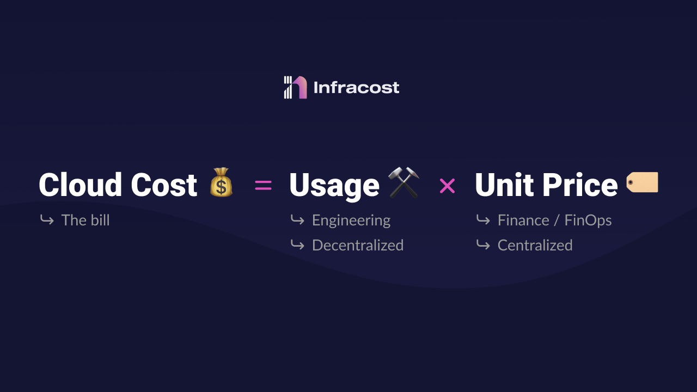

| ToC |
|-----|

### Introduction

I have some pretty strong beliefs when it comes to cloud costs, how they should be looked at, and who should be responsible for what.

First, lets go back to 2011. I was working in London for a major consulting company when my brother, Ali, who was doing his PhD in Cloud Computing, called me. He told me about a prototype he had built that could help companies assess the Total Cost of Ownership (TCO) of transitioning to the cloud. I got the train to Edinburgh that Friday, talked to him over the weekend, and quit my job on Monday. From there, we developed one of the first cloud cost management products available. And since then, we have remained in this field.

I tell this story because I’ve been deeply embedded in cloud costs and the different methods and attempts companies have made to reduce cloud costs, which ones work and which ones don’t.

I want to make three points in this blog. These points are what you, as engineers, can take to your management team to push for a engineering led FinOps practice. I will also show you what tool is available as the first step to shift cloud costs left (it's open source too!).

### 1. Understanding Cloud Usage is Key

Let's quickly cover the basics. When looking at cloud costs, it is helpful if we understand the [cloud cost formula](https://www.infracost.io/blog/cloud-cost-optimization-formula/):

**Cloud Cost = Usage x Unit Price**

The **Usage** component refers to the cloud resources you are provisioning - for example you have chosen an Amazon Elastic Compute Cloud (EC2) instance or a serverless AWS Lambda function to run your feature. This component of this formula is fully within your control. Engineering choose which services to use, how they are configured, set up, and even how the usage of those resources scale.

The **Unit Price** component refers to the rate you pay per-service per time-unit. For example, EC2 instances have a specific price rate based on instance size, family, region, OS etc. These resources can be purchased in multiple ways (on-demand, Reserved, Savings Plans etc). How the services are paid for is a financial decision. It doesn't impact the service and how it is run or managed, it just impacts the rate which will be charged.

The **Usage** component is the more important part of this formula. If an EC2 instance is not being used at all, it doesn’t matter if you save 60% of the cost via a purchase plan, it’s still 40% waste.

This is why the [FinOps practice](https://www.infracost.io/finops/) should be engineering-led. The core work that needs to be done under the FinOps umbrella requires engineering effort. Engineering is required for cost optimization, tagging of resources, and [right-sizing](https://community.aws/posts/rightsizing-the-right-way) decisions. Engineering is required to do the cost-benefit analysis for each action.

Now that you know the overall formula, try to identify where the biggest usage components of your infrastructure are. These will be your first target for optimization.

### 2. Understand Cloud Costs Before Making Changes

Many companies discuss the concept of shifting cloud costs left, but what they actually do is not shifting left.

Shifting left is defined as moving processes or tasks earlier in the development cycle to catch and address issues earlier, rather than waiting until later stages or after deployment.

Setting up alerting when a cost spike or anomaly happens is great, but that's not shifting left.

When we talk about shifting FinOps left, it means knowing how much the cloud costs ***before*** we spend the money. It means checking for the right tags and values ***before*** we merge the pull request. It means checking for best practice policies directly in ***our workflow***.

Keep this information in mind - at the end of this article, I'm going to show you a tool that you can deploy to automate these tasks.

### 3. Cloud Costs Are Complex

*We have code to write, features to ship, bugs to fix, and so on. Testing was shifted left; security was shifted left; if we keep shifting things left, we won't be coding anymore!* ... I hear what you are saying, and I agree. We can't just "shift it left" without putting in tools to help. We need the right information at the right time appended directly in our workflow.

In the great words of Gwen Stefani, *“this sh!t is bananas”*: [cloud costs are complex](https://www.infracost.io/blog/why-are-cloud-costs-so-complex/). Here at [Infracost](https://www.infracost.io), we maintain a comprehensive multi-cloud database comprising all resource prices from major cloud providers, totalling over 4 million prices! How do we expect anyone to know which price points are being used? We need to automate this to understand the cost impact of the changes before we spend the money. Non-engineering people are always surprised when I tell them that the cloud doesn't have a checkout screen!

That's the core reason why Infracost exists. We give you that checkout screen experience by simplifying these complex cloud costs and giving you an easy and automated way to know how much it will cost as you make changes to your infrastructure.

### FinOps Should Be Engineering-Led

If you wanted to get started managing your costs, you can install [Infracost](https://www.infracost.io/) into your GitHub or GitLab accounts (it is open-source, and has a free version).

As soon as you've installed it, every time someone makes Infrastructure as Code change, Infracost will leave a comment like *"this change is going to increase costs by 10% next month"* along with a detailed breakdown of the costs.

Knowing costs before spending money is the first step - that's our checkout screen. Next, you can set up checks to make sure [resources are tagged correctly](https://www.infracost.io/docs/infracost_cloud/tagging_policies/), best practice [cloud cost policies](https://www.infracost.io/docs/infracost_cloud/cost_policies/) are being followed, and [cost guardrails](https://www.infracost.io/docs/infracost_cloud/guardrails/) are put in place.

I hope I have given you some firepower and the next steps with cloud cost optimization. Push for FinOps to be engineering led, and if you want me to talk to your managers, tag me in!

Cheers,
[Hassan](https://www.linkedin.com/in/hassanhosseini/)