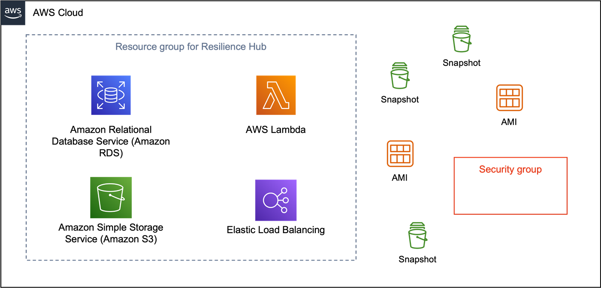

When I talk to customers who are running applications on the cloud, they all express concern over how they’ll keep their applications running and how they’ll recover quickly when there is a failure. Yes, “*when* there is a failure,” and not “*if* there is a failure,” because everything fails eventually. Whether it’s a few lines of “untested” code, a small configuration change, or a [deep sea fiber cable being severed due to shark attacks](https://www.wired.com/2014/08/shark-cable/) (apparently it’s a thing) that disrupts connectivity, you can be sure there will always be something that could cause your applications to fail. 

Although these customers are concerned about lost revenue and missed opportunities, they primarily just want to stay up and running so *their* customers get the best experience. And, as you likely know, modern applications are getting more complex all the time. How can developers and architects ensure their applications’ resilience?

In this blog post, we’ll explore the importance of application resilience and share six solutions — complete with scripts from the [AWS Resilience Hub tools](https://github.com/aws-samples/aws-resilience-hub-tools) repository (`aws-resilience-hub-tools`) — that you can use today with [AWS Resilience Hub](https://docs.aws.amazon.com/resilience-hub/latest/userguide/what-is.html?sc_channel=el&sc_campaign=resiliencewave&sc_content=knowyourappsareresilient&sc_geo=mult&sc_country=mult&sc_outcome=acq) to ensure your applications remain available, performant, and reliable, even in the face of unexpected events such as hardware failures, network outages, or natural disasters. Resilience Hub is a service that enables you to assess the resilience of your applications based on recovery targets you define. It provides two types of recommendations—resilience and operational — which will help improve the overall resilience of your application. Before exploring these tools, I advise you to familiarize yourself with how Resilience Hub works. If you do not already know this, you can [get hands-on experience with the workshop here](https://catalog.workshops.aws/aws-resilience-hub-lab/en-US?sc_channel=el&sc_campaign=resiliencewave&sc_content=knowyourappsareresilient&sc_geo=mult&sc_country=mult&sc_outcome=acq).  

Let’s take a look at how you can use the [AWS Resilience Hub tools](https://github.com/aws-samples/aws-resilience-hub-tools) repo (`aws-resilience-hub-tools`) with Resilience Hub to keep your apps up and running no matter what disaster strikes, *or when*.

## 1. Managing resilience targets at scale gets messy — use automation to make it easy

Recovery Time Objective (RTO) and Recovery Point Objective (RPO) are your *go to* measures for defining how your application will recover from disruptions, as these will define how long your application can be down and how much data you can tolerate losing. You can set these objectives in Resilience Hub using a [resiliency policy](https://docs.aws.amazon.com/resilience-hub/latest/userguide/create-policy.html?sc_channel=el&sc_campaign=resiliencewave&sc_content=knowyourappsareresilient&sc_geo=mult&sc_country=mult&sc_outcome=acq) to tell you whether you’re meeting these objectives or not. You can [read more about RTO and RPO here](https://aws.amazon.com/blogs/architecture/disaster-recovery-dr-architecture-on-aws-part-i-strategies-for-recovery-in-the-cloud?sc_channel=el&sc_campaign=resiliencewave&sc_content=knowyourappsareresilient&sc_geo=mult&sc_country=mult&sc_outcome=acq).

The [**(`create-resiliency-policy`)** solution, which you can download from here](https://github.com/aws-samples/aws-resilience-hub-tools/tree/main/create-resiliency-policy), is a CloudFormation template that can be used to specify the RTO and RPO for your applications and create a resiliency policy within Resilience Hub. You can then use [CloudFormation StackSets](https://docs.aws.amazon.com/AWSCloudFormation/latest/UserGuide/what-is-cfnstacksets.html?sc_channel=el&sc_campaign=resiliencewave&sc_content=knowyourappsareresilient&sc_geo=mult&sc_country=mult&sc_outcome=acq) to deploy these policies at scale across multiple AWS accounts and regions based on your organization's application criticality standards. Whether it's gold, platinum, diamond, or tier 0, tier 1, or tier 2, you can have these policies predefined, which makes it easier for application owners to use the right policy for each application.

**Create resiliency policy (`create-resiliency-policy`) can be found [here](https://github.com/aws-samples/aws-resilience-hub-tools/tree/main/create-resiliency-policy).**

## 2. Lots of resources don’t need to be looked at by Resilience Hub — reduce the clutter

Resilience Hub assesses resilience of your application. To define which cloud resources are part of this application, Resilience Hub enables you to [import these resources using a few different methods](https://docs.aws.amazon.com/resilience-hub/latest/userguide/discover-structure.html?sc_channel=el&sc_campaign=resiliencewave&sc_content=knowyourappsareresilient&sc_geo=mult&sc_country=mult&sc_outcome=acq). One of those methods is to use [AWS Resource Groups](https://docs.aws.amazon.com/ARG/latest/userguide/resource-groups.html?sc_channel=el&sc_campaign=resiliencewave&sc_content=knowyourappsareresilient&sc_geo=mult&sc_country=mult&sc_outcome=acq). Resource groups are useful for situations where application infrastructure was provisioned and configured manually, or when teams used a mix of manual provisioning and infrastructure-as-code. The CloudFormation template included in the solution [here](https://github.com/aws-samples/aws-resilience-hub-tools/tree/main/create-resource-group-for-resilience-hub) can create a resource group by applying appropriate resource type filters so that only the resource types supported by Resilience Hub are selected. This greatly reduces clutter and gives you a better understanding of the resources being assessed within Resilience Hub. Without this filter, this resource group can grow to contain hundreds, or thousands of resources, obscuring your view of your application.

**Create a resource group for use with Resilience Hub (`create-resource-group-for-resilience-hub`) can be found [here](https://github.com/aws-samples/aws-resilience-hub-tools/tree/main/create-resource-group-for-resilience-hub).**

## 3. Using GitHub Actions for CI/CD? — Yes, you too can implement continuous resilience

For a very long time, development and operations were performed by two distinct, separate teams. Eventually, the concept of [DevOps](https://www.buildon.aws/concepts/devops-essentials?sc_channel=el&sc_campaign=resiliencewave&sc_content=knowyourappsareresilient&sc_geo=mult&sc_country=mult&sc_outcome=acq) came to be, leveraging automation for continuous integration and continuous delivery (or deployment). Once organizations realized the value this added, a new paradigm was introduced by adding security — DevSecOps — ensuring security wasn’t sacrificed for agility. 

This paradigm has once again shifted with the idea of continuous resilience (DevSecResOps, if you prefer, but I’m frankly done with adding more abbreviations to an already Frankensteinesque term). In [this excellent blog post](https://aws.amazon.com/blogs/architecture/continually-assessing-application-resilience-with-aws-resilience-hub-and-aws-codepipeline?sc_channel=el&sc_campaign=resiliencewave&sc_content=knowyourappsareresilient&sc_geo=mult&sc_country=mult&sc_outcome=acq), Scott and Eli describe integrating resilience checks as part of your CI/CD pipeline and use AWS CodePipeline as an example. While CodePipeline is certainly popular, it is not the only CI/CD toolset available. Customers also use GitHub Actions for orchestrating releases. The `github-actions-integration` solution provides a walkthrough of how you can add resilience checks to your pipelines by integrating Resilience Hub with [GitHub Actions](https://docs.github.com/en/actions) and contains sample code that you can use to get started. 

**Integrate with GitHub Actions (`github-actions-integration`) can be found [here](https://github.com/aws-samples/aws-resilience-hub-tools/tree/main/github-actions-integration).**

## 4. Your data, your way — get access to the rich data you need about your application resilience

We live in an era of data, and large amounts of it. With the addition of context, data becomes information that can provide valuable insights and help you make well-informed decisions. Resilience Hub provides rich and granular data as part of application assessments, which is extremely useful to application owners and teams who want to understand the resilience of their applications and how to improve it. As you go higher up the corporate chain of command, this level of granularity, data about a single application, becomes less meaningful. A director or VP or CxO would want to view resilience data in an aggregated manner, such as across the entire line of business, or even the entire organization.

The `resilience-hub-csv-export` script uses [Resilience Hub APIs](https://docs.aws.amazon.com/resilience-hub/latest/APIReference/Welcome.html?sc_channel=el&sc_campaign=resiliencewave&sc_content=knowyourappsareresilient&sc_geo=mult&sc_country=mult&sc_outcome=acq) to extract resilience data for the applications that you have defined and assessed within Resilience Hub, and generates a CSV file. This file can then be fed into a business intelligence tool of your choice for analytics and reporting to show how applications across the portfolio are faring with respect to defined resilience objectives.

**CSV export for Resilience Hub (`resilience-hub-csv-export`) can be found [here](https://github.com/aws-samples/aws-resilience-hub-tools/tree/main/resilience-hub-csv-export).**

## 5. See your data all in one place — create interactive dashboards across your applications

You can create a fully automated resilience reporting dashboard using the `resilience-reporter` solution. The dashboard can serve as a central place for leadership and other stakeholders to get information regarding your organization's mission critical applications. For example, if the compliance team needs to report on certain applications' resilience each month, this dashboard would allow them to self-service that information.

The `resilience-hub-csv-export` script is run inside an AWS Lambda function, which is invoked periodically by an Amazon EventBridge rule. The CSV file that is generated is stored in an Amazon S3 bucket before being ingested into Amazon QuickSight for visualization.

**Resilience reporter (`resilience-reporter`) can be found [here](https://github.com/aws-samples/aws-resilience-hub-tools/tree/main/resilience-reporter).**

## 6. Keep it secure — create security credentials across multiple accounts

Daily assessments for your applications are a good idea. As datasets grow, and new features and changes are deployed, you need to know if your application resilience is still at the level you expect. For situations where you can’t integrate Resilience Hub into your CI/CD pipeline, or don’t have a CI/CD pipeline, you can still use Resilience Hub to configure daily assessments for your applications. AWS uses something called an [IAM role](https://docs.aws.amazon.com/IAM/latest/UserGuide/id_roles.html?sc_channel=el&sc_campaign=resiliencewave&sc_content=knowyourappsareresilient&sc_geo=mult&sc_country=mult&sc_outcome=acq), which gives Resilience Hub the necessary permissions to assess the resilience of your application. The solution [here](https://github.com/aws-samples/aws-resilience-hub-tools/tree/main/scheduled-assessment-role) is a CloudFormation template that can be deployed to create the IAM role that you need. This IAM role is [minimally scoped (least-privilege)](https://docs.aws.amazon.com/wellarchitected/latest/security-pillar/sec_permissions_least_privileges.html?sc_channel=el&sc_campaign=resiliencewave&sc_content=knowyourappsareresilient&sc_geo=mult&sc_country=mult&sc_outcome=acq) and Resilience Hub is the only principal that can use it. Similar to the `create-resiliency-policy` solution, this can solution can be deployed across multiple AWS accounts using CloudFormation StackSets for when you need to run daily resilience assessments using Resilience Hub across these accounts.

**Identity and Access Management (IAM) role for Resilience Hub (`scheduled-assessment-role`) can be found [here](https://github.com/aws-samples/aws-resilience-hub-tools/tree/main/scheduled-assessment-role).**

### Conclusion

I have shared with you these six solutions to common challenges one may face in setting and assessing resilience targets for your application. To make solving these problems easier, I created the [`aws-resilience-hub-tools`](https://github.com/aws-samples/aws-resilience-hub-tools) repository, a set of tools that help you create easy solutions when looking to enhance your AWS Resilience Hub usage. By using this collection of tools and solutions, which can be customized and integrated into your workflows, you can maximize efficiency and improve application resilience through simplified policy creation, streamlined resource management, and better data visualization and analysis.

We appreciate any contributions from you in improving the existing solutions, or creating something new. Please visit the [CONTRIBUTING](https://github.com/aws-samples/aws-resilience-hub-tools/blob/main/CONTRIBUTING.md) page on the repository for more information.
