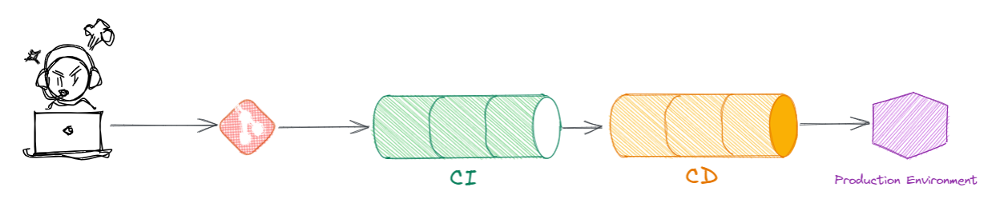

In this article you are going learn why a modern and 100% automated Continuous Integration and Continuous Deployment (CI/CD) pipeline empowers you and your team to ship software faster and in a better quality than ever before. 

In today's faster moving world, sotware development teams need to speed up feature delivery, generate business value faster and experiment with different options. It is tremendously important to have a reliable way to ship your features or defects. 

My last few years in my career have been focused on CI/CD - in theory and in practical experiences, and a topic that resonates a lot with me is that most of our projects are started with the wrong focus: Show your first feature, your first UI, your first button. This "first feature" is often demonstrated on the "localhost" of a developer or it has been manually deployed to an integration environment.

With this article you will understand why you should start with your CI/CD pipeline instead and why "Class A" software teams start with that instead of with features. You will also get to know at least two possibilities to not start your CI/CD pipeline with a "zero baseline".

| ToC |
|-----|

### What is 'business value' and why is it important for software developers?
[Business Value](https://en.wikipedia.org/wiki/Business_value) is, in a simplified definition, a piece of your deliverables that helps your customer (or your users) to make use of what you have just produced.

In Software Development, especially in Agile Software Development, teams try to ship features in small pieces for the end users. Features can be anything - small or big parts of the product that you are creating. They add value for the business - e.g.  by adding a functionality that was not there before giving the user a new reason to buy your product.

#### So why do software engineers need to understand the meaning of "business value"? 
In modern software development, especially in Cloud or Software as a Service (SaaS) development, teams are urged to create new features regularly. Software development teams are measured by the impact they make and through the created business value.

It is important for teams to deliver a constant and reliable output. As software engineers are measured by the success of the teams they are part of, they need to understand that only "shipped" lines of code - software that reaches the end user - produce business value.

### What is CI/CD?

In this article we define "*CI*" as being the "*Continuous Integration*" process that is executed directly after a developer commits his code into a source control repository (e.g. Git, Github, Bitbucket, ...).
This part of your delivery chain is usually executed on your "main" or "trunk" branch, where all developers commit and integrate their code.
In this part of the delivery pipeline, you should aim to execute unit tests, integration tests, static code analysis (SAST scans) and other verifications that are required to show that the last commit did not destroy existing functionality. The outut of the "*CI*" process is an artifact that will then be deployed to higher environments.

"*CD*" on the other side is the process that is started after the CI process finished - it is the "*Continuous Deployment*" process - where the previously created artifact is deployed to higher environment and potentially also to the production environment.

Ideally the complete process - from commit to the source control system up to the production environment - is 100% automated.

## The power of automation and continuous deployment and why you need to think about feature flags

If you have been in tech for more than a decade (like me), or even for more than five years, you might remember where you started your journey of "deployment". I personally remember very well - I had two flavours: working on a text-editor locally, then using FTP or SFTP to upload my PHP file or - if I needed to very even quicker - using vi or another text-editor directly on the production server. Rollouts and tests where manual - and any actions where not reproducable at all.

### An automated CI/CD pipeline to produce reliable output
Today, the world has changed - an automated CI/CD pipeline is key to speed up the deliverables of your software development teams. Automating testing, verification, security scans and deployment - without any manual step after merging a Pull Request, ensures that the output of your deployment is reliable and that you can _trust_ the output. You know, what you get - and every single step in that deployment process reduces the level of reliability and trust that you can have.
### If you automate deployment 100%, protect yourself
If you decide to go "all in" an automate the way up to the production environment, you should however protect yourself from surprises that can be problematic for your reputation. And this is where the concept of "feature flagging" can help you:

New features or new lines of code are hidden behing a "flag" that can be activated or deactivated very fast (within minutes or seconds). 

For more details on this, [here](https://aws.amazon.com/blogs/mt/how-cyberark-implements-feature-flags-with-aws-appconfig/) is a good blog post by AWS Serverless Hero [Ran Isenberg](https://www.ranthebuilder.cloud/post/manage-your-aws-lambda-feature-flags-like-a-boss) that also regularly frieds about the concept of feature flags.
## Why you should start with your CI/CD pipeline
So what are the main reasons for you to start your project with building the CI/CD pipeline?
Organizations and users today seek speed and frequency of updates and the agility of software development. They expect regular updates and changes - in a way higher quality than ever before.

This is true right from the start of a project, but the longer a product or a team exists, the more lines of code need to be tested and verified, the more features need to be validated.

If you have manual steps in your delivery pipeline or in your verifications, this will slow your deliverables down. In the long run, this will have an impact on your reputation and on the hapiness of your developers. 
Happy developers write better code - so if your developers are not happy anymore, this will cause further problems on the way to success.

#### And because of this, the first code you write for a new project...
...should be part of your CI/CD pipeline and should empower you to ship your first line of code directly to your production environment!

And this is another reason for starting with the pipeline: the more often you do things, the better you do them. If you practice deployments to production regularly, the moment that you produce your first "real" features will be "just another deployment", and not "the big release"!

## Start your project with the pipeline - but with a baseline not at "zero"
You read in this post, your first investments should go into the CI/CD piepeline, which will allow you to ship software more reliably directly from the beginning of your project. 

As you can see in this schematic graph, reaching 100% automation in the CI/CD pipeline is hard. In the next sections, you will get to know two things that can help you to reach the goal of 100% automation of your CI/CD piepline faster.
### Using CodeCatalyst Blue Prints to get you started
Amazon CodeCatalyst, which was announced at re:Invent 2022 and has been GA'd in april 2023 has the "[Blue Prints](https://codecatalyst.aws/explore/blueprints)" functionality. This feature provides best practice implementations from AWS for specific projects. And these projects do also include CodeCatalyst workflows - a CI/CD pipeline for each of the projects. While at the time of writing this post most of the workflows are basis, the "DevOps deployment pipeline" follows the "[Deployment pipeline reference architecture](https://pipelines.devops.aws.dev/)" and this is a very sophisticated CI/CD pipeline. Overall, all of the Blue Prints empower you to get started quickly and ensure that your CI/CD journey does not start from scratch.
### Avoid vendor lock-in for CI/CD - an introduction into Projen Pipelines
Another project that can help you to kick off you CI/CD journey is [Projen Pipelines](https://github.com/taimos/projen-pipelines). This project implements a CI/CD pipeline for different applications but a minimal set of verifications and tests. And not only this, it also empowers you to switch between different CI/CD vendors by abstracting the piepline itself and generating the required workflow files for tools like Gitlab, Github and CodeCatalyst. This project is in very early stages, but once it matures it will definately help you to level up your CI/CD experience.

## What you learned and what you should take away from this article

More details around how AWS itself implements this strategies can be found in the Amazon Builder's library - the article "[My CI/CD pipeline is my release captain](https://aws.amazon.com/builders-library/cicd-pipeline/)" describes concepts and implementation strategies of Amazon and AWS and the linked articles explain further details.

### Other links & guides
- [My CI/CD pipeline is my release captain](https://aws.amazon.com/builders-library/cicd-pipeline/)
- [Build Your iOS Applications Faster with a CI/CD Pipeline](posts/cicd-for-ios-app)
- [How to automatically release Sphinx documentation using CDK Pipelines and a custom CodeBuild image](posts/automatically-release-sphinx-documentation-cdk-pipelines-custom-codebuild-image)
- [Build a CI/CD Pipeline to Improve Your IaC with AWS CloudFormation](tutorials/build-ci-cd-pipeline-iac-cloudformation)
- [Deploy Your Web Application with AWS Elastic Beanstalk and AWS CDK Pipelines](tutorials/deploy-webapp-eb-cdk)
- [@CICDONAWS - CI/CD focused YouTube channel](https://www.youtube.com/œcicdonaws)
- [Projen Pipelines](https://github.com/taimos/projen-pipelines)
- [Building a Flutter application for Web, iOS and Android using a CI/CD pipeline on CodeBuild – #cdk4j](https://lockhead.info/index.php/2022/06/13/building-a-flutter-application-for-web-ios-and-android-using-a-ci-cd-pipeline-on-codebuild-cdk4j/)