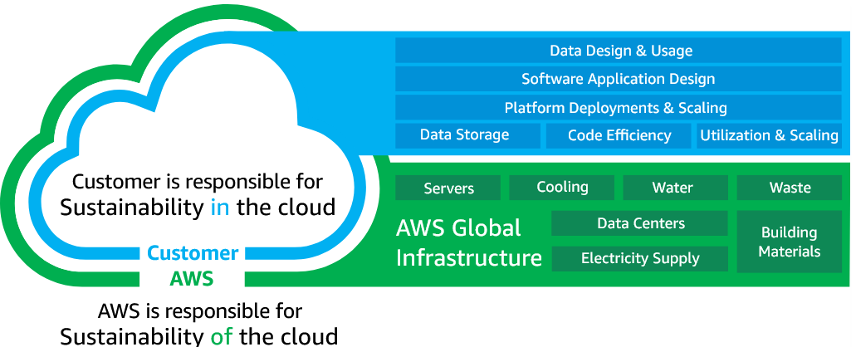

|ToC|
|---|

This is a 3-part series:

| SeriesToC |
|-----------|

## Introduction

Organizations process a vast amount of data to achieve their business outcomes. Proper data management and governance are pivotal to their success while ensuring they operate efficiently, are cost-efficient, and minimize environmental impact. As sustainability becomes a focal point in both business and technology (["Tech + Sustainability = Leadership" blog by Accenture](https://www.accenture.com/us-en/blogs/technology-innovation/tech-sustainability-leadership)), it is essential to design data management strategies with the environment in mind.

If you are keen to learn about sustainable data management, this blog series is for you. In this first part we will discuss how traditional data management practices impact the environment, and form an understanding of sustainable data management practices on AWS. Let’s dive in.

## The environmental impact of traditional data management practices

Traditional data management methods often overlook the environmental impact of massive data centers, leading to increased carbon footprint. Lack of on-demand compute in on-premises data centers force you to provision for peak usage leaving compute underutilized for long duration. These processes tend to be resource-intensive, consuming energy, often from nonrenewable sources. Additionally, they do not provide the levers for usage optimization, resulting in wastage of both compute and storage. As a result, businesses face higher operational costs, and struggle to reduce their environmental impact.

In data management, the impact is not only driven by compute provisioning factors, but also from practices you adopt in the data lifecycle. Here are three common observations we have made in traditional data management practices that lead to inefficiencies and wastage:

### 1. Data silos lead to redundant processes causing resource wastage

When data is trapped in isolated departments or teams in an organization, employees end up redoing the same tasks, unaware of each other's progress. It is like reinventing the wheel, every single time. Data is copied over multiple times to different destinations resulting in duplication in storage. This doesn't just waste time and effort, but also compute and storage resources.

### 2. Using the same tool for all jobs introduces rigidity and diminishes efficiency

We have learnt the one-size-fits-all approach for choosing tool for data management use-cases (or any use-case for that matter) leads to inefficiencies. Different use-cases demand specialized solutions for optimal outcomes. For example, when you run analytical queries on OLTP databases like Amazon Aurora, you'll likely face performance lags leading to resource contention, higher compute, and unhappy users. Running analytics queries on a data-warehouse like Amazon Redshift result in better performance, provide workload isolation and improves user experience.

### 3. Lack of data governance increases manual work compromising on efficiency

The lack of data governance directly contributes to resource wastage. Without proper oversight and standardization, data becomes unorganized and duplicated, often leading to data quality issues and inaccurate metrics. Teams spend extra time locating the right datasets, moving data over the network, and correcting data inaccuracies. This demands more storage and processing power that can be avoided with resilient data governance practices.

## Understanding sustainable data management

Sustainable data management is about creating processes that ensure data is stored, processed, and accessed in ways that have minimal environmental impact, are resilient, and cost-effective. We will dive into the strategies and architecture principles you can define to adopt sustainable data management practices in the later parts of this blog series. If you are operating on AWS, it is important to understand the shared responsibility model and how you can treat sustainability as a non-functional requirement in your architecture strategy.

### Sustainability shared responsibility model

Environmental sustainability is a shared responsibility between AWS and our customers. While AWS takes the responsibility of making the cloud eco-friendly through [efficient infrastructure](https://www.aboutamazon.eu/news/sustainability/reducing-carbon-by-moving-to-aws), [water conservation](https://aws.amazon.com/local/hongkong/news/water-positive-commitment/), and [adopting renewable energy sources](https://www.aboutamazon.com/news/sustainability/amazon-sets-a-new-record-for-the-most-renewable-energy-purchased-in-a-single-year), it is our customers’ responsibility to ensure they operate sustainably within the cloud, by fine-tuning their workloads and maximizing resource efficiency.

Sustainability <u>**in**</u> the cloud requires an ongoing commitment to energy reduction and efficiency across all components of the workload. This involves optimizing resource use, like computational power, and minimizing waste, such as removing redundant data. Effective sustainability measures can start from choosing efficient programming languages, employing streamlined data storage methods, deploying on appropriately scaled and efficient infrastructure, and reducing demands on resource-heavy end-user devices. You can refer to documented best practices listed in the [AWS Well-Architected framework Sustainability pillar](https://docs.aws.amazon.com/wellarchitected/latest/sustainability-pillar/sustainability-pillar.html) to optimize the workloads you operate in the cloud.

### Sustainability as a non-functional requirement

Incorporating sustainability into business practices on AWS can lead to cost-effective solutions by optimizing resource use. You have to prioritize sustainability in your functional requirements, like you would do with performance or availability. This means developers measure sustainability impact as they develop functional features. As with other non-functional requirements, there are trade-offs that you make while architecting for sustainability. For example, compromising on the quality of results by providing aggregated data instead of detailed data to reduce data transfer; modifying response time by batch processing tasks instead of processing streams; or adjusting availability targets by adding redundant infrastructure only when needed.

## Conclusion

Traditional data management do not have all the levers for optimization when it comes to minimizing environmental impact. With the growing emphasis on sustainability, it is crucial to integrate eco-friendly practices into our data strategies. AWS promotes sustainable data management, with a shared effort needed from both the AWS and customers. By making sustainability a core architecture principle, you can achieve both environmental and cost benefits. In the following segments will outline direct steps to achieve these goals.
