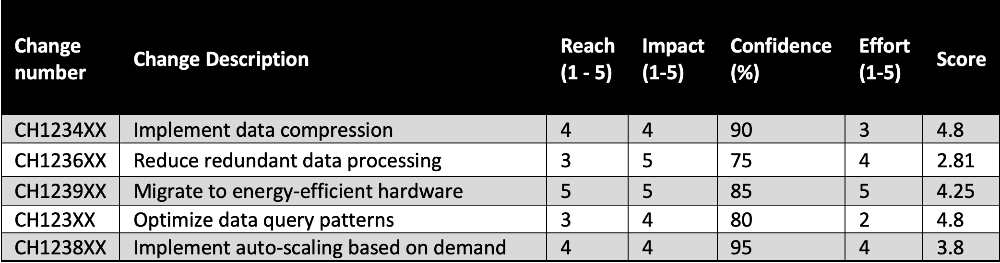

|ToC|
|---|

This is a 3-part series:

| SeriesToC |
|-----------|

## Introduction

In the previous posts I explained what is sustainable data management and how you can design data strategy with sustainability in mind. This article dives into how you can transition to sustainable data management practices, highlighting key steps to establish, monitor, and optimize processes that both align with environmental concerns and drive business value.

This post lists out the steps you need to take to embed sustainability in your data management operations, so you can identify areas of improvement and implement changes continuously.

## Transitioning to Sustainable Data Management practices

Transitioning to a sustainable data management practice requires a strategic, metric-driven approach considering impacts across the data lifecycle. By assessing current practices, setting sustainability KPIs across the organization, optimizing infrastructure and processes, and enabling cross-functional collaboration through DataOps, you can drive incremental enhancements that maximize efficiency, reduce wastage, and lower costs. You will need a systematic framework for evaluating, prioritizing, and implementing changes to ensure you focus on things that deliver maximum impact.

Let’s look at six steps to create a process that enables your organization to continuously deliver changes improving sustainability results.

### 1. Define your sustainability goals

First, you need to define your sustainability goals. Organizational sustainability goals encompass decarbonization, waste reduction, water stewardship, and renewable energy adoption. For your data workloads, you focus on energy efficiency leading to decarbonization.

You can create specific goals like *"remove 100% idle resources in data workloads"*, *"right size compute resources for data processing jobs to use the fewest vCPUs possible"*, or *"reduce storage space by 20% in the data lake"*.

I am making up numbers here, you could assess a realistic goal for your business and follow a [SMART](https://business.adobe.com/blog/basics/smart-goals) format for the goals.

### 2. Establish metrics for tracking Sustainability KPIs

By setting clear metrics across the organization, you can monitor improvements. This not only keeps everyone accountable but also provides a clear roadmap for areas that need attention, ensuring that sustainability goals are met. So, how can you track sustainability KPIs?

The [AWS Customer Carbon Footprint Tool](https://aws.amazon.com/aws-cost-management/aws-customer-carbon-footprint-tool?sc_channel=el&sc_campaign=costwave&sc_content=sustainable-data-management-practice&sc_geo=mult&sc_country=mult&sc_outcome=acq) (CCFT) provides the output metric of the greenhouse gas emissions associated with a customer’s AWS service usage. This emission data is used for reporting and understanding the high-level impact on a monthly basis. However, looking at total emissions alone doesn't fully reveal how efficiently a workload is running. For workload specific optimization, you will need access to additional data sources that reflect usage metrics. For this we use **sustainability proxy metrics** that demonstrate directional improvements in the carbon footprint.

For example, CPUUtilization, Total Number of vCPUs,StorageBytes, S3 Object Access, etc. You can learn more about proxy metrics in this blog - [Measure and track cloud efficiency with sustainability proxy metrics](https://aws.amazon.com/blogs/aws-cloud-financial-management/measure-and-track-cloud-efficiency-with-sustainability-proxy-metrics-part-i-what-are-proxy-metrics?sc_channel=el&sc_campaign=costwave&sc_content=sustainable-data-management-practice&sc_geo=mult&sc_country=mult&sc_outcome=acq).

So, how do you collect these metrics and align them to your sustainability KPIs? One way of doing this is to turn AWS Cost and Usage reports into efficiency reports. Download your Cost and Usage report from the payee account into an S3 bucket. Then use Amazon Athena to create a data source and a table to point to the data in S3. And then install the Sustainability Proxy Dashboard to point to the Athena table. That’s it. Use the instructions in this [lab](https://catalog.workshops.aws/well-architected-sustainability/en-US/5-process-and-culture/cur-reports-as-efficiency-reports) to build this
solution.

### 3. Build processes for continuously identifying targets for improvement

Build processes that regularly pinpoint areas ripe for enhancement. By doing so, you can ensure that your data management processes remain lean and efficient. With the proxy metrics dashboards in place, now you can make a good start at identifying areas for improvement.

Review workloads using the [Well-architected sustainability pillar best practices](https://docs.aws.amazon.com/wellarchitected/latest/sustainability-pillar/sustainability-pillar.html?sc_channel=el&sc_campaign=costwave&sc_content=sustainable-data-management-practice&sc_geo=mult&sc_country=mult&sc_outcome=acq). For new workloads, follow the best practices during build.

There are six key domains to consider in the review:

- **Region selection:** running a workload close to a region with low published carbon intensity can help to lower the carbon footprint of a cloud workload. Learn [how to select a region for your workload based on sustainability goals](https://aws.amazon.com/blogs/architecture/how-to-select-a-region-for-your-workload-based-on-sustainability-goals?sc_channel=el&sc_campaign=costwave&sc_content=sustainable-data-management-practice&sc_geo=mult&sc_country=mult&sc_outcome=acq).

- **User behavior:** ensure users are operating the services efficiently - they are leveraging scaling features for varying demand, not leaving services switched on when unused, using efficient end-user devices. The [alignment to demand](https://docs.aws.amazon.com/wellarchitected/latest/sustainability-pillar/alignment-to-demand.html?sc_channel=el&sc_campaign=costwave&sc_content=sustainable-data-management-practice&sc_geo=mult&sc_country=mult&sc_outcome=acq) module in the well-architect sustainability pillar provides more guidance.

- **Software & Architecture:** examine your workload regularly to remove any inactive or redundant components. AWS constantly introduces new services and features, the best setup for your workload might evolve over time. Optimize code to consume less resources.

- **Hardware:** review the hardware footprint of your workloads, use the least amount of hardware necessary for deployment and choose the most suitable and efficient equipment and services tailored to your specific workload. EC2 instances with [Graviton3 processors are 60% more energy efficient](https://aws.amazon.com/ec2/graviton?sc_channel=el&sc_campaign=costwave&sc_content=sustainable-data-management-practice&sc_geo=mult&sc_country=mult&sc_outcome=acq) than comparable EC2 instances.

- **Data:** know your data and choose storage solutions aligned with its business value and usage. Move data to colder storage tiers as they age or access frequency diminishes, and remove obsolete data.

- **Development & Deployment Process:** find opportunities to reduce your sustainability impact by making changes to your development, test, and deployment practices. Check for sustainability improvements during testing and prior to production deployment. Continuously streamline your development processes and environments, introduce automation thought CI/CD.

When you review your workloads and identify areas of improvement, classify them into these domains and evaluate which changes would deliver maximum impact. If you are optimizing AWS data services for sustainability, refer to this two-part blog - [Optimize your modern data architecture for sustainability](https://aws.amazon.com/blogs/architecture/optimize-your-modern-data-architecture-for-sustainability-part-1-data-ingestion-and-data-lake?sc_channel=el&sc_campaign=costwave&sc_content=sustainable-data-management-practice&sc_geo=mult&sc_country=mult&sc_outcome=acq) for some tips.

### 4. Setup a prioritization framework for implementing changes that impact sustainability KPIs

By setting up a framework that prioritizes changes based on their impact on sustainability KPIs, you ensure that the most significant improvements are tackled first. This approach guarantees that resources are allocated effectively, maximizing the benefits of each change. Other than the impact on sustainability KPIs, consider factors like effort required to make the change, confidence on impact, risks, and costs involved. You want to identify the quick wins and implement them, and then plan changes for mid to long-term.

One way of prioritizing changes could be by measuring how many users are affected (reach), the potential sustainability benefit (impact), confidence in estimates (confidence), and the effort required for implementation (effort). The following table with sample data shows an example measuring reach, impact, and effort on a scale of 1 (minimum) – 5 (massive), and confidence in percentage. The score is achieved by multiply reach, impact, confidence, and dividing the result by effort. The item with maximum score gets the most priority.

### 5. Implement DataOps for fostering effective collaboration

Optimizing your data management processes for sustainability is an on-going process. This requires you to have a collaborative data management practice that aims to improve the communication, integration, and automation of data flows between data producers and consumers across your organization. DataOps promotes efficient collaboration, [breaking silos among teams, and streamlining operations](https://aws.amazon.com/blogs/big-data/build-a-dataops-platform-to-break-silos-between-engineers-and-analysts?sc_channel=el&sc_campaign=costwave&sc_content=sustainable-data-management-practice&sc_geo=mult&sc_country=mult&sc_outcome=acq). It emphasizes automation in [data pipelines and ETL processes](https://aws.amazon.com/blogs/devops/deploying-data-lake-etl-jobs-using-cdk-pipelines?sc_channel=el&sc_campaign=costwave&sc_content=sustainable-data-management-practice&sc_geo=mult&sc_country=mult&sc_outcome=acq) reducing redundant processes and unnecessary data processing tasks, leading to optimized resource utilization. With DataOps you implement continuous integration and deployment allowing for incremental updates, so you can release sustainability improvements swiftly. The ability to swiftly adapt to changes ensures that as newer, more sustainable technologies or processes become available, you can integrate them without delay. This ensures that your platforms remain up-to-date with the sustainability best practices. With version control mechanisms if a particular change doesn't deliver the expected sustainability benefits, you can revert to more efficient versions. By automating data workflows and enhancing data quality, resources are utilized optimally. This approach not only minimizes environmental impact but also drives business agility and efficiency.

### 6. Measure results, learn, and replicate success

The journey of a sustainability improvement project doesn't end with achieving the desired goal. The real challenge often lies in measuring the success and ensuring it is a repeatable outcome. Regular monitoring using the sustainability proxy metrics provides visibility into the effectiveness of implemented changes. Once you observe and measure success, the next step is to ensure its repeatability. This requires a thorough analysis of the strategies that worked and understanding the reasons behind their success. Was it due to a new technology, a change in behavior, or change in code? Documenting these factors and creating a blueprint helps in scaling these successful initiatives to other parts of the organization. Encourage your teams to share their successes and failures. This not only builds a sense of collective responsibility but also ensures that mistakes aren't repeated and successes are built
upon.

## Conclusion

A sustainable data management strategy is the foundation of successful businesses as we head into a future of AI. By systematically measuring success and cultivating an environment of continuous improvement and knowledge sharing, you can ensure that your sustainability efforts have lasting impacts. This blog has explored how you can transition to a data management processes with sustainability in mind. Remember, it is not just an environmental endeavor, but also a strategic move for efficiency and resilience.
