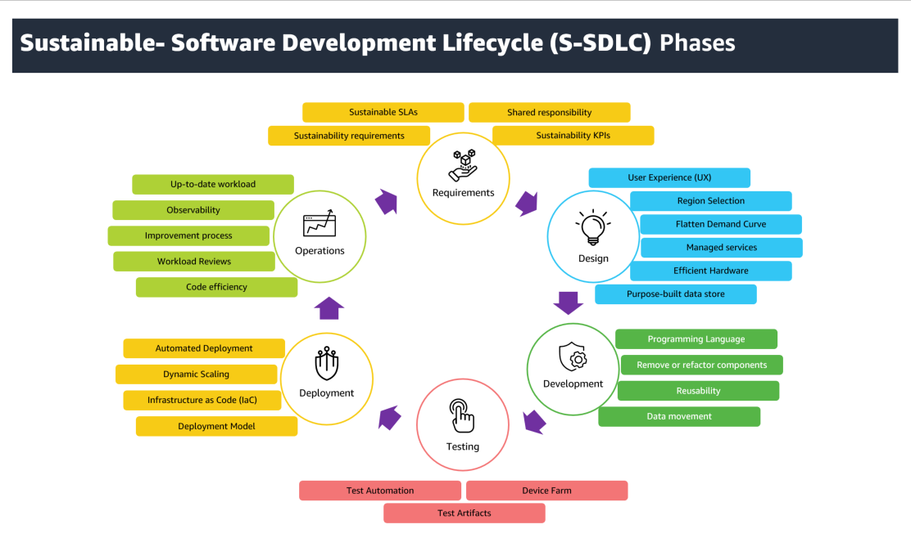

|ToC|
|---|

## Overview

The ICT (Information and Communication Technology) industry has grown exponentially in recent decades and this growth has some consequences to the environment. This industry uses computers, laptops and other electronic devices like routers, switches, printers etc. which are powered by electricity as the major contributor to greenhouse gas (GHG) emissions. In addition, software development activities may not be directly emitting emissions, but there is  an indirect contribution.  In this blog, we will explore the intersection of sustainability and software development, and look at some of the ways that developers can make a positive impact on the environment.  The primary audience of this blog consist of software developers and operators, those who design, build, test and operate software in the cloud.

## What is Sustainable Software Development Life Cycle (S-SDLC)?

The goal of sustainability in software development life cycle would focus on ensuring responsible application design, development and maintenance keeping energy consumption in mind. You should focus on increasing utilization for spun-up resources and reducing/removing idle resources.  Sustainable Software Development Life Cycle (S-SDLC) is not so much about doing different things as it is about considering sustainability in doing things.  

These are the key tenants and principles that are considered in S-SDLC.

* Share learning experiences and create a sustainability mindset across SDLC
* Leverage automation capabilities wherever possible
* Establish measurements to gain insights and create learning opportunities
* Makes sustainability a continuous focus including all stakeholders in the sustainability considerations
* Sustainability is everyone’s responsibility
* Focus on increasing utilization and minimizing waste
* Use efficient resources for your workload and focus on business differentiators while offloading undifferentiated heavy lifting to cloud  

## What are the benefits of S-SDLC?

S-SDLC aims to find ways and define best practices for reducing emission of greenhouse gases resulting from use of energy for powering IT systems and resources. This blog intends to provide information that development teams can consider to ensure that their product/solution is in align with organization’s sustainability goals and also helps them in showcasing their commitment to environmental and social responsibility. S-SDLC helps in making sustainability an continuous focus rather than one-time activity. It also helps in reducing waste and improving utilization of running resources thus making it more efficient to run the workload.  

The following sections captures some of the sustainability related best practices corresponding to various phases of SDLC.  

### Software Requirements

**Sustainability requirements**: During requirements elicitation phase, the focus is on gathering functional requirements and non-functional requirements.  Non-functional requirements(NFRs) should include sustainability requirements such as increasing efficiency, improving resource utilization, and waste reduction.  Also identify the environmental regulations and standards that need to be followed. The sustainability requirements must be SMART (Specific, Measurable, Actionable,  Realistic, Time-bound) and you should focus on efficiency without compromising the software quality for the users. Refer to [SUS06-BP01 Adopt methods that can rapidly introduce sustainability improvements](https://docs.aws.amazon.com/wellarchitected/latest/sustainability-pillar/sus_sus_dev_a2.html?sc_channel=el&sc_campaign=costwave&sc_content=sustainable-sdlc&sc_geo=mult&sc_country=mult&sc_outcome=acq) for more details.  

**Sustainability KPIs**: It is important to identify fine-grained metrics that can help measure the carbon footprint of your application. In some cases when you can’t measure the carbon emissions directly, consider using proxy/indirect metrics instead.  Common example for proxy metrics includes vCPU minutes for Compute, GB storage provisioned for storage and GB transferred or packets transferred for network.  To read more about Proxy metrics, please check [Sustainability proxy metrics](https://docs.aws.amazon.com/wellarchitected/latest/sustainability-pillar/evaluate-specific-improvements.html#proxy-metrics?sc_channel=el&sc_campaign=costwave&sc_content=sustainable-sdlc&sc_geo=mult&sc_country=mult&sc_outcome=acq) and [Identifying Proxy Metrics for Sustainability Optimization](/posts/identifying-proxy-metrics-for-sustainability-optimization).  

**Align SLA to your sustainability goals**: When defining/reviewing SLA (Service Level Agreements) for workload, plan to optimize the SLAs based on workload’s sustainability goals. By aligning workload SLAs to sustainability goals, you can optimize resource utilization along with meeting business needs. You should aim to meet your business requirements and not exceed them. Refer to [SUS02-BP02 Align SLAs with sustainability goals](https://docs.aws.amazon.com/wellarchitected/latest/sustainability-pillar/sus_sus_user_a3.html?sc_channel=el&sc_campaign=costwave&sc_content=sustainable-sdlc&sc_geo=mult&sc_country=mult&sc_outcome=acq) for more details.  

**Shared responsibility for sustainability**: Sustainability is a [shared responsibility](https://docs.aws.amazon.com/wellarchitected/latest/sustainability-pillar/the-shared-responsibility-model.html?sc_channel=el&sc_campaign=costwave&sc_content=sustainable-sdlc&sc_geo=mult&sc_country=mult&sc_outcome=acq) between AWS and customers. While AWS is responsible for ensuring sustainability of the cloud( delivering efficient, shared infrastructure, water stewardship, and sourcing renewable power), you are responsible for ensuring sustainability in the cloud ( optimizing workloads and resource utilization, and minimizing the total resources required to be deployed for your workloads).  

### Design

**Sustainable UX (User Experience)**: While designing UX, focus on how the user will be interacting with the application and use efficient design patterns like dark themes, lightweight images/videos, lazy loading, cache frequently accessed content, reducing load time(e.g., pagination, avoiding unnecessary data loading), reducing no. of round trips to process request.  

**Region Selection**: When considering cloud region to deploy your workload, consider regions which are powered by renewal energy sources or where the grid has a lower published carbon intensity. This needs to be evaluated along with other business requirements like close proximity to application users, cost of running workload in region, compliance requirements etc. Please refer [SUS01-BP01 Choose Region based on both business requirements and sustainability goals](https://docs.aws.amazon.com/wellarchitected/latest/sustainability-pillar/sus_sus_region_a2.html?sc_channel=el&sc_campaign=costwave&sc_content=sustainable-sdlc&sc_geo=mult&sc_country=mult&sc_outcome=acq) for more details.  

**Flatten demand curve**:  You should aim to flatten the demand curve by efficiently managing the demand spikes. For use cases that don’t require immediate response, consider using asynchronous processing or using scheduler to process requests in batches. You can use buffering to defer request processing and flatten the demand curve. To understand various AWS services that can help in flatting the demand curve, checkout [SUS02-BP06 Implement buffering or throttling to flatten the demand curve](https://docs.aws.amazon.com/wellarchitected/latest/sustainability-pillar/sus_sus_user_a7.html?sc_channel=el&sc_campaign=costwave&sc_content=sustainable-sdlc&sc_geo=mult&sc_country=mult&sc_outcome=acq) and [SUS03-BP01 Optimize software and architecture for asynchronous and scheduled jobs](https://docs.aws.amazon.com/wellarchitected/latest/sustainability-pillar/sus_sus_software_a2.html?sc_channel=el&sc_campaign=costwave&sc_content=sustainable-sdlc&sc_geo=mult&sc_country=mult&sc_outcome=acq) for more guidance on this.  

**Choose efficient hardware**: When choosing instances to deploy workload, consider options that provide better price performance along with low energy consumption. [AWS Graviton processors](https://aws.amazon.com/ec2/graviton/?sc_channel=el&sc_campaign=costwave&sc_content=sustainable-sdlc&sc_geo=mult&sc_country=mult&sc_outcome=acq) (custom silicon with 64-bit Arm processor cores) are designed to be more energy efficient. Graviton-based instances use up to 60% less energy for the same performance than comparable EC2 instances. There are many AWS managed services like Amazon DocumentDB, Amazon Aurora and Amazon ElastiCache that can be easily run on Amazon Graviton processors or can be easily migrated from x86 processors easily without incurring any downtime. Workloads based on Linux and JITd languages (like Java, Python, PHP) can be easily hosted/migrated to Graviton, while compiled languages like C/C++, Go require more effort. At the moment, Microsoft Windows servers are not yet available for arm64. For stateless applications, consider exploring [Spot Instances](https://docs.aws.amazon.com/AWSEC2/latest/UserGuide/using-spot-instances.html?sc_channel=el&sc_campaign=costwave&sc_content=sustainable-sdlc&sc_geo=mult&sc_country=mult&sc_outcome=acq) (unused EC2 instances that are available at a discounted price) or choosing [Burstable instance types](https://docs.aws.amazon.com/AWSEC2/latest/UserGuide/burstable-performance-instances.html?sc_channel=el&sc_campaign=costwave&sc_content=sustainable-sdlc&sc_geo=mult&sc_country=mult&sc_outcome=acq) for workloads with occasional spikes. For ML (Machine Learning) workloads, leverage [AWS Trainium](https://aws.amazon.com/machine-learning/trainium/) and [AWS Inferentia](https://aws.amazon.com/machine-learning/inferentia/?sc_channel=el&sc_campaign=costwave&sc_content=sustainable-sdlc&sc_geo=mult&sc_country=mult&sc_outcome=acq)  for model training and Inference respectively. These processors are designed and optimized to support deep learning workloads in AWS Cloud.  

**Prefer managed services**: Managed services shift the responsibility of maintaining high-average utilization and sustainability optimization of the hardware to AWS. Choosing fully-managed services helps you focus on their business differentiators rather than spending time of undifferentiated heavy lifting associated with managing infrastructure.  Example of such services includes ECS (Elastic Container Service), EKS (Elastic Kubernetes Service), Amazon API Gateway, Amazon DynamoDB, Amazon S3 (Simple Storage Service), Amazon RDS (Relational Database Service), Amazon Redshift, Amazon SNS (Simple Notification Service), Amazon SQS (Simple Queue Service) and AWS Step Function.  

**Use efficient software patterns**: While designing applications, choose efficient software designs and architectures. Using [Event-driven architectures](https://aws.amazon.com/what-is/eda/?sc_channel=el&sc_campaign=costwave&sc_content=sustainable-sdlc&sc_geo=mult&sc_country=mult&sc_outcome=acq) can promote development team independence due to loose coupling between publishers and subscribers. This allows publishers and subscribers to change independently of each other, providing more flexibility to the overall architecture. [Microservices architecture](https://aws.amazon.com/microservices/?sc_channel=el&sc_campaign=costwave&sc_content=sustainable-sdlc&sc_geo=mult&sc_country=mult&sc_outcome=acq) can help break application into independent services which can be developed, deployed, maintained and scaled independently. This also promoted polyglot programming model.  

**Choose purpose-built Data store**: Amazon provide number of [purpose-built databases](https://aws.amazon.com/products/databases/?sc_channel=el&sc_campaign=costwave&sc_content=sustainable-sdlc&sc_geo=mult&sc_country=mult&sc_outcome=acq) to choose from. Select the right database for your application workload e.g., Transactional, Analytical or Caching. This has direct impact on application performance efficiency. You can benefit from better performance-per-watt with AWS Graviton processors for running your databases.  

### Development

**Choose Energy efficient programming language**: Choose energy efficient programming languages for development.  5 most energy-efficient programming languages as suggested in [Energy Efficiency across Programming Languages](https://greenlab.di.uminho.pt/wp-content/uploads/2017/10/sleFinal.pdf) are C, C++, Java, Rust and Ada. Python is not a great option from energy efficiency perspective. Checkout [AWS re:Invent 2022 - Sustainability in the cloud with Rust and AWS Graviton (DOP315)](https://www.youtube.com/watch?v=HKAl4tSCp7o) for more details.  

**Remove or refactor unused assets**:  You should target to remove any code blocks in the existing application which are no longer required. This will help in keeping the codebase smaller as well as makes it easier to maintain application.  Plan to perform periodic analysis on resources and stop/decommission unused ones. If the development resources are not accessed 24/7, it would be recommended to turn them off when not in use. For more details, checkout [SUS03-BP02 Remove or refactor workload components with low or no use](https://docs.aws.amazon.com/wellarchitected/latest/sustainability-pillar/sus_sus_software_a3.html?sc_channel=el&sc_campaign=costwave&sc_content=sustainable-sdlc&sc_geo=mult&sc_country=mult&sc_outcome=acq) page for more details.  

**Focus on reusability**:  Before considering developing new application, review any existing application can be modified to cater to new business requirement. Reuse would promote carbon avoidance at first place. Also plan for periodic review of application components/modules that are no more required but are still part of application.  

**Minimize data movement**: Reduce the amount of data that needs to be transferred while processing request by co-locating application components closer that reduces the data transfer. Data compression can also help in reducing the amount of data that needs to be transferred. Review API request and response parameters to minimize amount of data transfer. Prefer chunky API calls (which involves fewer requests with large requests) over chatty API calls ( frequent and small requests).  Checkout [SUS04-BP07 Minimize data movement across networks](https://docs.aws.amazon.com/wellarchitected/latest/sustainability-pillar/sus_sus_data_a8.html?sc_channel=el&sc_campaign=costwave&sc_content=sustainable-sdlc&sc_geo=mult&sc_country=mult&sc_outcome=acq) for more details.  

### Testing

**Use automated testing**: Prefer automating testing over manual testing as later consumes time and energy. Automation can help in speeding up test cycle and minimize the energy and resource consumption associated with manual testing efforts.  

**Use managed Device farm**: [AWS Device Farm](https://aws.amazon.com/device-farm/?sc_channel=el&sc_campaign=costwave&sc_content=sustainable-sdlc&sc_geo=mult&sc_country=mult&sc_outcome=acq) is an application testing service that you can use to test and interact with your Android, iOS, and web apps on real, physical phones and tablets. Device Farm can also be used to execute Selenium tests on different desktop browsers and browser versions.  

**Manage test artifacts**: Testing artifacts could include test cases, test scripts, test data and test outputs. Avoid storing test artifacts that can be easily generated. Once the testing is over, try to delete data and files (input, output, logs, test evidences).  

### Deployment

**Automatically Scale Infrastructure**: Always scale infrastructure to match demand (user load) and avoid over-provisioning resources to deliver the lowest environmental impact. Use dynamic scaling (e.g., target tracking scaling policies) based on target value for right Amazon CloudWatch metrics. AWS provides a range of auto scaling mechanism. Automatic scaling will also ensure that you scale down once the user load has decreased. Verify that scale-in events are working as expected without affecting end use experience. Refer to [SUS02-BP01 Scale workload infrastructure dynamically](https://docs.aws.amazon.com/wellarchitected/latest/sustainability-pillar/sus_sus_user_a2.html?sc_channel=el&sc_campaign=costwave&sc_content=sustainable-sdlc&sc_geo=mult&sc_country=mult&sc_outcome=acq) for implementation guidance and steps.  

**Focus on automation and Infrastructure as code(IaC)**: By automating frequently repeated tasks, you can save overall time it takes to complete the task as well as avoid manual errors. This time saving is translated to more efficiency (as compared to doing the task manually).  Use  [Infrastructure as code (IaC)](https://aws.amazon.com/what-is/iac/?sc_channel=el&sc_campaign=costwave&sc_content=sustainable-sdlc&sc_geo=mult&sc_country=mult&sc_outcome=acq) to provision and manage your infrastructure. This reduces manual effort, minimizes resource waste, and allows you to scale up or down based on demand.  AWS services like [AWS Cloud Development Kit (AWS CDK)](https://aws.amazon.com/cdk/?sc_channel=el&sc_campaign=costwave&sc_content=sustainable-sdlc&sc_geo=mult&sc_country=mult&sc_outcome=acq) and [AWS CloudFormation](https://aws.amazon.com/cloudformation/?sc_channel=el&sc_campaign=costwave&sc_content=sustainable-sdlc&sc_geo=mult&sc_country=mult&sc_outcome=acq) can help with your IaC needs.  

### Operation

**Keep your workload up to date**: Keeping your operating systems, libraries, and applications  Up-to-date improves workload efficiency and enables easier adoption of more efficient technologies. Up-to-date software may also include features that help measure the sustainability impact of your workload more accurately.  

**Configure Observability**: Periodically review your workload against the sustainability best practices to identify targets for improvements. Use [AWS Cost and Usage Reports (CUR)](https://docs.aws.amazon.com/cur/latest/userguide/what-is-cur.html?sc_channel=el&sc_campaign=costwave&sc_content=sustainable-sdlc&sc_geo=mult&sc_country=mult&sc_outcome=acq) and  [AWS Customer Carbon Footprint Tool (CCFT)](https://aws.amazon.com/aws-cost-management/aws-customer-carbon-footprint-tool/?sc_channel=el&sc_campaign=costwave&sc_content=sustainable-sdlc&sc_geo=mult&sc_country=mult&sc_outcome=acq) to identify hot spots that you can target to improve resource utilization and/or reduce the resource required to complete  a unit of work. While implementing improvements, identify metrics that can help to quantify the impact of improvement on associated resources (compute, storage, network resources etc.) provisioned for workload being reviewed. In scenarios when you don’t have direct metrics to help track specific improvement or it can be complex and costly to setup, you can rely on [Proxy metrics](https://aws.amazon.com/blogs/aws-cloud-financial-management/measure-and-track-cloud-efficiency-with-sustainability-proxy-metrics-part-i-what-are-proxy-metrics/?sc_channel=el&sc_campaign=costwave&sc_content=sustainable-sdlc&sc_geo=mult&sc_country=mult&sc_outcome=acq) to monitor and analyze the efficiency of a system or workload.  

**Monitor Code size & Efficiency**: Review your code for code smells (unused code block that can be removed, duplicate code blocks that can be refactored to common function, unused variable declarations that can be removed, memory leaks, loops, switch statements etc.) and  remove them to reduce the overall execution for each request which invokes that code. Use services like [Amazon CodeGuru Reviewer](https://docs.aws.amazon.com/codeguru/latest/reviewer-ug/welcome.html?sc_channel=el&sc_campaign=costwave&sc_content=sustainable-sdlc&sc_geo=mult&sc_country=mult&sc_outcome=acq) that performs code reviews and  provide actionable recommendations by analyzing runtime data.  [Amazon CodeGuru Profiler](https://docs.aws.amazon.com/codeguru/latest/profiler-ug/what-is-codeguru-profiler.html?sc_channel=el&sc_campaign=costwave&sc_content=sustainable-sdlc&sc_geo=mult&sc_country=mult&sc_outcome=acq) can help to improve code efficiency.  

**Define Improvement process**: Sustainability improvement is a cyclic process and not a one time journey. Use [Well-Architected for sustainability](https://docs.aws.amazon.com/wellarchitected/latest/sustainability-pillar/sustainability-pillar.html?sc_channel=el&sc_campaign=costwave&sc_content=sustainable-sdlc&sc_geo=mult&sc_country=mult&sc_outcome=acq) to identify area of improvement, define an improvement plan, implement and test improvement, and if successful plan for sharing your learnings with other project teams. Refer to [Improvement process](https://docs.aws.amazon.com/wellarchitected/latest/sustainability-pillar/improvement-process.html?sc_channel=el&sc_campaign=costwave&sc_content=sustainable-sdlc&sc_geo=mult&sc_country=mult&sc_outcome=acq) for more details.  

### Conclusion

Sustainability in the cloud is a continuous, focused effort on energy consumption and efficiency across all components of a workload. By following the various best practices related to sustainable-SDLC, you can minimize the environmental impact of running your workload in the cloud.
