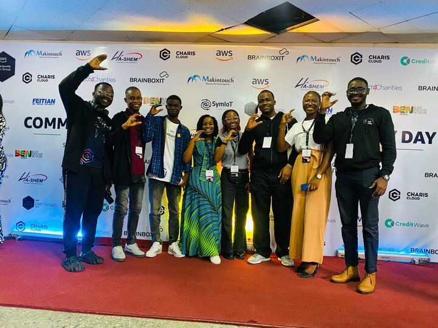

> "Everything fails all of the time." — Werner Vogels, AWS CTO

That's not what Swifties wanted to hear as they tried to buy tickets to Taylor Swift's Eras tour. But as fans coordinated purchases with spreadsheets, multiple browser windows, and group text threads, only to be denied, it started to feel like a Cruel Summer. 

Most people don't understand the impact of a system failure until they experience it themselves: you can't just Shake It Off. This post has articles, news, and events to help you prepare because, if there’s one thing we know All Too Well, it's that failure happens.

## Resilience: Compiled

1. What do big trucks, Jackie Chan movies, and cardboard boxes have in common? **Read about resilience** from AWS Developer Advocate Seth Eliot as he explains [how Amazon.com does DevOps in real life](https://community.aws/posts/how-amazon-does-devops-in-real-life).
2. **Gain confidence and improve the resilience of your application** with AWS Developer Advocates Seth Eliot, Brian Ketelsen, and Linda Haviv as they [use Chaos Engineering to learn how a software system recovers (or doesn't)](https://community.aws/livestreams/winging-it/2023-05-24).
3. Do you know where your backups are? **Learn where to put your backups** and what data recovery looks like for different failure modes from AWS Solutions Architect Jennifer Moran in her [latest blog post](https://community.aws/posts/where-do-i-put-my-backups-in-the-cloud).
4. What happened to my car?! No, we didn’t forget where we parked at the concert. **Read about gray failures** from AWS Solutions Architect Clark Richey as he shares [how his stalling car helped him understand these tricky failures](https://community.aws/posts/what-happened-to-my-car).
5. Compliance requirements, resiliency, or latency may be reasons you want to **implement a multi-region system**. AWS Community Builder Jimmy Dahlqvist shows you [how to do this for your IoT system](https://community.aws/posts/building-a-multi-region-serverless-iot-system).

## Community buzz

**Give a warm welcome to the new AWS Community Builders** [on LinkedIn using the #AWSCommunity hashtag](https://www.linkedin.com/feed/hashtag/?keywords=awscommunity)! Emerging thought leaders are recognized for sharing their knowledge and connecting with the technical community. Learn more about the program [here](https://aws.amazon.com/developer/community/community-builders).

Seven Cloud Club Captains traveled from all over Nigeria to join the West Africa Community Day. **Learn more about these student leaders** on [their blog](https://dev.to/awscloudclubs) or [find a Cloud Club near you](https://www.meetup.com/pro/cloud-clubs/).

AWS Community Builder, Brian H. Hough shows you how to **build your own machine learning system** without a single line of code to predict stock prices for fun in [this video series](https://www.youtube.com/playlist?list=PLDqi6CuDzubygWf7HS4UCoIBTtdggB0dh).

## While you’re waiting for your app to recover

**Join AWS Developer Advocates Olivier Leplus and Matheus Guimaraes** on tour as they cross Europe like some 80s rock band that hasn't discovered airplanes! Find your city's [tour date](https://awsontour.splashthat.com/) for free, all-day events with food, networking, and AWS fun.

**Continue your Generative AI learning journey** with AWS Developer Advocate Mike Chambers as he shows you [how a prompt is processed by Large Language Models (LLMs)](https://youtu.be/ibr5wmtinG0).

**Build an image gallery** for all your Taylor Swift concert photos with your AI coding companion, Amazon CodeWhisperer. AWS Developer Advocate Olivier Leplus steps through [this tutorial](https://www.youtube.com/watch?v=jk7r8nMPnjY) to build your app using React and AWS Amplify.

**Deploy your app on a Friday** so it’s ready to go for concert time by reading AWS Developer Advocate Marcelo Palladino's list of [12 DevOps best practices](https://community.aws/posts/deploy-on-friday-devops-best-practices).

**Explore the ABCs of Generative AI** with AWS Developer Advocate Brooke Jamieson on [the Community.aws blog](https://community.aws/posts/the-abcs-of-generative-ai) or watch [this short](https://youtube.com/shorts/E_nH2oWlniQ?feature=share) taken on the floor of the AWS Summit in New York City.

**Improve your resource utilization and save money** during the [Build On Live Cost Optimization](https://www.youtube.com/watch?v=OTSNv49s2vk) livestream with AWS Developer Advocate Darko Mesaros and AWS Solutions Architect Steph Gooch on September 28.
