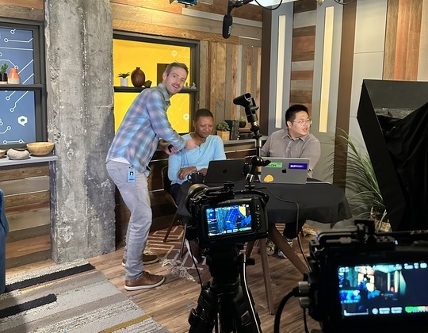
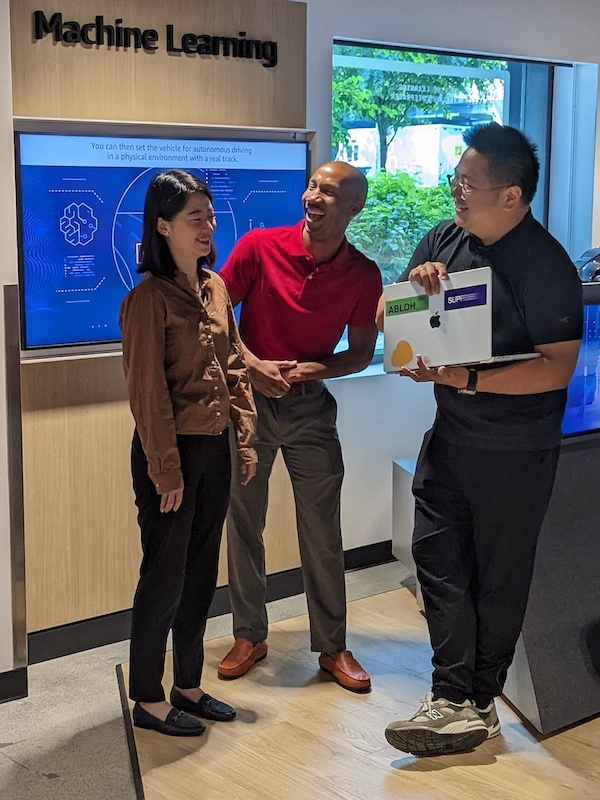

## Announcing The Grad Project: Showcasing Innovative Student Research

Have you ever been curious about what students in prestigious universities are working on these days? The Grad Project is a new video and hands-on coding initiative hosted on LinkedIn Live. It showcases the research carried out by innovative graduate students using AWS technologies, enabling them to share their knowledge with the community. The project consists of short videos accompanied by a longer hands-on tutorial with a live Q&A. Each video features graduate students discussing their research and demonstrating how they used AWS technologies to achieve their goals. We were lucky enough to be able to join these students in Seattle to record their experiences.

## Learn from MIT

The first sequence of videos airing on Sept 19th will feature Ben Lewis, a Master’s student at the [Massachusetts Institute of Technology (MIT)](https://web.mit.edu/) and Jessy Han, a PhD student also from MIT, who will demonstrate their work at the [IDSS](https://idss.mit.edu/) (MIT’s Institute for Data, Systems and Society). Ben and Jessy’s work focuses on social justice and how data can be mined to unearth patterns that point to systemic racism. Knowledge gained from observing and analyzing this data then can be used to address these problems through proactive action.

https://www.youtube.com/embed/vHfCu0due0g

Register for Ben and Jessy's session [here](https://www.linkedin.com/events/howmitstudentsarecombatingracis7100201173629972481/theater/)

## Skill up with CMU

The second sequence, airing on Sept 26, will feature Zinuo (Vincent) Xu, a recently-graduated Master’s student from [Carnegie Mellon’s Heinz College](https://www.heinz.cmu.edu/). Vince was also one of our pioneering [Cloud Club Captains](https://s12d.com/cloud-clubs), helping organize the world’s first Student Symposium at CMU while building a strong Cloud Club in his intitution. Vince will discuss and demo his work creating a Large Language Model to build a way for a financial institution to query a database using natural language that is converted by the model to SQL.

https://www.youtube.com/embed/kMVxu-3BkK4

Register for Vince's session [here](https://www.linkedin.com/events/exploringtext-to-sql-howcarnegi7100202154535071744/theater/)

## Learn with Us

To accompany their hands-on videos, the students have provided annotated notebooks that can be run on [SageMaker Studio Lab](https://studiolab.sagemaker.aws/) by viewers. Tune in to the broadcast with the notebooks ready to run , and follow along as the students, accompanied by Curtis Evans, Principal Academic Advocate, explain their research.  Be sure to login to [SageMaker Studio Lab](https://studiolab.sagemaker.aws/) for free access to notebooks that can be run in the Cloud, enabling you to follow along with the steps and experiment with the technology themselves. Find the notebooks on [The Grad Project’s GitHub repo](https://github.com/build-on-aws/the-grad-project). Fork these notebooks to your GitHub account and be ready to run them in the Cloud!

>Jessy, Ben and Vince enjoy a light moment while recording in Seattle’s Skill Center

The Grad Project is part of our ongoing effort to support education and research in the field of machine learning and artificial intelligence. By providing resources and opportunities for graduate students to share their work and learn from each other, we hope to help advance the state of the art in these fields and inspire the next generation of innovators. Be sure to tune in to watch the next generation of Cloud builders in action.

## Get ready for The Grad Project by:

1. Logging into [SageMaker Studio Lab](https://studiolab.sagemaker.aws/) to create a free account
2. Fork the Grad Project's student-built [GitHub repos](https://github.com/build-on-aws/the-grad-project)
3. Preregister for the [MIT](https://www.linkedin.com/events/howmitstudentsarecombatingracis7100201173629972481/theater/) session and the [CMU](https://www.linkedin.com/events/exploringtext-to-sql-howcarnegi7100202154535071744/theater/) session.
3. Tune in on LinkedIn Live on Sept 19th and 26th to learn live with Ben, Jessy, Vince, and Developer Advocate Curtis who will be ready to answer your questions.
4. Miss the broadcast? You can find it on this [YouTube](https://www.youtube.com/playlist?list=PL5bUlblGfe0L4Gg3_W90NPLO0drg9OuHU) playlist after the event.

## About the Authors

Curtis Evans, who conducted the interviews with The Grad Project students, is a Principal Academic Advocate on the Academic Advocacy Team managed by Jen Looper, the Head of Academic Advocacy at AWS. The AA Team works to build and curate a quality journey for postsecondary-aged students worldwide by crafting great content, cool events, and a valuable community experience on campuses globally called [Cloud Clubs](https://s12d.com/cloud-clubs). Learn more about Academic Advocacy's initiatives [on our website](https://s12d.com/students).

