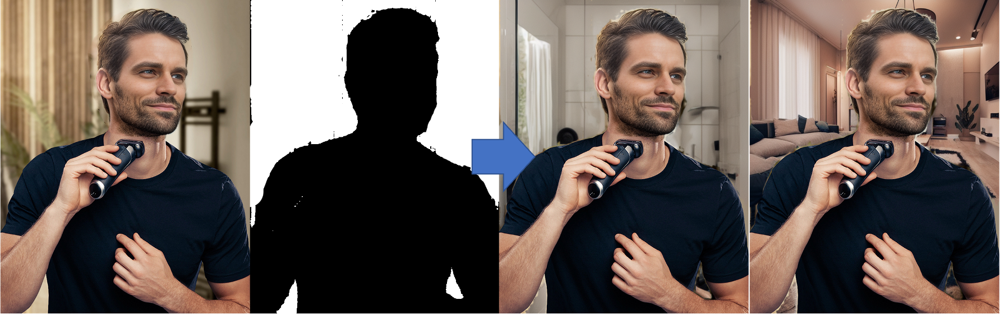
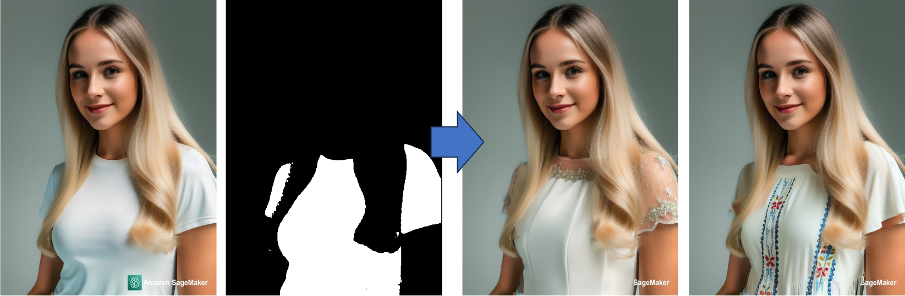
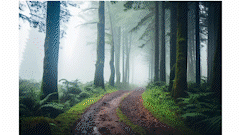
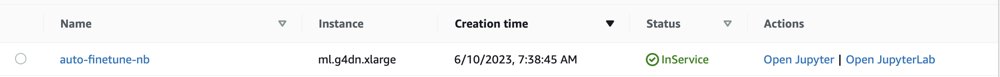
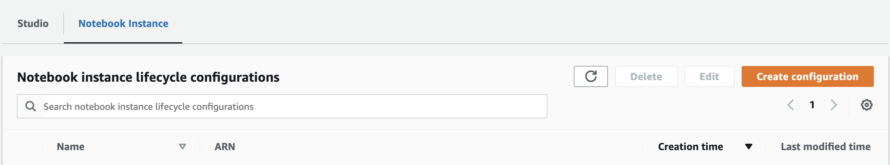
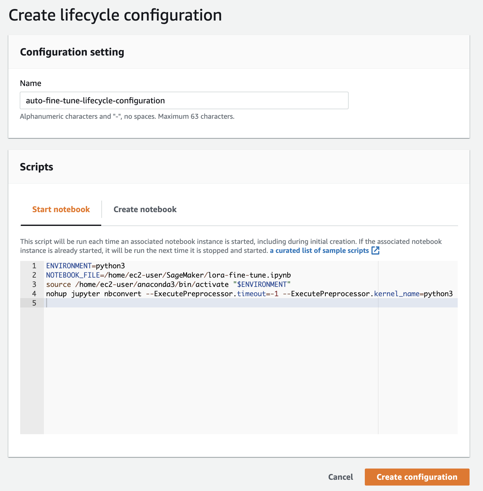
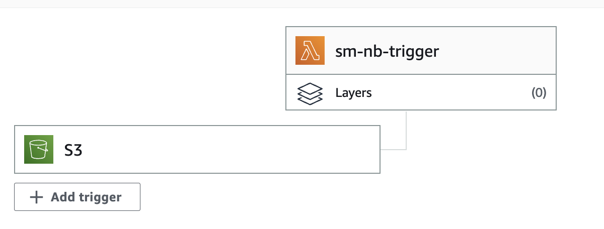
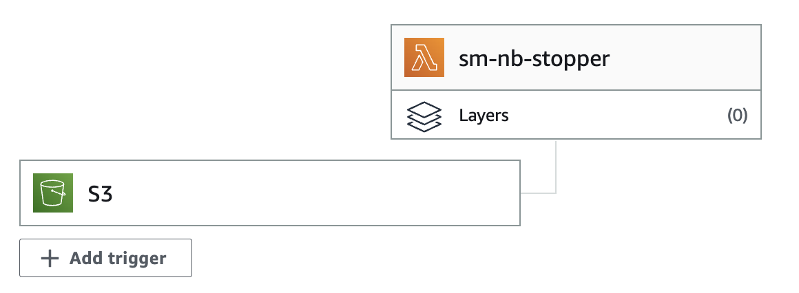
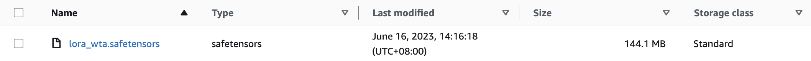

In the ever-evolving landscape of the retail industry, the emergence of generative AI techniques, such as Stable Diffusion, has become a game-changer. By harnessing the power of advanced machine learning algorithms to generate diverse and dynamic contents, Stable Diffusion provides a transformative solution to age-old pain points faced by retailers. From revolutionizing virtual try-on experiences to crafting personalized advertisements, the impact of Stable Diffusion is far-reaching, transforming the retail sector in unprecedented ways.

To effectively leverage Stable Diffusion, retailers must first identify their specific use cases and assess the potential return on investment (ROI). This involves evaluating how these technologies can improve customer engagement and boost sales. Allocating the right roles and responsibilities is crucial, requiring the hiring of data scientists, prompt engineers, project managers, and artists. Lastly, retailers must implement risk mitigation strategies to minimize the potential licensing risks associated with using copyrighted or restricted content. By carefully navigating these considerations, retailers can leverage the power of Stable Diffusion to stay ahead in the competitive retail landscape.

Amazon SageMaker is an excellent service for users seeking to harness the power of generative AI in the retail industry. With its complete machine learning capabilities and user-friendly interface, SageMaker empowers retailers to leverage generative AI technologies without the need for complex infrastructure provisioning or extensive data science expertise. 

Let's explore 3 solutions using SageMaker:

## Stable Diffusion on Amazon SageMaker Solution

* SageMaker Jumpstart
  * One-click to deploy pre-trained stable diffusion model to SageMaker Endpoint without provision.
  * You can get the code from jumpstart to inference endpoint immediately or modify the code according to your scenario.
* SageMaker Notebook Instance

    

  * Requiring only a few steps to quickly deploy a web application environment for AI-generated image generation in your AWS account with CloudFormation for one-click deployment.
  * Amazon SageMaker Notebook Instance-hosted Jupyter notebook instance take care of underlying IT development environments (such as storage, networking, etc.) and infrastructure maintenance.
  * The solution is built on the Stable Diffusion version 1.5, provides a great user experience with source available project usage and supports extensions based on your needs such as ControlNet.
  * Users can fine-tune the model with their own image data and quickly deployed for inference using automated pipeline tools.
* All-in-one
  
  * Requiring only a few steps to quickly deploy a web application environment for AI-generated image generation in your AWS account with CloudFormation for one-click deployment.
  * Host the model on SageMaker Endpoint with auto-scaling capability to adjust the resource base on the request queues size.
  * All-in-one solution can integrate with your own model seamlessly. You just upload the model to S3 bucket then it would deploy the model to SageMaker Endpoint automatically without manual configuration.

 Now that we have looked at three SageMaker solutions for generative AI, let's delve into some compelling use-cases that highlight how retailers can benefit from this transformative technology.

## Use case

### Scenario: Lift the limit of location and model for product images

According to the market research, the price of hiring a model for product photography is around $200+ per hour and would rise according to how many products you need to shoot. Besides the cost of venue, equipments and makeup, it can add pressure for smaller retailers. Stable Diffusion can help to lift the limit of location and model for product images in seconds.

* Select the 'img2img' tab from the menu options.
* You'll find two fields: "Positive Prompt" and "Negative Prompt". In these fields, you can specify the attributes you want in your final image.
* To generate a high-quality image, it is crucial to provide detailed prompts that encompass three essential elements.
  * Object: what kind of object, the object look like, color and etc..
  * Scene: background, indoor, outdoor, atmosphere and etc..
  * Style: photo, sketch, painting, equipments and etc.

Now, let's put the instructions mentioned above into practice and start typing your prompt. 
1. In the 'Positive Prompt' field, type "living room, wabi style, light, curtain, indoor, warm, photo of interior design, masterpiece, high resolution, high quality"
2. In the 'Negative Prompt', you can type the attributes you do not want in your image like "low resolution, low quality, watermark, dark, dirty, messy"
3. Select “inpaint upload” to upload the original photo and masked photo, so you can make the model just inpaint for the masked area.
4. Click “Generate” then you will see the results



You can do the same steps with different masked such as models, clothes, and so on, then you can get tones of product photos in seconds.



### Scenario: Efficiently Generate the Advertising Materials to Increase Sales

As a festival season approaches, marketing teams are always busy designing advertising campaigns for sales and special events.  It requires a substantial effort to generate diverse advertising materials. Stable diffusion is a great tool for generating materials in seconds to craft your unique advertisements.

Consider an advertisement for a windbreaker as an example. We would need materials like a forest scene, a model, a product photo, and compelling text. In addition to the prompt elements mentioned in the previous example, there are several valuable tips to further enhance the quality of prompts.

* The prompt's proximity to the beginning holds more weight in influencing the image generation process.
* Parentheses ( ) signify assigning a weight of 1.1 to the enclosed prompt, while square brackets [ ] assign a weight of 0.91.
* Multiple prompts can be linked using the "+" or "and" operators. For instance, to generate an image of a beach with people wearing sunglasses, simply type "beach+sunglasses" in the prompt.
* To combine multiple prompts, use the "|" or "or" operator. For example, generating an image of a person with green-dyed hair can be achieved by typing "(green hair: 1.1) | (black hair: 1.4)" in the prompt.

Now, armed with the tips mentioned above, you can leverage them to effortlessly generate materials in seconds and craft your own unique advertisements. 

1. Select the model and choose txt2img tab on the webUI
2. Generate the materials with prompts separately.
  * a photo of breathtaking forest scene, raining and foggy, lush forest in the mountain, muddy trail, majestic and astonishing forest scene, masterpiece, high resolution, high quality, hdr, fujifilm xt4, 50mm, f/1.6, sharp focus, high detailed
  * a product photo of yellow windbreaker , masterpiece, (full body), (yellow windbreaker:1.3), sport pants, hiking boots, handsome and young man, normal eyes, high detailed face, High Detail, Sharp focus, lightly smile, nature skin, realistic, intricate, depth of field, fujifilm xt4, medium shot, hdr, 8k, highres, modelshoot style
  * A photo of raining splatter on the (yellow windbreaker), (waterproof), masterpiece, high detail, high resolution, 8k, hdr, (micro shot),
  
3. Then easily assemble the materials to an advertisement
  

## Fine-Tune the LoRA Model with Your Own Images Data

In many cases, users require more than just image generation from Stable Diffusion. They often need to utilize the model to generate images that feature specific products or models. For instance, consider a scenario where a retailer collaborates with Key Opinion Leaders (KOLs) to enable them to select endorsements online then employ Stable Diffusion model that can swiftly generate product photography for sales purposes. Therefore, users require a streamlined pipeline that automates the fine-tuning of the model using their own image data. The architecture is as follows:


As users upload their own images data to S3 input bucket, S3 would send the event to trigger Lambda to start the SageMaker Notebook Instance for training. The instance will use pre-built lifecycle configuration to run the training scripts then export the model to S3 output bucket. Then S3 would send the event to trigger Lambda to shutdown the instance to avoid unnecessary cost. You can follow the steps below to build the pipeline.

### Step 1. Create a SageMaker Notebook Instance for Fine-Tuning

Prepare a notebook instance with GPU for fine-tuning. I choose the `ml.g4dn.xlarge` as example.



### Step 2. Prepare S3 Bucket

Prepare three S3 bucket for fine-tuning

* one for training data
* one for generated image output
* one for model output

### Step 3. Prepare Training Data

Prepare your own images of products or characters, also the captions for each image. For example, I would like to create the endorsement photo with someone, so I prepare 6 photos(512*704) and 6 txt files with the same name. Write the prompt in each txt file. Then zip the folder to **training_data.zip** for later use.

### Step 4. Build the training script

Build a training script for LoRA model training with your own images. I will following this [sample code](https://github.com/terrificdm/dreambooth-stablediffusion-sagemaker-notebook/blob/main/sd-lora-db-finetune-character.ipynb) which modified from[kohya-ss/sd-scripts](https://github.com/kohya-ss/sd-scripts) to build the training script.

#### Install Dependencies

```bash
!pip install torch==2.0.0+cu118 torchvision==0.15.1+cu118 --extra-index-url https://download.pytorch.org/whl/cu118
!pip install xformers==0.0.18
!git clone https://github.com/kohya-ss/sd-scripts
%cd sd-scripts/
!pip install -U -r requirements.txt
!pip install --upgrade lion-pytorch lycoris-lora
```

```bash
# fix some warnings and bugs poping up from notebook
!pip install tensorflow==2.11.0
!sudo rm -rf /lib64/libstdc++.so.6 /lib64/libstdc++.so.6
!sudo ln -s /home/ec2-user/anaconda3/envs/python3/lib/libstdc++.so.6 /lib64/libstdc++.so.6

import os
os.environ['TF_ENABLE_ONEDNN_OPTS'] = '0'
os.environ['TF_CPP_MIN_LOG_LEVEL'] = '1'
```

#### Initialize Training Environment

```python
from accelerate.utils import write_basic_config
write_basic_config()
```

```text
%%writefile dataset.toml
[general]
enable_bucket = true
shuffle_caption = true
caption_extension = '.txt'
keep_tokens = 0

# DreamBooth caption based character datasets
[[datasets]]
resolution = 512
batch_size = 2

  [[datasets.subsets]]
  image_dir = './images/sample'
  num_repeats = 10
```

```bash
MODEL_NAME = "runwayml/stable-diffusion-v1-5"
DATASET_CONFIG = "./dataset.toml"
TRAIN_DATA_DIR = "./images/sample"
IMAGES_OUTPTS = "./images/outputs"
!mkdir -p $IMAGES_OUTPTS
```

```bash
!rm -rf sample training_data.zip $TRAIN_DATA_DIR
#REMEMBER TO CHANGE YOUR OWN BUCKET NAME FOR DATA INPUT
!aws s3 cp s3://<your s3 bucket for data input>/training_data.zip .
!unzip training_data.zip
!mv sample $TRAIN_DATA_DIR
!rm -rf training_data.zip
```

#### Train Model

```bash
!accelerate launch train_network.py \
   --pretrained_model_name_or_path=$MODEL_NAME \
   --dataset_config=$DATASET_CONFIG \
   --output_dir="./output" \
   --logging_dir="./logs" \
   --network_module="networks.lora" \
   --max_train_epochs=10 \
   --learning_rate="1e-4" \
   --unet_lr="1e-4" \
   --text_encoder_lr="1e-5" \
   --lr_scheduler="cosine_with_restarts" \
   --lr_scheduler_num_cycles=1 \
   --network_dim=64 \
   --network_alpha=32 \
   --output_name="lora_wta" \
   --save_every_n_epochs=2 \
   --mixed_precision="fp16" \
   --cache_latents \
   --gradient_checkpointing \
   --clip_skip=2 \
   --prior_loss_weight=1 \
   --max_token_length=225 \
   --save_model_as="safetensors" \
   --noise_offset=0.1 \
   --xformers --use_8bit_adam
```

#### [Option] Inference the Model to Generate an Image for Verification

```python
import torch
import datetime

from diffusers import StableDiffusionPipeline, EulerAncestralDiscreteScheduler
from networks.lora import LoRAModule, create_network_from_weights
from safetensors.torch import load_file

import boto3

model_id_or_dir = r"runwayml/stable-diffusion-v1-5"

# create pipe
print(f"creating pipe from {model_id_or_dir}...")
scheduler = EulerAncestralDiscreteScheduler.from_pretrained(model_id_or_dir, subfolder="scheduler")
generator = torch.Generator(device="cuda")
pipe = StableDiffusionPipeline.from_pretrained(model_id_or_dir, scheduler=scheduler, torch_dtype=torch.float16)
# pipe = StableDiffusionPipeline.from_pretrained(model_id_or_dir, custom_pipeline="lpw_stable_diffusion", scheduler=scheduler, torch_dtype=torch.float16)
pipe = pipe.to("cuda")
vae = pipe.vae
text_encoder = pipe.text_encoder
unet = pipe.unet

# load lora networks
print(f"loading lora networks...")

lora_path = r"./output/lora_wta.safetensors"
sd = load_file(lora_path)   # If the file is .ckpt, use torch.load instead.
network, sd = create_network_from_weights(0.8, None, vae, text_encoder,unet, sd)
network.apply_to(text_encoder, unet)
network.load_state_dict(sd)
network.to("cuda", dtype=torch.float16)

# Uncomment below codes, if you don't want to enable NFSW
def dummy(images, **kwargs):
    return images, False
pipe.safety_checker = dummy

# prompts
prompt = "zwxman, solo,"
negative_prompt = "lowres, worst quality, ugly, extra limbs, deformed legs, disfigured legs, (disfigured), ((mutated hands, misshapen hands, mutated fingers, fused fingers):1.2), text, logo, watermark"

# exec pipe
print("generating image...")

num_images = 1
seeds = []
s3upload_client = boto3.client("s3")

for _ in range(num_images):
    seed = generator.seed()
    seeds.append(seed)
    generator = generator.manual_seed(seed)
    with torch.autocast("cuda"):
        image = pipe(
            prompt, 
            negative_prompt=negative_prompt,
            height=512,
            width=512,
            num_images_per_prompt=1,
            num_inference_steps=20,
            guidance_scale=7, 
            generator = generator
        ).images[0]
        display(image)
        now = datetime.datetime.now().strftime("%Y-%m-%d %H:%M:%S")
        file_path = IMAGES_OUTPTS + "/" + str(seed) + "_" + str(now) + ".png"
        print(file_path + "\n")
        image.save(file_path)
        #REMEMBER TO CHANGE YOUR OWN BUCKET NAME FOR IMAGE OUTPUT
        s3upload_client.upload_file(file_path, "<your s3 bucket for image output >", str(seed) + "_" + str(now) + ".png")
# print(seeds)
print(f"\nSeeds for generating images: {seeds}\n")
```

#### Upload the fine-tuned model to S3

```bash
#REMEMBER TO CHANGE YOUR OWN BUCKET NAME FOR MODEL OUTPUT
!aws s3 cp ./output/lora_wta.safetensors s3://<your s3 bucket for model output>/
```

### Step 5. Create a Notebook Lifecycle Configuration

Since we need to automatically run the training script as the instance startup, we need to build a lifecycle configuration for notebook instance.

* Navigate to [SageMaker](https://us-east-1.console.aws.amazon.com/sagemaker/home?region=us-east-1#/landing), click the Lifecycle configuration at the left-side menu
* Select “Notebook Instance” tab and click “Create configuration”



* Type the Name and select the “Start notebook” tab then paste the following code, remember to replace your training script name

```bash
ENVIRONMENT=python3
NOTEBOOK_FILE=/home/ec2-user/SageMaker/<your training script name>.ipynb
source /home/ec2-user/anaconda3/bin/activate "$ENVIRONMENT"
nohup jupyter nbconvert --ExecutePreprocessor.timeout=-1 --ExecutePreprocessor.kernel_name=python3 --to notebook --execute "$NOTEBOOK_FILE" >output.log 2>&1 < /dev/null &
```



* Click “Create configuration”

### Step 6. Configure the Lambda and S3 Bucket Event Trigger

Create two Lambda:

* one for start up the notebook instance as the training data upload to S3
* one for stop the notebook instance as the fine-tuned model upload to S3

Please following the steps below

* Navigate to [Lambda](https://us-east-1.console.aws.amazon.com/lambda/home?region=us-east-1#/discover)
* Click “Create function” and select Python
* Type the following code, remember to replace your notebook instance name

```python
import json
import boto3
import logging

notebook_name='<your notebook instance name>'
# starts customer segmentation notebook instance on S3 file put
def lambda_handler(event, context):
    client = boto3.client('sagemaker')
    notebook_description = client.describe_notebook_instance(NotebookInstanceName=notebook_name)
    # keep this line
    if notebook_description['NotebookInstanceStatus'] in ['Stopped', 'Failed']:
        client.start_notebook_instance(NotebookInstanceName= notebook_name)
    return 0 
```

* Set your S3 bucket of input data as trigger with Event types: `s3:ObjectCreated:*`
* Deploy the function



* Click “Create function” again and select Python
* Type the following code, remember to replace your notebook instance name

```python
import json
import boto3
import logging

notebook_name='<your notebook instance name>'
# starts customer segmentation notebook instance on S3 file put
def lambda_handler(event, context):
    client = boto3.client('sagemaker')
    notebook_description = client.describe_notebook_instance(NotebookInstanceName=notebook_name)
    # keep this line
    if notebook_description['NotebookInstanceStatus'] in ['InService']:
        client.stop_notebook_instance(NotebookInstanceName= notebook_name)
    return 0
```

* Set your S3 bucket of model output as trigger with Event types: `s3:ObjectCreated:*`
* Deploy the function


Now, you are all set. You can try to upload the **training_data.zip** to start the auto fine-tuning pipeline. You can see your model under `s3://<your s3 bucket of model output>` and generated image under under `s3://<your s3 bucket of image output>`. You can also download the model from s3 and use in WebUI directly.



## Conclusion

In conclusion, SageMaker provides a user-friendly ML platform that enables retailers to quickly start and accelerate their ML projects. With its managed infrastructure and pre-built algorithms, retailers can reduce the overhead of infrastructure management and focus on developing and fine-tuning their ML models. Additionally, SageMaker's autoscaling feature allows for seamless handling of unpredictable demand, ensuring a reliable and scalable AI service for retailers.

Overall, SageMaker empowers retailers with a streamlined ML platform, enabling them to leverage AI capabilities effectively and drive innovation in the retail industry. By leveraging SageMaker's quick start capabilities, reducing infrastructure management overhead, and utilizing its autoscaling features, retailers can expedite their AI initiatives. This can help deliver exceptional customer experiences, and enable them to stay competitive in the evolving retail landscape.
