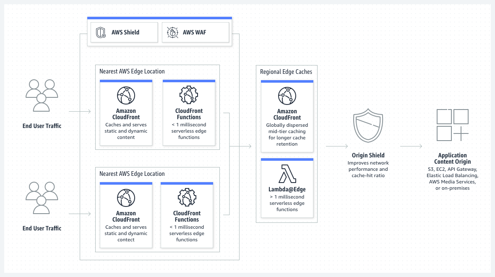

In the AWS Developer Relations organization, we have Developer Advocates and content creators who are passionate about creating useful and valuable content for the wider technical public. We are an organization that can understand what builders appreciate because we are builders ourselves. So it was only natural for us to embark on this journey of creating BuildOn.AWS.

We're still working on a snazzy one liner to describe BuildOn.AWS, but in the meantime I can tell you the cheesy definition that best describes it right now (don't quote me on this) - BuildOn.AWS is a website that hosts content for builder, by builders.

Anyways, while we work on coming up with that one-liner, I'm going to take the opportunity to share with you the tech stack that powers BuildOn.AWS.

(work in progress, TBC)

## AWS Services used

### CloudFront

