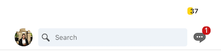
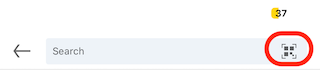
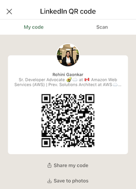

AWS re:Invent registrations have opened for 2023 and we cannot wait for the event at Las Vegas!  As we gear up for this year's event, it is easy to feel both excited and a little overwhelmed. Whether you are a first-time attendee or a re:Invent veteran, optimizing your experience requires more than just showing up. I've distilled my top 3 tips to ensure you get the most out of AWS re:Invent. Let's dive in!

## Plan your Sessions

### Prioritize and Reserve Early

 Prioritize sessions tha align with your objectives - learn new services, dive deeper into current stack, or find new solutions for your current challenges. Whatever the objective, figure our what sessions, workshops, bootcamps, etc would be important for you.

 Popular sessions fill up quickly, so reserve your spot to ensure you don't miss out. The session catalog is now available. You can access the catalog [here](https://reinvent.awsevents.com/session-catalog/).

 If you need more help in finding appropriate sessions then do check out [Attendee guides](https://reinvent.awsevents.com/learn/attendee-guides/?trk=9798ed69-1e88-43ce-9331-412979cf6c70) by AWS Heroes, AWS Partners, and AWS industry teams. I definitely urge you to read [Tips for your first AWS re:Invent](https://reinvent.awsevents.com/learn/attendee-guides/reliability-engineering/?trk=9798ed69-1e88-43ce-9331-412979cf6c70) by [Sathyajith Bhat](https://aws.amazon.com/developer/community/heroes/sathyajith-bhat/?did=dh_card&trk=dh_card), AWS Container Hero.

 > There won’t be certification exams at re:Invent.  However, registered attendees can access a 50% discount code toward an AWS official Certification exam. More info [here](https://reinvent.awsevents.com/community/aws-certified/?trk=9798ed69-1e88-43ce-9331-412979cf6c70).

### Community Events

Community Developer Lounge is where I spent most of my time as AWS Developer Advocate. Here, you can talk to experts, meet the community in-person, sign up for your local community and more. There are also sessions by community members called as Dev Chats - session IDs start with COM***. AWS Heroes are also presenting in 12 breakout sessions.

For more updates do check out [re:Invent Community page](https://reinvent.awsevents.com/community/#networking)

## Network, Network, Network

One of the biggest benefits of attending re:Invent in person is the networking opportunities. Engage in chats, Q&A sessions, and make use of the lounges and common areas to strike up conversations.

### Set up meetings

If you are an AWS Customer and have AWS Account Teams, make sure you reach out and set up meetings with relevant AWS Experts. If you do not have AWS account team yet, then you can [Contact AWS](https://aws.amazon.com/contact-us/).

You can also set up meetings with other customers, and community members. re:Invent is spread across a very wide area, plan early so people can make it to the venues on time.

### Attend Social Events

There are lots of parties at re:Invent, which basically covers dinners. 🙂 These parties can be organized by AWS like [replay](https://reinvent.awsevents.com/community/replay/?trk=9798ed69-1e88-43ce-9331-412979cf6c70), AWS Partners, or exclusive customer/community parties. Ensure you are not missing out on the important ones.

Most of the parties are listed on this third-party website [conferenceparties.com](https://conferenceparties.com/reinvent2023/). So keep this link handy and get ready to party Vegas style! 🥳

There are activities like the 5K run, Rec Centre, Pickleball tournament and more where you can have fun and connect with fellow attendees. You can find this [year's fun activities](https://reinvent.awsevents.com/community/#competition).

### Collect contacts

It is important to maintain the connections you have built throughout the event. Do ensure you collect business cards (if folks still give out those) or quickly [use a LinkedIn QR Code to Connect with Members](https://www.linkedin.com/help/linkedin/answer/a525286/using-a-linkedin-qr-code-to-connect-with-members): 

- **Step 1** : Open LinkedIn app, and click on the Search bar on the top:

    

- **Step 2** : Click on the little QR code icon that pops up, see the highlighted red box around it in the image below:

    

- **Step 3** : Thats it! Now you can let other scan this using LinkedIn, Camera app or any app that lets you scan QR Code. You can also save it in your photos gallery and scan and connect! :

## Self Care is important

### Eat, Hydrate and Rest

It can be overwhelming with back-to-back sessions, networking, and the sheer size of the event. Make sure to hydrate, and take breaks. 

Breakfast, lunch and snacks are provided at the expo hall in The Venetian. If you ever miss out on any, or are just hungry and want to grab a bite, Vegas has lots of food options. You can find almost everything busy, so be prepared to stand in queues.

**Bonus tip** - hotels typically sell water bottles at a hefty price. Find a CVS, Walgreens, or other convenience stores and buy in bulk.

### Wear comfortable shoes

Do not take this lightly - there is lot of walking!!!

If you plan to not walk and always take shuttle/cab do not underestimate Las Vegas traffic.

Content will be delivered across six venues on the Las Vegas strip: The Venetian, Wynn, Encore, Caesars Forum, MGM Grand, and Mandalay Bay. Your hotel may or may not be one of these. They might look close on the map, but getting from one hotel to another takes longer than you think. The closer you are to [The Venetian](https://maps.app.goo.gl/SgufMSUXc8MG9fAJ9), the better!

To help you get around, re:Invent ambassadors and wayfinding stations are also available across the re:Invent campus. You can find more detailed info on [venues, hotels, and getting around](https://reinvent.awsevents.com/campus/?trk=9798ed69-1e88-43ce-9331-412979cf6c70).

### Enjoy Las Vegas

Yes, Las Vegas will be the sin city and you might find unwanted attention too. So be safe, stay in well lit areas and maybe find a re:Invent buddy!

Also, make sure you enjoy what city and the state.

In the city, there are lot of attractions like  newly opened [The Sphere](https://www.thespherevegas.com/), Stratosphere (now known as The Strat Hotel & Casino & Tower), fountains, shows, and concerts. Tickets fill up fast, so make sure you book them in advance.

Over the years I have been to Vegas a lot and did enjoy the attractions outside of Las Vegas - Hoover dam, Valley of flowers, Death Valley, Grand Canyon, and more.

**Bonus tip** - if you are traveling Internationally, then ensure you come early to Vegas and carry an extra empty luggage - for shopping and swags. This way you can make use of the Thanksgiving sales at the North/South Premium Outlets - much better deals than in the city for sure. And it can also help with the jetlag. Doing re:Invent with jetlag is not easy.

Stay safe and have fun!
