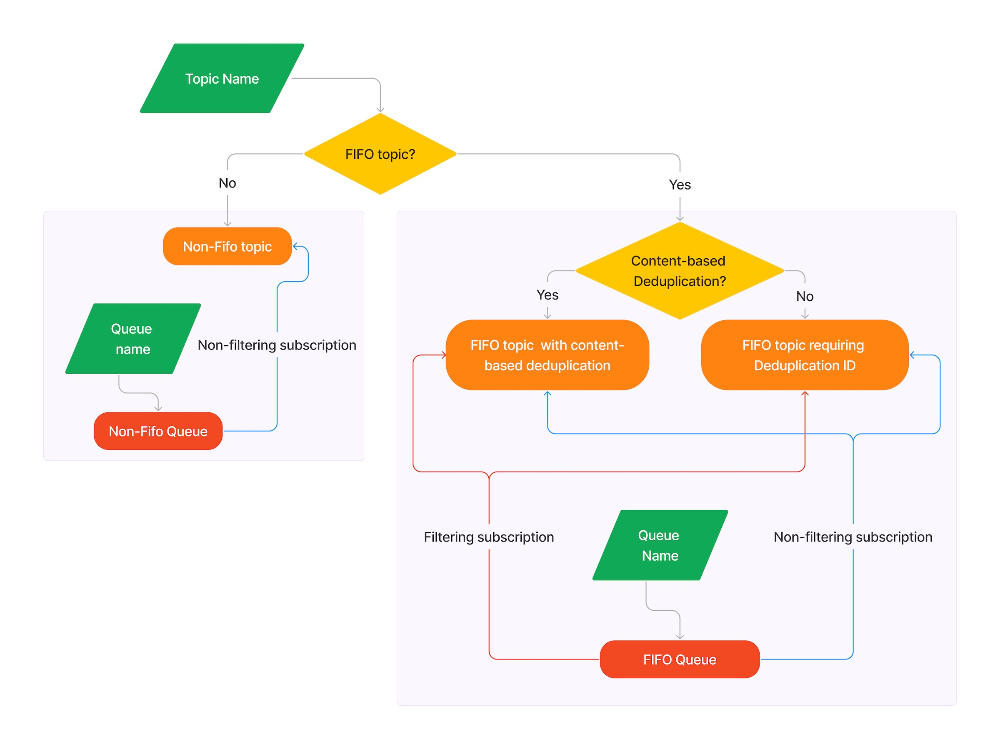

##

| ToC |
|-----|

This article describes the topics and queues workflow sample code which is part of the [AWS SDK code examples GitHub repository](https://github.com/awsdocs/aws-doc-sdk-examples). 
This workflow sample code demonstrates publish and subscribe 
using Amazon Simple Notification Service (Amazon SNS) and Amazon Simple Queue Service (Amazon SQS). This sample code is implemented in multiple programming languages. 
For example, if you would like to code publish and subscribe using Java, 
there is Java topics and queues workflow sample code to get you started. The topics and queues workflow sample code runs as a command-line application. This 
application allows you to select options and observe their behavior. You can play with filter subscriptions, or you can see what is required to implement a FIFO queue.

## Publish and Subscribe

Publish and subscribe is a mechanism for passing information. It’s used in social media, and it’s also used internally in software applications. A producer publishes a message, and the subscribers receive the message. 
In software, publish and subscribe notifications make message passing flexible and robust. The producers of messages are decoupled from the consumers of messages.

You can publish and subscribe using Amazon SNS alone. But combining Amazon SNS with Amazon SQS gives you greater flexibility in how the messages are consumed. Amazon SNS is a push service. 
It pushes to endpoints such as email addresses, mobile application endpoints, or SQS queues. (For a full list of endpoints, see [SNS event destinations](https://docs.aws.amazon.com/sns/latest/dg/sns-event-destinations.html)). 
With Amazon SQS, messages are received from a queue by polling. With polling, the subscriber receives messages by calling a receive message API. Any code can poll the queue. 
Also, the messages stay in the queue until you delete them. This gives you more flexibility in how the messages are processed. For example, a consumer may not be able to process a message the first time it is polled. 
The message is left in the queue for later processing. The point is there are more options for solving a use case. Polling may allow a cleaner solution than push notifications would require.

## Topics and Queues Workflow Command-line application 

The following diagram shows the SNS topic and SQS queue options demonstrated in the command-line application.



As already mentioned, code for these applications is contained in the [AWS SDK Code Examples](https://github.com/awsdocs/aws-doc-sdk-examples) GitHub repository. 
To download the repo you will need to install `git`. Then you can clone the repository.

```
git clone https://github.com/awsdocs/aws-doc-sdk-examples.git
```

The easiest way to find the topics and queues workflow for a particular language is to use the [code example library](https://docs.aws.amazon.com/code-library/latest/ug/sns_example_sqs_Scenario_TopicsAndQueues_section.html) website page.
The link to the code for each language is shown in the "Note" on the panel for that language. The workflow code is in its own folder which contains a README with instructions for building and running the code.

The code is structured to allow you to choose different options, which follow different paths in the code. 
This allows you to play with different options and see what is required to implement a particular option. 

To give you an idea of what is contained in the application, I have included an example of the command-line interface.

### Application Interface Description

Note: The actual interface may vary slightly between programming languages. 

#### Create an SNS topic

```
Would you like to work with FIFO topics? (y/n) 
```

You configure FIFO (First-In-First-Out) topics when you create them. Choosing a FIFO topic enables other options, too. To learn more, see [FIFO topics example use case](https://docs.aws.amazon.com/sns/latest/dg/fifo-example-use-case.html).

```
Use content-based deduplication instead of a deduplication ID? (y/n)
```

Deduplication is only available for FIFO topics. Deduplication prevents the subscriber from responding repeatedly to the same message. 
If a published message is determined to be a duplicate within the five-minute deduplication interval, the message is accepted but not delivered. 
For more information, see [Message deduplication for FIFO topics](https://docs.aws.amazon.com/sns/latest/dg/fifo-message-dedup.html).

Content-based deduplication uses a hash of the content as a deduplication ID. If content-based deduplication is not enabled, you must include a deduplication ID with each message.

```
Enter a name for your SNS topic:
```

If you chose a FIFO topic, the application automatically adds a “.fifo” suffix, which is required for FIFO topics.

#### Create two SQS queues

For this example, 2 queues are created to allow you to compare messages in the 2 queues. 
You can see that only the appropriate messages are sent to a filtered queue. All messages will be delivered to the non-filtered queue.
For non-FIFO queues, the results will be the same for both queues.

```
Enter a name for an SQS queue.
```

If you chose a FIFO topic, the application automatically adds a “.fifo” suffix, which is required for FIFO queues.

```
Filter messages for "<queue name>.fifo"s subscription to 
the topic "<topic name>.fifo"?  (y/n)
```

If you chose FIFO topics, you can add a filter to the queue’s topic subscription. There are many ways to filter a topic. In this example code, 
you have the option to filter by a predetermined selection of attributes. For more information about filters, see [Message filtering for FIFO topics](https://docs.aws.amazon.com/sns/latest/dg/fifo-message-filtering.html).

```
You can filter messages by one or more of the following "tone" attributes.
1. cheerful
2. funny
3. serious
4. sincere
Enter a number (or enter zero to stop adding more)
```

If you add a filter, you can select one or more “tone” attributes to filter by. When you’re done, enter “0’” to continue.

The application now prompts you to add the second queue. Repeat the previous steps for the second queue.


After you create the topic and subscribe both queues, the application lets you publish messages to the topic.

```
Enter a message text to publish.
```

All configurations include a message text.

```
Enter a message group ID for this message.
```

For more information about group IDs, see [Message grouping for FIFO topics](https://docs.aws.amazon.com/sns/latest/dg/fifo-message-grouping.html).

```
Enter a deduplication ID for this message.
```

If this is a FIFO topic and content-based deduplication is not enabled, then you must enter a deduplication ID. 

```
Add an attribute to this message? (y/n) y
```

If you added a filter to one of the subscriptions, you can choose to add a filtering attribute to the message.

```
1. cheerful
2. funny
3. serious
4. sincere
Enter a number for an attribute: 
```

Select a number for an attribute.

```
Post another message? (y/n)
```

You can post as many messages as you want.

When you are done posting messages, the application polls the queues and displays their messages.

## Conclusion

At the time of this writing, topics and queues workflows exist for the following languages.
* Java
* C++
* Kotlin
* JavaScript

Implementations for other languages will soon be added. The existing implementations can be found on the [code example library](https://docs.aws.amazon.com/code-library/latest/ug/sns_example_sqs_Scenario_TopicsAndQueues_section.html) website. 
The code can be downloaded from the [AWS SDK Code Examples](https://github.com/awsdocs/aws-doc-sdk-examples) GitHub repository.