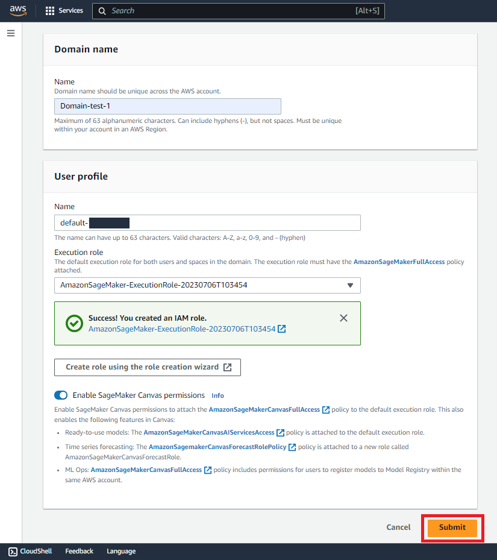
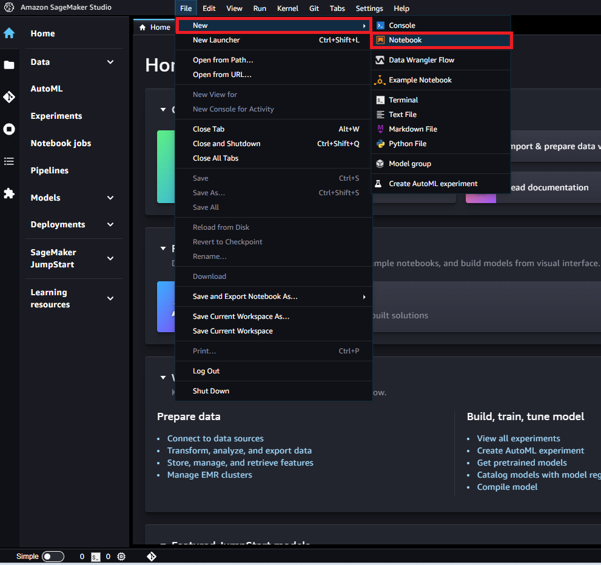
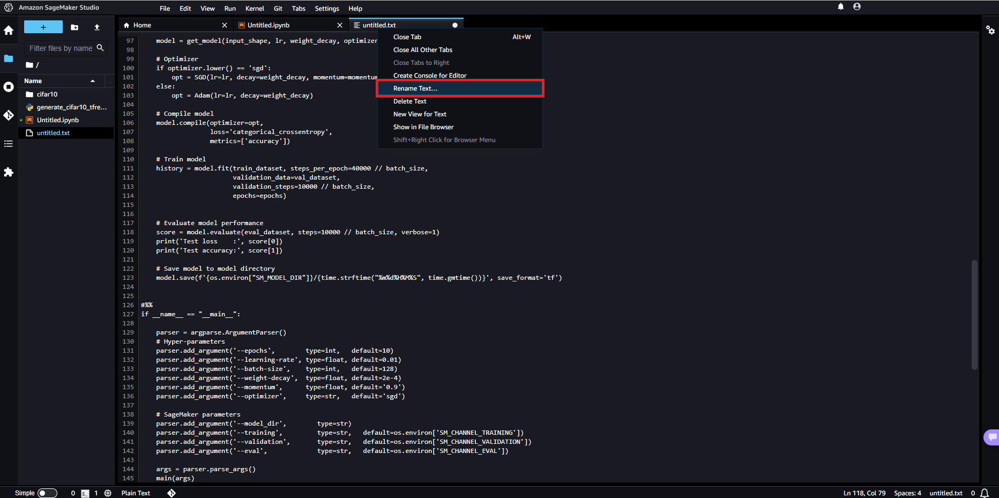

In this tutorial, you will learn how to use Amazon SageMaker to build, train, and tune a TensorFlow deep learning model. This includes:

- Setting up Amazon SageMaker Studio.
- Downloading a public dataset using an Amazon SageMaker Studio Notebook and upload it to Amazon S3.
- Creating an Amazon SageMaker Experiment to track and manage training jobs.
- Running a TensorFlow training job on a fully managed GPU instance using one-click training with Amazon SageMaker.
- Improving accuracy by running a large-scale Amazon SageMaker Automatic Model Tuning job to find the best model hyperparameters.
- Visualizing training results.
- Using the CIFAR-10 dataset to train a model in TensorFlow to classify images into 10 classes. This dataset consists of 60,000 32x32 color images, split into 40,000 images  for training, 10,000 images for validation, and 10,000 images for testing.

[Amazon SageMaker](https://aws.amazon.com/sagemaker/) is a fully managed service that provides machine learning (ML) developers and data scientists with the ability to build, train, and deploy ML models quickly. Amazon SageMaker has everything you need to train and tune models at scale without the need to manage infrastructure.

[Amazon SageMaker Studio](https://docs.aws.amazon.com/sagemaker/latest/dg/studio.html) is the first integrated development environment (IDE) for machine learning. You can use it to quickly visualize experiments and track training progress without ever leaving the familiar Jupyter Notebook interface. Within Amazon SageMaker Studio, you can use [Amazon SageMaker Experiments](https://docs.aws.amazon.com/sagemaker/latest/dg/experiments.html) to track, evaluate, and organize experiments easily.


## Table of Contents

| Attributes                |                                   |
| ------------------- | -------------------------------------- |
| ✅ AWS Level        | Intermediate                         |
| ⏱ Time to complete  | 1 hour                              |
| 💰 Cost to complete | Approx. $100     |
| 🧩 Prerequisites    | [AWS Account](https://aws.amazon.com/resources/create-account/?sc_channel=el&sc_campaign=devopswave&sc_content=cicdcdkpthnec2aws&sc_geo=mult&sc_country=mult&sc_outcome=acq) 
| 📢 Feedback            | <a href="https://pulse.buildon.aws/survey/DEM0H5VW" target="_blank">Any feedback, issues, or just a</a> 👍 / 👎 ?    |
| ⏰ Last Updated     | YYYY-MM-DD                             |

| ToC |
|-----|


## Setting up Amazon SageMaker Studio

You’re going to begin by onboarding onto Amazon SageMaker Studio and setting up your Amazon SageMaker Studio Control Panel. For more information, read our documentation [Get Started with Amazon SageMaker Studio](https://docs.aws.amazon.com/sagemaker/latest/dg/gs.html). Once you have your account, sign in to the [Amazon SageMaker console](https://console.aws.amazon.com/sagemaker/).

In the top-right corner, select an AWS Region where SageMaker Studio is available. For a list of Regions, check out or documentation on how to [Onboard to Amazon SageMaker Studio](https://docs.aws.amazon.com/sagemaker/latest/dg/gs-studio-onboard.html):


Next, in the `Amazon SageMaker` navigation pane, choose `Studio` and then `Create SageMaker domain`.
 
If you are using Amazon SageMaker Studio for the first time, you must complete the [Studio onboarding process](https://docs.aws.amazon.com/sagemaker/latest/dg/gs-studio-onboard.html). When onboarding, you can choose to use either AWS Single Sign-On (AWS SSO) or AWS Identity and Access Management (IAM) for authentication methods. When you use IAM authentication, you can choose the Quick start or the Standard setup procedure. If you are unsure of which option to choose, read [Onboard to Amazon SageMaker Studio](https://docs.aws.amazon.com/sagemaker/latest/dg/gs-studio-onboard.html) or ask your IT administrator for assistance. For this tutorial, we will use the `Quick start` procedure:


Now, select `Quick setup` and specify a domain name and user profile name:


For `Execution role`, choose `Create new role`. In the dialog box prompt, select `Any S3 bucket` and `Create role`.
From there, Amazon SageMaker creates a role with the required permissions and assigns it to your instance:  


After creating a role with the appropriate permissions, press `Submit`:



Now that you’ve completed the Amazon SageMaker Studio process, you can proceed to downloading a dataset to your notebook. 


## Creating a SageMaker Notebook and handling datasets

Amazon SageMaker Studio notebooks are one-click Jupyter Notebooks that contain everything you need to build and test your training scripts. SageMaker Studio also includes experiment tracking and visualization so that it’s easy to manage your entire machine learning workflow in one place.

In this step you’ll create a SageMaker Notebook, download the dataset, convert the dataset into TensorFlow supported TFRecord format, and then upload the dataset to Amazon S3. For more information, read our documentation [Use Amazon SageMaker Studio Notebooks](https://docs.aws.amazon.com/sagemaker/latest/dg/notebooks.html).

In the `Amazon SageMaker Domains`, choose `Launch Studio`:


Next, in `JupyterLab`, on the `File` menu, select `New`. In the `Notebooks` section, for `Select a SageMaker image`, choose `TensorFlow 1.15 Python 3.7 (optimized for CPU)`. Then, for `Notebook`, choose `Python 3`.
 
`Note:` In this step, you’re choosing a CPU instance which is used to run the SageMaker Notebook that downloads the dataset, builds your training scripts, submits Amazon SageMaker training jobs, and visualizes results. The training job itself runs on a separate instance type that you can specify, such as a GPU instance as you’ll see in Step 5.




Copy and insert the following code block into the code cell and select `Run`.
 
This code downloads the `generate_cifar10_tfrecords.py` script and the [CIFAR-10 dataset](https://www.cs.toronto.edu/~kriz/cifar.html), then converts it into TFRecord format.
 
While the code runs, an `*` appears between the square brackets. After a few seconds, the code execution completes and the `*` is replaced with a number as in the following example:

```Python
%%writefile generate_cifar10_tfrecords.py 
from __future__ import absolute_import, division, print_function 
import argparse 
import os 
import shutil 
import sys 
import tarfile 
import tensorflow as tf 
from IPython.display import display 
from ipywidgets import FloatProgress 
from six.moves import cPickle as pickle 
from six.moves import xrange  # pylint: disable=redefined-builtin 
from six.moves import urllib 

CIFAR_FILENAME = "cifar-10-python.tar.gz" 
CIFAR_DOWNLOAD_URL = "https://www.cs.toronto.edu/~kriz/" + CIFAR_FILENAME 
CIFAR_LOCAL_FOLDER = "cifar-10-batches-py" 

def download_and_extract(data_dir, print_progress=True): 
    """Download and extract the tarball from Alex's website.""" 
    if not os.path.exists(data_dir): 
        os.makedirs(data_dir) 

    if os.path.exists(os.path.join(data_dir, "cifar-10-batches-bin")): 
        print("cifar dataset already downloaded") 
        return 

    filename = CIFAR_DOWNLOAD_URL.split("/")[-1] 
    filepath = os.path.join(data_dir, filename) 

    if not os.path.exists(filepath): 
        f = FloatProgress(min=0, max=100)
        display(f)
        sys.stdout.write("\r>> Downloading %s " % (filename)) 

        def _progress(count, block_size, total_size): 
            if print_progress: 
                f.value = 100.0 * count * block_size / total_size 
        filepath, _ = urllib.request.urlretrieve(CIFAR_DOWNLOAD_URL, filepath, _progress) 
        print() 
        statinfo = os.stat(filepath) 
        print("Successfully downloaded", filename, statinfo.st_size, "bytes.") 
    tarfile.open(filepath, "r:gz").extractall(data_dir) 

def _int64_feature(value): 
    return tf.train.Feature(int64_list=tf.train.Int64List(value=[value])) 

def _bytes_feature(value): 
    return tf.train.Feature(bytes_list=tf.train.BytesList(value=[value])) 

def _get_file_names(): 
    """Returns the file names expected to exist in the input_dir.""" 
    file_names = {} 
    file_names["train"] = ["data_batch_%d" % i for i in xrange(1, 5)] 
    file_names["validation"] = ["data_batch_5"] 
    file_names["eval"] = ["test_batch"] 
    return file_names 

def read_pickle_from_file(filename): 
    with tf.io.gfile.GFile(filename, "rb") as f: 
        if sys.version_info >= (3, 0): 
            data_dict = pickle.load(f, encoding="bytes") 
        else: 
            data_dict = pickle.load(f) 
    return data_dict 

def convert_to_tfrecord(input_files, output_file): 
    """Converts a file to TFRecords.""" 
    print("Generating %s" % output_file) 
    with tf.io.TFRecordWriter(output_file) as record_writer: 
        for input_file in input_files: 
            data_dict = read_pickle_from_file(input_file) 
            data = data_dict[b"data"] 
            labels = data_dict[b"labels"] 
            num_entries_in_batch = len(labels) 
            for i in range(num_entries_in_batch): 
                example = tf.train.Example( 
                    features=tf.train.Features( 
                        feature={ 
                            "image": _bytes_feature(data[i].tobytes()), 
                            "label": _int64_feature(labels[i]), 
                        } 
                    ) 
                ) 
                record_writer.write(example.SerializeToString()) 

def main(data_dir): 
    print("Download from {} and extract.".format(CIFAR_DOWNLOAD_URL)) 
    download_and_extract(data_dir) 
    file_names = _get_file_names() 
    input_dir = os.path.join(data_dir, CIFAR_LOCAL_FOLDER) 

    for mode, files in file_names.items(): 
        input_files = [os.path.join(input_dir, f) for f in files] 
        output_file = os.path.join(data_dir, mode + ".tfrecords") 

        try: 
            os.remove(output_file) 

        except OSError: 
            pass

        # Convert to tf.train.Example and write the to TFRecords. 
        convert_to_tfrecord(input_files, output_file) 
    print("Removing original files.") 
    os.remove(os.path.join(data_dir, CIFAR_FILENAME)) 
    shutil.rmtree(input_dir) 
    print("Done!") 

if __name__ == "__main__": 
    parser = argparse.ArgumentParser() 
    parser.add_argument("--data-dir", type=str, default="", help="Directory to download and extract CIFAR-10 to.") 
    args = parser.parse_args() 
    main(args.data_dir) 
```


Once this completes, copy and insert the following code and select `Run`:

```Python
!pip install ipywidgets
!python generate_cifar10_tfrecords.py --data-dir cifar10
```


Next, upload the dataset to your default Amazon SageMaker Amazon S3 bucket. Insert the following code and select `Run`. You should receive the Amazon S3 location for your dataset in the output:

```Python
import time, os, sys
import sagemaker, boto3
import numpy as np
import pandas as pd

sess = boto3.Session()
sm   = sess.client('sagemaker')
role = sagemaker.get_execution_role()
sagemaker_session = sagemaker.Session(boto_session=sess)

datasets = sagemaker_session.upload_data(path='cifar10', key_prefix='datasets/cifar10-dataset')
datasets 
```


Now that you’ve downloaded and uploaded your dataset to your bucket, you can move on to creating an Amazon SageMaker experiment. 


## Creating an Amazon SageMaker Experiment

With your dataset downloaded and staged in Amazon S3, you are now ready to create an Amazon SageMaker Experiment. An experiment is a collection of processing and training jobs related to the same machine learning project. Amazon SageMaker Experiments automatically manages and tracks your training runs for you.

For more information, read[Experiments](https://docs.aws.amazon.com/sagemaker/latest/dg/experiments.html) in the Amazon SageMaker documentation.

First, in your Jupyter Notebook, insert the following code and select `Run`. The code uses the `smexperiments` python package to create an experiment named `sagemaker-training-experiments`. This package comes pre-installed on Amazon SageMaker Studio Notebooks. You can customize the experiment name and description:

```Python
from smexperiments.experiment import Experiment
from smexperiments.trial import Trial
from smexperiments.trial_component import TrialComponent

training_experiment = Experiment.create(
                                experiment_name = "sagemaker-training-experiments", 
                                description     = "Experiment to track cifar10 training trials", 
                                sagemaker_boto_client=sm)
```


Now, on the left toolbar, choose `Home` and select`Experiments`. The new experiment `sagemaker-training-experiments` appears in the list as in the following: 


Now that your experiment is created you can move forward with the trial and training script. 


## Creating the trial and training script

In your Jupyter Notebook, insert the following code block and select `Run`. This code creates a new trial and associates it with the Experiment you created in Step 4:

```Python
single_gpu_trial = Trial.create(
    trial_name = 'sagemaker-single-gpu-training', 
    experiment_name = training_experiment.experiment_name,
    sagemaker_boto_client = sm,
)

trial_comp_name = 'single-gpu-training-job'
experiment_config = {"ExperimentName": training_experiment.experiment_name, 
                       "TrialName": single_gpu_trial.trial_name,
                       "TrialComponentDisplayName": trial_comp_name}
```


Each trial is an iteration of your end-to-end training job. In addition to the training job, a trial can track preprocessing jobs, post-processing jobs, datasets, and other metadata. A single experiment can include multiple trials, making it easy for you to track various iterations over time within the Amazon SageMaker Studio Experiments pane.

In the left toolbar, choose `Home` and then `Experiments`. Press the `sagemaker-training-experiments` to display the associated trials in a new view. Within the `Runs` section, the new trial `sagemaker-single-gpu-training` appears in this list:


Next, on the `File` menu, select `New`, then `Text File`. In the code editor, insert the following TensorFlow code into the newly created file.
 
This script implements TensorFlow code to read the CIFAR-10 dataset and train a resnet50 model:

```Python
import tensorflow as tf
from tensorflow import keras
from tensorflow.keras.callbacks import ModelCheckpoint
from tensorflow.keras.layers import Input, Dense, Flatten
from tensorflow.keras.models import Model, load_model
from tensorflow.keras.optimizers import Adam, SGD
import argparse
import os
import re
import time

HEIGHT = 32
WIDTH = 32
DEPTH = 3
NUM_CLASSES = 10

def single_example_parser(serialized_example):
    """Parses a single tf.Example into image and label tensors."""
    # Dimensions of the images in the CIFAR-10 dataset.
    # See http://www.cs.toronto.edu/~kriz/cifar.html for a description of the
    # input format.
    features = tf.io.parse_single_example(
        serialized_example,
        features={
            'image': tf.io.FixedLenFeature([], tf.string),
            'label': tf.io.FixedLenFeature([], tf.int64),
        })
    image = tf.decode_raw(features['image'], tf.uint8)
    image.set_shape([DEPTH * HEIGHT * WIDTH])

    # Reshape from [depth * height * width] to [depth, height, width].
    image = tf.cast(
        tf.transpose(tf.reshape(image, [DEPTH, HEIGHT, WIDTH]), [1, 2, 0]),
        tf.float32)
    label = tf.cast(features['label'], tf.int32)
    image = train_preprocess_fn(image)
    label = tf.one_hot(label, NUM_CLASSES)
    return image, label

def train_preprocess_fn(image):
    # Resize the image to add four extra pixels on each side.
    image = tf.image.resize_with_crop_or_pad(image, HEIGHT + 8, WIDTH + 8)

    # Randomly crop a [HEIGHT, WIDTH] section of the image.
    image = tf.image.random_crop(image, [HEIGHT, WIDTH, DEPTH])

    # Randomly flip the image horizontally.
    image = tf.image.random_flip_left_right(image)
    return image

def get_dataset(filenames, batch_size):
    """Read the images and labels from 'filenames'."""
    # Repeat infinitely.
    dataset = tf.data.TFRecordDataset(filenames).repeat().shuffle(10000)

    # Parse records.
    dataset = dataset.map(single_example_parser, num_parallel_calls=tf.data.experimental.AUTOTUNE)

    # Batch it up.
    dataset = dataset.batch(batch_size, drop_remainder=True)
    return dataset

def get_model(input_shape, learning_rate, weight_decay, optimizer, momentum):
    input_tensor = Input(shape=input_shape)
    base_model = keras.applications.resnet50.ResNet50(include_top=False,
                                                          weights='imagenet',
                                                          input_tensor=input_tensor,
                                                          input_shape=input_shape,
                                                          classes=None)
    x = Flatten()(base_model.output)
    predictions = Dense(NUM_CLASSES, activation='softmax')(x)
    model = Model(inputs=base_model.input, outputs=predictions)
    return model

def main(args):
    # Hyper-parameters
    epochs       = args.epochs
    lr           = args.learning_rate
    batch_size   = args.batch_size
    momentum     = args.momentum
    weight_decay = args.weight_decay
    optimizer    = args.optimizer

    # SageMaker options
    training_dir   = args.training
    validation_dir = args.validation
    eval_dir       = args.eval


    train_dataset = get_dataset(training_dir+'/train.tfrecords',  batch_size)
    val_dataset   = get_dataset(validation_dir+'/validation.tfrecords', batch_size)
    eval_dataset  = get_dataset(eval_dir+'/eval.tfrecords', batch_size)
    
    input_shape = (HEIGHT, WIDTH, DEPTH)
    model = get_model(input_shape, lr, weight_decay, optimizer, momentum)
    
    # Optimizer
    if optimizer.lower() == 'sgd':
        opt = SGD(lr=lr, decay=weight_decay, momentum=momentum)
    else:
        opt = Adam(lr=lr, decay=weight_decay)

    # Compile model
    model.compile(optimizer=opt,
                  loss='categorical_crossentropy',
                  metrics=['accuracy'])
    
    # Train model
    history = model.fit(train_dataset, steps_per_epoch=40000 // batch_size,
                        validation_data=val_dataset, 
                        validation_steps=10000 // batch_size,
                        epochs=epochs)       
    
    # Evaluate model performance
    score = model.evaluate(eval_dataset, steps=10000 // batch_size, verbose=1)
    print('Test loss    :', score[0])
    print('Test accuracy:', score[1])
    
    # Save model to model directory
    model.save(f'{os.environ["SM_MODEL_DIR"]}/{time.strftime("%m%d%H%M%S", time.gmtime())}', save_format='tf')

#%%
if __name__ == "__main__":
    parser = argparse.ArgumentParser()
    # Hyper-parameters
    parser.add_argument('--epochs',        type=int,   default=10)
    parser.add_argument('--learning-rate', type=float, default=0.01)
    parser.add_argument('--batch-size',    type=int,   default=128)
    parser.add_argument('--weight-decay',  type=float, default=2e-4)
    parser.add_argument('--momentum',      type=float, default='0.9')
    parser.add_argument('--optimizer',     type=str,   default='sgd')

    # SageMaker parameters
    parser.add_argument('--model_dir',        type=str)
    parser.add_argument('--training',         type=str,   default=os.environ['SM_CHANNEL_TRAINING'])
    parser.add_argument('--validation',       type=str,   default=os.environ['SM_CHANNEL_VALIDATION'])
    parser.add_argument('--eval',             type=str,   default=os.environ['SM_CHANNEL_EVAL'])
    
    args = parser.parse_args()
    main(args)
```


On the `File` tab, right click and choose `Rename File`. In the `New Name` box, copy and paste *cifar10-training-sagemaker.py* and choose `Rename`. (Make sure that the new extension is `.py` and not `.txt`). Then, choose `File` and `Save Python File`.




You’re now ready to run your Tensorflow training job in the next step. 


## Running the TensorFlow training job and visualize the results

In this step, you will run a TensorFlow training job using Amazon SageMaker. Training models are easy with Amazon SageMaker. All you need to do is specify the location of your dataset in Amazon S3 and training instance type. From there, Amazon SageMaker manages the training infrastructure for you. For more information, read our documentation [Use TensorFlow with Amazon SageMaker](https://docs.aws.amazon.com/sagemaker/latest/dg/tf.html).

In your Jupyter Notebook, insert the following code block and select `Run`. Then, review the code closely:
 
`Note:` If a `ResourceLimitExceeded` appears, change the instance type to `ml.c5.xlarge`. Additionally, you can safely ignore any deprecation warnings (for example, *sagemaker.deprecations:train_instance_type* has been renamed...). These warnings are due to version changes and do not cause any training failures.

```Python
from sagemaker.tensorflow import TensorFlow

hyperparams={'epochs'       : 30,
             'learning-rate': 0.01,
             'batch-size'   : 256,
             'weight-decay' : 2e-4,
             'momentum'     : 0.9,
             'optimizer'    : 'adam'}

bucket_name = sagemaker_session.default_bucket()
output_path = f's3://{bucket_name}/jobs'
metric_definitions = [{'Name': 'val_acc', 'Regex': 'val_acc: ([0-9\\.]+)'}]

tf_estimator = TensorFlow(entry_point          = 'cifar10-training-sagemaker.py', 
                          output_path          = f'{output_path}/',
                          code_location        = output_path,
                          role                 = role,
                          train_instance_count = 1, 
                          train_instance_type  = 'ml.g4dn.xlarge',
                          framework_version    = '1.15.2', 
                          py_version           = 'py3',
                          script_mode          = True,
                          metric_definitions   = metric_definitions,
                          sagemaker_session    = sagemaker_session,
                          hyperparameters      = hyperparams)

job_name=f'tensorflow-single-gpu-{time.strftime("%Y-%m-%d-%H-%M-%S", time.gmtime())}'
tf_estimator.fit({'training'  : datasets,
                  'validation': datasets,
                  'eval'      : datasets},
                 job_name = job_name,
                 experiment_config=experiment_config)
```


This code consists of three parts:

- First, it specifies training job hyperparameters.
- Second, it calls an Amazon SageMaker Estimator function and provides training job details. For example, the name of the training script, what instance type to train on, framework version, etc.
- Third, it calls the fit function to initiate the training job.

Amazon SageMaker automatically provisions the requested instances, downloads the dataset, pulls the TensorFlow container, downloads the training script, and starts training.

In this example, you will submit an Amazon SageMaker training job to run on `ml.c5.xlarge` which is not a GPU instance. Deep learning training is computationally intensive and GPU instances are recommended for getting results faster.   

After training is complete, you should see final accuracy results, training time, and billable time as in the following: 


To view the training summary, navigate to the left toolbar and choose ´Experiments´. Then, press ´sagemaker-training-experiments´ and select the newly created ´single-gpu-training-job´ Trial Component for your training job. Finally, choose Metrics to view the summary:


To visualize the results, select `Charts` then `Add chart`. In the `Chart Properties` pane, make the following selections: 

- `Chart type`: Line
- `X-axis dimension`: Step
- `Y-axis`: val_acc_EVAL

After making those selections, you will receive a graph showing the change in evaluation accuracy as training progresses, ending with the final accuracy in Step 6a: 


After running this training job and reviewing the results, you can proceed to the next step on automatic model tuning. 


## Tuning the model with Amazon SageMaker automatic model tuning

In this step, you will run an Amazon SageMaker automatic model tuning job to find the best hyperparameters. This will improve the training accuracy obtained in Step 6. For more information, read our documentation [Perform Automatic Model Tuning](https://docs.aws.amazon.com/sagemaker/latest/dg/automatic-model-tuning.html).

To run a model tuning job, you need to provide Amazon SageMaker with hyperparameter ranges rather than fixed values. This lets it explore the hyperparameter space and automatically find the best values for you. In your Jupyter Notebook, insert the following code and select `Run`. Then, review the code:
 
`Note:` If a `ResourceLimitExceeded` appears, change the instance type to `ml.c5.xlarge`. You can safely ignore any deprecation warnings (for example, *sagemaker.deprecations:train_instance_type has been renamed...)*. These warnings are due to version changes and do not cause any training failures.

```Python
from sagemaker.tuner import IntegerParameter, CategoricalParameter, ContinuousParameter, HyperparameterTuner

hyperparameter_ranges = {
    'epochs'        : IntegerParameter(5, 30),
    'learning-rate' : ContinuousParameter(0.001, 0.1, scaling_type='Logarithmic'), 
    'batch-size'    : CategoricalParameter(['128', '256', '512']),
    'momentum'      : ContinuousParameter(0.9, 0.99),
    'optimizer'     : CategoricalParameter(['sgd', 'adam'])
}

objective_metric_name = 'val_acc'
objective_type = 'Maximize'
metric_definitions = [{'Name': 'val_acc', 'Regex': 'val_acc: ([0-9\\.]+)'}]

tf_estimator = TensorFlow(entry_point          = 'cifar10-training-sagemaker.py', 
                          output_path          = f'{output_path}/',
                          code_location        = output_path,
                          role                 = role,
                          train_instance_count = 1, 
                          train_instance_type  = 'ml.g4dn.xlarge',
                          framework_version    = '1.15', 
                          py_version           = 'py3',
                          script_mode          = True,
                          metric_definitions   = metric_definitions,
                          sagemaker_session    = sagemaker_session)

tuner = HyperparameterTuner(estimator             = tf_estimator,
                            objective_metric_name = objective_metric_name,
                            hyperparameter_ranges = hyperparameter_ranges,
                            metric_definitions    = metric_definitions,
                            max_jobs              = 16,
                            max_parallel_jobs     = 8,
                            objective_type        = objective_type)

job_name=f'tf-hpo-{time.strftime("%Y-%m-%d-%H-%M-%S", time.gmtime())}'
tuner.fit({'training'  : datasets,
           'validation': datasets,
           'eval'      : datasets},
            job_name = job_name)
```


This code consists of four parts:

- First, it specifies a range of values for hyperparameters. These could be integer ranges (eg. Epoch numbers), continuous ranges (eg. Learning rate), or categorical values (eg. Optimizer type sgd or adam).
- Second, it calls an Estimator function similar to the one in Step 6.
- Third, it creates a HyperparameterTuner object. This has hyperparameter ranges, maximum number of jobs, and number of parallel jobs to run.
- Fourth, it calls the fit function to initiate a hyperparameter tuning job.

You can reduce the `max_jobs` variable from 16 to a smaller number to save tuning job costs. However, by reducing the number of tuning jobs, you reduce the chances of finding a better model. You can also reduce the `max_parallel_jobs` variable to a number less than or equal to `max_jobs`. You can get results faster when `max_parallel_jobs` is equal to `max_jobs`. Make sure that `max_parallel_jobs` is lower than the instance limits of your AWS account to avoid running into resource errors.

To view the best hyperparameters, open the [Amazon SageMaker Console](https://console.aws.amazon.com/sagemaker/), and in the left navigation pane toggle to `Training` and choose `Hyperparameter tuning jobs`. Select the tuning job and then choose `Best training job`. You’ll see an improvement in the training accuracy (80%) compared to results in Step 6 (60%).
 
Keep in mind that your results may vary. You can improve your results by increasing `max_jobs`, relaxing the hyperparameter ranges, and exploring other model architectures:


## Cleaning up resources

In this step, you will terminate the resources you used in this lab. Terminating resources that are not actively being used reduces costs and is a best practice. Not terminating your resources will result in charges to your account.

To stop training jobs, first  open the [Amazon SageMaker Console](https://console.aws.amazon.com/sagemaker/). In the left navigation pane, go to `Training` and choose `Training Jobs`. Confirm that there are no training jobs that have a status of `In Progress`. For any in progress training jobs, you can either wait for the job to finish training, or select the training job name and choose `Stop`:


Optionally, if you want to clean up all training artifacts (models, preprocessed data sets, etc.), in your Jupyter notebook, insert the following code and select `Run`. Make sure to replace ACCOUNT_NUMBER with your account number as in the following example:

```Python
!aws s3 rm --recursive s3://sagemaker-us-west-2-ACCOUNT_NUMBER/datasets/cifar10-dataset
!aws s3 rm --recursive s3://sagemaker-us-west-2-ACCOUNT_NUMBER/jobs
```

Your resources have now been successfully eliminated and you can avoid accruing any additional charges to your account.


## Conclusion

You have successfully set up Amazon SageMaker to train a TensorFlow deep learning model, including downloading and uploading datasets to an S3 bucket. You further tuned this model to operate at scale, by using  Amazon SageMaker’s Automatic Model Tuning. This gives you the best hyperparameters to optimize your model.

Amazon SageMaker lets you train and tune at scale through a fully managed service, from within its own IDE. Deploy quickly and let us handle your infrastructure needs.
