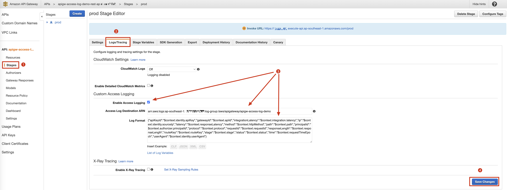
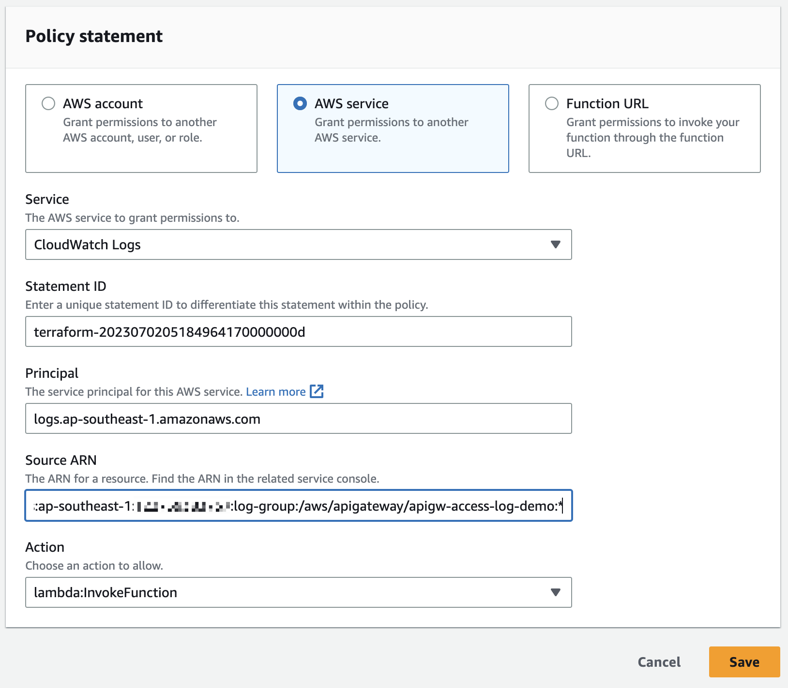
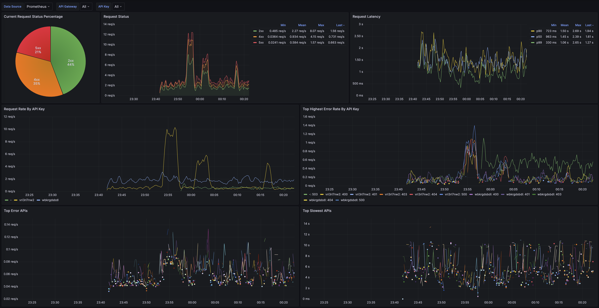
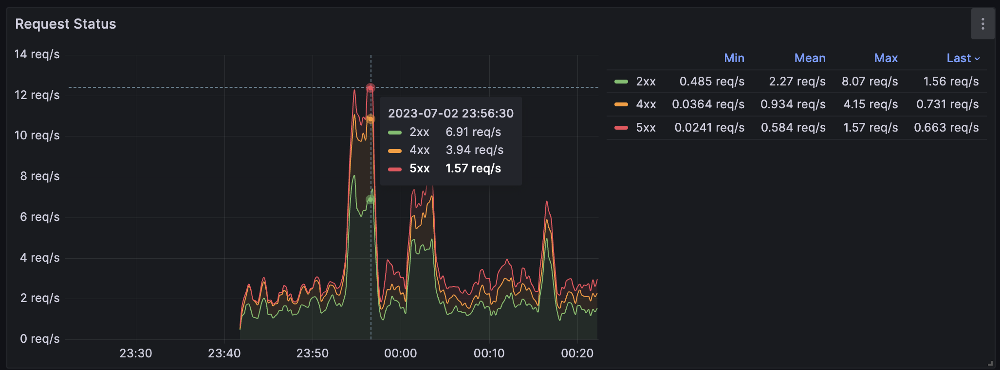
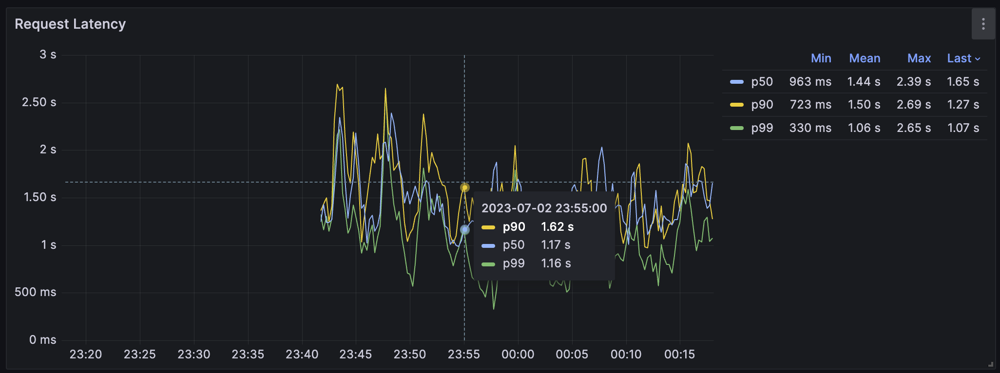
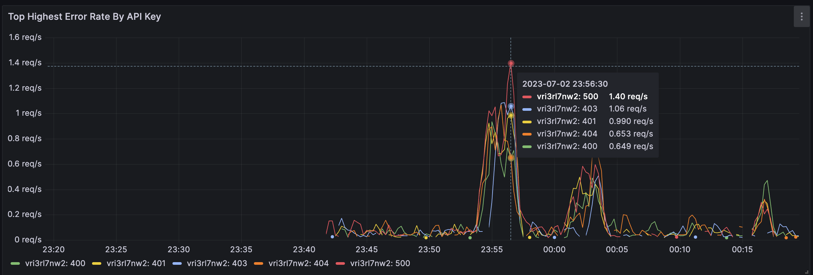
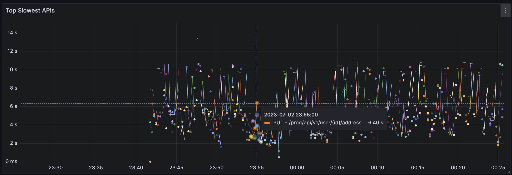

|ToC|
|---|

## Challenges

When working with Amazon API Gateway, there are several challenges you may encounter. Particularly in terms of observability, here are some challenges:

- **Metrics and Monitoring**: API Gateway offers some basic metrics and monitoring capabilities, but they might not be sufficient for in-depth observability. You may need to integrate with AWS CloudWatch or other monitoring solutions to collect and analyze metrics like latency, error rates, and request throughput, etc.
- **Debugging**: Debugging issues within API Gateway can be tricky due to limited visibility into the inner workings of the service. It's crucial to utilize logging, metrics, and distributed tracing to identify and troubleshoot issues effectively. Additionally, thorough testing and monitoring of API Gateway configurations are essential.
- **Error Handling**: API Gateway can return various types of errors and status codes. Proper error handling and monitoring mechanisms are crucial to ensure you can identify and address errors promptly. Configuring appropriate alarms or integrating with other monitoring tools can help in this regard.
- **Scalability and Performance**: As API traffic grows, ensuring scalability and optimal performance becomes crucial. Monitoring and observability can help you identify bottlenecks, optimize resource allocation, and monitor the overall health and performance of backend services of the API Gateway.

To overcome these challenges, it is essential to leverage additional AWS services, third-party monitoring tools, open-source frameworks to enhance observability. By combining these tools and best practices, you can gain better insights into your API Gateway, identify performance issues, debug problems, and ensure a seamless experience for your users.

Let's look at a situation. I possess a SaaS product that offers APIs through an API Gateway to clients. Each client has the capability to generate multiple API keys for various purposes. Furthermore, each API key can be linked to a different predefined usage plan.

I would like to obtain metrics that provide insight into client behavior, including:

- Which clients and API keys have the highest consumption rates? What are the rates at which they make requests?
- Which API exhibits the slowest performance? What are the latency values for the 99th, 90th, and 50th percentiles?
- What are the success and error rates for a specific API?

Unfortunately, API Gateway does not offer metrics specifically for tracking such insights. Generating those metrics would require implementing custom instrument codes within the backend services, which can be time-consuming and require significant effort.

## Solution

As the API Gateway access log already includes all the essential information, I would utilize it to obtain insightful metrics. Given that I am utilizing the Prom stack (Prometheus, Alertmanager, Grafana) as my observability platform, I would like to find a solution to convert the API Gateway access log into Prometheus metrics. This will enable seamless integration with my current tools and framework.

There are numerous tools available that facilitate the transformation of logs into Prometheus metrics. Additionally, it is possible to develop a custom tool for this purpose. Personally, I have a preference for open-source solutions, and in my experience, I have found vector.dev to be a powerful and high-performance tool for observability purposes. It effectively caters to my requirements in this particular use case.

### Architecture

The following diagram illustrates my solution for transforming API Gateway access logs into Prometheus metrics:


The solution's basic flow for converting API Gateway access logs into Prometheus metrics is as follows:

1. API Gateway is configured to generate access logs, which are then sent to CloudWatch Logs
2. CloudWatch Logs Subscription Filter is employed to forward the access logs to a Lambda function
3. The Lambda function performs additional enhancements on the access logs and dispatches them to an SQS queue
4. [Vector](https://vector.dev) deployment is implemented, utilizing either ECS tasks or EKS pods. This deployment retrieves the access logs from the SQS queue and transforms them into Prometheus metrics, while also exposing these metrics
5. Prometheus scrapes the metrics exposed by Vector
6. Lastly, Grafana queries the Prometheus metrics and visualizes them in the form of graphs

You will need an AWS account and a basic knowledge of the AWS to begin with. Below are high-level steps. Let’s get started!

### Enable API Gateway access log

We first need to enable access log of the API Gateway. Let’s say we already have an existing API Gateway.




Here are log formats:

* REST API
    ```json
    {
        "apiKeyId": "$context.identity.apiKey",
        "gatewayId": "$context.apiId",
        "integrationLatency": "$context.integration.latency",
        "ip": "$context.identity.sourceIp",
        "latency": "$context.responseLatency",
        "method": "$context.httpMethod",
        "path": "$context.path",
        "principalId": "$context.authorizer.principalId",
        "protocol": "$context.protocol",
        "requestId": "$context.requestId",
        "responseLength": "$context.responseLength",
        "routeKey": "$context.routeKey",
        "stage": "$context.stage",
        "status": "$context.status",
        "time": "$context.requestTimeEpoch",
        "userAgent": "$context.identity.userAgent"
    }
    ```
* HTTP API
    ```json
    {
        "apiKeyId": "-",
        "gatewayId": "$context.apiId",
        "integrationLatency": "$context.integration.latency",
        "ip": "$context.identity.sourceIp",
        "latency": "$context.responseLatency",
        "method": "$context.httpMethod",
        "path": "$context.path",
        "principalId": "$context.authorizer.principalId",
        "protocol": "$context.protocol",
        "requestId": "$context.requestId",
        "responseLength": "$context.responseLength",
        "routeKey": "$context.routeKey",
        "stage": "$context.stage",
        "status": "$context.status",
        "time": "$context.requestTimeEpoch",
        "userAgent": "$context.identity.userAgent"
    }
    ```

There is a minor distinction in the log format between a REST API and an HTTP API. The key difference lies in the absence of the `$context.identity.apiKey` support in the log format of an HTTP API, which is exclusively available in a REST API. As a result, when utilizing an HTTP API, it becomes impossible to retrieve metrics related to the usage of API keys.

### Create CloudWatch Logs Subscription Filter

Before we create subscription filter to forward log to SQS queue, we need to create a lambda function. 

Here is the function:

```python
import json
import os
import zlib
from base64 import b64decode

import boto3

SQS_QUEUE_URL = os.getenv("SQS_QUEUE_URL")
SQS_QUEUE_REGION = os.getenv("SQS_QUEUE_REGION")

CONVERT_TO_INT_FIELDS = ["integrationLatency",
                         "latency", "status", "time", "responseLength"]

sqs = boto3.session.Session().client(
    'sqs', region_name=SQS_QUEUE_REGION, use_ssl=True)


def lambda_handler(event, context):
    decoded_data = decode_cwl_event(event["awslogs"]["data"])

    count = 0
    messages = []
    for log_event in decoded_data["logEvents"]:
        message_payload = json.loads(log_event["message"])

        # transform str into int
        for k, v in message_payload.items():
            if k in CONVERT_TO_INT_FIELDS:
                try:
                    message_payload[k] = int(v)
                except:
                    message_payload[k] = 0

        messages.append({
            "Id": str(count),
            "MessageBody": json.dumps(message_payload)
        })
        count = count + 1
        if count == 10:
            sqs.send_message_batch(
                QueueUrl=SQS_QUEUE_URL,
                Entries=messages
            )
            print(f"{count} message(s) sent to SQS at {SQS_QUEUE_URL}")
            count = 0
            messages = []

    if len(messages) > 0:
        sqs.send_message_batch(
            QueueUrl=SQS_QUEUE_URL,
            Entries=messages
        )
        print(f"{count} message(s) sent to SQS at {SQS_QUEUE_URL}")


def decode_cwl_event(encoded_data: str) -> dict:
    compressed_data = b64decode(encoded_data)
    json_payload = zlib.decompress(compressed_data, 16+zlib.MAX_WBITS)
    return json.loads(json_payload)
```

To ensure the proper functioning of the function, it is essential to grant the necessary permissions by utilizing both the `Execution role` and `Resource-based policy statements`. By combining these two components, the function can access the required resources and perform its tasks effectively.

This is permission policies of the execution role of the function:

```json
{
    "Statement": [
        {
            "Action": [
                "sqs:SendMessage",
                "sqs:GetQueueUrl"
            ],
            "Effect": "Allow",
            "Resource": "arn:aws:sqs:<region>:<account-id>:apigw-access-log-demo",
            "Sid": "sqs"
        },
        {
            "Action": [
                "logs:PutLogEvents",
                "logs:CreateLogStream",
                "logs:CreateLogGroup"
            ],
            "Effect": "Allow",
            "Resource": [
                "arn:aws:logs:<region>:<account-id>:log-group:/aws/lambda/apigw-access-log-demo:*:*",
                "arn:aws:logs:<region>:<account-id>:log-group:/aws/lambda/apigw-access-log-demo:*"
            ]
        }
    ],
    "Version": "2012-10-17"
}
```

And this a resource-based policy statement which enables CloudWatch Logs to in invoke the function



Now that we have completed the necessary steps, we are ready to create a CloudWatch Logs subscription filter.

Go to **CloudWatch Logs** and navigate to API Gateway access log group, then click on **"Create Lambda subscription filter"**


We need to choose the lambda function created in the previous step, and give the subscription filter a name


### Deploy and configure Vector

The deployment configuration of Vector varies depending on the deployment location (ECS or EKS). However, the configuration of Vector itself remains consistent. 

Here is the configuration for Vector:

```yaml
sources:
  apigw_access_log_queue:
    type: aws_sqs
    region: <region>
    queue_url: <sqs-queue-url>
    client_concurrency: 1
    decoding:
      codec: json
transforms:
  apigw_access_log_transformed:
    type: remap
    inputs:
    - apigw_access_log_queue
    source: >-
      .path, err = replace(.path, r'(\d{2,})', "{id}")
  apigw_access_log_2_metrics:
    type: log_to_metric
    inputs:
    - apigw_access_log_transformed
    metrics:
    - field: path
      name: http_request_count_total
      type: counter
      tags:
        method: "{{method}}"
        path: "{{path}}"
        status: "{{status}}"
        gatewayId: "{{gatewayId}}"
        apiKeyId: "{{apiKeyId}}"
    - field: latency
      name: http_response_latency_milliseconds
      type: histogram
      tags:
        method: "{{method}}"
        path: "{{path}}"
        status: "{{status}}"
        gatewayId: "{{gatewayId}}"
        apiKeyId: "{{apiKeyId}}"
sinks:
  apigw_aceess_log_metrics:
    type: prometheus_exporter
    inputs:
    - apigw_access_log_2_metrics
    address: 0.0.0.0:18687
    default_namespace: aws_apigw
    distributions_as_summaries: true
```

Let's delve deeper into the configuration details: 

- First, we have the **`source`** configuration named `apigw_access_log_queue`. This configuration enables Vector deployment instances to poll messages from a specified SQS queue for further processing.

- Next, we have two **`transforms`** configured: `apigw_access_log_transformed` and `apigw_access_log_2_metrics`. These transforms serve specific purposes:

    - The `apigw_access_log_transformed` transform is responsible for modifying any `path` field that contains more than one digest into *`{id}`*. Here's an example:
    
        Before transforming:

        ```json
        {
            ...
            "method": "POST",
            "path": "/prod/api/v1/user/8761/friend/271",
            ...
        }
        ```

        After transforming: 

        ```json
        {
            ...
            "method": "POST",
            "path": "/prod/api/v1/user/{id}/friend/{id}",
            ...
        }
        ```

        The purpose of this step is to reduce the cardinality of metrics exposed later on. When working with a time-series database, it is crucial to keep the cardinality of metrics as low as possible. This helps optimize performance and resource utilization. Read more [cardinality is key](https://www.robustperception.io/cardinality-is-key)

    - The `apigw_access_log_2_metrics` transform serves the purpose of converting messages from the previous transform into Prometheus metrics. This transform is responsible for exposing two metrics: **`http_request_count_total`** and **`http_response_latency_milliseconds`**. These metrics will include a set of labels such as *`method`*, *`path`*, *`status`*, *`gatewayId`*, and *`apiKeyId`*.
    
        For more details, please refer to [Vector log to metrics configuration documentation](https://vector.dev/docs/reference/configuration/transforms/log_to_metric)

- Lastly, we have the **`sink`** configuration named `apigw_access_log_metrics`, which is responsible for exposing the metrics to port `18687` on the Vector deployment instances. Each metric name will have a prefix based on the value configured at `default_namespace`. This configuration allows the metrics to be accessible and collected by external systems or monitoring tools

This is ECS task definition for Vector deployment:

```json
{
    "containerDefinitions": [
        {
            "name": "config-init",
            "image": "ubuntu:23.10",
            "cpu": 0,
            "portMappings": [],
            "essential": false,
            "entryPoint": [
                "bash",
                "-c",
                "set -ueo pipefail; mkdir -p /etc/vector/; echo c291cmNlczoKICBhcGlnd19hY2Nlc3NfbG9nX3F1ZXVlOgogICAgdHlwZTogYXdzX3NxcwogICAgcmVnaW9uOiA8cmVnaW9uPgogICAgcXVldWVfdXJsOiBodHRwczovL3Nxcy48cmVnaW9uPi5hbWF6b25hd3MuY29tLzxhY2NvdW50LWlkPi9hcGlndy1hY2Nlc3MtbG9nLWRlbW8KICAgIGNsaWVudF9jb25jdXJyZW5jeTogMQogICAgZGVjb2Rpbmc6CiAgICAgIGNvZGVjOiBqc29uCnRyYW5zZm9ybXM6CiAgYXBpZ3dfYWNjZXNzX2xvZ190cmFuc2Zvcm1lZDoKICAgIHR5cGU6IHJlbWFwCiAgICBpbnB1dHM6CiAgICAtIGFwaWd3X2FjY2Vzc19sb2dfcXVldWUKICAgIHNvdXJjZTogPi0KICAgICAgLnBhdGgsIGVyciA9IHJlcGxhY2UoLnBhdGgsIHInKFxkezIsfSknLCAie2lkfSIpCiAgYXBpZ3dfYWNjZXNzX2xvZ18yX21ldHJpY3M6CiAgICB0eXBlOiBsb2dfdG9fbWV0cmljCiAgICBpbnB1dHM6CiAgICAtIGFwaWd3X2FjY2Vzc19sb2dfdHJhbnNmb3JtZWQKICAgIG1ldHJpY3M6CiAgICAtIGZpZWxkOiBwYXRoCiAgICAgIG5hbWU6IGh0dHBfcmVxdWVzdF9jb3VudF90b3RhbAogICAgICB0eXBlOiBjb3VudGVyCiAgICAgIHRhZ3M6CiAgICAgICAgbWV0aG9kOiAie3ttZXRob2R9fSIKICAgICAgICBwYXRoOiAie3twYXRofX0iCiAgICAgICAgc3RhdHVzOiAie3tzdGF0dXN9fSIKICAgICAgICBnYXRld2F5SWQ6ICJ7e2dhdGV3YXlJZH19IgogICAgICAgIGFwaUtleUlkOiAie3thcGlLZXlJZH19IgogICAgLSBmaWVsZDogbGF0ZW5jeQogICAgICBuYW1lOiBodHRwX3Jlc3BvbnNlX2xhdGVuY3lfbWlsbGlzZWNvbmRzCiAgICAgIHR5cGU6IGhpc3RvZ3JhbQogICAgICB0YWdzOgogICAgICAgIG1ldGhvZDogInt7bWV0aG9kfX0iCiAgICAgICAgcGF0aDogInt7cGF0aH19IgogICAgICAgIHN0YXR1czogInt7c3RhdHVzfX0iCiAgICAgICAgZ2F0ZXdheUlkOiAie3tnYXRld2F5SWR9fSIKICAgICAgICBhcGlLZXlJZDogInt7YXBpS2V5SWR9fSIKc2lua3M6CiAgYXBpZ3dfYWNlZXNzX2xvZ19tZXRyaWNzOgogICAgdHlwZTogcHJvbWV0aGV1c19leHBvcnRlcgogICAgaW5wdXRzOgogICAgLSBhcGlnd19hY2Nlc3NfbG9nXzJfbWV0cmljcwogICAgYWRkcmVzczogMC4wLjAuMDoxODY4NwogICAgZGVmYXVsdF9uYW1lc3BhY2U6IGF3c19hcGlndwogICAgZGlzdHJpYnV0aW9uc19hc19zdW1tYXJpZXM6IHRydWUK | base64 -d > /etc/vector/vector.yaml; cat /etc/vector/vector.yaml"
            ],
            "environment": [],
            "mountPoints": [
                {
                    "sourceVolume": "config",
                    "containerPath": "/etc/vector"
                }
            ],
            "volumesFrom": [],
            "stopTimeout": 10,
            "privileged": false,
            "readonlyRootFilesystem": false,
            "logConfiguration": {
                "logDriver": "awslogs",
                "options": {
                    "awslogs-group": "/aws/ecs/apigw-access-log-demo",
                    "awslogs-region": "<region>",
                    "awslogs-stream-prefix": "vector"
                }
            }
        },
        {
            "name": "vector",
            "image": "timberio/vector:0.30.0-distroless-libc",
            "cpu": 0,
            "portMappings": [
                {
                    "containerPort": 8686,
                    "hostPort": 8686,
                    "protocol": "tcp"
                },
                {
                    "containerPort": 18687,
                    "hostPort": 18687,
                    "protocol": "tcp"
                }
            ],
            "essential": true,
            "command": [
                "--config-dir",
                "/etc/vector/"
            ],
            "environment": [],
            "mountPoints": [
                {
                    "sourceVolume": "config",
                    "containerPath": "/etc/vector"
                }
            ],
            "volumesFrom": [],
            "dependsOn": [
                {
                    "containerName": "config-init",
                    "condition": "SUCCESS"
                }
            ],
            "privileged": false,
            "readonlyRootFilesystem": false,
            "logConfiguration": {
                "logDriver": "awslogs",
                "options": {
                    "awslogs-group": "/aws/ecs/apigw-access-log-demo",
                    "awslogs-region": "<region>",
                    "awslogs-stream-prefix": "vector"
                }
            }
        }
    ],
    "family": "vector",
    "taskRoleArn": "arn:aws:iam::<account-id>:role/vector-ecs-task-role",
    "executionRoleArn": "arn:aws:iam::<account-id>:role/apigw-access-log-demo-ecs-task-role",
    "networkMode": "awsvpc",
    "volumes": [
        {
            "name": "config",
            "host": {}
        }
    ],
    "compatibilities": [
        "EC2",
        "FARGATE"
    ],
    "requiresCompatibilities": [
        "FARGATE"
    ],
    "cpu": "256",
    "memory": "512",
    "runtimePlatform": {
        "cpuArchitecture": "ARM64",
        "operatingSystemFamily": "LINUX"
    }
}
```

Please note, you have to configure proper permission to enable ECS tasks polling message from SQS. Here is an example of the permission configuration:

```json
{
    "Version": "2012-10-17",
    "Statement": [
        {
            "Effect": "Allow",
            "Action": [
                "ecr:GetAuthorizationToken",
                "ecr:BatchCheckLayerAvailability",
                "ecr:GetDownloadUrlForLayer",
                "ecr:BatchGetImage",
                "logs:CreateLogStream",
                "logs:PutLogEvents"
            ],
            "Resource": "*"
        },
        {
            "Action": [
                "sqs:ReceiveMessage",
                "sqs:DeleteMessage"
            ],
            "Effect": "Allow",
            "Resource": "arn:aws:sqs:<region>:<account-id>:apigw-access-log-demo"
        }
    ]
}
```

### Configure Promethues

Let's proceed with configuring Prometheus to scrape metrics from Vector

```yaml
scrape_configs:
...
- job_name: apigw-access-log
  scrape_interval: 15s
  static_configs:
  - targets: [<vector-address>:18687]
...
```

### Verifying and visualizing metrics on Grafana

First, let’s verify if everything integrate well and works as expected. We can try sending a request to API Gateway and then get metrics for that request by **Grafana Explore** web interface.

```bash
curl -X GET <API-Gateway-URL>/api/v1/user/12345
```

Then run the following PromQL to get related metrics of the request: 

```bash
{job="apigw-access-log", __name__=~".+", method="GET", path=~".*/api/v1/user/{id}"}
```

We will get result look like this:


Alright, everything works well. Let's simulate increased traffic and generate more meaningful graphs on Grafana. By generating more data and visualizations, we’ll gain deeper insights into client behavior as well as the system's performance, and be able to make informed decisions based on the metrics collected.

Here are some graphs:













## Conclusion

With just two basic metrics extracted from the access log, we have gained valuable insights into both the performance of the system and the behavior of our clients. These metrics can be easily integrated into the existing monitoring and alarm tools, enhancing the overall system visibility.

The solution we have implemented demonstrates a high level of availability and scalability. For instance, when it comes to lambda functions, we can optimize their performance and minimize cold starts by appropriately configuring provisioned concurrency. Additionally, the Vector deployment can be scaled either vertically or horizontally, enabling us to allocate resources efficiently as per our needs.

Furthermore, this solution is not limited to a single account; it can be expanded to include multiple accounts. This capability becomes particularly advantageous when a centralized monitoring solution is required for multiple accounts across the organization. It allows for streamlined management and oversight, simplifying the overall monitoring process.