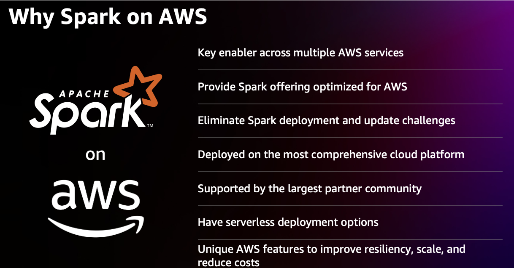
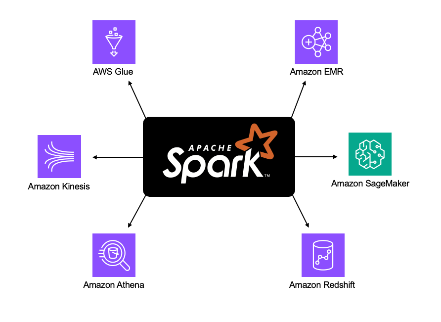

|ToC|
|---|

When it comes to running Apache Spark on AWS, developers have a wide range of services to choose from, each tailored to specific use cases and requirements. Selecting the right AWS service for running Spark applications is crucial for optimizing performance, scalability, and cost-effectiveness - but which service is best isn't always immediately evident. 

In this guide, we will explore various decision-making questions to help developers navigate the options and choose the most suitable AWS service for their Spark workloads.

## Why AWS for Apache Spark? 

AWS offers a comprehensive suite of services that integrate seamlessly with Apache Spark, enabling efficient data processing, analytics, and machine learning tasks. Crucially, AWS allows organizations to harness the power of Spark's distributed computing capabilities without the need for upfront infrastructure investments or complex management overhead. Below are some of the key features and benefits of running Apache Spark on Amazon Web Services.

### Elasticity and Scalability

AWS's auto-scaling capabilities allow Spark clusters to effortlessly adapt to varying workload demands, ensuring optimal resource utilization. This dynamic adjustment not only leads to efficient operations but also significant cost savings, as you're billed only for the resources you use. 

On the other hand, the traditional route of infrastructure management holds its own merits. For some Spark applications, there's a need for custom hardware setups, like high-performance GPUs for intensive machine learning tasks or high memory configurations for vast in-memory computations. Further, manual management offers the luxury of data locality optimization, where datasets can be positioned strategically near compute resources, reducing transfer times. This hands-on approach also gives the flexibility to fine-tune network configurations, optimize JVM settings, and ensure robust security measures. Additionally, there's the freedom to select specialized storage solutions tailored to the application's needs.

In essence, while AWS presents a seamless, scalable, and cost-effective solution, the traditional infrastructure management approach can provide customized optimizations for specific scenarios. The decision between them should align with the project's unique requirements and objectives.

### Traditional and Serverless Spark Clusters

AWS provides managed services that simplify the deployment and management of Apache Spark clusters. With these managed services, launching a Spark cluster or running a Spark application becomes a streamlined process. Users can select the desired configurations with ease. Moreover, AWS offers serverless options, enabling the automatic scaling and provisioning of Spark clusters without manual intervention. This serverless approach frees data engineers from infrastructure management, letting them concentrate on analytical tasks.

### Integration with AWS Data Services

Apache Spark on AWS integrates effortlessly with various AWS data services. This allows organizations to utilize their existing data infrastructure. Spark can interact with services like [Amazon S3](https://docs.aws.amazon.com/AmazonS3/latest/userguide/Welcome.html), [Amazon Redshift](https://docs.aws.amazon.com/redshift/latest/gsg/new-user-serverless.html), [Amazon DynamoDB](https://docs.aws.amazon.com/amazondynamodb/latest/developerguide/Introduction.html), and [Amazon RDS](https://docs.aws.amazon.com/rds/?icmpid=docs_homepage_databases), facilitating the processing and analysis of data stored in these platforms. Such integration fosters data agility and positions Spark as an integral component of a holistic data processing and analytics pipeline.

### Machine Learning Capabilities

AWS furnishes a diverse range of services that meld perfectly with Spark, catalyzing potent machine learning workflows. Merging Spark's distributed computing prowess with AWS machine learning services lets you tap into the full potential of your data for crafting and rolling out machine learning models.

### Broad Ecosystem and Tooling

Apache Spark prides itself on a vast ecosystem, supporting multiple programming languages, libraries, and frameworks. AWS extends an array of auxiliary services that augment Spark's functionalities. For instance, AWS Lambda can be employed for serverless data processing, Amazon Kinesis for real-time streaming ingestion, and AWS Glue DataBrew for data preparation. Pairing these services with Spark's robust processing engine lets organizations craft comprehensive data pipelines and execute intricate analytics procedures.

### Cost Optimization

AWS's flexible pricing structure enables organizations to efficiently manage expenses. The pay-as-you-go model ensures you're billed only for the resources leveraged, eliminating the need for fixed infrastructure provisioning and oversight. To top it off, AWS proffers cost optimization utilities like AWS Cost Explorer and AWS Trusted Advisor, guiding organizations to monitor and fine-tune their Spark deployments for peak efficiency and economic feasibility.

From data preparation and ETL to real-time streaming and interactive querying, AWS provides specialized services designed to enhance the capabilities of Spark and facilitate streamlined workflows. By considering specific requirements and use cases, developers can leverage the power of AWS services to maximize the potential of Apache Spark. Let's delve into the decision-making questions to help guide the selection of the right AWS service for running Spark applications.

    

## Which Service to Pick and When? 

Considering these questions and the provided solutions will guide you in making well-informed choices about which services will best meet your needs. To determine the optimal AWS service for deploying Apache Spark, keeping in mind your unique needs, use case, and prerequisites.

### Are You Completely New to Spark?

If you are **completely new** to Spark and don't have specific use cases in mind, AWS Glue is an excellent choice to get started quickly. It helps in the following ways:

- **Simplifies** data preparation.
- **Provides** quick deployment of Spark clusters.
- **Allows** you to focus on analytics.
- **Seamlessly integrates** with Spark.
- **Offers** scalability and cost optimization.

By choosing AWS Glue, you can kickstart your Spark journey on AWS with **ease and efficiency**.

    

### 📘 Do You Need to Prepare and Transform Data for Analysis?

If the answer is yes, 🌟 **consider using AWS Glue**. AWS Glue is a fully managed ETL service that integrates with Apache Spark, offering automated schema discovery, data cataloging, and data transformation capabilities. AWS Glue:

 - 🚀 Integrates with **Apache Spark**.
 - 🧠 Offers automated **schema discovery**.
 - 📚 Provides **data cataloging**.
 - 🔧 Enables efficient **data transformation** capabilities.

#### [🔗 Spark with AWS Glue - Getting Started with Data Processing and Analytics](https://sparkbyexamples.com/amazon-aws/spark-with-aws-glue-getting-started-with-data-processing-and-analytics/)

---

### 📘 Do You Need to Deploy and Manage Spark Clusters Easily?

If the answer is yes, 🌟 **consider Amazon EMR**. Amazon EMR:

- 🚀 Is a **fully managed big data processing service**.
- 💡 Simplifies the **deployment and management** of Spark clusters.
- 🌐 Offers **EMR Serverless**: A serverless runtime environment optimized for analytics applications, compatible with frameworks like **Spark** and **Hive**.

#### [🔗 Spark with Amazon EMR](https://docs.aws.amazon.com/emr/latest/ReleaseGuide/emr-spark.html)
#### [🔗 Create an ETL Pipeline with Amazon EMR and Apache Spark](https://community.aws/tutorials/create-an-etl-pipeline-apache-spark)
#### [🔗 Run Apache Spark workloads 3.5 times faster with Amazon EMR 6.9](https://aws.amazon.com/blogs/big-data/run-apache-spark-workloads-3-5-times-faster-with-amazon-emr-6-9/)

---

### 📘 Do You Need to Perform Machine Learning Tasks With Spark?

If your answer is yes, 🌟 **consider using Amazon SageMaker**. 

🤖 **Amazon SageMaker** is a fully managed machine learning service that integrates seamlessly with **Spark**. With SageMaker, you can leverage Spark's distributed data processing capabilities for data preparation and preprocessing. This sets the stage for efficiently training machine learning models. Furthermore, Spark can handle distributed processing of inference on new data.

**BONUS: Enhanced Workflow with SageMaker Studio** 🎉

SageMaker Studio, provided by AWS, is a fully integrated development environment (IDE) that enhances the ML workflow. It provides a unified interface for data exploration, model development, and collaboration among team members. When combined with **Glue** and **EMR**, SageMaker Studio becomes even more powerful:

- 🔄 Data engineers can use **Glue** for their extract, transform, and load (ETL) tasks.
- 📊 **EMR** is optimal for distributed data processing and feature engineering.
- 🤖 Lastly, **SageMaker** shines in training, deploying, and hosting ML models, thanks to its scalability and built-in features.

#### [🔗 Gettings started with SageMaker with Apache Spark](https://docs.aws.amazon.com/sagemaker/latest/dg/apache-spark.html)
#### [🔗 Gettings started with SageMaker Studio with AWS Glue](https://www.youtube.com/watch?v=VL1ttYyeJDE&t=3s&ab_channel=AmazonWebServices)
#### [🔗 Gettings started with SageMaker Studio with Amazon EMR](https://aws.amazon.com/blogs/machine-learning/part-1-create-and-manage-amazon-emr-clusters-from-sagemaker-studio-to-run-interactive-spark-and-ml-workloads/)
#### [🔗 Deploy Serverless Spark Jobs to AWS Using GitHub Actions](https://community.aws/tutorials/deploy-serverless-spark-jobs-to-aws-using-github-actions)

---

### 📘 Do You Need to Run Interactive SQL Queries on Data Stored in S3 With Spark?

If the answer is yes, 🌟 **consider using Amazon Athena**. **Amazon Athena** is a serverless interactive query service that offers the ability to:
- 📂 Analyze and query data directly in **S3** using SQL.
- 💡 Use Spark code for data processing and fetch results directly through Athena.

Experience the power of serverless querying combined with Spark's processing capabilities!

#### [🔗 Gettings started with Apache Spark with Amazon Athena](https://docs.aws.amazon.com/athena/latest/ug/notebooks-spark-getting-started.html)

---

### 📘 Do You Need to Analyze Large Datasets With Fast Query Performance?

If that's your requirement, 🌟 **consider using Amazon Redshift**. With its seamless integration with Apache Spark, Amazon Redshift simplifies the process of crafting and executing Spark applications. This not only supports Redshift Serverless but also paves the way for users to harness a wider range of AWS analytics and machine learning (ML) tools. Redshift:

- 🗄️ Is a **fully managed** data warehousing service.
- ⚙️ Allows you to integrate with **Spark** for distributed data processing and analytics on large datasets.
- 🔄 Lets you experience the power of **Redshift Serverless** — offering a serverless approach to data warehousing that adjusts resources automatically based on query demands.
- 📊 Lets you seamlessly perform analytics on datasets stored in **Redshift**.

Unlock the potential of fast data analysis combined with the scalability of Redshift!

#### [🔗 Spark with Amazon Redshift](https://aws.amazon.com/blogs/aws/new-amazon-redshift-integration-with-apache-spark/)

---

### 📘 **Do you need to process real-time streaming data with Spark?**

If your goal aligns with this, 🌟 **consider Amazon Kinesis Data Firehose or Amazon Kinesis Data Analytics**.

🌊 **Amazon Kinesis Data Firehose**:
- 🚀 A fully managed service.
- 🔄 Ingests, transforms, and delivers streaming data to destinations like **Spark**.

📈 **Amazon Kinesis Data Analytics**:
- 🔍 Allows you to run **Apache Flink** applications.
- 💡 Can integrate with **Spark** for real-time data processing and analytics.

Harness the power of real-time data processing with Amazon Kinesis and Spark!
#### [🔗 Spark with Amazon Kinesis](https://docs.aws.amazon.com/streams/latest/dev/using-other-services-read-spark.html)

---

### 📘 **Do You Need to Process and Analyze Data Using a Serverless Approach (With AWS Lambda)?

If this resonates with your requirements, 🌟 **think about AWS Lambda in tandem with Apache Spark**. AWS Lambda: 
- 🚀 Is a serverless compute service.
- 🖥️ Enables you to run Spark functions without the hassle of managing infrastructure.
- ⚡ Can trigger Spark jobs in reaction to events from a multitude of AWS services.
- 📈 Scales resources dynamically based on workload demands.

#### [🔗 Spark on AWS Lambda (SoAL-framework)](https://github.com/aws-samples/spark-on-aws-lambda/wiki) 

## Conclusion

Running Apache Spark on AWS is undeniably powerful, offering developers a rich toolkit to process and analyze data at scale. Given the myriad of services AWS offers, the road to optimizing Spark applications might seem daunting. However, by systematically addressing the pivotal questions outlined above, you can carve out a clear path that caters to your specific needs.

AWS not only brings the power of Spark to the fore but enhances it manifold by seamlessly integrating with tools like [Glue](https://docs.aws.amazon.com/glue/latest/dg/what-is-glue.html), [EMR](https://docs.aws.amazon.com/emr/latest/EMR-Serverless-UserGuide/emr-serverless.html), [SageMaker](https://docs.aws.amazon.com/sagemaker/latest/dg/gs.html?icmpid=docs_sagemaker_lp/index.html), [Athena](https://docs.aws.amazon.com/athena/latest/ug/what-is.html), [Redshift](https://docs.aws.amazon.com/redshift/latest/gsg/new-user-serverless.html), [Kinesis](https://docs.aws.amazon.com/streams/latest/dev/introduction.html), and [Lambda](https://docs.aws.amazon.com/lambda/latest/dg/welcome.html). Each of these services accentuates a unique facet of data processing, be it ETL, machine learning, interactive querying, or real-time streaming.

As we conclude this guide, it's evident that the intersection of Spark and AWS is where scalability meets efficiency. By aligning your requirements with the right AWS service, you can harness the combined potential of both, ensuring maintainability, reliability, and cost-effectiveness. Remember, the ultimate aim is to optimize the data processing workflow, and with the guidelines provided, you're well-equipped to make informed decisions.
