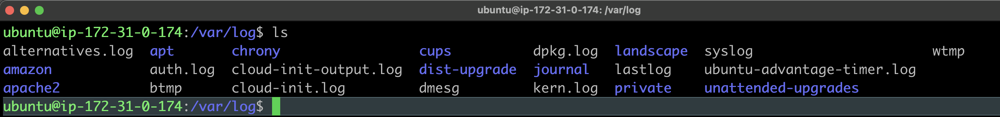
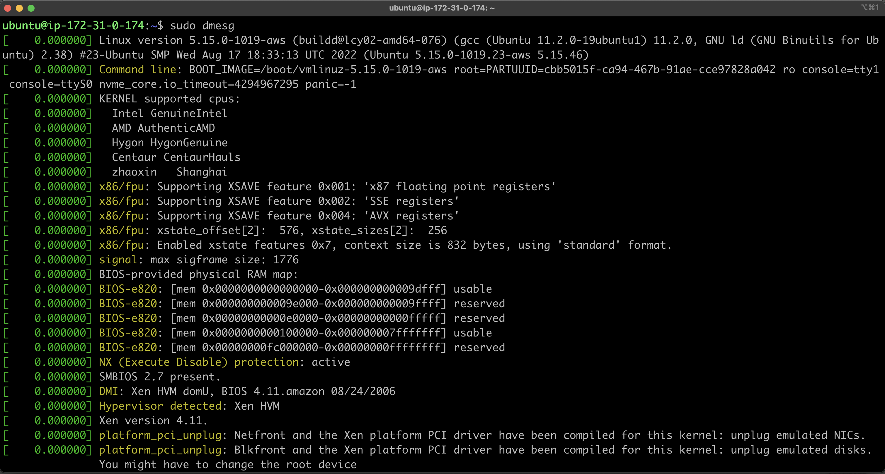
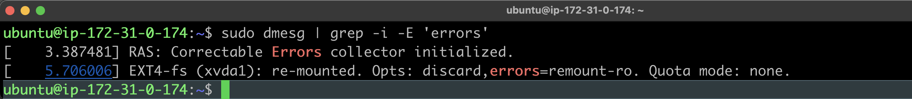

 ---
title: "Understanding Log Files on your Linux System"
description: "Log files in Linux represent point in time events for activity related to the OS, system devices, and applications running on the system. Learn how to leverage logs to troubleshoot issues, debug applications, and keep servers reliable at all times."
tags:
  - linux
  - logging
authorGithubAlias: cie247
authorName: Curtis Evans
date: 2022-11-28
---

Whether you’re a new user or an experienced Site Reliability Engineer, system logs are a vital source of information available on servers to help keep operations reliable. Logs are available on all system types, and their existence is very prevalent on machines running Linux. From boot sequences and process threads to user activity, practically every operation produces a written record of an event that is logged, allowing operators access to information and visibility across the entire server. But how does one go about locating and viewing these critical logs?

Depending on the packages that are installed, applications running, and connected devices, the total number of log files can grow into the hundreds and contain millions of entries over time. In this article, I’ll provide an overview of several Linux log types along with the utilities operators can use to manage systems more effectively. Note that some files and utilities require root permissions, so users should ensure they have the proper system privileges or access levels.

## System Logs
Linux systems contain a common directory structure under `/var/log` to store files for several key OS services, and applications. Contents may vary across distributions, but a typical list view of what is found inside is similar to the following,



Log file entries of note include:

- `/var/log/syslog` which stores global system activity like notices and alerts generated at server boot time. The actual log name depends on the Linux variant, but generally Ubuntu systems use `syslog`, while other distros like Amazon Linux and CentOS use the name `/var/log/messages`.
- `/var/log/auth.log` for storing security-related events such as failed login attempts, user password updates, and package installs performed by the root user. You can think of this log file as the system of record for activity requiring approval from pluggable authentication modules (PAM). Ubuntu uses the file `auth.log`, while Amazon Linux and CentOS use `/var/log/secure`.
- `/var/log/kern.log` stores low-level system activity records for disk management, memory, and system tasks. The entries found in this log includes kernel events, errors, and warnings, which can be helpful for troubleshooting custom configurations.
- `/var/log/cron` stores information about cron jobs which are tasks configured to run on a set schedule. An example would be an operation that runs every **Sunday at 4:00AM** to perform data backups. The information captured in the cron log verifies if a task runs as scheduled as well as the output results from the job.

Applications developed to run on Linux can also create logs as evidenced by several sub-directories in the graphic above. Print services write logs to the `./cups` sub-directory, and information captured by webservers is written to `./apache2`. Developers simply modify the code so that output is written to a location most suited for the application. As a best practice, developers can use a unique sub-directory to manage logs associated with each application. Two very important utilities found in the `/var/log` directory are `syslog` and `dmesg`.

### What is *Syslog*?
Syslog is used for generating message logs and has been the standard on Linux systems for years. Recently, distributions have been updated to ship with journald, a utility used in conjunction with syslog for collecting and storing message data. The concept of syslog can be easily broken down into the following components:

1. The syslog *protocol* [RFC 5424](https://tools.ietf.org/html/rfc5424), which is a transport protocol that specifies how to transmit logs over the network. It is also the data format that defines the structure of a message. By default, syslog uses ports `514` for plaintext and `6514` to encrypt messages requiring additional security.
2. The syslog *daemon* process, for receiving and processing system messages. It listens for events through `/dev/log`, where applications write message details. Because of its flexibility, the daemon can write locally to the system or to a remote server making it possible to centralize event logs across a distributed, multi-server environment. There are different implementations of syslog including [rsyslogd](https://www.rsyslog.com/) and [syslog-ng](https://www.syslog-ng.com/).
3. The syslog _message_, which is an event record structured using the syslog [message format](https://tools.ietf.org/html/rfc5424#section-6). A message is comprised of a standard header and body containing complete details about an event.

Because syslog is able to forward messages to remote servers, it can send critical events to 3rd-party management platforms like SolarWinds and New Relic, or to analytics tools like OpenSearch. Inside of these applications, data is stored, aggregated and visualized for further reporting and analysis.

### What is *dmesg*?
The dmesg utility examines kernel-related messages generated from the kernel ring buffer on a system. This component contains information about server hardware, device drivers, and a variety of modules that perform operations during system start-up. The tool is useful when diagnosing component failures or issues with connected devices.

By default, dmesg produces output as illustrated in the following diagram,



Using regular expressions, operators can easily query for certain log entries. For example, you can output information through dmesg that contains errors or warnings:



With so many logs and utilities available on Linux, journald is becoming increasingly popular because it simplifies the log management process. Because it is based on [systemd](https://en.wikipedia.org/wiki/Systemd), logs can be maintained in a structured fashion and indexed by various sources. Below are some additional examples to demonstrate the flexibility in using the journald logging service. `journalctl` is a utility to query and display journald logs.

The following command generates unfiltered output for **all** collected log files:
```bash
$ journalctl
```

You can also "tail" the logs to see them streaming by in real time:
```bash
journalctl -f
```

To view user logins for the current day:
```bash
$ journalctl -u 'systemd-logind' --since "today" --until "tomorrow"
```

To view messages from an apache webserver:
```bash
$ journalctl -f -u apache
```

## Wrapping it up

Understanding the importance of log files on your Linux system is crucial for troubleshooting, and ensuring applications remain stable and perform as expected. Knowing how to access, view, and manage logs reduces time and complexity for personnel responsible for system operations and application development. Reference the documentation for your chosen operating system, or execute `man journalctl` via the command line for more info and options on how to manage system logs.
