A lot of things have changed in the past few years in how we handle data, from introducing different ways to store it using data warehousing, Hadoop, and NoSQL databases to offering remote storage and faster compute through cloud computing. Advancements in networking and computing have pushed more processing to happen at the edge with edge computing and the Internet of Things. Now we are seeing a diverse set of data sources sending data more often and at higher quality.

Data volumes are increasing at an exponential clip, from terabytes to petabytes and all the way to exabytes. Organizations are looking to gain more value from their data but are challenged to capture, store, and analyze all the data being generated today. Data is growing at an exponential rate from diverse sources, with new sources and use cases showing up.

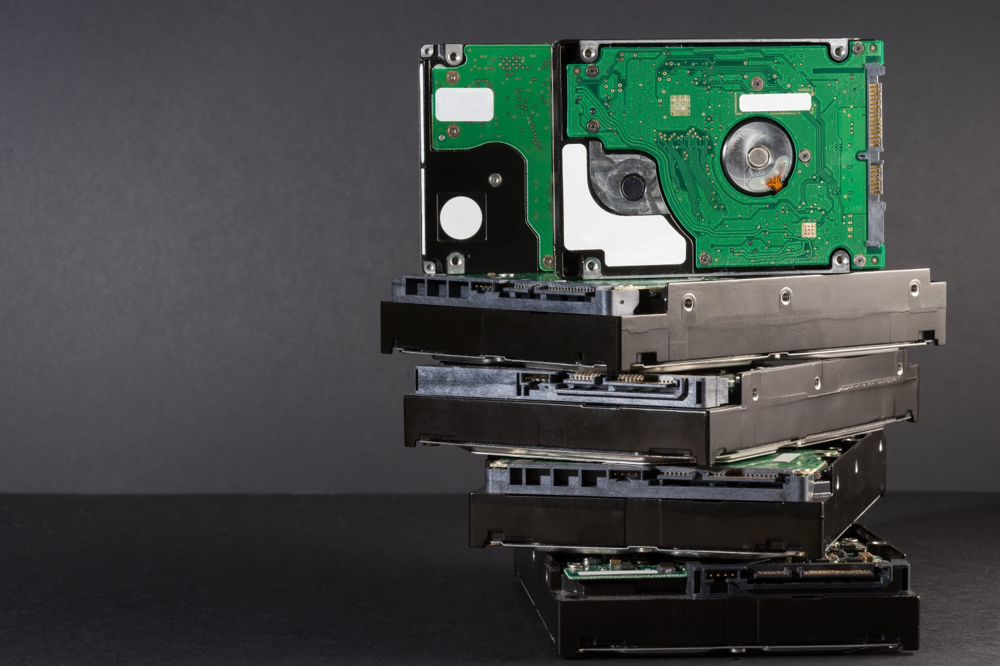

In 2021, Gartners released an article on the Top 10 Data and Analytics Trends for 2021. In this article, Gartner mentioned two trends where they cite data and analytics as core business functions. They cited how business leaders are beginning to understand the importance of using data and analytics to accelerate digital business initiatives, shifting from a secondary focus to a core function for the business. In that same article, Gartner talks about how more data analytics technologies are starting to live outside of the traditional data center and cloud environments, closer to the physical assets. This means doing data analytics at the edge to reduce latency for data-centric solutions and enable more real-time value. The renewed focus on data analytics and the need for more real-time processing have evolved analytics to put more emphasis on processing in real-time.

## Perishable insights

In 2022, Forrester released a report on "perishable insights". The report talks about how the value of data diminishes and perishes over time. Traditional analytics is designed to process data that is stored over a period of days. months and years. But for real-time systems, data is time-sensitive and is designed to be processed in a matter of seconds, minutes, or sometimes fractions of a second.

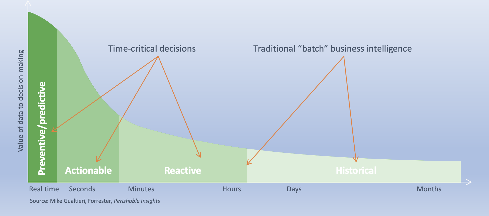

## Siloed-based architecture

For most systems that start early on, they are designed using a siloed-based architecture.  Some start from small
 applications that are managed by one group.  Over time, more and more applications are created by different groups to service their needs.  These are internal and external applications managed by groups in the organization like HR, marketing, finance, engineering teams, sales teams etc, having their own team and building their own applications.  Over time, data in these organizations grow and become increasingly relevant.  They start being information siloes, where data becomes hard to share across the organization.  

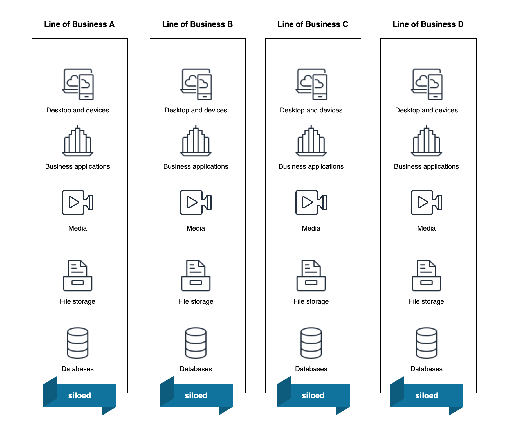

Although data silos appear to be innocuous, they present hurdles to information sharing and collaboration across departments. Data quality frequently decreases as a result of inconsistencies in data that may overlap across silos. When data is segregated, it is difficult for leaders to gain a comprehensive view of company data.

At some point, enterprises start thinking about how to bring all these data together. Work is required to move this data to another is not an easy task, requiring teams to create scripts and programs to extract, transform and load them from one place to another. Over time they end up building a complex pipeline that is easy to break, hard to maintain and don’t scale well as more data come in.

## Types of data processing

Traditional analytics involved two major phases: data getting stored and then analyzed. Data can be stored in a lot of different ways and formats, like files or in databases. One of the ways this data is processed is through batch processing, where stored data is processed and analyzed in batches. Batch processing is efficient at processing large amounts of data and is suitable when you don’t need fast results.

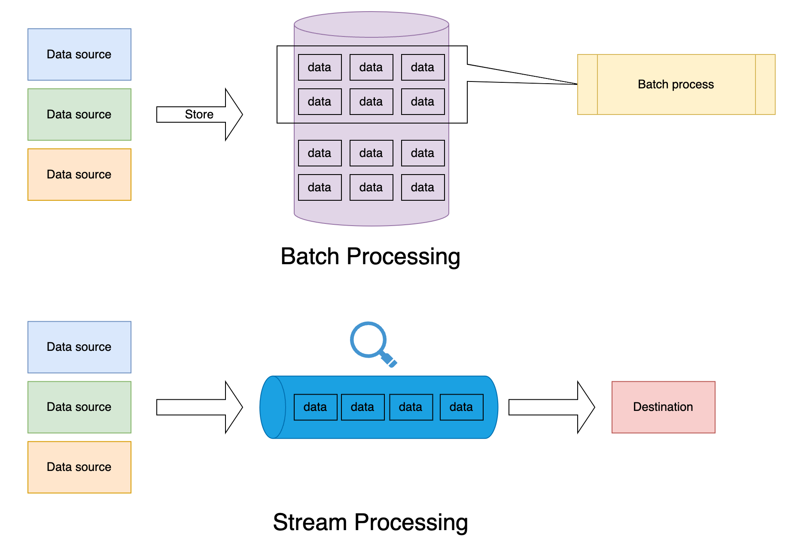

There are certain processes where batch processing works well. Some examples are processing hourly logs, weekly or monthly bills, daily website clickstreams, or daily fraud reports. Again, these are data where they fall in traditional analytics, with the age of the data in the hours, days, months, or years.

Some of the systems now are evolving into real-time systems that are pushing large volumes of data, requiring continuous processing and analysis of live data, allowing enterprises to gain insights in real time from varied sources like devices and systems. The issue with processing in batches is that you are getting insights from data that is not necessarily up-to-date. Real-time processing, as opposed to traditional analytics, processes and analyzes these events and data as they happen.

## Real-time data streaming 

Real-time data streaming is the collection and ingestion of data from various sources and processing it in real time to gain meaning and insight.

### Components of Real-time Data Streaming

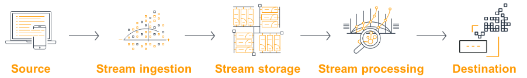

Above are the components of a real-time data streaming pipeline. The sources are devices or applications producing high volumes of continuous data at high velocity, like mobile devices, web applications, application logs, IoT sensors, smart devices, and gaming applications. The stream ingestion component provides the solution to capture continuous data from these sources and store it in scalable stream storage. The stream processing component allows you to transform and deliver data to a destination for further analysis or long-term storage. In each of the components of the processing, from the ingestion to the destination, the components need to be able to scale as the data volume increases.

Below are some of the common use cases for streaming

* Security monitoring
* Industrial automation
* Log analytics
* Data lakes
* Microservices communication

Some specific examples of data streaming are logs generated from customer activities in a mobile or web application, e-commerce websites, in-game player activity, information from social networks, financial trading floors, or geospatial services, and telemetry from connected devices or instrumentation in data centers. The use cases are just a subset of the diverse use cases for real-time streaming. These use cases have in common the need to gain real-time insights on the incoming data to meet a real-time need. This need is critical to making business decisions based on the most up-to-date data.

## Understanding the Stream store

Let’s take a step back and talk about the data structure that supports streaming data architectures. This data structure is the commit log. A commit log works like a persistent queue composed of an ordered collection of records. Like a queue, a commit log can only be appended at the end, so older records are at the head and newer records are at the tail of the queue. The commit log is persistent in the sense that the data stored in it is not transient and can be analyzed any number of times. The data stored in a commit log can span seconds, minutes, days, months, or years!

A commit log is a repository of all the mutations and events. A relational database is a subset of what is contained in the commit log. The values, mutations, and events in a commit log are captured as a snapshot of a point in time within tables in a relational database and presented using indexes to allow for querying and searching. Behind the scenes, the data you are querying databases against is a subset of the same data contained in the commit log. Going back to the fact that a commit log is really an ordered collection of data, a commit log is the ideal data structure for writing and storing streams of events, which is essentially what we call a stream store. Querying and reading through a stream store is different from a relational database and requires a different approach altogether.

## Stream programming constructs

There are different programming constructs when working with streaming architectures.

* **Aggregations**: This is simply the summarization of data to query for particular values and allow you to perform operations like sum, average, min, max, etc.
* **Time and temporal windows**: This is another common pattern for streaming scenarios. Windowing functions allow developers to build complex queries based on temporal windows of time. An example is querying a stream against a window in time, say in the last hour, and then filtering for a specific event type or value. Temporal windows also allow you to mix with aggregation to further create complex queries. These insights can be used to build metrics used by downstream resources for business decisions or tracked by your observability stack, i.e., querying against the number of orders in the last hour.
* **Causality and Relationships**: Stream processing also allows for detecting patterns to correlate or analyze the causality between events. This allows you to understand the relationships between one event and other events, enabling you to discern whether event A is tied to event B.

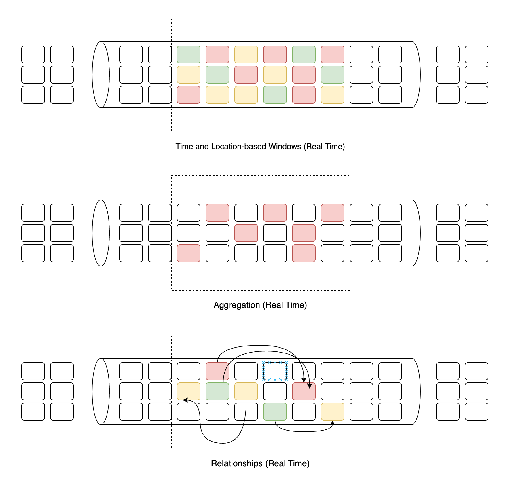

Leveraging these different programming constructs allows you to take advantage of what stream processing has to offer. These constructs can be used in isolation or in tandem to allow you to create simple or complex stream queries that effectively provide insight into the most up-to-date events and data emitted by your system. Ultimately, these constructs allow you to gain meaningful insights to make timely data-driven business decisions.

## Stream processing considerations

### Transaction data into stream

One consideration for organizations moving into real-time streaming would be transforming existing transaction data into a stream of events. Most organizations have transactional data residing in relational databases. The data in these databases is helpful in correlating with other streams of events and finding useful, actionable insights for your business. There are existing technologies that allow your transactional data stream to be captured using a technique called change data capture (CDC). This allows database systems to read at the log level using the commit log. For new systems, you should start writing streams of events directly into the stream store, thereby avoiding the otherwise two-step process of saving to a database and then generating streams through a CDC connector.

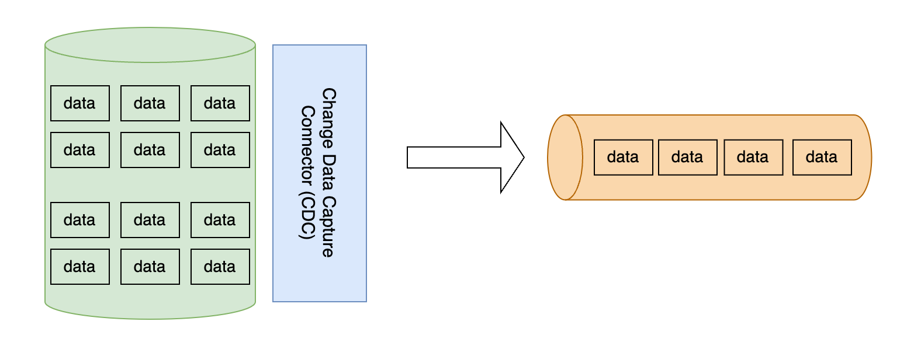

### Avoid stream stores per project

In the beginning, we talked about the challenges of building a silo-based architecture where your datastores are isolated. A similar scenario can arise when organizations build isolated stream stores. It’s ideal to have a common stream store across multiple systems, centralizing the stream store for all the different datasources to write into and having individual applications read and query from it. This simplifies access and the need to scale and maintain these isolated stream stores. Having a central data store also benefits data discovery across the organization.

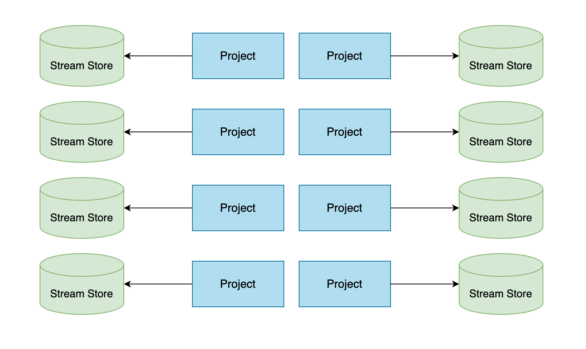

### Support geo-replication and multi-tenancy

Another consideration in choosing the right stream store is support for geo-replication and multi-tenancy. This also ties into the previous consideration of avoiding stream stores per project by making sure your central stream store allows for replication across regions to allow for a global distribution of producers and consumers. The stream store should be able to scale and accommodate multi-tenancy for multiple projects. Having both features allows correlation against data from different locations and projects.

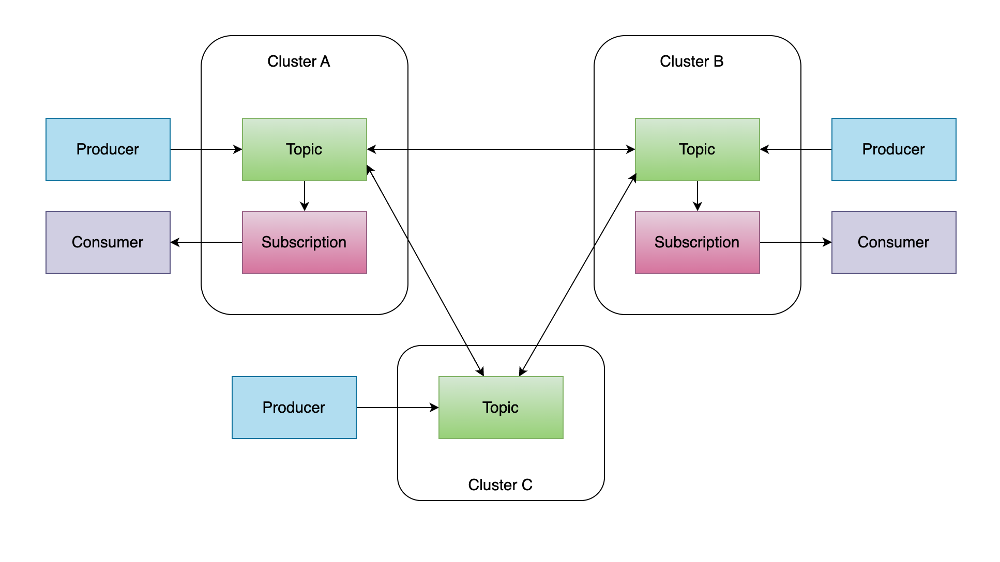

## Scaling storage with compute

Chosen stream stores should also accommodate scaling storage without necessarily scaling compute. Be careful when selecting stream stores that tightly couple compute with storage and require you to increase compute to get more storage. There are stream stores available now that allow you to persist data into durable and cheap hot and cold tiers to provide cost-efficient storage for your ever-growing data.

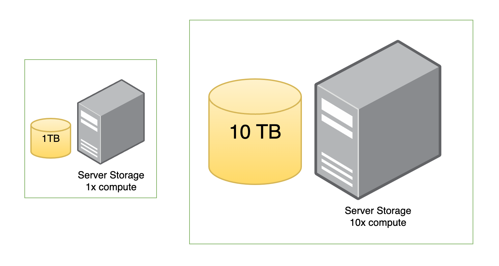

## Unidirectional flow of data

Another important concept is not being tied to one-way processing. It is easy to fall into the trap of building forward-only streaming architectures. Remind yourself that you might need to go back and make revisions or changes, and allow for data to be continuously updated back to the stream, reused, and refined.

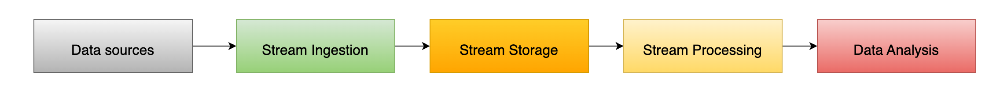

## Understanding build versus buy

Last, but definitely not least, is understanding when it is best to build or buy. There are three major criteria to consider when deciding between building versus buying. First is competency. Is your team able to build and maintain an infrastructure? In the beginning, we talked about data analytics becoming a core function in the business. It's important for the organization to evaluate whether it makes business sense for your team to build and maintain this in-house. This is a decision not to be taken lightly, as it will take resources away from other activities. As for opting to buy and outsource your stream source to a vendor, assess their feature portfolio for completeness. Make sure you also look beyond what the stream store provides and inspect their stream processing framework, along with the tooling around it. Make sure they provide the features you need now and in the near future. It is not a trivial exercise to change implementation when you already have a central store in place and have our valuable insights.

## Conclusion

In this blog, I talked about how data analytics have evolved from traditional data analytics, which deals with data in hours, days, months, or years, into real-time analytics, which deals with data in seconds, minutes, and hours. How siloed architecture needed to be bridged together. I looked at the current trends and how advancements in technology are ushering in real-time analytics to gain real-time insights that benefit the business. Understanding that real-time streaming use cases and applications are evolving our data analytics now and that there are important considerations when planning for your real-time streaming analytics platform is a great way to start on the right footing. This should equip you on your journey to start building out your own real-time analytics for your organization.
