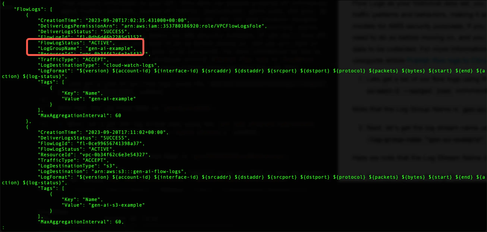
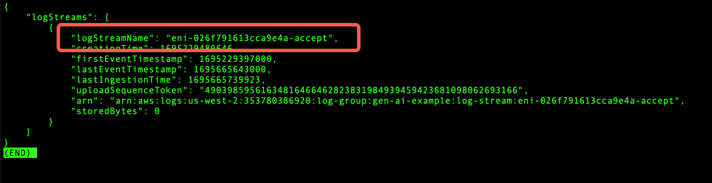
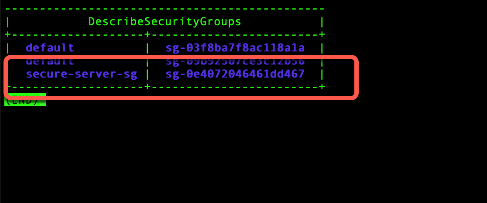
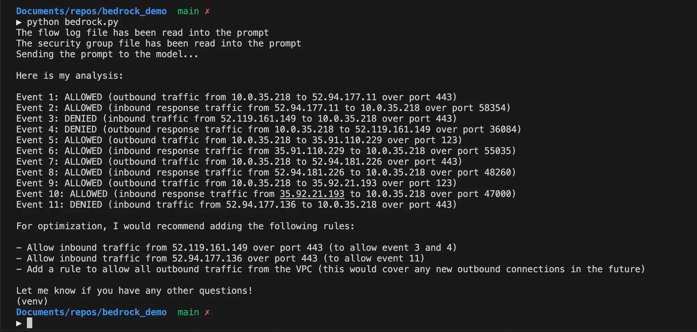

|ToC|
|---|

Generative AI, at its core, refers to algorithms that can generate new data instances that resemble a given set of data. In the realm of cloud computing, this technology is being used for many practical applications, from creating realistic training datasets for machine learning models to simulating network traffic for testing and validation purposes. For instance, developers are using Generative AI to create synthetic datasets that help train models where real data is scarce or sensitive. In the domain of cloud infrastructure, it can aid in optimizing resource allocation by predicting and simulating workloads.

But why is Generative AI crucial when we talk about cloud security on platforms like AWS? The answer lies in its ability to anticipate, simulate, and counteract potential threats. By generating potential security scenarios, Generative AI can help organizations anticipate vulnerabilities, test their systems against simulated breaches, and develop more resilient security postures. It's not just about responding to threats, but proactively preparing for them.

In the sections that follow, we will explore how Generative AI can bolster your cloud security posture on AWS, provide a hands-on example of querying [Amazon Bedrock](https://docs.aws.amazon.com/bedrock/latest/userguide/what-is-service.html?sc_channel=el&sc_campaign=genai&sc_content=unlocking-the-potential-gen-ai-and-cloud-security-possibilities&sc_geo=mult&sc_country=mult&sc_outcome=acq) for Security Group rule reviews using Python, and conclude with thoughts into the future of Generative AI in cloud security.

## Harnessing Generative AI to Fortify AWS Cloud Security

You probably already recognize that we are now living in a time in which businesses are increasingly reliant on cloud platforms. As organizations scale their operations on the cloud, the complexity of managing security postures grows exponentially. Traditional security measures are still essential, however at time, they fall short in addressing the dynamic nature of threats in a cloud environment. This is where Generative AI has the potential to enhance our security, offering an innovative, fresh perspective.

### Understanding Generative AI in the Context of Cloud Security

Generative AI can make new data from existing patterns. For cloud security, this means it has the potential to:

1. **Simulate Threat Scenarios**: Generative AI can create realistic threat scenarios, allowing security teams to test and validate their Cloud infrastructure's resilience. By simulating potential attack vectors, organizations can proactively identify vulnerabilities and take steps to ensure they are protected against them before they are exploited.

2. **Optimize Security Configurations**: AWS offers a number of services, each with its own set of security configurations. With Generative AI, we can analyze existing configurations, simulate various combinations, and ask Generative AI to provide recommendations based on our specific needs.

3. **Enhance Monitoring and Alerts**: By training on historical security logs and events, Generative AI can predict potential security breaches or anomalies. The key word here is "potential."  Knowing what "could" happen allows security teams time to prepare and allows for more rapid action to be taken.

### Generative AI and AWS Services

How might AWS services benefit from integration with Generative AI?  Here are a few possibilities to consider.  

> Note that these are simply possibilities based on what I have experienced with Generative AI. In no way does this reflect the actual plans or roadmap for these services.  I am not a member of these service teams.

- **[AWS WAF (Web Application Firewall)](https://docs.aws.amazon.com/waf/latest/developerguide/waf-chapter.html?sc_channel=el&sc_campaign=genai&sc_content=unlocking-the-potential-gen-ai-and-cloud-security-possibilities&sc_geo=mult&sc_country=mult&sc_outcome=acq)**: Generative AI could simulate web traffic patterns based on your historical log data and compare that to your existing WAF rules, ensuring that malicious requests are blocked while legitimate traffic flows seamlessly.

- **[Amazon GuardDuty](https://docs.aws.amazon.com/guardduty/latest/ug/what-is-guardduty.html?sc_channel=el&sc_campaign=genai&sc_content=unlocking-the-potential-gen-ai-and-cloud-security-possibilities&sc_geo=mult&sc_country=mult&sc_outcome=acq)**: By analyzing findings from GuardDuty, Generative AI could predict emerging threat patterns and suggest refinements to other areas of your cloud security posture.

- **[VPC Flow Logs](https://docs.aws.amazon.com/vpc/latest/userguide/flow-logs.html?sc_channel=el&sc_campaign=genai&sc_content=unlocking-the-potential-gen-ai-and-cloud-security-possibilities&sc_geo=mult&sc_country=mult&sc_outcome=acq)**: Analyzing flow logs with Generative AI can provide insights into network traffic patterns, highlighting potential security risks and optimizing network access controls. To take this a step further, this could be compared against existing WAF rules, AWS Network Firewall Rules, Security Groups, Network ACLs, and so on, and provide recommendations for optimizing and enhancing our rule sets. You'll see an example of this below.

### The Bigger Picture: A Proactive Approach to Security

The true power of Generative AI lies in its ability to shift the security paradigm from a reactive to a proactive stance. Instead of waiting for threats to manifest, organizations can use Generative AI to anticipate and prepare for them. This forward-thinking approach paves the way for a future where cloud security is not just about defense but about foresight through innovation.

## A Practical Example: Leveraging Generative AI to Review AWS Security Group Rules

In this section, we'll examine a practical example of how Generative AI can be used to review and optimize firewall rules. Specifically, we'll focus on AWS Security Groups, which act as virtual firewalls to control inbound and outbound traffic to AWS resources.

### **Objective**

Our goal is to use Generative AI to:

1. Examine VPC Flow Log data.
2. Compare each entry in the flow log to each entry of the Security Group.
3. Recommend optimizations to enhance security and allow necessary traffic.

### **Setting Up**

Before we dive into the code, we will need to:

1. Obtain VPC flow log data to feed into the LLM.
2. Obtain our current security groups rules configuration to feed into the LLM.

In taking these two data sources and providing it to the LLM we are doing what is known as in-context learning.  The LLM will learn what our traffic looks like as well as what our Security Groups look like and from there it can perform a zero-shot inference to provide us with a response.  To learn more about the terminology and methods used with generative AI and Large-Language Models, see the course, [Generative AI with Large Language Models](https://www.coursera.org/learn/generative-ai-with-llms) on Coursera.

Let's begin  by getting the flow log data that we will use to train our model.

### **Fetching Historical Traffic Data**

The historical data set in the context of our example would ideally come from VPC Flow Logs. VPC Flow Logs capture information about the IP traffic going to and from network interfaces in your VPC. This data can provide a wealth of information about traffic patterns, sources of traffic, destinations, ports used, and more. By using VPC Flow Logs as your historical data set, you can gain valuable insights into your network traffic patterns and behaviors, making it an excellent source for training generative AI models for AWS security purposes. If you don't have VPC Flow Logs enabled you will need to do so before moving on, and you will need to allow some time to pass for data to be collected. For more information on how to set up VPC Flow Logs see the user guide article [Publish flow logs to CloudWatch Logs](https://docs.aws.amazon.com/vpc/latest/userguide/flow-logs-cwl.html?sc_channel=el&sc_campaign=genai&sc_content=unlocking-the-potential-gen-ai-and-cloud-security-possibilities&sc_geo=mult&sc_country=mult&sc_outcome=acq).

1. Let's get a list of our flow logs using the `aws ec2 describe-flow-logs --region us-west-2 --output json` command. From here take note of the **Log Group Name**.



Note that the Log Group Name is `gen-ai-example`.

2. Next, let's get the log stream name using the `aws logs describe-log-streams --log-group-name "gen-ai-example" --region us-west-2` command.



Here we note that the Log Stream Name is `eni-026f791613cca9e4a-accept`.

3. Now we want to copy the log data to a file that we will feed it into our prompt.  We do this using the `aws logs get-log-events --log-group-name gen-ai-example --log-stream-name eni-026f791613cca9e4a-accept --region us-west-2 | > log_data.json` command.  

This creates a file named `log_data.json` in your current directory. Below is a sample output of the log data used in this post should you want to recreate this on your own.

```json
{
    "events": [
        {
            "timestamp": 1695664801000,
            "message": "2 353780386920 eni-026f791613cca9e4a 52.94.177.11 10.0.35.218 443 58354 6 2 111 1695664801 1695664861 ACCEPT OK",
            "ingestionTime": 1695664900855
        },
        {
            "timestamp": 1695664801000,
            "message": "2 353780386920 eni-026f791613cca9e4a 10.0.35.218 52.94.177.11 58354 443 6 3 151 1695664801 1695664861 ACCEPT OK",
            "ingestionTime": 1695664900855
        },
        {
            "timestamp": 1695664801000,
            "message": "2 353780386920 eni-026f791613cca9e4a 52.119.161.149 10.0.35.218 443 36084 6 4 160 1695664801 1695664861 ACCEPT OK",
            "ingestionTime": 1695664900855
        },
        {
            "timestamp": 1695664801000,
            "message": "2 353780386920 eni-026f791613cca9e4a 10.0.35.218 52.119.161.149 36084 443 6 4 160 1695664801 1695664861 ACCEPT OK",
            "ingestionTime": 1695664900855
        },
        {
            "timestamp": 1695664801000,
            "message": "2 353780386920 eni-026f791613cca9e4a 35.91.110.229 10.0.35.218 123 55035 17 1 76 1695664801 1695664861 ACCEPT OK",
            "ingestionTime": 1695664900855
        },
        {
            "timestamp": 1695664801000,
            "message": "2 353780386920 eni-026f791613cca9e4a 10.0.35.218 35.91.110.229 55035 123 17 1 76 1695664801 1695664861 ACCEPT OK",
            "ingestionTime": 1695664900855
        },
        {
            "timestamp": 1695664801000,
            "message": "2 353780386920 eni-026f791613cca9e4a 52.94.181.226 10.0.35.218 443 48260 6 24 7218 1695664801 1695664861 ACCEPT OK",
            "ingestionTime": 1695664900855
        },
        {
            "timestamp": 1695664801000,
            "message": "2 353780386920 eni-026f791613cca9e4a 10.0.35.218 52.94.181.226 48260 443 6 22 5603 1695664801 1695664861 ACCEPT OK",
            "ingestionTime": 1695664900855
        },
        {
            "timestamp": 1695664801000,
            "message": "2 353780386920 eni-026f791613cca9e4a 35.92.21.193 10.0.35.218 123 47000 17 1 76 1695664801 1695664861 ACCEPT OK",
            "ingestionTime": 1695664900855
        },
        {
            "timestamp": 1695664801000,
            "message": "2 353780386920 eni-026f791613cca9e4a 10.0.35.218 35.92.21.193 47000 123 17 1 76 1695664801 1695664861 ACCEPT OK",
            "ingestionTime": 1695664900855
        },
        {
            "timestamp": 1695664801000,
            "message": "2 353780386920 eni-026f791613cca9e4a 52.94.177.136 10.0.35.218 443 52688 6 6 614 1695664801 1695664861 ACCEPT OK",
            "ingestionTime": 1695664900855
        },
        {
            "timestamp": 1695664863000,
            "message": "2 353780386920 eni-026f791613cca9e4a 52.94.181.226 10.0.35.218 443 48786 6 24 7218 1695664863 1695664921 ACCEPT OK",
            "ingestionTime": 1695664960692
        },
        {
            "timestamp": 1695664863000,
            "message": "2 353780386920 eni-026f791613cca9e4a 10.0.35.218 52.94.181.226 48786 443 6 22 5603 1695664863 1695664921 ACCEPT OK",
            "ingestionTime": 1695664960692
        },
        {
            "timestamp": 1695664863000,
            "message": "2 353780386920 eni-026f791613cca9e4a 52.94.181.228 10.0.35.218 443 37094 6 25 7258 1695664863 1695664921 ACCEPT OK",
            "ingestionTime": 1695664960692
        },
        {
            "timestamp": 1695664863000,
            "message": "2 353780386920 eni-026f791613cca9e4a 10.0.35.218 52.94.181.228 37094 443 6 22 5603 1695664863 1695664921 ACCEPT OK",
            "ingestionTime": 1695664960692
        },
        {
            "timestamp": 1695664863000,
            "message": "2 353780386920 eni-026f791613cca9e4a 52.94.181.226 10.0.35.218 443 43620 6 24 7218 1695664863 1695664921 ACCEPT OK",
            "ingestionTime": 1695664960692
        },
        {
            "timestamp": 1695664863000,
            "message": "2 353780386920 eni-026f791613cca9e4a 10.0.35.218 52.94.181.226 43620 443 6 21 5563 1695664863 1695664921 ACCEPT OK",
            "ingestionTime": 1695664960692
        },
        {
            "timestamp": 1695664863000,
            "message": "2 353780386920 eni-026f791613cca9e4a 140.179.111.177 10.0.35.218 0 0 1 1 36 1695664863 1695664921 ACCEPT OK",
            "ingestionTime": 1695664960692
        },
        {
            "timestamp": 1695664863000,
            "message": "2 353780386920 eni-026f791613cca9e4a 10.0.35.218 140.179.111.177 0 0 1 1 36 1695664863 1695664921 ACCEPT OK",
            "ingestionTime": 1695664960692
        },
        {
            "timestamp": 1695664923000,
            "message": "2 353780386920 eni-026f791613cca9e4a 52.94.181.228 10.0.35.218 443 46594 6 21 7098 1695664923 1695664981 ACCEPT OK",
            "ingestionTime": 1695665020924
        },
        {
            "timestamp": 1695664923000,
            "message": "2 353780386920 eni-026f791613cca9e4a 10.0.35.218 52.94.181.228 46594 443 6 21 5563 1695664923 1695664981 ACCEPT OK",
            "ingestionTime": 1695665020924
        },
        {
            "timestamp": 1695664923000,
            "message": "2 353780386920 eni-026f791613cca9e4a 52.81.32.251 10.0.35.218 0 0 1 1 36 1695664923 1695664981 ACCEPT OK",
            "ingestionTime": 1695665020924
        },
        {
            "timestamp": 1695664923000,
            "message": "2 353780386920 eni-026f791613cca9e4a 10.0.35.218 52.81.32.251 0 0 1 1 36 1695664923 1695664981 ACCEPT OK",
            "ingestionTime": 1695665020924
        },
        {
            "timestamp": 1695664923000,
            "message": "2 353780386920 eni-026f791613cca9e4a 52.119.161.149 10.0.35.218 443 36084 6 4 160 1695664923 1695664981 ACCEPT OK",
            "ingestionTime": 1695665020924
        },
        {
            "timestamp": 1695665043000,
            "message": "2 353780386920 eni-026f791613cca9e4a 10.0.35.218 140.179.187.185 0 0 1 1 36 1695665043 1695665101 ACCEPT OK",
            "ingestionTime": 1695665140727
        },
    ],
    "nextForwardToken": "f/37814608962896265246615151523299961083884467897132384273/s",
    "nextBackwardToken": "b/37814588669218134583748091639240811873876947816635170816/s"
}
```

4. Next let's list our security groups and get their IDs.  We do this with the command `aws ec2 describe-security-groups --query 'SecurityGroups[*].[GroupName,GroupId]' --output table --region us-west-2`.



The security group we want to work with is called **secure-server-sg**.

5. Now let's copy the rules from that security group out to a file using the command `aws ec2 describe-security-groups --group-ids sg-0e4072046461dd467 --region us-west-2 | > security_groups.json`.

This creates a file named `security_groups.json` in your current directory. Below is a sample output of the security group data used in this post should you want to recreate this on your own.

```json
{
    "SecurityGroups": [
        {
            "Description": "launch-wizard-1 created 2023-06-19T20:08:08.082Z",
            "GroupName": "secure-server-sg",
            "IpPermissions": [
                {
                    "FromPort": 80,
                    "IpProtocol": "tcp",
                    "IpRanges": [
                        {
                            "CidrIp": "172.112.129.135/32"
                        }
                    ],
                    "Ipv6Ranges": [],
                    "PrefixListIds": [],
                    "ToPort": 80,
                    "UserIdGroupPairs": []
                },
                {
                    "FromPort": 22,
                    "IpProtocol": "tcp",
                    "IpRanges": [
                        {
                            "CidrIp": "0.0.0.0/0"
                        }
                    ],
                    "Ipv6Ranges": [],
                    "PrefixListIds": [],
                    "ToPort": 22,
                    "UserIdGroupPairs": []
                },
                {
                    "FromPort": -1,
                    "IpProtocol": "icmp",
                    "IpRanges": [
                        {
                            "CidrIp": "0.0.0.0/0"
                        }
                    ],
                    "Ipv6Ranges": [],
                    "PrefixListIds": [],
                    "ToPort": -1,
                    "UserIdGroupPairs": []
                },
                {
                    "FromPort": 443,
                    "IpProtocol": "tcp",
                    "IpRanges": [
                        {
                            "CidrIp": "172.112.129.135/32"
                        }
                    ],
                    "Ipv6Ranges": [],
                    "PrefixListIds": [],
                    "ToPort": 443,
                    "UserIdGroupPairs": []
                }
            ],
            "OwnerId": "353780386920",
            "GroupId": "sg-0e4072046461dd467",
            "IpPermissionsEgress": [
                {
                    "IpProtocol": "-1",
                    "IpRanges": [
                        {
                            "CidrIp": "0.0.0.0/0"
                        }
                    ],
                    "Ipv6Ranges": [],
                    "PrefixListIds": [],
                    "UserIdGroupPairs": []
                }
            ],
            "Tags": [
                {
                    "Key": "Project",
                    "Value": "tls-inspection"
                }
            ],
            "VpcId": "vpc-0b34f62c6e3e54327"
        }
    ]
}
```

**Importance of understanding Tokens:** A concept that's important to understand when working with LLMs is the use of **Tokens**.  A token can be as short as one character or as long as one word. For example, "a" is one token, and "address" is also one token. In some languages or scripts, a token might represent a syllable or a word component.  When working with an LLM a process called *Tokenization* takes place in which a sequence of text (your prompt in this case) is converted to tokens.  LLMs have a maximum token limit for interactions with it.  This is both for input and output. In our python code below you will see the `max_tokens_to_sample` value set to 4096. If a prompt is too long, it might need to be truncated or otherwise adapted to fit within this limit. This is important because the log data and the security groups will be tokenized, and longer formats can consume more tokens.  Here we are using JSON, but you may prefer to convert to CSV. Either way, you need to be aware of how this will impact your prompt and the corresponding result.

Now that we have our data to provide to the model, let's interact with the LLM using Python.

### Interacting with the Model

For this step we will take the data we have saved in the two files, include that in our prompt and ask the LLM to examine the VPC Flow Log data, compare each entry in the flow log to each entry of the Security Group, and then recommend optimizations to enhance security and allow necessary traffic.

Here's a look at what the python code looks like. For this example we are interacting with the Amazon Bedrock Service. 

```python
# Analyze code based on a style guide
import boto3
import json

bedrock = boto3.client(
    service_name="bedrock",
    region_name="us-west-2",
    endpoint_url="https://bedrock.us-west-2.amazonaws.com",
)

# Next we have a function called `call_claude` to interact with the model. The single parameter is `prompt`.  This has a dictionary called `prompt_config` that includes the various parameters. 

def call_claude(prompt):

# * `prompt` is what will be passed to the model.
# * `max_tokens_to_sample` is the maximum number of tokens to sample in the model's response.
# * `temperature` controls the randomness of the output. If we have a value of `0` it will be deterministic.  A value of `9` would be very random.
# * `top_k` 
# * `top_p`
# * `stop_sequences`

    prompt_config = {
        "prompt": prompt,
        "max_tokens_to_sample": 4096,
        "temperature": 0.,
        "top_k": 250,
        "top_p": 0.5,
        "stop_sequences": [],
    }

# The dictionary is then converted to a JSON string and stored in the body variable

    body = json.dumps(prompt_config)

# modelId: Specifies the ID of the model, in this case, "anthropic.claude-v1".
# accept and contentType: Both are set to "application/json", indicating that the data being sent and received is in JSON format.

    modelId = "anthropic.claude-v1"
    accept = "application/json"
    contentType = "application/json"

# The function `bedrock.invoke_model` is called with the specified parameters. This function interacts with the Bedrock API endpoint to invoke the model and get its response. 
# The response from the model is expected to be in JSON format and is parsed using json.loads.

    response = bedrock.invoke_model(
        body=body, modelId=modelId, accept=accept, contentType=contentType
    )
    response_body = json.loads(response.get("body").read())

# The function extracts the "completion" field from the parsed response and stores it in the results variable.

    results = response_body.get("completion")

# The function returns the results, which is the completion generated by the "claude" model based on the provided prompt.

    return results

# With the function defined let's get the data we need for the prompt.

# Open the VPC Flow log file in read mode
with open('log_data.json', 'r') as file:
    vpc_flow_logs = file.read()

# Now, vpc_flow_logs contains the contents of the file. Print to the terminal that the file has been read into the prompt.
print ("The flow log file has been read into the prompt")


# Open the security group file in read mode
with open('security_groups.json', 'r') as file:
    security_groups_rules = file.read()

# Now, security_groups_rules contains the contents of the file
print ("The security group file has been read into the prompt")

# Next let's create our prompt:

prompt = f"""
Human: Act as a VPC Flow log analyzer. 
My CIDR range is 10.0.0.0/16.
Any source traffic from my CIDR range is considered outbound traffic and is allowed by default.
Any source traffic from a different CIDR range is considered inbound traffic and is denied by default.
Based on the supplied vpc flow log traffic flows, determine if the traffic would be allowed or denied by my existing VPC security group rules and explain why.
Recommend any optimizations to the existing rules.

Here are the VPC flow logs:
{vpc_flow_logs}

Here are my security groups rules:
{security_groups_rules}

Assistant: Act as a VPC Flow log analyzer.
"""
# Here we call the function `call_claude` with the prompt.
response = call_claude(prompt)

print ("Sending the prompt to the model...")

# Print the response to the terminal.
print(response)

```

After sending the prompt we are returned the following response, as seen in the image below.



As can be seen in the response, the LLM was able to take the VPC Flow Log data and Security Group data I provided to the LLM along with specific information in my prompt (CIDR range and inbound vs. outbound directionality) and provide a breakdown of what the rules would do when seeing the provided traffic as well as a list of recommendations.  

As seen above, the LLM has learned what inbound vs. outbound is in the context of my environment.  It's also determined based on the data I provided what would be allowed and what would be denied.  This is not without error.  The model did not take into consideration that outbound traffic from a Security Group is allowed by default and therefore return traffic would match a state table entry and be allowed.  It made the assumption that all the traffic it saw in the flow log was not stateful.  This is something that could be added to the prompt in the future, however the real purpose of this example is to give you an idea of what security could look like when working hand-in-hand with generative-ai tools, and how you might interact with an LLM using code rather than a Web UI. This also illustrates the importance of good prompt engineering and how it directly impacts the results you get in return.

## Conclusion

At the start of this article, we talked about how Generative AI can do many things to help fortify our cloud security posture. It can help us guess future problems, give advice on security settings, and more. But, like all powerful tools, we need to use it wisely.

Generative AI has the potential to change the game for cloud security. Our practical example of using the LLM to review our security groups is just a simple example amongst a world of possibilities? 

What's next for Generative AI in cloud security? Maybe it can help us find weak spots before they become big problems. Or maybe it can alert us right away if something suspicious happens. While there are products and services on the market today that do these things, we should be interested in how Generative AI can add to the functionality and benefit of these services.  

So, as we finish up, let's remember this is just the beginning. There's a lot more to learn and do with Generative AI and cloud security and hopefully this helped you become more acquainted with it. If you haven't done so already, start thinking about Generative AI and cloud security.  It's likely to become a regular part of our work in the near future.  Until then, keep exploring, keep learning, and happy lab-ing.

### References

Here are some relevant resources that discuss the use of generative AI in cloud security to get you started.

1. [How Generative AI is a Game Changer for Cloud Security](https://www.techrepublic.com/article/generative-ai-cloud/)
   - This article from TechRepublic discusses how generative AI is revolutionizing the way organizations address cloud security by providing realistic synthetic data for testing.

2. [Adding generative AI systems may change your cloud architecture](https://www.infoworld.com/Cloud-Computing)
   - InfoWorld's piece discusses the implications of adding generative AI to cloud architectures, especially concerning data availability, security, and model selection.

3. [Generative AI: Proposed Shared Responsibility Model | CSA](https://cloudsecurityalliance.org/blog/2023/07/28/generative-ai-shared-responsibility-model)
   - The Cloud Security Alliance discusses the shared responsibility model in the context of generative AI applications built on the cloud.

4. [The Intersection of IAM and Generative AI in the Cloud | CSA](https://cloudsecurityalliance.org/blog/2023/09/15/exploring-the-intersection-of-iam-and-generative-ai-in-the-cloud/)
   - Written by Ken Huang, this article delves into the challenges emerging around identity and access management (IAM) within cloud environments due to the rise of generative AI. It explores how IAM enables and secures GenAI deployments in the cloud and the new security considerations that arise when combining these technologies.

5. [What Can Generative AI do for Hybrid Cloud Security?](https://www.trendmicro.com/en_us/devops/23/h/generative-ai-hybrid-cloud-security.html)
   - This article discusses the challenges of securing cloud resources and how generative AI can be a powerful tool in addressing these challenges. It touches upon the potential of generative AI in producing template-based infrastructure-as-code for secure cloud environments and the importance of scanning for misconfigurations.

6. [Prompt engineering for foundation models](https://docs.aws.amazon.com/sagemaker/latest/dg/jumpstart-foundation-models-customize-prompt-engineering.html?sc_channel=el&sc_campaign=genai&sc_content=unlocking-the-potential-gen-ai-and-cloud-security-possibilities&sc_geo=mult&sc_country=mult&sc_outcome=acq)
   - This Amazon SageMaker Documentation explains what prompt engineering is, why it's important, and how a model can be trained with Zero-shot and Few-shot learning.
