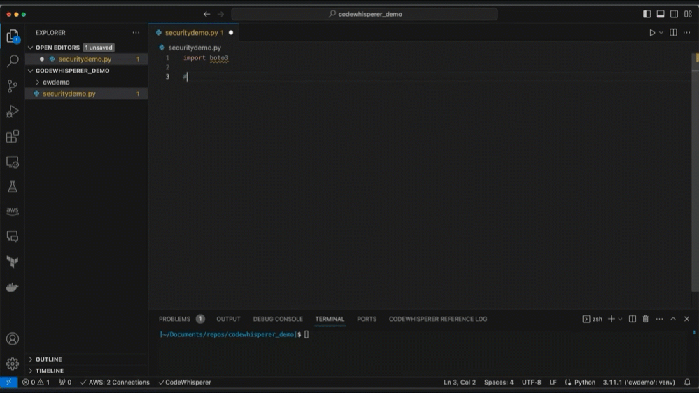

|ToC|
|---|

In the realm of cybersecurity, the integration of Generative AI is opening up new avenues for innovation and enhanced security measures. Generative AI, a subset of machine learning, has the potential to approximate human abilities in various tasks, making it a topic of keen interest for many in the tech industry.  If you've been following along then you know I'm not just talking about [ChatGPT](https://chat.openai.com/auth/login), but Amazon has recently released [Amazon Bedrock](https://aws.amazon.com/blogs/aws/amazon-bedrock-is-now-generally-available-build-and-scale-generative-ai-applications-with-foundation-models/?sc_channel=el&sc_campaign=genaiwave&sc_content=using-generative-ai-for-cybersecurity-work&sc_geo=mult&sc_country=mult&sc_outcome=acq), which has the ability to integrate various LLMs with you AWS Cloud Resources.  I won't be getting into that quite yet, but in this post I'll share my thoughts on the potential Generative AI has when pointed at CyberSecurity work, and what you should consider if you plan to go down that path in your organization.

## Risk Assessment and Vulnerability Analysis

One of the most intriguing applications of Generative AI in cybersecurity is its use in risk assessment and vulnerability analysis. By feeding the AI system with log data and traffic flows, it can be prompted to compare this data against security groups and firewall rules. This process aids in identifying potential security gaps without the need for manual inspection. Such an approach not only streamlines the assessment process but also provides a fresh perspective on potential vulnerabilities. To read more about this and see a working example, see the article [Unlocking the Potential: Generative AI and Cloud Security Possibilities](https://bit.ly/gen-ai-csp).

However, while the capabilities of Generative AI are vast, it's essential to approach its use with a discerning eye. Large language models, which form the foundation of many Generative AI systems, make predictions based on the data they've been trained on. These predictions, or "guesses", are statistical in nature and can vary based on the input provided. Imagine if you've read every book in a massive library and remembered every single word. That's kind of how large language models (LLMs) work in the world of Generative AI. These models have been fed billions of words, soaking up patterns from all that text. When you chat with one, it's like it's recalling all those patterns to predict what word should come next. Think of it as an educated guess based on what it's seen before. It's all about statistics. For instance, if during its "reading spree," it often saw the phrase "How are you" followed by "doing today?", it'll likely suggest that. But here's the fun part: tweak your question a bit or ask it on a different day, and you might get a slightly different answer.

Now, here's a little insider secret: Such inconsistencies can be attributed to the random number generator embedded within these models. It's like the model's sprinkle of spontaneity, adding a dash of creativity to its responses. And guess what? If you're feeling adventurous, you can play around with this creativity. There's a setting called "temperature" that lets you tweak how predictable or wild the model's answers can be. Turn it up for more surprises, or dial it down if you want things a bit more by-the-book. You can see an example of this in the image below. It's like having a chat with someone who's read a lot but can sometimes be a tad unpredictable or super on-point, depending on how you set the mood. Cool, right?  

Given these nuances, it's crucial to understand that while Generative AI can offer valuable insights, it might not always be the best tool for every job. For tasks that require consistent and predictable outputs, traditional computer programs might be more suitable. For instance, if one needs to analyze specific flow logs for a particular pattern, traditional analysis methods might be more efficient.

## A Real Strength : Assisted Code Writing

That said, the real strength of Generative AI lies in its ability to assist in code writing. Tools like [Amazon Code Whisperer](https://aws.amazon.com/pm/codewhisperer/?trk=83c710fd-0a7a-416b-9bb8-baa535b64ee0&sc_channel=el), which can be integrated into IDEs like [VS Code](https://code.visualstudio.com/), go beyond mere code completion. They can intuitively understand the function being defined and offer to complete it, enhancing productivity. This capability extends to crafting sentences and prompts, making the coding process smoother and more intuitive.  Here's a simple example that we can tie into security work.  Let's say you are asked to find out what security groups are attacked to all your running instances.  You could go to each one, or you could use a little python code to do it.  Since python is my preferred language I jump into VS Code, which has Code Whisperer installed.  I import `boto3` and start a comment on what I want to do.  As you can see below, as I create my comments, Code Whisperer creates the code for me. All I have to do to accept it is hit the `tab` key.  In this case I am happy with the code, and we can run it.  Just like that we are interacting with our AWS environment.

If you'd like to learn more about CodeWhisperer, check out the following playlist on our YouTube Channel.

https://youtube.com/playlist?list=PLDqi6CuDzubxzL-yIqgQb9UbbceYdKhpK&si=5P1Kfe3P-Q3Iaz6l

The future of Generative AI in cybersecurity looks promising. As we continue to experiment and understand its capabilities better, we can expect more refined and targeted applications that can revolutionize the way we approach security. For those eager to delve deeper into the world of Generative AI, the [Generative AI Space](/generative-ai) on AWS's community platform offers a plethora of resources, including insightful videos and discussions.

## Key Takeaway

In conclusion, while we are still in the early stages of fully harnessing the potential of Generative AI in cybersecurity, the initial results are promising. By combining human expertise with AI's capabilities, we can pave the way for a more secure and efficient digital landscape. In the meantime, keep learning and experimenting.  Happy Labbing!
