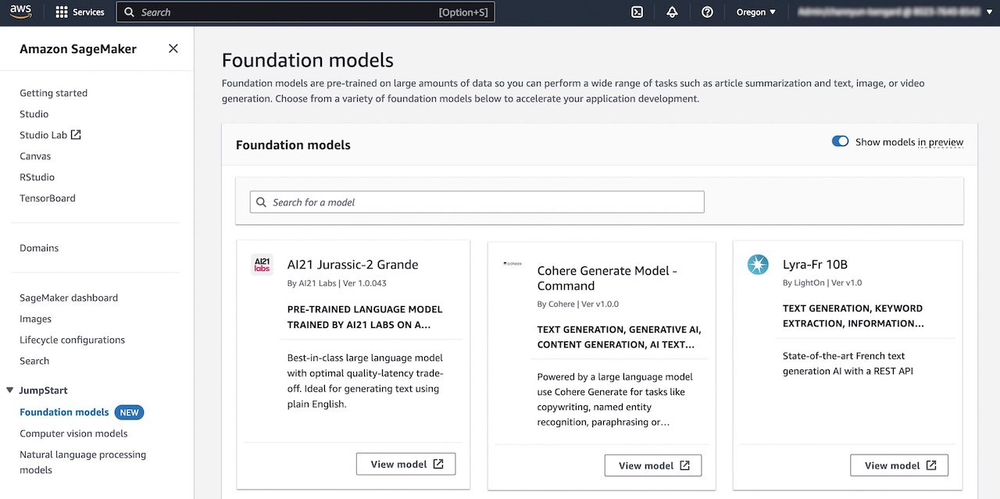
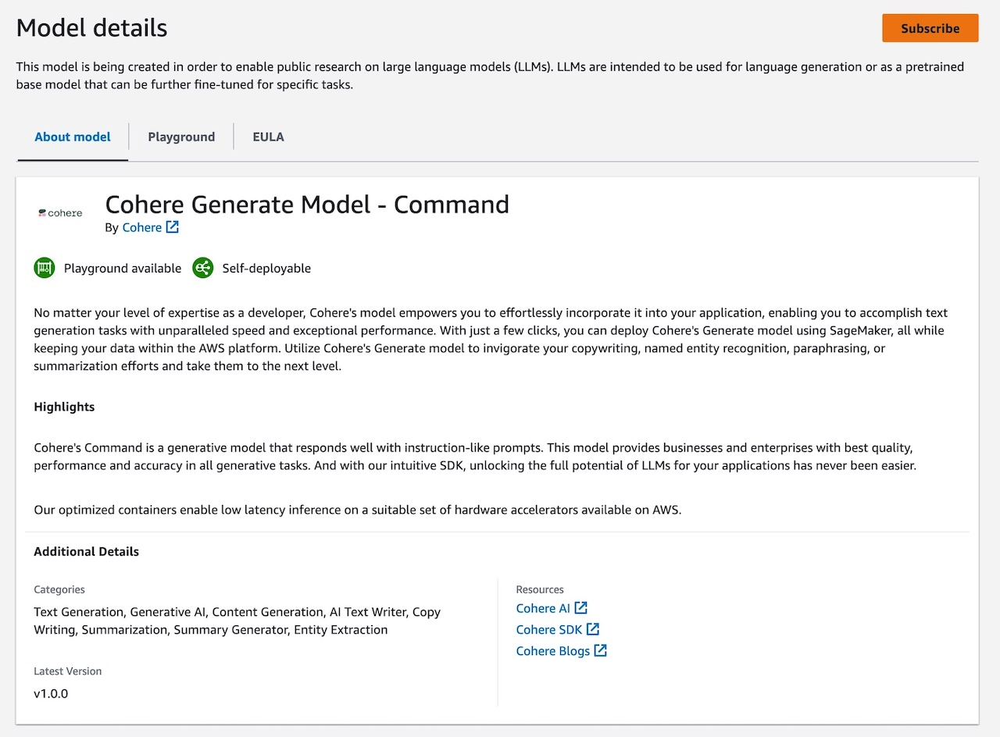
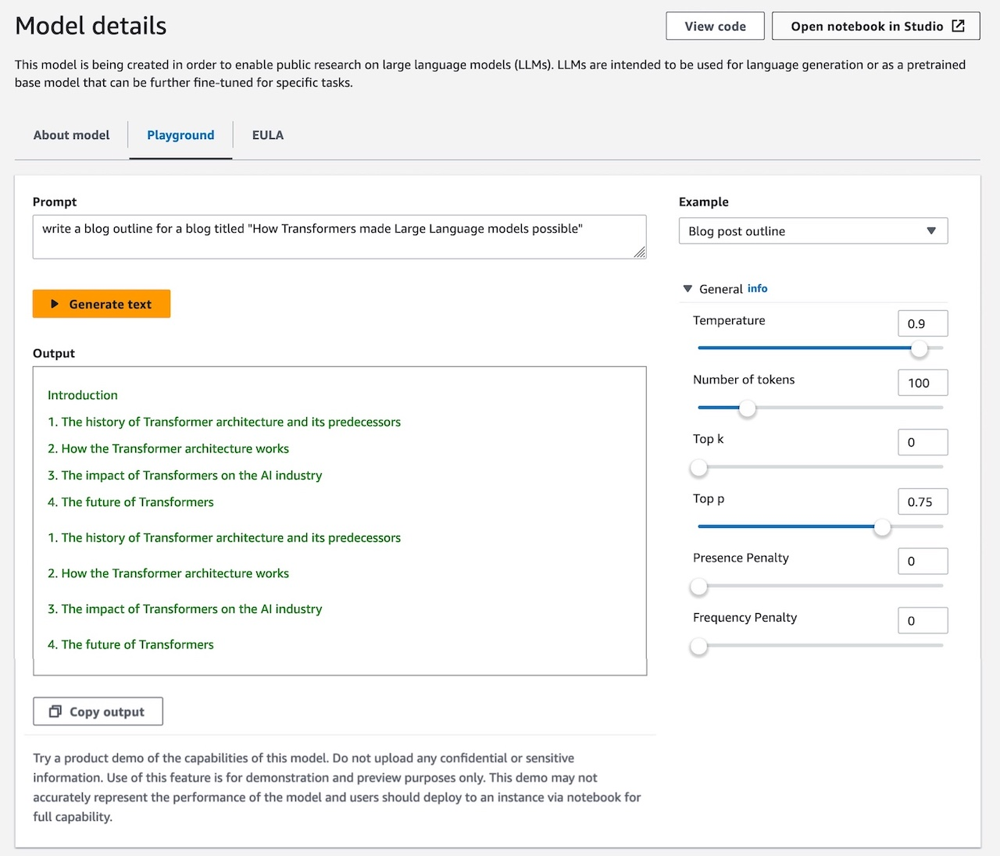
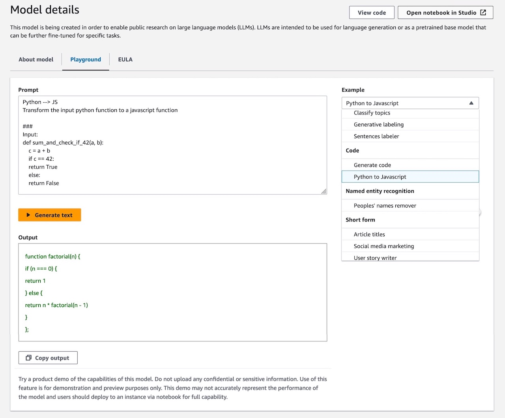
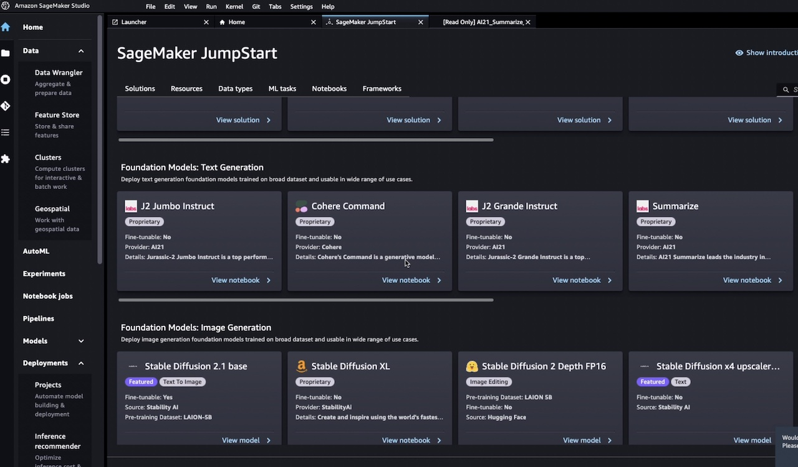
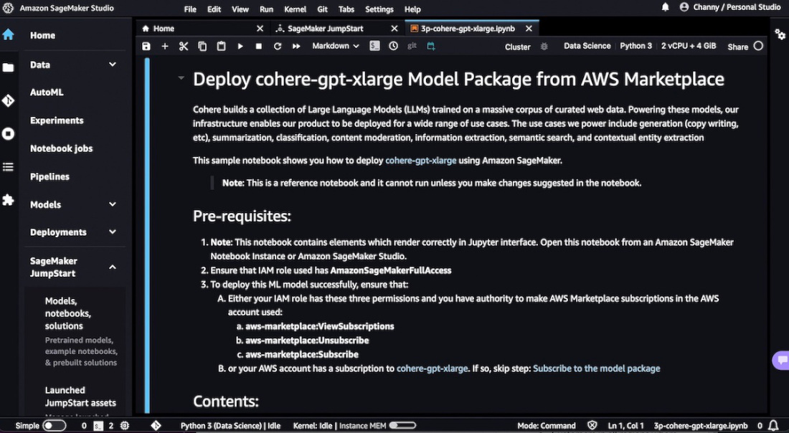
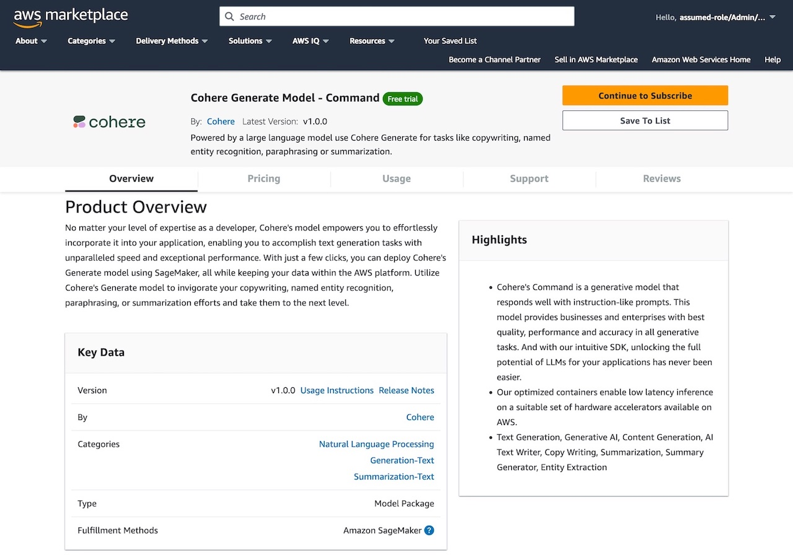

[Foundation models](https://en.wikipedia.org/wiki/Foundation_models) are large-scale machine learning (ML) models that contain billions of parameters and are pre-trained on the vast data sets of text and image, such as the entirety of Wikipedia and publicly available literature across multiple spoken languages as well as computer programming languages. So you can perform a wide range of tasks such as article summarization and text, image, or video generation. Because foundation models are pre-trained, they can help lower training and infrastructure costs and enable customization for your use case.

[Amazon SageMaker JumpStart](https://aws.amazon.com/sagemaker/jumpstart/?sc_channel=el&sc_campaign=datamlwave&sc_geo=mult&sc_country=mult&sc_outcome=acq&sc_content=using-proprietary-foundation-models-sagemaker-jumpstart-building-gen-ai-apps) is a ML hub with [hundreds of built-in algorithms and pre-trained models](https://aws.amazon.com/sagemaker/jumpstart/getting-started/?sc_channel=el&sc_campaign=datamlwave&sc_geo=mult&sc_country=mult&sc_outcome=acq&sc_content=using-proprietary-foundation-models-sagemaker-jumpstart-building-gen-ai-apps) for customers to accelerate ML model building and easily deploy within SageMaker, while ensuring their data security. SageMaker JumpStart also offers the broad set of foundation models from Amazon to proprietary, and publicly available from various model providers representing top-scoring models via [Holistic Evaluation of Language Models](https://crfm.stanford.edu/helm/latest/) (HELM) benchmarks.

## Proprietary Foundation Models with Amazon SageMaker JumpStart
Since November 2022, SageMaker JumpStart has previewed pre-trained proprietary models, such as [AI21 Jurassic-1 language model](https://aws.amazon.com/blogs/machine-learning/ai21-jurassic-1-foundation-model-is-now-available-on-amazon-sagemaker/?sc_channel=el&sc_campaign=datamlwave&sc_geo=mult&sc_country=mult&sc_outcome=acq&sc_content=using-proprietary-foundation-models-sagemaker-jumpstart-building-gen-ai-apps), [Cohere language model](https://aws.amazon.com/blogs/machine-learning/cohere-brings-language-ai-to-amazon-sagemaker/?sc_channel=el&sc_campaign=datamlwave&sc_geo=mult&sc_country=mult&sc_outcome=acq&sc_content=using-proprietary-foundation-models-sagemaker-jumpstart-building-gen-ai-apps), and [LightOn Lyra-fr model](https://aws.amazon.com/blogs/machine-learning/lighton-lyra-fr-model-is-now-available-on-amazon-sagemaker/?sc_channel=el&sc_campaign=datamlwave&sc_geo=mult&sc_country=mult&sc_outcome=acq&sc_content=using-proprietary-foundation-models-sagemaker-jumpstart-building-gen-ai-apps), as well as publicly available models such as [AlexaTM 20B language model](https://aws.amazon.com/blogs/machine-learning/alexatm-20b-is-now-available-in-amazon-sagemaker-jumpstart/?sc_channel=el&sc_campaign=datamlwave&sc_geo=mult&sc_country=mult&sc_outcome=acq&sc_content=using-proprietary-foundation-models-sagemaker-jumpstart-building-gen-ai-apps), [Bloom language models](https://aws.amazon.com/blogs/machine-learning/run-text-generation-with-gpt-and-bloom-models-on-amazon-sagemaker-jumpstart/?sc_channel=el&sc_campaign=datamlwave&sc_geo=mult&sc_country=mult&sc_outcome=acq&sc_content=using-proprietary-foundation-models-sagemaker-jumpstart-building-gen-ai-apps), [Finetuned Language Models](https://aws.amazon.com/blogs/machine-learning/zero-shot-prompting-for-the-flan-t5-foundation-model-in-amazon-sagemaker-jumpstart/?sc_channel=el&sc_campaign=datamlwave&sc_geo=mult&sc_country=mult&sc_outcome=acq&sc_content=using-proprietary-foundation-models-sagemaker-jumpstart-building-gen-ai-apps) (FLAN) model, and [Stability AI image creation model](https://aws.amazon.com/blogs/machine-learning/stability-ai-builds-foundation-models-on-amazon-sagemaker/?sc_channel=el&sc_campaign=datamlwave&sc_geo=mult&sc_country=mult&sc_outcome=acq&sc_content=using-proprietary-foundation-models-sagemaker-jumpstart-building-gen-ai-apps).


You can optimize them for accuracy, performance, and cost for different use cases based on your specific needs to build generative artificial intelligence (AI) applications.

For example, the Stable Diffusion model is used by hundreds of business applications such as [DreamStudio](https://beta.dreamstudio.ai/) reaching millions of end users to create novel designs for their content. If you want to generate your own new artwork, you can simply create an image like the one below by feeding the sentence “_Four men riding bicycles in the Swiss Alps, a Renaissance painting, a majestic, breathtaking natural landscape._” to the Stable Diffusion model.


Also, we [announced Amazon CodeWhisperer](https://aws.amazon.com/blogs/aws/amazon-codewhisperer-free-for-individual-use-is-now-generally-available/?sc_channel=el&sc_campaign=datamlwave&sc_geo=mult&sc_country=mult&sc_outcome=acq&sc_content=using-proprietary-foundation-models-sagemaker-jumpstart-building-gen-ai-apps), Amazon’s generative AI service to help improve developer productivity by generating code recommendations based on their prior code and comments. We now see many customers that want to harness foundation models to their business use cases.

In this blog post, you can learn how to use pre-trained proprietary models in SageMaker JumpStart to perform a wide range of tasks to generate text, image, or video for your generative AI applications. This is based on a preview feature, a playground of AWS console and deploy to SageMaker Studio. You can test these models without writing a single line of code and easily evaluate models on your specific tasks

## Getting Started Proprietary Models with SageMaker JumpStart
You can try out popular pre-trained foundation models without the need to deploy. To get started on the latest models that are in preview or to try out models in a playground, you need to request access. You’ll receive an email once it’s ready. If you have a preview access, choose **Foundation models** under **JumpStart** in the [Amazon SageMaker console](https://console.aws.amazon.com/sagemaker/home?#/foundation-models).



Here are popular proprietary model providers such as [AI21 Labs](https://www.ai21.com/), [Cohere](https://cohere.com/), and [LightOn](https://www.lighton.ai/). You can test these models without writing a single line of code and easily evaluate models on your specific tasks.

For example, [Cohere Generate Model – Command](https://aws.amazon.com/marketplace/pp/prodview-n44fbeuycwldi?sc_channel=el&sc_campaign=datamlwave&sc_geo=mult&sc_country=mult&sc_outcome=acq&sc_content=using-proprietary-foundation-models-sagemaker-jumpstart-building-gen-ai-apps) model helps automate a wide range of tasks such as copywriting, entity recognition, paraphrasing, text summarization, and classification. This enables developers and customers to add linguistic AI to their technology stack and build a variety of applications with it.

If you want to try out this mode, choose **View model** and see the model description popup.



When you choose **Playground**, you can try a product demo of the capabilities of this model. If you have tried out the notebook for full model capability, choose **Subscribe** and click **Open notebook in Studio** to open up the notebook to deploy the model to a customer-dedicated endpoint.

Now let’s test this Cohere model and prompt it to generate given examples. Choose **Playground** and “Blog post outline” write a blog outline for a blog titled “How Transformers made Large Language models possible” in the **Example** dropdown menu.



It includes more examples such as blog post title, body paragraph, cold outreach email, product description, and professional post generator.

Another popular proprietary model, [AI21 Labs’s Jurassic-2 Grande](https://aws.amazon.com/marketplace/pp/prodview-5ytkctg7ux5om?sc_channel=el&sc_campaign=datamlwave&sc_geo=mult&sc_country=mult&sc_outcome=acq&sc_content=using-proprietary-foundation-models-sagemaker-jumpstart-building-gen-ai-apps) has fun use-cases such as, generating simple programming code, classifying news articles by topics, labeling peoples’ names, and suggesting tweets copy for social media marketing.



Use of this feature is for demonstration and preview purposes only. These demo may not accurately represent the performance of the model, and you should deploy to an instance via the SageMaker Studio notebook for full capacity.

## Deploying Proprietary Models with SageMaker Studio
You can deploy foundation models with only one click in the [Amazon SageMaker Studio](https://aws.amazon.com/sagemaker/studio/?sc_channel=el&sc_campaign=datamlwave&sc_geo=mult&sc_country=mult&sc_outcome=acq&sc_content=using-proprietary-foundation-models-sagemaker-jumpstart-building-gen-ai-apps) interface, or with very few lines of code through the [SageMaker Python SDK](https://sagemaker.readthedocs.io/en/stable/).

You can use more proprietary foundation models for your purpose – zero-shot classification models such as AI21 Jurassic-2 language models (Jumbo instruct, Grande Instruct), Cohere Command, LightOn Mini, and task specific models such as AI21 Summarize and Paraphrasing.



To get started, choose **Open notebook in Studio** in the model page or select your model in SageMaker JumpStart panel to open up the notebook in SageMaker Studio.

Now, let’s look now to deploy [Cohere’s Generate Model – Command](https://aws.amazon.com/marketplace/pp/prodview-n44fbeuycwldi?sc_channel=el&sc_campaign=datamlwave&sc_geo=mult&sc_country=mult&sc_outcome=acq&sc_content=using-proprietary-foundation-models-sagemaker-jumpstart-building-gen-ai-apps) model.

Following the step-by-step guide in the notebook, you should subscribe to deploy Cohere’s language model package from [AWS Marketplace](https://aws.amazon.com/marketplace/pp/prodview-n44fbeuycwldi?sc_channel=el&sc_campaign=datamlwave&sc_geo=mult&sc_country=mult&sc_outcome=acq&sc_content=using-proprietary-foundation-models-sagemaker-jumpstart-building-gen-ai-apps) and use your own data to customize models to your specific needs.



On the AWS Marketplace listing, click on the **Continue to subscribe** button, review and click on **Accept Offer** if you and your organization agrees with end-user license agreement, pricing, and support terms.



The model offers both the software pricing and free trial pricing model. In case of Cohere Command model, you can choose **Free trial** option.

Once you click on **Continue to configuration** button and then choose a region, you will see a `Product Arn` displayed. This is the model package ARN that you need to specify while creating a deployable model using `Boto3`. Copy the `ARN` corresponding to your region and specify the same in the `model_package_map` in the example of notebook code.

```python
    # Mapping for Model Packages
    model_package_map = {
        "us-east-1": "arn:aws:sagemaker:us-east-1:123456789012:model-package/cohere-gpt-medium-v1-5-15e34931a06235b7bac32dca396a970a",
        "eu-west-1": "arn:aws:sagemaker:eu-west-1:123456789012:model-package/cohere-gpt-medium-v1-5-15e34931a06235b7bac32dca396a970a",
    }

    region = boto3.Session().region_name
    if region not in model_package_map.keys():
        raise Exception("Current boto3 session region {region} is not supported.")
    model_package_arn = model_package_map['us-east-1']

    # Create an endpoint
    co = Client(region_name=region)
    co.create_endpoint(arn=model_package_arn, endpoint_name="cohere-gpt-medium", instance_type="ml.g5.xlarge", n_instances=1)

    # If the endpoint is already created, you just need to connect to it
    # co.connect_to_endpoint(endpoint_name="cohere-gpt-medium")

    # Perform real-time inference
    prompt="""Write a creative product description for a wireless headphone product named the CO-1T, with the keywords "bluetooth", "wireless", "fast charging" for a software developer who works in noisy offices, and describe benefits of this product."""
    response = co.generate(prompt=prompt, max_tokens=100, temperature=0.9)
    print(response.generations[0].text)
```

When you’ve finished working and clean up your resources, you need [shut down the SageMaker Studio instances](https://docs.aws.amazon.com/sagemaker/latest/dg/notebooks-run-and-manage-shut-down.html?sc_channel=el&sc_campaign=datamlwave&sc_geo=mult&sc_country=mult&sc_outcome=acq&sc_content=using-proprietary-foundation-models-sagemaker-jumpstart-building-gen-ai-apps) to delete the endpoint and avoid incurring additional costs.

For a variety of tutorials and tips and tricks related to this language model, see [Cohere brings language AI to Amazon SageMaker](https://aws.amazon.com/blogs/machine-learning/cohere-brings-language-ai-to-amazon-sagemaker/?sc_channel=el&sc_campaign=datamlwave&sc_geo=mult&sc_country=mult&sc_outcome=acq&sc_content=using-proprietary-foundation-models-sagemaker-jumpstart-building-gen-ai-apps) in the AWS Machine Learning Blog. You can also see an [example of automated quiz generation with AWS Certification exams](https://aws.amazon.com/blogs/machine-learning/accelerate-your-learning-towards-aws-certification-exams-with-automated-quiz-generation-using-amazon-sagemaker-foundations-models/?sc_channel=el&sc_campaign=datamlwave&sc_geo=mult&sc_country=mult&sc_outcome=acq&sc_content=using-proprietary-foundation-models-sagemaker-jumpstart-building-gen-ai-apps) using AI21 Jurassic-2 Jumbo Instruct model.

To learn more examples about building generative AI with SageMaker JumpStart, see [blog articles](https://aws.amazon.com/blogs/machine-learning/category/artificial-intelligence/generative-ai/?sc_channel=el&sc_campaign=datamlwave&sc_geo=mult&sc_country=mult&sc_outcome=acq&sc_content=using-proprietary-foundation-models-sagemaker-jumpstart-building-gen-ai-apps) in the AWS Machine Learning Blog.

## Conclusion
You can now access [various proprietary foundation models](https://aws.amazon.com/sagemaker/jumpstart/getting-started/?sagemaker-jumpstart-cards.sort-by=item.additionalFields.priority&sagemaker-jumpstart-cards.sort-order=asc&awsf.sagemaker-jumpstart-filter-product-type=*all&awsf.sagemaker-jumpstart-filter-text=*all&awsf.sagemaker-jumpstart-filter-vision=*all&awsf.sagemaker-jumpstart-filter-tabular=*all&awsf.sagemaker-jumpstart-filter-audio-tasks=*all&awsf.sagemaker-jumpstart-filter-multimodal=*all&awsf.sagemaker-jumpstart-filter-RL=*all&sc_channel=el&sc_campaign=datamlwave&sc_geo=mult&sc_country=mult&sc_outcome=acq&sc_content=using-proprietary-foundation-models-sagemaker-jumpstart-building-gen-ai-apps) from Amazon SageMaker console, SageMaker Studio, and SageMaker SDK, by subscribing to these from AWS Marketplace. Since all data is encrypted and does not leave your VPC, you can trust that your data will remain private and confidential. Try out a playground of these models and deploy to SageMaker Studio. You can test these models without writing a single line of code and easily evaluate models on your specific tasks

You can also choose a [broad range of AWS services](https://aws.amazon.com/blogs/machine-learning/announcing-new-tools-for-building-with-generative-ai-on-aws/?sc_channel=el&sc_campaign=datamlwave&sc_geo=mult&sc_country=mult&sc_outcome=acq&sc_content=using-proprietary-foundation-models-sagemaker-jumpstart-building-gen-ai-apps) that have generative AI built in, all running on the most cost-effective cloud infrastructure for generative AI. To learn more, visit [Generative AI](https://aws.amazon.com/generative-ai/?sc_channel=el&sc_campaign=datamlwave&sc_geo=mult&sc_country=mult&sc_outcome=acq&sc_content=using-proprietary-foundation-models-sagemaker-jumpstart-building-gen-ai-apps) on AWS to innovate faster to reinvent your applications.

## About Author
Channy Yun is a Principal Developer Advocate for AWS, and passionate about helping developers to build modern applications on latest AWS services. A pragmatic developer and blogger at heart, he loves community-driven learning and sharing of technology, which has funneled developers to global AWS Usergroups. His main topics are open-source, container, storage, network & security, and IoT. Follow him on Twitter at [@channyun](https://twitter.com/channyun).
