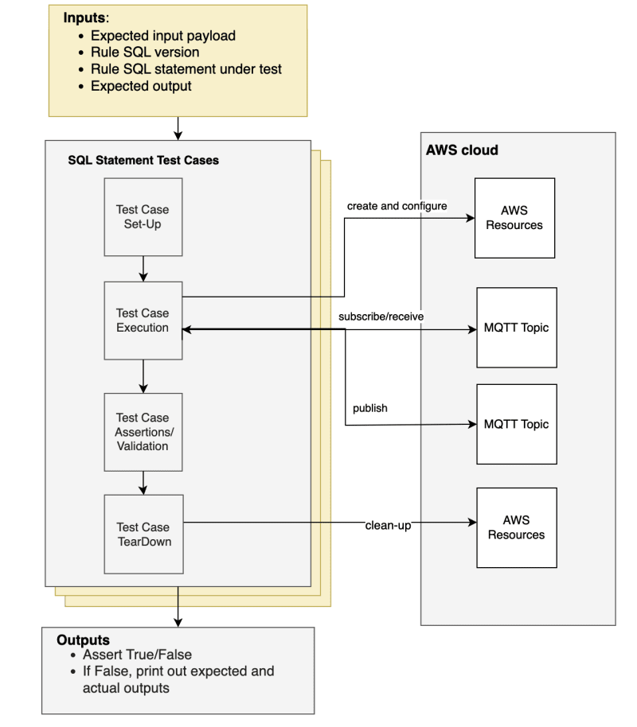
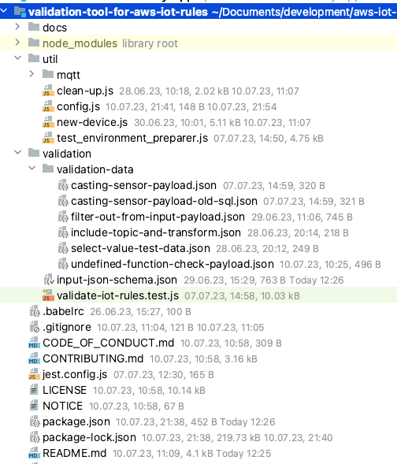
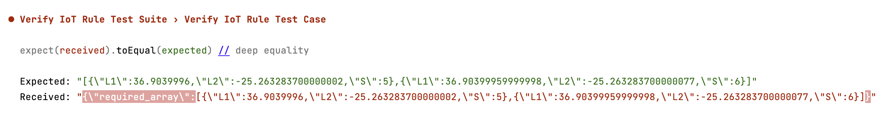

|ToC|
|---|

Rules Engine is a feature in AWS IoT Core that allows engineers to filter, decode, and process IoT device data and route this data to 15+ AWS and third-party services. AWS IoT Core Rules Engine currently has support for over 70 distinct SQL functions which can be used in either SELECT or WHERE clauses, 14 distinct operators which can be used in either SELECT or WHERE clauses, all JSON data types, specifying Literal objects in the SELECT and WHERE clauses, case statements, JSON extensions, substitution templates and nested object queries and more.

https://www.youtube.com/watch?v=VfswJyz07ds

In this post, we explore how to validate AWS IoT Core Rules Engine Rules SQL Statements, by introducing a validation tool which:

* Encapsulates the heavy lifting of creating, configuring and cleaning up the AWS resources needed to create, run and validate IoT Rule SQL payload transformations.
* Enables friction free validation of Rules syntax and payload transformations.
* Provides an easily extensible library of sample SQL statements, with input payloads and expected output, allowing you to build your own use-cases.

This tool is available on GitHub, [here](https://github.com/aws-iot-builder-tools/validation-tool-for-aws-iot-rules/).

## Why do we need a tool?

To validate SQL syntax and the input/output expectations, developers would normally need to:

1. Create a rule.
2. Create and assign actions to the rule.
3. Create and assign an IAM Role with valid permissions for the actions.
4. Subscribe to the output topic (or monitor the output system), and then publish an MQTT message, to see if the rule works.
5. If the Rule execution does not work, they have to check in Amazon CloudWatch IoT Logs or the downstream service logs to see what went wrong.
6. If Amazon CloudWatch Logs for IoT are not enabled, developers need to enable them and then try again.

This is quite some heavy lifting, if the ultimate purpose is to validate that the payload transformations from provided input into expected output work as expected.

So this called for creating a tool that enables developers to do a ‘closed box ’- type of validation, where input payload, SQL statement and expected output are provided. The tool executes validation scenarios, and if the Rules Engine parses the input as expected, with the expected output, scenarios succeed, if not they fail and expected versus actual output payload are printed for references.

## How does the tool work?

The diagram below shows the architecture of the validation tool. You can imagine this tool working like an integration test suite, where you only need to define the inputs, configuration and expected outputs (components you need to define are marked yellow). This inputs are provided as a new JSON file and also referred to as creating a new test case or validation scenario. See the _“Adding a new test case”_ section below for details.

The integration test itself (set-up, execution, assertions and expectations and tear down - marked gray on the diagram)  is already part of the tool. Of course, if you discover that you need to implement different behaviour to the one the tool provides for set up/tear down/test execution and assertions/validation, you can extend this tool by creating further integration tests to fit your use case.

Additionally, the tool also includes a sample library with validation scenarios, comprised to date, of 6 examples from the more popularly reported Rules SQL statement questions. These scenarios can be explored, executed or modified and adapted.



To better understand the format of the input, have a look at the current JSON schema:

```json
{
  "$schema": "https://json-schema.org/draft/2019-09/schema",
  "type": "object",
  "properties": {
    "sqlVersion": {
      "type": "string",
      "description": "SQL version needed for the test. Defaults to latest."
    },
    "topic": {
      "type": "string",
      "description":"This is the AWS IoT MQTT topic that the input payload will be published on. The same topic must be used in the Rule SQL FROM clause. "
    },
    "inputPayload": {
      "anyOf": [
        {
          "type": "string"
        },
        {
          "type": "object"
        }
      ],
      "description":"This is the test input payload which will be published during the test execution. "
    },
    "inputSql": {
      "type": "string",
      "description":"This is the SQL statement of the IoT Rule under evaluation. "
    },
    "expectedOutput": {
      "anyOf": [
        {
          "type": "string"
        },
        {
          "type": "object"
        },
        {
          "type": "array"
        }
      ]
    },
    "description":"This is the expected output that the input payload will be transformed into after scenario validation execution. "

  },
  "required": [
    "topic",
    "inputPayload",
    "inputSql",
    "expectedOutput"
  ]
}
```

## Getting started

### Pre-Requisites

To be able to run the existing or new validation scenarios, you need to:

* Install [npm](https://docs.npmjs.com/getting-started). This project was tested with Node v18.16.0.
* Have an AWS Account and provide Node.js with [credentials](https://docs.aws.amazon.com/sdk-for-javascript/v3/developer-guide/setting-credentials-node.html?sc_channel=el&sc_campaign=datamlwave&sc_content=validation-tool-for-aws-iot-rules&sc_geo=mult&sc_country=mult&sc_outcome=acq).

### Repository Structure

The project repository is structured as per screenshot below:

* A `util` folder containing the configuration, environment and resource set-up  and clean-up utilities. The utilities are called from the validation test automatically as needed.
* A `validation` folder containing:
  * `validation-data`: this is a sample library of working examples of SQL statements which validate successfully. You can extend this folder with more validation scenario files as needed.
  * `input-json-schema`: providing type and description information for mandatory and optional input fields.
  * `validate-iot-rules`: which is the framework for set up and execution of the provided and new validation scenarios.



### To get started

1. Clone the GitHub repository: [https://github.com/aws-iot-builder-tools/validation-tool-for-aws-iot-rules](https://github.com/aws-iot-builder-tools/validation-tool-for-aws-iot-rules).
2. Make sure you add your AWS account id in the configuration file: `util/config.js`.
3. Run:`npm install`
4. By default, the default validation scenario is executed: `casting-sensor-payload.json`.  To run the default scenario, run:  `npm run test`.
5. To change the default scenario, got to `config.js`, and re-set the `defaultInputFile` to a file of your choice from the provided files in the `validation/validation-data` directory. You can choose the validation scenario you want to execute, by running: `npm test -- -inputFile=<existing or newly created file name>`.
6. You can also choose to execute all the provides scenarios, by running: `npm test -- -inputFile=ALL`.

**Note that:**

* This is a development tool, which is designed to support with faster, friction free testing and validation of SQL statements based on desired inputs and outputs. It is therefore not recommended to run this tool against production environments.
* Running all validation scenarios takes longer as, the tool creates and needed rules, IAM roles and policies before executing any of the tests.
* As tests are executed, expectations are evaluated to either success or failure (with the printed expected and actual result).
* All AWS resources are automatically cleaned up post execution, so there is no manual action needed.

If there is a test failure, you see the comparison between expected and actual output, as shown below:



## Adding a new validation scenario

Adding a new validation scenario based on your use-case is straight-forward. You need to add a new JSON file in the `verification-tool-for-aws-iot-rules/validation/validation-data` folder.

The following requirements hold when adding your own new validation scenario:

* The contents of the file must follow the JSON schema (`validation/input-json-schema.json`) mentioned in the paragraph above and include all mandatory fields, with the correct data types.
* You need to also make sure that the topic name is test uses is unique.
* If you add more validation scenarios, bear in mind that you might need to adjust the Jest timeout value. If you want to execute all validation scenarios together in the same test suite after you added more scenarios, you should adjust the timeout value in the test itself, or in the Jest configuration (`jest.config.js`).

## Conclusion and Future Improvements

This blog shows an approach which allows developers to experiment with and validate AWS IoT Rules SQL statements faster and friction-free. This is achieved by encapsulating the complexities of AWS resource creation and clean-up, publishing data on topics and republishing actions in a configurable and extensible tool developers can use ([available on GitHub](https://github.com/aws-iot-builder-tools/validation-tool-for-aws-iot-rules)), which does this heavy lifting.

This tool is currently in its first iteration. Below is a list of improvements could be considered for future iterations:

* In the current version, the tool is designed to run locally. Ideally it would be integrated in a CI/CD pipeline.
* Add support for MQTT 5 and protobuf.
* Add ability to mock Rules SQL functions which call other AWS and Amazon services, like Amazon DynamoDB or AWS Lambda.
* In the current version, the tool assumes that the rule executes (i.e. that the payload satisfies the WHERE clause). To validate scenarios where input payloads do not satisfy the WHERE clause, a new test case needs to be created, with modified expectations.
* Improve overall execution time and resilience.

For more information about AWS IoT Core and Rules Engine, have a look at the [AWS IoT Developer Guide](https://docs.aws.amazon.com/iot/latest/developerguide/iot-rules.html?sc_channel=el&sc_campaign=datamlwave&sc_content=validation-tool-for-aws-iot-rules&sc_geo=mult&sc_country=mult&sc_outcome=acq).

If you have validation scenarios you would like to share, or additions to this tool, feel free reach out to me on [LinkedIn](https://www.linkedin.com/in/alina-dima/) or [Twitter](https://twitter.com/fay_ette), or provide feedback on GitHub.

To get notified about more IoT content, you can additionally subscribe to the [IoT Builders YouTube channel](https://www.youtube.com/@iotbuilders).
