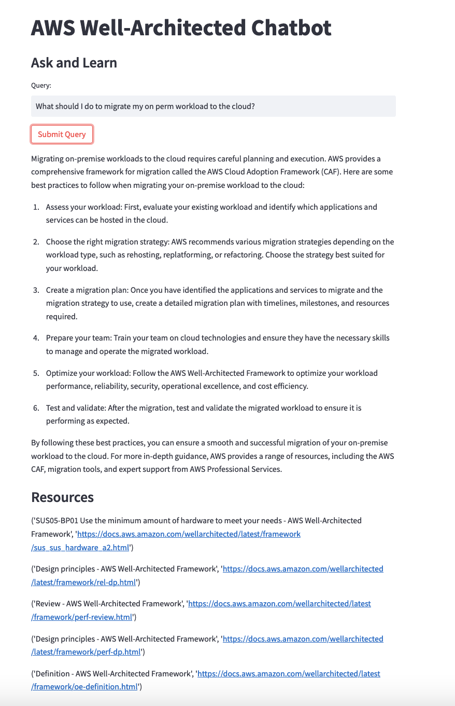
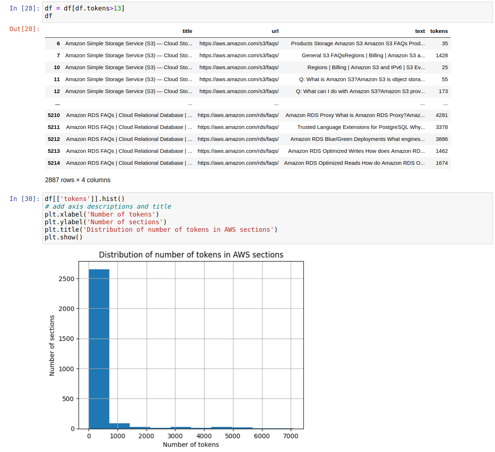
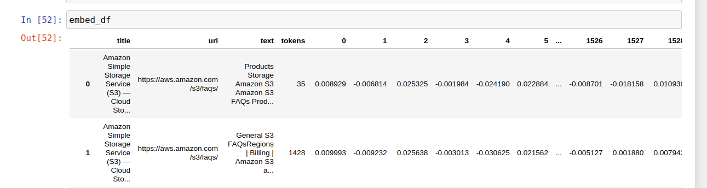
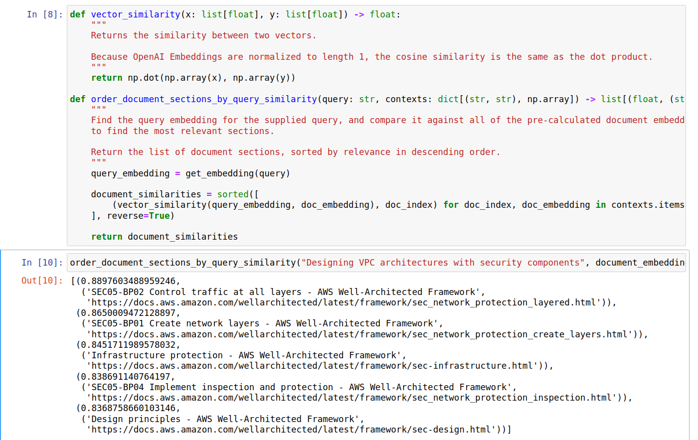

The [AWS Well-Architected Framework](https://aws.amazon.com/architecture/well-architected/) is a set of best practices for designing and operating reliable, secure, efficient, and cost-effective systems in the cloud. However, finding the right answers to questions related to the framework can be time-consuming and challenging. So I decided to build a chatbot to answer questions related to the framework and provide developers with quick and accurate responses - all with links to supporting documents. In this article, I'll share tips and guidance on building a ChatGPT powered AWS Well-Architected chatbot.



To accomplish this, I'll walk you through the following:

* Data Collection
* Creating Text Embeddings
* Prompt Engineering
* Creating the Chat Interface

You can try my chatbot [here](https://banjtheman-aws-well-arch-chatbot-aws-well-arch-st-d985uz.streamlit.app/).

And check out the GitHub repo with the code [here](https://github.com/banjtheman/aws_well_arch_chatbot).

## Data Collection

I started by using `Selenium` and `BeautifulSoup` to methodically scrape content from the entire [Well-Architected Framework](https://docs.aws.amazon.com/wellarchitected/latest/framework/welcome.html) page. To ensure comprehensive data extraction, I meticulously examined every section on the main page, as well as followed and scraped all associated links found in the sidebar. As a result, I captured the complete content and compiled it into a CSV file, along with the corresponding titles and URLs for easy reference and citation.

Here is some of the code used to gather data for each page.

```python
def get_page_info(url):
    browser.get(url)
    html = browser.page_source
    # Have soup parse the website
    soup = BeautifulSoup(html, "html.parser")

    # Get title
    title = soup.find("title").string

    main_article = soup.find(id="main-col-body")  # main text of article
    # Get text sections
    text_sections = main_article.findAll("p")
    text_list = []

    for list_item in text_sections:
        text_list.append(list_item.text)

    # Get info in tables
    tables = main_article.findAll("table")

    for table in tables:
        # Add all ths and tds
        tds = table.findAll("td")
        ths = table.findAll("th")

        for th in ths:
            text_list.append(th.text)

        for td in tds:
            text_list.append(td.text)

    json_obj = {}
    json_obj["url"] = url
    json_obj["title"] = title
    json_obj["sections"] = text_list

    return json_obj
```

### Data Cleaning

Data cleaning is a vital step in preparing scraped data for analysis, ensuring that the resulting insights are accurate, relevant, and meaningful. In this project, I focused on three primary data cleaning techniques:

**Text Normalization**: To ensure consistency, I performed text normalization by converting all text to lowercase and removing any extra spaces or special characters. This step facilitated better analysis and processing by the model.

**Token Limitation**: Since the model I used has a token limit of 5,000, I divided sections exceeding this limit into smaller chunks. This enabled the model to process the information effectively without losing any essential data.

**Filtering Out Short Texts**: I also filtered out any text with less than 13 tokens, as these often comprised service names, like "Amazon S3," without any contextual information. By removing these short, context-less snippets, I ensured that the data fed into the model was both relevant and meaningful.

These data cleaning steps helped to refine the raw data and enhance the model's overall performance, ultimately leading to more accurate and useful insights.



## Creating Text Embeddings

Next, I created text embeddings for each of the pages using 
OpenAI's [embeddings API](https://platform.openai.com/docs/guides/embeddings/what-are-embeddings).

Text embeddings measure the relatedness of text strings. Embeddings are commonly used for:

* Search (where results are ranked by relevance to a query string)
* Clustering (where text strings are grouped by similarity)
* Recommendations (where items with related text strings are recommended)
* Anomaly detection (where outliers with little relatedness are identified)
* Diversity measurement (where similarity distributions are analyzed)
* Classification (where text strings are classified by their most similar label)

An embedding is a vector (list) of floating-point numbers. The distance between two vectors measures their relatedness. Small distances suggest high relatedness and large distances suggest low relatedness.

This [OpenAI Notebook](https://github.com/openai/openai-cookbook/blob/main/examples/Question_answering_using_embeddings.ipynb) provides a full end-to-end example of creating text embeddings.

Here is an example of how the text looks as an embedding, a list of 1536 numbers that represent the text.



With text embeddings we can now do a Search of all the text based on an input query. By asking `How do I design VPC architectures with security components?` we get a list of the documents that has text which is relevant to the query.



## Prompt Engineering

Prompt engineering is about designing prompts that elicit the most relevant and desired response from a Large Language Model (LLM) such as GPT-3.

Crafting these [prompts is an art](https://platform.openai.com/docs/guides/completion/prompt-design) that many are still figuring out, but a rule of thumb is the more detailed the prompt, the better the desired outcome.

OpenAI recently just released their [ChatGPT API](https://openai.com/blog/introducing-chatgpt-and-whisper-apis), which is 10x cheaper than their previous text generation API.

To use the API, you have to create a prompt that leverages a "system" persona, and then take input from the user.

Here is what I used for the system prompt:

**"You are an AWS Certified Solutions Architect. Your role is to help customers understand best practices on building on AWS. Return your response in markdown, so you can bold and highlight important steps for customers.",**

Then I added one more system prompt to use the context from the text embeddings search:

**"Use the following context from the AWS Well-Architected Framework to answer the user's query.\nContext:\n{context}"**

Afterwards, the user prompt is the query, such as "How can I design resilient workloads?".

Here is a code snippet of using the ChatGPT API endpoint:

```python
    response = openai.ChatCompletion.create(
        model="gpt-3.5-turbo",
        messages=[
            {
                "role": "system",
                "content": "You are an AWS Certified Solutions Architect. Your role is to help customers understand best practices on building on AWS. Return your response in markdown, so you can bold and highlight important steps for customers.",
            },
            {
                "role": "system",
                "content": f"Use the following context from the AWS Well-Architected Framework to answer the user's query.\nContext:\n{context}",
            },
            {"role": "user", "content": f"{query}"},
        ],
    )

```

## Creating the Chat Interface

I developed the chat interface using my go-to tool for building web applications with Python, [Streamlit](https://streamlit.io/). Streamlit allows builders to easily create interactive web apps that provide instant feedback on user responses.

This code creates a simple interface with a text input for the user to enter their query, and a "Send" button to submit it. When the user clicks the "Send" button, the `get_answer_from_chatgpt()` function is called to get a response from the ChatGPT and the referenced documents.

```python
def app() -> None:
    """
    Purpose:
        Controls the app flow
    Args:
        N/A
    Returns:
        N/A
    """

    # Spin up the sidebar
    sidebar()
    # Load questions
    query = st.text_input("Query:")

    df = load_data_frame("min_aws_wa.csv")
    document_embeddings = load_embeddings("document_embeddings.pkl")

    if st.button("Submit Query"):
        with st.spinner("Generating..."):
            answer, docs = utils.get_answer_from_chatgpt(
                query,
                df,
                document_embeddings,
            )

            st.markdown(answer)

            st.subheader("Resources")
            for doc in docs:
                st.write(doc)

```

The dataframe contains the text data, along with links to the corresponding ground truth information indicating how the chatbot responded. This allows for easy validation and verification of the chatbot's accuracy and can aid in identifying areas for improvement.

For more details on how to deploy and create Streamlit apps, checkout the [GitHub repo](https://github.com/banjtheman/aws_well_arch_chatbot).

## Conclusion

In this post, I walked through the process of building an AWS Well-Architected chatbot using the OpenAI GPT model and Streamlit. We started by collecting data from the AWS Well-Architected Framework using Python, and then used the OpenAI API to generate responses to user input.

You can check out the chatbot [here](https://banjtheman-aws-well-arch-chatbot-aws-well-arch-st-d985uz.streamlit.app/). 

If you're interested in building your own ChatGPT powered applications, I hope this post has provided you with some helpful tips and guidance.

## About the Author

Banjo is a Senior Developer Advocate at AWS, where he helps builders get excited about using AWS. Banjo is passionate about operationalizing data and has started a podcast, a meetup, and open-source projects around utilizing data. When not building the next big thing, Banjo likes to relax by playing video games, especially JRPGs, and exploring events happening around him.


