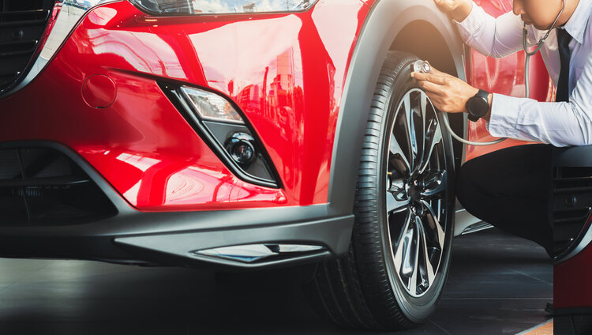

# What Happened to my Car? Understanding Gray Failures

In my role at Amazon, I spend most of my time talking to people about [resilience](https://docs.aws.amazon.com/wellarchitected/latest/reliability-pillar/resiliency-and-the-components-of-reliability.html). One of the frequent topics in these discussions is gray failures. Gray failures come up a lot because they can be highly problematic and they can also be a bit difficult to explain. An official, technical definition, would be that a gray failure is a form of differential observability, where one observer reports that the system is healthy, but another observer reports the system as unhealthy. Huh. We could expand on this definition to say that these failures are non-binary are often appear to happen randomly. Still not a lot of help, really. I'm a big believer in trying to find simple ways to explain things, and making gray failures easy to understand has continued to elude me.

Then it happened. I had a moment of clarity where gray failures revealed themselves to me in a new context, and I finally understood. What was this revelation? My car stalled. Three times. Boom! Problem solved, gray failures made clear! Let me provide a bit more details.

I'm not a car guy. I can drive them fine and admire the entertainment system and the number of cup holders, but as far as understanding how they work, its basically magic for me. My minivan has one of those features where it will sometimes turn the engine off after I've come to a complete stop, and then it will automatically restart the engine when I release the brake. Cool. So the other day, I stop the car at a traffic light, the engine stops, I eventually release the break to go, and…the engine stalls. Uh oh. That's not good. I restart the car, shift to drive and off I go, no issues. Weird.

While I'm not a car guy, I am a tech guy, and more importantly, an expert in resilience! This failure in my car worried me because I didn't know what caused the problem, if it would happen again, etc. so I bought a connector and an app that gives me the ability to observe all the car's health checks (car people tell me these are called engine codes or something. Whatever. I say they are health checks.). I pull over just down the road, pull out the app, run the diagnostics and wait for the result of the health check (engine codes, whatever). Nothing. Everything is fine.

Ok, fine. Maybe I wasn't paying attention the first time and I caused the issue. Operator error is definitely an issue with both software and driving. I get back on the road. I come to another red light and when I go to start again….stalled. I restart the car and drive off again but now it really doesn't seem like I was the cause of the error. I'm growing a bit concerned. I catch another red light and I'm a bit tense at this point. Engine turns off as normal, that's good…I guess. When the light turns green I go to start, one finger already hovering over the switch for my hazard light as I anticipate the stall. The engine starts fine and I drive off.

Well, that was a surprise, but a good surprise! I'm feeling better about life. I continue my journey and have another successful stop and restart. I'm happy and starting to forget about the incident, until it happens again. Definitely not great. Now I'm in a constant state of tension, dreading every stop, wondering if my car is about to die forever. Fortunately, I'm almost home and I make it back without any other incidents.

Back in the safety of my driveway, I pull out my phone and rerun the diagnostic app. Obviously whatever is causing the problem will have triggered a failure of the health checks by now. Wrong. Everything reports green. I run the checks again. Green. I turn the car off, wait, turn it back on, and run the checks. Green. Baffled, I leave the car, go into the house, and get a drink.

Fast forward a bit. The car runs fine then next day and the day after. No issue for a week. No issues after three weeks. Well, that's a relief a guess, but what happened? I have no idea. Then, suddenly it hits me. I've experienced a real life, in the physical world, Gray Failure!

It's obvious that _something_ went wrong with the car. It's also pretty obvious that whatever _was_ wrong seems to not be a problem anymore. I didn't change anything in, about, or even near the car, so the issue somehow resolved itself. It is clear at this point that the internal health checks I was looking at didn't detect the problem. The health checks observed the car operating correctly, but I, as the user, most certainly observed non-optimal behavior. That's **differential observability**. My experience of the car as its driver reported, "_Car very sad….maybe dying!"_ while the internals checks reported "_All good here!"_

## Epilogue

The car continues to run fine. Occasionally, when I'm feeling brave, I even attempt to reproduce the failure. I try to start suddenly while the engine is restarting or something similar. I can't reproduce the failure which makes the car owner in me very happy, but the engineer in me very sad. I wish that the car manufacturer had taken the time to ensure that I don't run into this situation where I experience differential observability. Its clear that the car isn't being properly monitored and this leads to increased difficulty in detecting and diagnosing problems. In this case maybe it was just some bad gas (I think that's a real thing) but it would be nice if there was some sort of fuel check test that could have told me that. Additionlly, the engineers need to add stall detection (which is the condition I observed), and log that event. With the deep health check captured, (the underlying cause - bad fuel? gremlins?) **along with** the user expereince (the stall) there is now enough information to connect the events and determine what is happening with the car. Even if *only* the stall event is captured because the other issue (fuel? excess wear of the engine thingy?) isn't yet sever enough to trigger an alarm, capturing the event experienced by the driver (user) can be a leading indicator that something is starting to go wrong. Sure, *I* couldn't solve the problem, but now a qualified mechanic could! 

These improvements that I wish for in my car are things we, as engineers, need to implement in our software applications. We need to make sure we implement [deep health checks](https://aws.amazon.com/blogs/networking-and-content-delivery/choosing-the-right-health-check-with-elastic-load-balancing-and-ec2-auto-scaling/) that look at the status of all the layers of our application. We also need to create [synthetic canaries](https://docs.aws.amazon.com/AmazonCloudWatch/latest/monitoring/CloudWatch_Synthetics_Canaries.html), that monitor the state of the end user experience. These canaries can help us find errors before users even report them, or at the very least they can provide confirmation that the issues your users are occasionally complaining about really did happen so that you can go and look for more clues. If we don't implement these observability techniques we may one day be stuck somewhere, puzzled, wondering, what happened to my car?
