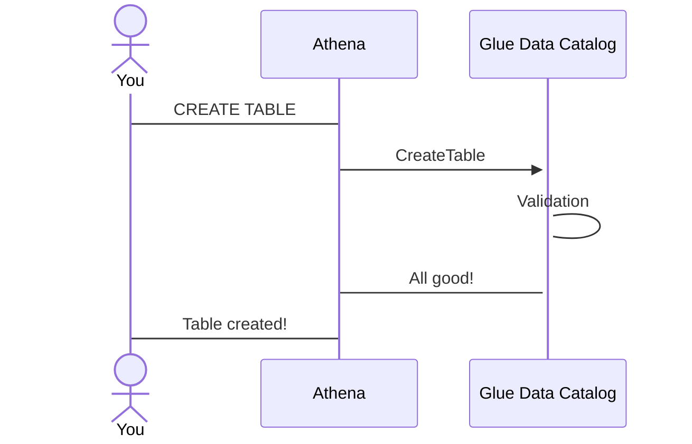
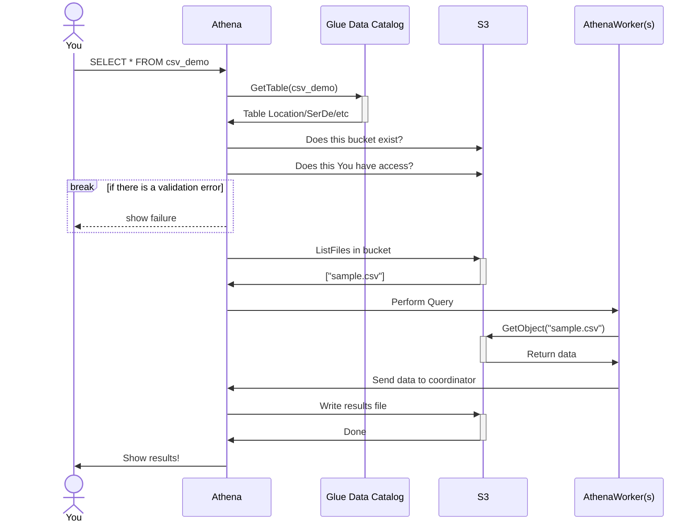
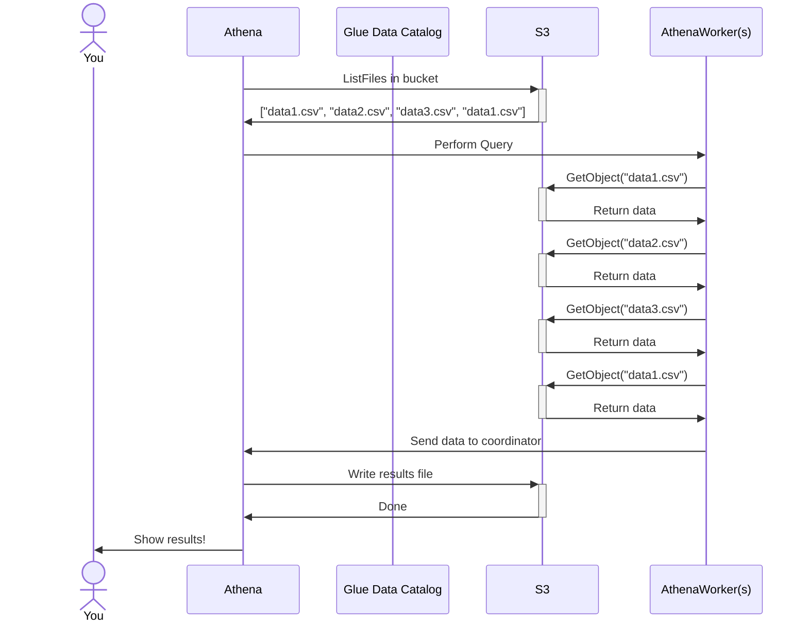
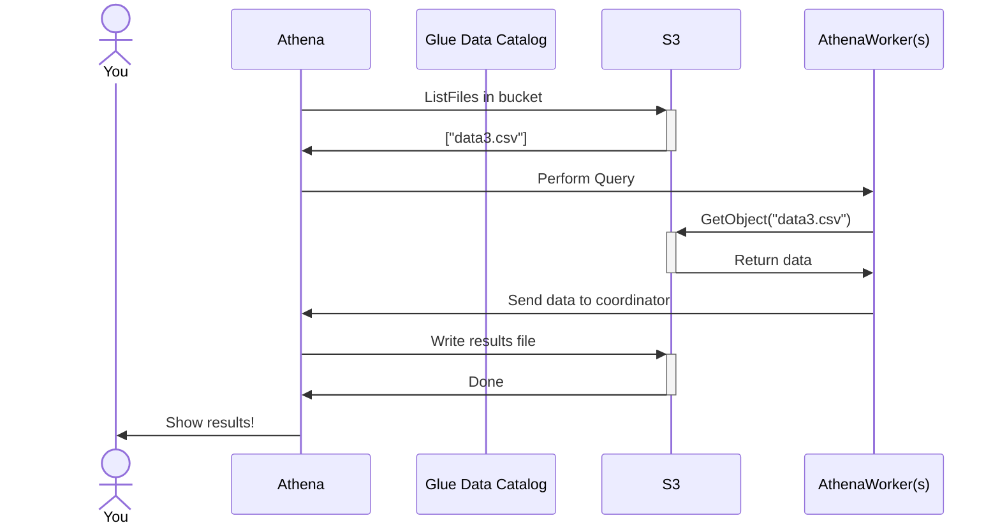
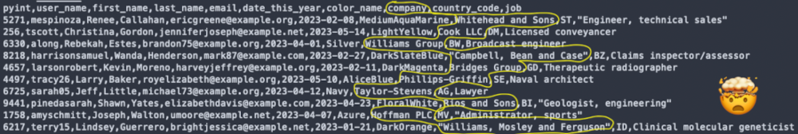
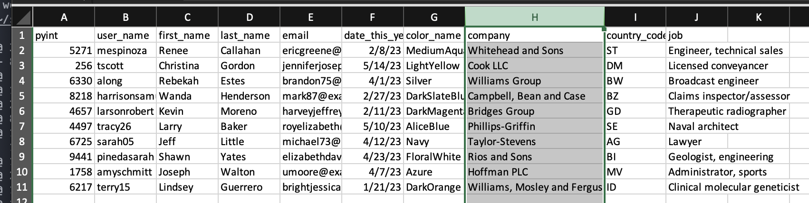

|ToC|
|---|

Hi folks, Damon here. Today I want to walk through you through what happens when you hit "SUBMIT" on the Athena console and run a query. First, a little background. I first heard about Athena when it was announced in 2016. I had just finished building a fairly typical data pipeline at the time, with data being extracted from operational databases and third-party APIs to S3, loaded into a staging data warehouse, and curated into a production data warehouse. I was floored with how easy Athena would have made several stages of my pipeline and within a year I was working as a Big Data Architect within AWS helping customers make use of EMR, Athena, and Glue. One of the most common topics of conversations was around exactly how Athena works and how to optimize queries for Athena. I've heard how people think that Athena is a Magical Mystery SQL box, but in reality it's fairly straight-forward how queries get executed. And the more you understand about it, the better you can optimize it! Let's get started.

First, let's call out the three main components you generally work with when using Athena.

1. Amazon S3 - When Athena first launched, it only supported data stored in S3. Today, you can make use of federated queries for any data source you want, but the majority of data queried by Athena resides in S3.
2. AWS Glue Data Catalog - Athena stores table definitions, including the location and type of data, in the Glue Data Catalog.
3. Athena itself - This is the execution engine that Athena uses to query your data. Originally, Athena was powered by Presto, a distributed query engine that was open sourced by Facebook. Today, Athena uses a derivative of that engine known as Trino and can also run queries using the open source Apache Spark engine. A lot changes in 7 years. 😁

**Important!** A quick note to say what I _won't_ be talking about. I won't dive into the underlying query engines too much and I also won't discuss the inner workings of how the Athena Control Plane or Data Plane works.

## Step 1 - Getting ready

Getting data ready to query in Athena requires that you upload it to S3 and register your data in the Glue Data Catalog.

### What is Glue?

Straight away this can be a little confusing. "Isn't Glue serverless data integration?", you ask? It is, but one of the components of AWS Glue is the Glue Data Catalog - a location for defining metadata about your datasets including type, location, and schema. The Glue Data Catalog can be used across multiple different services, including native AWS services like Athena and Redshift as well as Open Source tech like Spark, Trino, and Hive.

### Upload a CSV File

Now, let's get started with a everyone's favorite data type - a CSV file sitting on S3. We'll use a simple file that just has a User ID, name, and last login date. The file looks like this.

| ID  | Name   | last_login_at |
| --- | ------ | ------------- |
| 1   | Damon  | 2023-04-18    |
| 2   | dacort | 2023-04-22    |

We'll assume you already have this file located in S3. If not and you have a shell prompt and the AWS CLI handy, you can run this command to make one.

```bash
echo -e "id,name,last_login_at\n1,Damon,2023-04-18\n2,dacort,2023-04-22" \
| aws s3 cp - s3://<YOUR_BUCKET>/data/csv-example-1/data.csv
```

> **Note**: One very, very important thing to keep in mind about Athena is that it uses "folders" to organize data. This means that when you upload data to S3 that you want to use in Athena, the data in each folder has to have the same schema. In other words, for a CSV file, it has to have the same headers, columns, and types of data in it. And you can't point Athena to a single _file_. It needs to be a folder.

So, now we've got a single CSV file in S3. If you use the AWS CLI to list out your folder, you'll see it there.

```bash
aws s3 ls s3://<YOUR_BUCKET>/data/csv-example-1/
```

### Register your data

Now that the data is on S3, we need to register it with Athena. In other words, we're going to create a table in the Glue Data Catalog using the `CREATE TABLE` statement in the Athena query editor.

To do this, you [open up the Athena console](https://console.aws.amazon.com/athena/home#/query-editor) and create a query like the following:

```sql
CREATE EXTERNAL TABLE csv_demo (
    id string,
    name string,
    last_login_at date
)
ROW FORMAT DELIMITED FIELDS TERMINATED BY ','
LOCATION 's3://<YOUR_BUCKET>/data/csv-example-1/'
TBLPROPERTIES ("skip.header.line.count"="1")
```

All this says is "create a new table, with the specified columns and data types, in the CSV format and located in this S3 bucket and prefix."

When you hit the **Run** button, here's what happens.

- Athena makes a `CreateTable` call to the Glue API.

That's...really it. There's nothing specially going on behind the scenes except that Athena constructs this `CreateTable` API call for you in the format that Glue needs. If you call `GetTable` using the Glue API, you'll see the exact format of this.

```bash
aws glue get-table --database-name default --name csv_demo
```

```json
{
  "Table": {
    "Name": "csv_demo",
    "DatabaseName": "default",
    "Owner": "hadoop",
    "CreateTime": "2023-05-08T15:17:22-07:00",
    "UpdateTime": "2023-05-08T15:17:22-07:00",
    "LastAccessTime": "1969-12-31T16:00:00-08:00",
    "Retention": 0,
    "StorageDescriptor": {
      "Columns": [
        {
          "Name": "id",
          "Type": "string"
        },
        {
          "Name": "name",
          "Type": "string"
        },
        {
          "Name": "last_login_at",
          "Type": "date"
        }
      ],
      "Location": "s3://your-bucket-name/data/csv-example-1",
      "InputFormat": "org.apache.hadoop.mapred.TextInputFormat",
      "OutputFormat": "org.apache.hadoop.hive.ql.io.HiveIgnoreKeyTextOutputFormat",
      "Compressed": false,
      "NumberOfBuckets": -1,
      "SerdeInfo": {
        "SerializationLibrary": "org.apache.hadoop.hive.serde2.lazy.LazySimpleSerDe",
        "Parameters": {
          "serialization.format": "1",
          "field.delim": ","
        }
      },
      "BucketColumns": [],
      "SortColumns": [],
      "Parameters": {},
      "SkewedInfo": {
        "SkewedColumnNames": [],
        "SkewedColumnValues": [],
        "SkewedColumnValueLocationMaps": {}
      },
      "StoredAsSubDirectories": false
    },
    "PartitionKeys": [],
    "TableType": "EXTERNAL_TABLE",
    "Parameters": {
      "EXTERNAL": "TRUE",
      "skip.header.line.count": "1",
      "transient_lastDdlTime": "1683584242"
    },
    "CreatedBy": "arn:aws:sts::123456789012:assumed-role/Admin/your-aws-username",
    "IsRegisteredWithLakeFormation": false,
    "CatalogId": "123456789012",
    "VersionId": "0"
  }
}
```

😮

Let's take a quick pause to discuss an important component here - `SerDe`. What the heck is a SerDe and what is used for?!

`SerDe`s are Java classes that tell Athena how to handle the data (it's short for Serializer/Deserializer). The Glue Data Catalog lets you create a table with _ANY_ SerDe and this is another area where I see folks get stuck. While Athena [supports many popular data formats](https://docs.aws.amazon.com/athena/latest/ug/supported-serdes.html?sc_channel=el&sc_campaign=datamlwave&sc_content=what-happens-athena-query&sc_geo=mult&sc_country=mult&sc_outcome=acq) like CSV, JSON, Parquet, and ORC, it doesn't support _every_ format. In addition, there can even be different SerDes for the same data type. Athena supports `LazySimpleSerDe` and `OpenCSVSerDe` for processing CSV files. For JSON, there's also both Hive JSON SerDe and OpenX JSON SerDe. Which SerDe you use depends on your data format and what features of that data format the SerDe itself supports.

I should also note that no data is "imported" into Athena and there's no data conversion happening or anything like that. Athena is just telling the Glue Data Catalog "Hey, here's a table. It's located in this place in S3 and it uses this format. Kthx!"



## Step 2 - Querying your data

OK, now you've uploaded your data and created a table. You can now query it with Athena!

Let's hop back into [the console](https://console.aws.amazon.com/athena/home#/query-editor) and run the following query:

```sql
SELECT * FROM csv_demo
```

This is where quite a lot more activity happens. I'll break this up into 3 phases: planning, execution, and output.

### Planning

1. Athena queries the Glue Data Catalog for the `csv_demo` table.
    1. If that doesn't exist, Athena will return an error.
2. Next, Athena checks the SerDe on the table to make sure it's supported.
3. Athena makes one or more `ListObjectsV2` calls to your S3 bucket.
    1. If the user doesn't have permission to the S3 path in the table location, Athena will return an error.

Athena uses the list operation to find all the objects in order to plan your query. Sometimes...this can take a while depending on how many objects you have! _Imagine if you will a bucket with millions and millions of tiny files._ This is where "partitioning" comes in handy, and we'll talk about that below.

💁 It's also important to note that this planning stage happens on a single node, the Athena coordinator.

Now that Athena knows where the data is and the format to use, it's time to read some data!

### Execution

Athena uses the information above to plan your query and once that's done, it can begin to distribute the work of reading and analyzing the data to it's workers. As a distributed query engine, Athena scales out the work of reading the various files from S3 to a larger number of worker systems.

1. Athena splits the work into chunks and communicates the work to be performed to the various workers.
2. For each object on S3, the worker nodes call `GetObject` to retrieve the data from S3.

I'm going to pause here because there's a very important thing to realize. The way that Athena works changes wildly depending on the type of files that are being read from S3. Certain file types are splittable across multiple workers while others aren't. Other file types have built-in aggregate metrics that Athena can use while other file types need to be completely read by Athena in order to compute the metrics itself.

This is where many folks spend a significant amount of time both debugging and optimizing. If you've heard of Parquet or ORC, or comparing gzip compression to bzip2 compression, this is where it comes in handy.

For now, though, we're just dealing with a simple CSV file. 😅

3. In the case of a `SELECT *` on a single CSV file. Athena will read the entire file and parse it according it to the SerDe you're using.

### Output

Now that Athena has queried the files – potentially distributing the work of reading, processing, and aggregating data to worker nodes – it now needs to return the output to you, the user!

For `SELECT` queries, Athena will create a new CSV file in your "Query result location" S3 bucket. As the coordinator node aggregates results from the workers nodes, it writes it into this file.

> **Important Pro Tip**: If you're using `SELECT *` to generate a large result set, look into the [`UNLOAD` statement](https://docs.aws.amazon.com/athena/latest/ug/unload.html?sc_channel=el&sc_campaign=datamlwave&sc_content=what-happens-athena-query&sc_geo=mult&sc_country=mult&sc_outcome=acq).

When writing is finished, Athena can begin showing the results to you. It does this simply by reading the results file from S3 and showing it to you in the console!

It's also important to note something else here - Athena is asynchronous and stateless - what does that mean?

- You don't have to stick around in the console to wait for results to come back.
- You can look at the results from previous queries (for up to 45 days).
- Athena wants to reuse the compute resources used by your query, which is why it writes the results to S3.

Here's what the whole process looks like from start to finish.



## Advanced Queries

Now, a `SELECT *` is quite straightforward. Athena opens and reads data files from S3, aggregates it into a single node, and writes it back out to S3. Where things start to get interesting is when you change up file formats, aggregate data, or partition your data. We'll talk through all of these use-cases below and how they impact Athena queries.

### Partitioning

One of the benefits of Athena is that you can "partition" your data in S3 by using slash-delimited prefixes. This is a way to reduce the amount of data scanned by your query by only reading the relevant files.

For example, you can separate your data by year, month, and day if your query patterns usually filter data by dates. In S3, it would look like this.

```text
s3://your-bucket/data/2023/05/10/data1.csv
s3://your-bucket/data/2023/05/10/data2.csv
s3://your-bucket/data/2023/05/09/data3.csv
s3://your-bucket/data/2023/05/08/data1.csv
```

You can also use something called Hive-style partitioning. This allows Athena (and other query engines) to infer the name of the partition from the path.

```text
s3://your-bucket/data/year=2023/month=05/day=10/data1.csv
s3://your-bucket/data/year=2023/month=05/day=10/data2.csv
s3://your-bucket/data/year=2023/month=05/day=09/data3.csv
s3://your-bucket/data/year=2023/month=05/day=08/data1.csv
```

Where this can be really beneficial is if you typically filter your queries on the partitions. For example, let's see what happens before and after we add a filter using the partition fields.

```sql
SELECT * FROM sample_data WHERE some_field = 'ok'
```



Without a partition field in your `WHERE` query, Athena needs to scan all of the files listed above in order to find the right data. But if you add a filter based on the partition fields:

```sql
SELECT * FROM sample_data
WHERE year='2023' AND month='05' AND day='09' AND some_field = 'ok'
```



Athena, while querying the Glue Data Catalog to determine the data location and format, will also realize that you're using partitions in your query and ask the Glue Data Catalog where the S3 location is _just for those_ partitions.

I'll say that again because it introduces an interesting quirk in querying data with Athena. For each partition value you specify in the query (`year=2023, month=05, day=09`), Athena will fetch the S3 location of the partition from the Glue Data Catalog. This means that we can change the typical behavior of an Athena query where it only fetches data under one S3 prefix.

It also means that we can limit the number of files scanned for a particular Athena query. In the example above, we reduce the number of files scanned from 4 to 1. This decreases both query time and cost.

For a few files...not a big deal. But if you've got a billion tiny little CSV files sitting in S3...because who doesn't...it can make a **huge** difference.

### Columnar File Formats

A common approach to optimizing data on S3 is to convert row-based formats (like JSON and CSV) to binary, columnar-based formats (like Parquet and ORC). I never really understood columnar formats until I started diving in to how query engines like Athena read the data from S3. There are two huge benefits.

1. When selecting specific columns from your data

Imagine you have a CSV file with 10 columns and you want to *only* read the 8th column. As a human, you open up the file. If you open up the CSV file in a text editor and want to look at that 8th column...you kind of have to scan through each row and pick out the 8th column on a line-by-line basis. Hard work for both your eyes and your brain.



But now imagine you open up that same CSV file in Excel. And you click on the header for the 8th column. Instantly, both your brain and your eyes can relax because Excel highlights exactly the data you want.



Parquet and ORC function similarly. When you specify columns in your `SELECT` statement, (`SELECT id,name FROM table`), Athena _only_ needs to read the `id` and `name` columns from your Parquet data. If it was CSV, Athena would need to read every single row of the CSV file, pick out the `id` and `name` columns, and ignore the rest.

For some cases, this doesn't result in too much of a difference. But imagine if your data had 150 columns...or even thousands...you'd be reading **way** more data than you need. And it would take a lot longer.

Also imagine if you were simply trying to pick the `MAX` value of an integer column...instead of just reading that single column, you would have to read the rest of the CSV file. But it gets even better than that!

2. When running aggregates

For this I'll use a very simple example.

Imagine you want to `COUNT(*)` from a 50GB CSV file. Regardless of which query engine you use – Athena, Spark, Ray, an actual abacus – you need to loop through every. Single. Row of that CSV file. Some query engines can distribute that work, but you're still reading 50GB of data to get one number. And if that file is gzipped, like many CSVs are, only 1 worker thread can decompress the file!

For Parquet, you read a few bytes of the header and you're done. Seriously. Parquet is a binary file format and right at the top of the file is a little metadata that says "this file has X number of rows of data in it". This is why file formats like Parquet and ORC are so great for analytics - the hard work of counting things is already done by whomever generated the file! Not only that, for some data types Parquet even stores what the minimum or maximum values are for the whole column!

For a quick comparison, I ran a `COUNT(*)` over 12GB of CSV files with Athena. It took 5.163 seconds and scanned (aka, listed, fetched, opened, parsed) all 12GB. I converted the dataset to Parquet and ran the same `COUNT(*)`. Run time? 840ms. Data scanned? 0. (_This is because we were able to use the file metadata to get the answer so Athena had to scan no data!!_)

## Wrap It Up

I hope this article has been useful for you to understand what happens behind the scenes when you run an Athena query.

If you'd like to learn more about how to improve your query performance, be sure to check out the [performance tuning tips for Athena](https://aws.amazon.com/blogs/big-data/top-10-performance-tuning-tips-for-amazon-athena/?sc_channel=el&sc_campaign=datamlwave&sc_content=what-happens-athena-query&sc_geo=mult&sc_country=mult&sc_outcome=acq).
