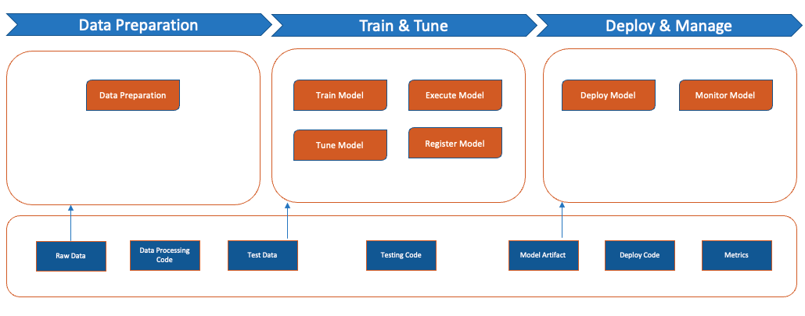

Imagine a music production company wants to predict the success of a new album before it's released. The company hires a data scientist to build a predictive model to forecast the revenue of the album based on its characteristics, and it offers the data scientist access to data about past albums - including genre, artists, producers, budget, release date, and revenue.

The data scientist starts by exploring the data and identifying which features are most important for predicting revenue. They use statistical techniques to understand the relationships between the features and the revenue, and they build a machine learning model, trained on historical data and using various algorithms, to predict revenue of future albums. Problem solved, right? Well, sort of.

Building a machine learning model is only the beginning. Continuous monitoring is needed to detect when the model's performance has degraded or is no longer accurate. A standardized and reproducible approach to deploying and managing machine learning models is needed to deploy the models consistently across different environments. A clear audit trail of changes made to the model and its environment is needed to comply with regulations or to investigate any issues that arise.

In short, building, maintaining, and effectively deploying machine learning models in a variety of environments is a complex process. Problems with that process may lead to problems with the outcomes: inaccurate predictions, lost revenue, legal or financial consequences, and a lack of trust in the model. That's where MLOps comes in.

In this post, I'm going to explain what MLOps is and how it fits into the larger framework of DevOps. Then I'm going to give a quick demonstration of how you can implement some of the principles of MLOps practically, and how to use AWS SageMaker to try out MLOps processes quickly. Let's dive in!

## Welcome to the World of MLOps

MLOps is short for Machine Learning Operations, a practice that combines machine learning with [Devops principles](https://www.buildon.aws/concepts/what-is-devops) to streamline and manage the lifecycle of machine learning models. Essentially MLOps helps data scientists and engineers to deploy, monitor, and manage machine learning models in a smooth and efficient way - emphasizing collaboration, automation, and continuous improvement.

Okay, but what does that practically look like?

Without a basic MLOps practice in place, the challenges for data scientists and engineers start as early as data collection, which can lead to data quality issues and introduce data structure errors during the manual preprocessing step. Model selection and hyper parameter tuning relies on individual preferences, resulting in suboptimal configurations. Due to lack of documentation, the reproducibility of training suffers. Evaluation metrics and techniques vary, too, hindering comparison and hampering maintenance cycles for the model. Manual deployment also makes scaling and maintenance more challenging, with improper plans to replace models causing disruptions to production.

 

A basic MLOps practice, by contrast, enures a structured and consistent process to collect, clean, transform, and format data, and it delivers meaningful data features for the ML model to process in the next phase. Within this MLOps practice, engineers and data scientist can access and compare collective insights about model versioning, experimentation tracking, and model performance monitoring data - and select the right algorithm and framework for the ML model. When it's time to deploy the model in different environments, this practice aides by prepackaging infrastructure and environment variables, avoiding manual errors. Tools are made available to track the deployed model performance such like, data drift, model accuracy, latency, and resource utilization and alerts can be enabled to monitor and report potential issues. When a model becomes outdated or less effective, planning for its retirement and replacement with a newer, improved model becomes a consistent process reducing risks. Throughout the lifecycle of the ML model, with a collaboration practice in place, effective communications, knowledge sharing, and alignment of goals between data scientists, engineers, and stakeholders is ensured.

A basic MLOps practice like this essentially offers the Data Scientists a superhero sidekick to automate repetitive tasks and ensure their model is always running smoothly and producing accurate results. It helps save time and money by reducing the costs associated with developing and deploying machine learning models quickly and efficiently.

## How Does MLOps Differ from DevOps?

Think about DevOps like an event planner, responsible for coordinating all the different elements of a party, from the food and decorations to the music and guest list. They make sure everything runs smoothly and everyone has a good time.

One important part of a good party is the cake, and if you're baking the cake, MLOps is like your trusty kitchen assistant, responsible for helping you get the perfect bake every time. It makes sure you have all the right ingredients, that your oven is preheated to the right temperature, and that you don't overmix the batter. You may be the baker, but the assistant ensures all the small-but-necessary tasks during the baking process are accomplished.

In other words, DevOps is a set of practices that help organizations streamline the entire software development process, while MLOps is a specialized practice that focuses specifically on managing the lifecycle of one important element of that process - building and deploying machine learning models. 

MLOps tools are specifically designed to handle the unique challenges associated with managing machine learning models. This includes features such as model versioning, data versioning, model registry, and model serving.

MLOps tools also offer specialized support for popular machine learning frameworks and libraries, such as TensorFlow, PyTorch, and Scikit-learn. This can make it easier for data scientists to deploy their models in production without having to worry about the underlying infrastructure and deployment mechanisms. What's more, these tools can make it easier to manage the entire process in a single platform, rather than relying on multiple tools and systems for different parts of the workflow.

So while both DevOps and MLOps share some conceptual similarities, such as automation and collaboration, they differ in their scope and the tools and techniques they use. 

## How Do You Get Started?

Okay, we've covered what MLOps is and how it fits into the larger DevOps logic. But now it's time to unlock the true potential of your machine learning projects by embracing the power of MLOps to streamline your workflows, automate deployments, and enhance collaboration between software developers and operations teams.

Before we dive into a short demonstration, here are some important things to do:

**Understand the Basics of Machine Learning**: To get started with MLOps, you need to have a good understanding of the basics of machine learning. This includes concepts like supervised and unsupervised learning, feature engineering, model selection, and evaluation. You can leverage [Machine Learning Essentials for Business and Technical Decision Makers](https://explore.skillbuilder.aws/learn/course/external/view/elearning/1404/machine-learning-essentials-for-business-and-technical-decision-makers?laml=tile&tile=dt) a free online course sponsored by AWS Training and certification.

**Learn About the Basic MLOps Tools and Frameworks**: There are many MLOps tools and frameworks available, and it's important to understand the pros and cons of each. Some popular options include [AWS MLOps Workload Orchestrator](https://aws.amazon.com/solutions/implementations/mlops-workload-orchestrator/), [Kubeflow](https://www.kubeflow.org/docs/external-add-ons/serving/), [MLflow](https://mlflow.org/), and [TensorFlow](https://www.tensorflow.org/tfx). You can start by reading the documentation for these solutions and trying out some sample projects like this [MNIST](https://static.us-east-1.prod.workshops.aws/public/80e98500-8b21-4a12-b8a4-3473e548f33f/static/code/ml-ops.zip) code that uses ConvNets based on [PyTorch](https://github.com/pytorch/examples) examples for image classification.

**Practice with Other Real-World Datasets**: Once you have a basic understanding of machine learning and MLOps tools, you can start practicing with real-world datasets. Kaggle is a great resource for finding datasets like this [key indicators for Heart disease](https://www.kaggle.com/datasets/ambujdevsingh/key-indicators-of-heart-disease) which has 400K adults health status that can be used to detect key indicators for heart diseases. 

For this challenge an example Machine Learning model code to begin with may look like this:

```bash
import pandas as pd
from sklearn.model_selection import train_test_split
from sklearn.linear_model import LogisticRegression
from sklearn.metrics import classification_report

# Load the data
df = pd.read_csv('heart_disease.csv')

# Select relevant features and target variable
features = ['age', 'gender', 'weight', 'height', 'smoke', 'alcohol', 'phys_active', 'cholesterol', 'sys_bp', 'dia_bp', 'diabetes']
target = 'heart_disease'
df = df[features + [target]]

# Split the data into training and testing sets
X_train, X_test, y_train, y_test = train_test_split(df[features], df[target], test_size=0.2, random_state=42)

# Fit a logistic regression model
model = LogisticRegression()
model.fit(X_train, y_train)

# Make predictions on the test set
y_pred = model.predict(X_test)

# Print classification report
print(classification_report(y_test, y_pred))
```

In this example, you first load the heart disease dataset into a pandas dataframe and select the relevant features and target variable. You then split the data into training and testing sets, and fit a logistic regression model to the training set. Finally, you use the trained model to make predictions on the testing set and print a classification report to evaluate its performance.

You may want to try experimenting with feature engineering techniques to see if you can improve the accuracy. One next step to consider handling class imbalance, which is a common issue in machine learning models when one class is significantly more represented than the other. In this case, the "heart_disease" class is binary, with "Yes" and "No" values. We can check the class distribution using the value_counts() method:

```bash
print(df[target].value_counts())
```

If the difference between the two classes is large, it may be necessary to use techniques such as oversampling, undersampling, or changing the class weights to balance the classes. This can improve the model's accuracy, recall, and precision.

In case if there is a class imbalance presence, one way to balance the classes is to use the class_weight parameter in the LogisticRegression() function. The parameter should be set to "balanced", which will automatically adjust the weights based on the class distribution:

```bash
model = LogisticRegression(class_weight='balanced')
```

As you improvise with this machine learning model code progression, you might have realized the operational challenges due to the lack of a machine learning practice. Note down those challenges in each steps and that will be the user requirements to kick start your MLOps journey.

Similar to this model code progression, when you're ready to start implementing MLOps in your own projects, it's important to start small and iterate. Don't try to implement all the features at once. Instead, focus on the most critical parts of the workflow and build up from there. Trying to do everything at once leads to several issues such as complex code, long development cycles, and increased risk of errors

Starting small and iterating helps in breaking down the complex process into smaller, manageable taks that can be accomplished in a shorter amount of time. This approach also allows you to identify and address any issues or errors at an earlier stage and tune according to business needs, rather than waiting until the end of the deployment cycle. You can save time by making small, incremental improvements to the MLOps system, leading to more efficient and effective development cycles.

## Is There a Fast Track Path?

You can speed up the journey by using a cloud native service that provides seamless integration to accommodate the MLOps features such as Amazon Sagemaker.

 

On the data preparation part of the workflow, Sagemaker offers capabilities that can be plugged into any machine learning workflow. Sagemaker data wrangler can be used to build your data transformation pipeline using a graphical interface, or else you can use SageMaker processing to build your data processing jobs. In either case, the tasks performed by these jobs can be easily plugged into your machine learning pipeline. The Sagemaker feature store can be used to store curated features that can then be used as part of the pipeline for your training activities. Both the inputs and outputs generated at this stage needs to be versioned, which include your data processing code and your prepared data sets for training and validating your model. 

To aid the model-building and model-testing parts of the workflow, Sagemaker experiments helps to run experiments to train, evaluate, and tune your model until it’s performing as expected while tracking the performance for each of these experiments. Due to the continous tracking it is easier to revert back to the experiments that resulted in the best performing model, and you know the inputs that went into actually creating that model version. You can further register this model on the Sagemaker model registry to store metadata  about the best-performing models. All of the output from this stage of the workflow, such as training code and model artifacts, needs to be versioned for traceability. 

Once you find the version of the model that performs based on the minimum threshold that you have identified as a KPI, you can then use Sagemaker deployments to take that model artifact, package it, and deploy it to one or more target environments. In this deployment step, you're packaging your model, and then choosing the type of deployment option
that meets your use case - whether that's to host services, use a persistent endpoint, or use batch transform or asyncronous inference. You can also use Sagemaker model monitor to monitor the ongoing performance of your model over time, so that you can be alerted when the system notices concept drift or data drift. 

SageMaker Pipeline comes in to tie all of these different steps together to automate these steps, as well as incorporate all these inputs, outputs, and artifacts as part of a pipeline that has end-to-end traceability. Finally sagemaker projects provide pre-configured MLOps templates, as well as the capability to bring your own templates. Each of these templates can be instantiated multiple times to automate the process of setting up and configuring your machine learning pipelines, but also incorporate CI/CD practices, such as automated triggers and source and version control. 

All of these features of sagemaker can be used together, or you can pick and choose features of sagemaker that makes sense for your requirements and your use case when you're building out your machine learning pipelines.

## Conclusion

By understanding MLOps tools and frameworks, reading documentation, and exploring sample projects, you can gain hands-on experience in implementing MLOps workflows. Additionally, joining communities and staying updated with the latest trends will enhance your knowledge in this rapidly evolving field.

For actionable next steps, I recommend the following resources to further your MLOps journey:

[MLOps Workshop](https://catalog.us-east-1.prod.workshops.aws/workshops/50716cb8-6a42-427f-9eeb-0465dea6e95b/en-US) - Dive into this workshop to gain a comprehensive understanding of MLOps principles, practices, and tools.

[Develop ML Project with Amazon SageMaker](https://catalog.us-east-1.prod.workshops.aws/workshops/9a6bcca9-93d6-4e09-ada2-64b692267342/en-US) - Explore this workshop to learn how to develop end-to-end machine learning projects using Amazon SageMaker, a powerful MLOps platform.

[Amazon Sagemaker Workshop](https://sagemaker-workshop.com/) - Visit this website to access a workshop that provides hands-on exercises, tutorials, and resources for leveraging Amazon SageMaker in your MLOps workflows.

By engaging with these resources, you can gain practical knowledge, develop essential skills, and take significant strides in your MLOps journey. Embrace the opportunities to learn, practice, and collaborate with the MLOps community as you continue to enhance your expertise in this exciting field.
