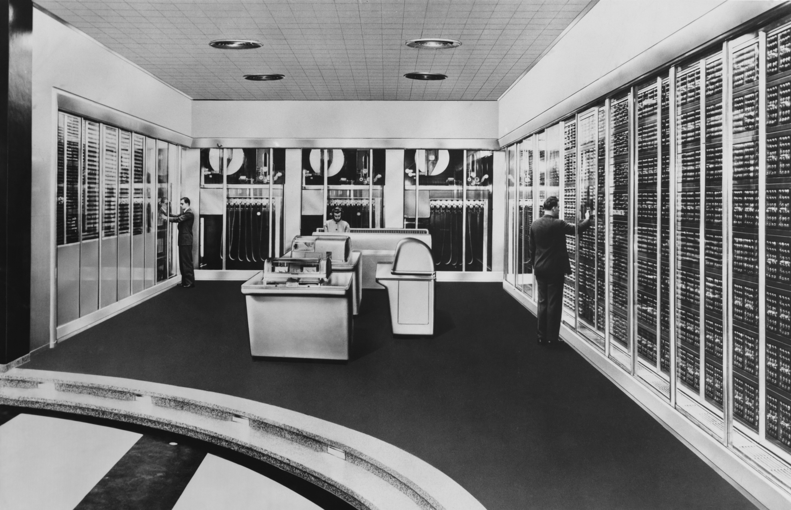

In the movie Creed, aging boxer Rocky Balboa mentors a young upstart named Donnie. At one point, [Rocky asks Donnie](https://www.youtube.com/watch?v=PPlgvSL00fA) to keep an important document, and Donnie takes a photo of it on his phone. “It’s up in the cloud,” he says. Rocky looks up at the sky. “What cloud?”  

Even my parents knew enough about the cloud in 2015 to laugh at that joke — but most average people aren’t too far off from Rocky’s confusion. Even if we know what the cloud _isn’t_ (a literal cloud), a lot of us would be hard-pressed to explain in simple terms what the cloud actually _is_. It turns out, that explanation is a little tougher than it seems.  

## A brief history of computing

To understand the cloud, you’ve got to understand the conditions that created it. The second half of the 20th century saw the rapid, parallel rise of personal computers and of networking, culminating in the internet at the end of the eighties and beginning of the nineties.  
  
Networking initially meant connecting various terminals or dummy nodes to a shared computer (usually a mainframe). Then, when computers got smaller and more people had them, it meant connecting computers to each other over larger distances, using shared protocols for how the information exchange would happen. But again, this was mostly for communication purposes — now on a steadily growing scale.  
  
The internet fundamentally changed things. We weren’t only sending messages back and forth anymore; we were visiting digital locations called websites. These websites needed a place to store their text and images, and eventually they started doing more than displaying stored information; they began to facilitate sales, coordinate deliveries, and much more. All the storage and computing for these countless websites had to come from somewhere, and that somewhere was a server.  

  
If you don't know already, a server is basically a high-powered computer with no dedicated monitor. Think of it as raw computing and storage to be called upon by people anywhere in the world. In fact, I could put a server under my desk right now to host a website (complete with text, images, video, and more) for you to visit.  
  
All these servers, owned by countless people and businesses, were the beginning of the cloud.  
  
## The rise of cloud services  
  
We are nearly a quarter of the way into the 21st century, and the way we use servers has dramatically changed. Why? Because of cloud service providers like Amazon Web Services, Google Cloud Platform, and Microsoft Azure.  
  
Remember how websites started doing more complex stuff than storing images and text back in the ‘90s? Well, businesses are doing even more now: collecting and storing vast amounts of customer data, running call centers, developing complex artificial intelligences, and so on. And that takes a ton of storage and compute power. In the past, companies would use their own servers to power all of this, but that approach presented two problems. First off, buying and maintaining your own servers is a painful investment early in the life of a business. Secondly, so-called “on-premise” servers create infrastuctural rigidity.  
  
Here’s what I mean: imagine you’re a store that gets fifty times more customers around Black Friday and the holiday season than the rest of the year. With on-premise servers, you have two options: you can buy enough servers to support your needs most of the year, and have everything break down on Black Friday (in which case you’d sacrifice tons of profit); or you can buy the servers to support your needs on Black Friday, then let all that extra capacity go to waste for the rest of the year.  
  
Cloud services offer a third way: they allow businesses to provision parts of servers that live in massive warehouses called data centers on an as-needed basis, granting companies more flexibility — or elasticity — in responding to their ever-changing computing and storage needs.  
  
This “cloud” of servers isn’t only for big companies. Individual students and researchers can pay a few bucks to access what is essentially a fleet of computers for a few days to run models that would normally crash their own machines. In short, the cloud makes expensive resources available temporarily and at a much lower price — democratizing the computing and storage that once upon a time was only accessible to large research facilities and corporations.  

## So how would I define the cloud for Rocky?
  
If I were talking to Rocky, I could tell him about personal computers and data centers winking back and forth at one another a million times per second along underground or underwater fiberoptic cables. I could even talk about the services that allow businesses and individuals to leverage those computing resources over great distances and at minimal cost.  

But defining the cloud simply by its physical apparatus or implementation is a little like defining first love by a pounding heart and sweaty hands: it’s no less than those things, but it’s certainly far more.  

The cloud is the sum of our data and computing power, humanity’s most impressive technological advances gathered and made accessible via the internet to most anyone. It is the printing press, the telephone, the satellite broadcast, all rolled into one and exploded into something new, yet familiar — a glove for a hand we never knew we had until now.  

And that means the cloud is irrevocably changing the world - and not just _the_ world, but _your_ world. It evolved the internet from a network of distinct nodes chattering back and forth into one, shared, unimaginably powerful computer (which is really just countless, coordinated computers). Open your browser on a laptop built fifteen years ago or yesterday, and you can watch TV, play games, ask an AI to write an article for you, publish that article to millions of readers, explore humanity’s knowledge preserved for millennia, buy nearly anything, assuming you have the money — and if you don’t, apply for the credit to buy it anyway. We’ve evolved, too, collectively and individually, thanks to the cloud. We are globalized, more knowledgeable and connected than ever before.  

**In short, the cloud is the foundation of much of the computerized technology you use everyday, and it is the technology upon which the future will be built.**  

https://www.youtube.com/watch?v=zHur4SaTZ6M

If you want to [learn more about the cloud](https://youtu.be/txkSFiG7ogg) — how it’s changed over time, how it’s shaped various industries, and where it’s going in the future — check out [my explainer video on it](https://youtu.be/zHur4SaTZ6M) and [my follow-up conversation with Brian Ketelsen](https://youtu.be/nGa4pHmjlfY), a principal developer advocate at AWS.
