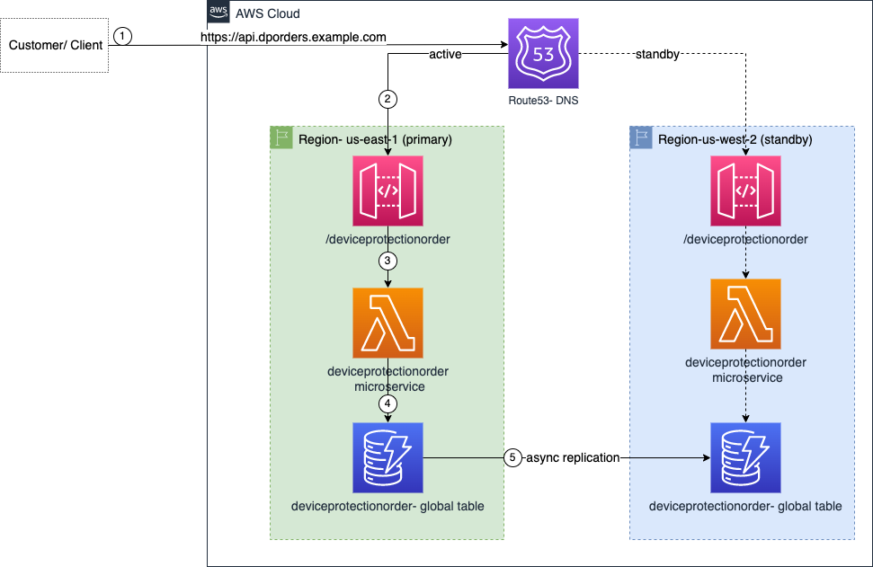

# When Should I failover? How do I know failover happened?

As a professional working in the software space, you've probably been on one or more "war rooms", where it's all hands on deck to get the systems back up and running. The first question that gets asked in those meetings is, “what’s the business impact?”. That’s the part many of us struggle with the most. I can tell you that the application is down and not taking orders but don’t ask me beyond that. After the application has failed over, the question becomes, “are we good to declare if business is back to normal?”. Many times, the answers come with a hesitation as no one knows clearly whether business has been restored to steady state.

In this blog, I will walk you through a serverless application and through that application I will show you a way to build observability to answer those questions confidently.
 

## Application overview:
Let me walk you through 'DeviceProtectionOrders' microservice. This is the service which processes the requests when your customers add a protection plan for their device(s), either directly through your website or through your clients. I have architected this service using severless technologies- [API Gateway (fully managed, scalable API management service)](https://aws.amazon.com/api-gateway/), [Lambda Functions (serverless compute)](https://aws.amazon.com/lambda/) and [DynamoDB (fast, flexible NoSQL database)](https://aws.amazon.com/dynamodb/) where AWS does the undifferentiated heavy lifting of infrastructure management and data replication. All these services are Regional in scope meaning, you don’t have to worry about which [AZ(s)](https://aws.amazon.com/about-aws/global-infrastructure/regions_az/) you should deploy it to. AWS deploys them to multiple AZs, taking that complexity away from you.

Since this is a critical application, I have deployed it two [AWS Regions](https://aws.amazon.com/about-aws/global-infrastructure/regions_az/): us-east-1 (primary) and us-west2 (standby) following the [warm standby disaster recovery (DR) strategy](https://docs.aws.amazon.com/whitepapers/latest/disaster-recovery-workloads-on-aws/disaster-recovery-options-in-the-cloud.html). Under normal circumstances, all requests will go to the primary Region and in case of an event that impacts ability to run the application in the primary Region, the application would fail over and requests would go to the standby Region. Shown below is the multi-region architecture for this service:

When your customer submits a device protection order, that request goes to [Route53 ](https://aws.amazon.com/route53/) (#1 in the diagram) which resolves the DNS to the API Gateway endpoint and request then goes to the API Gateway (#2). API Gateway, in turn, invokes the Lambda function (#3) to process the request and save the details to DynamoDB table (#4). Since 'deviceprotectionorders' table is a [global table](https://aws.amazon.com/dynamodb/global-tables/), DynamoDB automatically replicates it to the standby Region (#5).

## Adding layers of observability

Going back to the opening remark on identifying the business impact, you need to design for instrumentation (like which Region the request is being processed in, what’s the order value, etc.) and for health check that validates all layers in the application. In the architecture diagram below, I show you an approach for implementing instrumentation as well as  health check using CloudWatch custom metrics and metric filters with CloudWatch logs.

### Metrics for each component:

You can use metrics provided out of the box for API Gateway, Lambda, and DynamoDB to see how each of these individual services are doing. For example, [“PutItem” latency](https://docs.aws.amazon.com/amazondynamodb/latest/developerguide/metrics-dimensions.html#SuccessfulRequestLatency) can show how long DynamoDB writes are taking. Based your normal operations, you can establish a baseline. Anything beyond that threshold could be a symptom of an issue with DynamoDB. Similarly, [“5XX Error”, “Latency”, and other metrics](https://docs.aws.amazon.com/apigateway/latest/developerguide/api-gateway-metrics-and-dimensions.html) from API Gateway can tell you about API Gateway service degradation. Likewise, you can observe a pattern for Lambda metrics ["Errors", "Duration", "Throttles", "ConcurrentExecutions", "Invocations"](https://docs.aws.amazon.com/lambda/latest/dg/monitoring-metrics.html) and any deviation from that pattern would be a signal of application or Lambda service impairment. Having this level of detail in one place will help you decide if you need a war room bridge and if you need to fail over.

As shown below, I have created a [CloudWatch Dashboard](https://docs.aws.amazon.com/AmazonCloudWatch/latest/monitoring/CloudWatch_Dashboards.html)- “DeviceProtectionOrders-GlobalDashboard’. I am pulling metrics for all of the above AWS services from both primary Region and standby Region so that I can see state of my system holistically in one place.

In this dashboard, I have organized metrics from both the Regions in two colums: left side is showing various metrics from the primary Region and the right side shows corresponding metrics from the standby Region. Under steady state operations, 
you can observe latency for your orders from widget- "APIGateway-PrimaryRegion" and you can see that normally the latency is between 125ms and 325ms (see in pictur below) over a period of time (5 days shown in the dashboard). If you notice that the latency is greater than this range for a sustained period of time, it may be an indication of an issue either with your application or AWS services. Similarly, you can see that the normally Lambda Invocations is at 120 per hour as shown in 'LambdaFunctionMetrics-PrimaryRegion' widget above. If you see deviations from this number or see more than normal 'Errors' or 'Throttles', that could be an indication of application or AWS service degradation.

I see data in 'APIGateway-StandbyRegion' and 'DatabaseReadWriteLatency-StandbyRegion (GetItem)' because of the health check hitting the API Gateway triggering a health check Lambda function which reads from the DynamoDB table (explained in 'Implementing deep health check' section below). Additionally, I would see non-zero graph for 'DatabaseReadWriteLatency-StandbyRegion (PutItem)' showing that orders processed data in the primary Region being replicated to standby Region at DynamoDB table level. 
I don't see any data for 'LambdaFunctionMterics-StandbyRegion' as no request are going to the standby region.

This view gives you a good understanding of your application's steady state from systems perspective.

### Implementing deep health check

While these out of the box service metrics are good indicators of health of individual service, you might not have view into what we call [‘gray failures’](https://docs.aws.amazon.com/whitepapers/latest/advanced-multi-az-resilience-patterns/advanced-multi-az-resilience-patterns.html). In simple terms, a gray failure is one where individual services may show healthy but your workload as a whole is impaired. Adding health checks can help you expose such issues. You can build a health check by hitting your API endpoint and API returning a mock respose without checking the downstream application components. This kind of health check is referred to as shallow health check ([shallow vs deep health check](https://aws.amazon.com/builders-library/implementing-health-checks/)). In contrast, a deep health check goes through all layers of your application.

In this example, I am implementing a deep health check using all application comonents (API Gateway, Lambda, DynamoDB) and [CloudWatch Syntehtics Canary](https://docs.aws.amazon.com/AmazonCloudWatch/latest/monitoring/CloudWatch_Synthetics_Canaries.html). I have added another RESTFul resource 'health' to the API Gateway in both the Regions. The Syntetics Canary in each Region invokes ‘/health’ API endpoint in respective Region (shown with circle 'A' in the diagram above) which in turn triggers a Lambda function, called ‘HealthCheck’ ('B' in the above picture). This function queries a dummy record from the DynamoDB table ('C' in the diagram above). If successful, it pushes a custom metrics to CloudWatch shown as 'D' in the picture above. If Synthetic canary is successful that means all layers of the application are working as expected. 
Note that the Canary hits separate endpoint ('/health') instead of your business endpoint ('/deviceprotectionorder'). The reason behind it is that it won’t skew your business metrics like request count, order rate, etc.

So far, we have service specific metrics and a deep health check which sends custom health metrics every 2 minutes. 

For [graphing](https://docs.aws.amazon.com/AmazonCloudWatch/latest/monitoring/graph_metrics.html) deep health check, I have chosen [sample count](https://docs.aws.amazon.com/AmazonCloudWatch/latest/monitoring/Statistics-definitions.html) every minute to depict the application health as shown in the graph below. 

A flat line means application is healthy in both primary and standby Regions. You would see gaps in this line for intermittent health check failures and would see this line not moving if there were failures for sustained period of time.

### Building business level health checks

So far, we have built observability from systems point of view. But the question still remains- How do you quantify the impact of service impairment? For that, you can instrument your microservice code in Lambda to generate business level signals. For example, every time your request is processed, you can push a custom metric, ‘OrderValue’, which is the amount of the order from the request. Your customer can choose a device protection plan from single device plan for $29.99 or multiple device plan for $49.99 or family device plan for $69.99. If you get 2 such orders every minute, you can expect the average order value to be between $29.99 and $69.99 in 5 minute interval. 
Based on this reasoning, I have added code for instrumenting the dollar value of each order processed and pushed it as a custom metric- ‘AvgOrderValue-PrimaryRegion’ shown as #6 in the "Figure2. Application architecture with observability components". You can add this custom metric to the dashboard as shown below:

You can also instrument the Lambda function to emit another custom metric, 'OrderProcessedIn', which is the Region where the requests is processed in. In normal state all orders will be processed in the primary Region as shown in the first graph- ‘OrderProcessedIn-PrimaryRegion’. The corresponding graph from the standby Region on the right side-‘OrderProcessedIn-StandbyRegion’ shows no data.
Silimarly, ‘AvgOrderValue-PrimaryRegion’ graph shows that dollar value of orders processed in the primary Region. 
You can also use [CloudWatch anomaly detection](https://docs.aws.amazon.com/AmazonCloudWatch/latest/monitoring/CloudWatch_Anomaly_Detection.html) for OrderProcessedIn-PrimaryRegion which can help you determine normal bases and surface anomalies as shown in the picture above (gray shaded area shows the anomaly band for average order value metric). With these custom metrics and anomaly detection, when you join the war room, you can easily tell which Region your  customer requests are being processed in and also quantify the impact if your service is impaired.

## Composite view of the system as a whole from both Regions

From operations point of view, it would be important to be able to see system level metrics, deep health checks as well as business metrics in single dashboard. I have created a CloudWatch Dashboard with all metrics (system & business) and health checks. I am pulling all these metrics from both primary Region and standby Region to provide that single view as shown below:

Additionally, you can create alarms based on these metrics using either a static threshold or use anomaly bands powered by AI. I created two alarms: first one is 'DeepHealthCheckFailure' alarm based on RegionalDeepHealthCheck metric for which I used static value (count less than 2 in 5 mins for 2 consecutive times) and second one is 'LowOrderValueAlarm' based on 'AvgOrderValue' business metric for which I used anomaly detection- i.e. order value lower that average order value band. 

Further, I created a composite alarm using  'DeepHealthCheckFailure' and 'LowOrderValueAlarm' alarms. This alarm depicts the overall health of the application based on deep health check as well as business metrics.
As you would expect, 'DP-orders-overall-health-alarm-east1' alarm is green in steady state as shown in the dashboard above.

## Detecting Region-level service impairment & failing over

Based on your use case, you can have the system fail over to standby automatically or you can decide that in the war-room bridge and initiate the failover manually using Route 53 Application Recovery Controller ARC or 'standby takes over primary' as discussed in [Creating Disaster Recovery Mechanisms Using Amazon Route 53](https://aws.amazon.com/blogs/networking-and-content-delivery/creating-disaster-recovery-mechanisms-using-amazon-route-53/). 
If you decide to trigger failover manually, having layers of observability, including business level metrics, you will not only be able to tell what the business impact is but also be able to make that decision easier.

In this example, I have implemented automatic failover using [Route 53 failover policy](https://docs.aws.amazon.com/Route53/latest/DeveloperGuide/dns-failover-types.html#dns-failover-types-active-passive) when 'DeepHealthCheckFailure' alarm goes off.

To simulate a Region-level service impairment, I stopped the Sythentic Canary which was generating the custom health check metric. As soon as health checks are missed 2 consecutive times, the alarm goes off and Route53 starts sending traffic to the standby Region as captured in the picture below:

## Verifying system normal state after failing over:

For the final question- “are we good to declare if business is back to normal?”, apart from the system metrics, you can look at the business metrics from the standby Region which is now serving all of your customer requests. When you observe that the business metrics, in this case, average order amount goes back to normal range, you can infer that the system has been restored to normal state and you can close the war room bridge:

## Conclusion:

It is important to detect service impairments and be able to translate them into business terms so that business stakeholders can understand the impact. Through this blog, I showed you a way to build that level of observability to tell clear business impact and to use this information in making failover decision.
 
Happy building!
