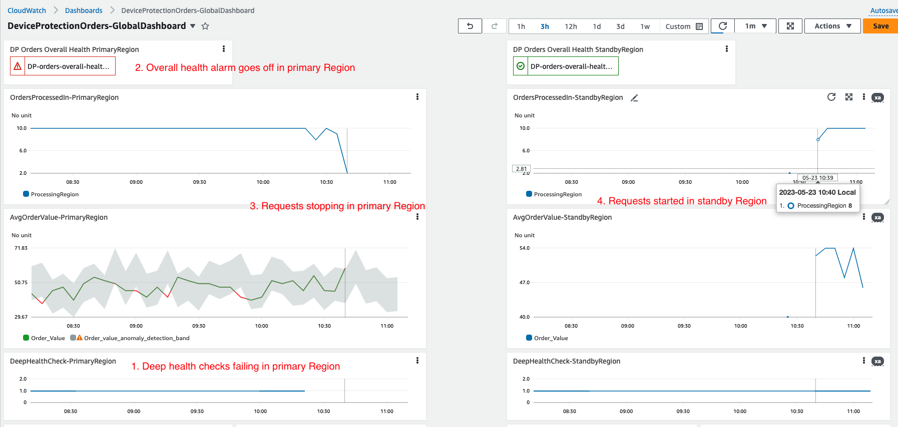

# When Should I failover? How do I know failover happened?

As a professional working in the software space, you've probably been on one or more "war rooms", where it's all hands on deck to get the systems back up and running. The first question that gets asked in those meetings is, “what’s the business impact?”. That’s the part many of us struggle with the most. I can tell you that the application is down and not taking orders but don’t ask me beyond that. After the application has failed over, the question becomes, “are we good to declare if business is back to normal?”. Many times, the answers come with a hesitation as no one knows clearly whether business has been restored to steady state.

In this blog, I will walk you through a server-less application and through that application I will show you a way to build observability to answer those questions confidently.
 

## Application overview:
<!-- Let’s assume that you tech care company and offer different plans like single device plan, multiple device plan and family device plan. -->
<!-- you receive a request via an API call which processes this device protection order and saves the information in your system. -->
Let me walk you through 'DeviceProtectionOrders' microservice architecture. This is the service which processes the requests when your customers add one of the protection plans for their device(s), either directly through your website or through your clients. I have architected this service using severless technologies- ['API Gateway(fully managed, scalable API management service)'](https://aws.amazon.com/api-gateway/), ['Lambda Function (serverless compute)'](https://aws.amazon.com/lambda/) and ['DynamoDB (fast, flexible NoSQL database)'](https://aws.amazon.com/dynamodb/) where AWS does the undifferentiated heavy lifting of infrastructure management and data replication. All these services are regional in scope meaning, you don’t have to worry about which AZ(s) you should deploy it to. AWS deploys them to multiple AZs, taking that complexity away from you.

Since this is a critical application, I have deployed it two [AWS Regions](https://aws.amazon.com/about-aws/global-infrastructure/regions_az/): us-east-1 (primary) and us-west2 (standby) following the [Warm standby Disaster Recovery (DR) strategy](https://docs.aws.amazon.com/whitepapers/latest/disaster-recovery-workloads-on-aws/disaster-recovery-options-in-the-cloud.html). Under normal circumstances, all requests will go to the primary region and in case of an event that impacts ability to run the application in the primary region, the application would fail over and requests would go to the standby region. Shown below is the multi-region architecture for this DeviceProtectionOrders service:

When your customer submits a device protection order, that request goes to ['Route53 ](https://aws.amazon.com/route53/) (#1 in the diagram) which resolves the DNS to the API Gateway endpoint and request then goes to the API Gateway (#2). API Gateway, in turn, invokes the Lambda function to process the request and save the details to DynamoDB table (#4). Since 'deviceprotectionorders' table is a ['global table'](https://aws.amazon.com/dynamodb/global-tables/), DynamoDB automatically replicates it to the standby Region (#5).

## Adding layers of observability

Going back to the opening remark on identifying the business impact, you need to design for instrumentation (like which region the request is being processed from, what’s the order value, etc.) and deep health check that validates all layers in the application. In the architecture diagram below, I show an approach for implementing instrumentation as well as deep health check using CloudWatch custom metrics and metric filters with CloudWatch logs.

### Metrics for each component:

You can use the out of the box provided metrics for API Gateway, Lambda, and DynamoDB to see how each of these individual services are doing. For example, [“PutItem” latency](https://docs.aws.amazon.com/amazondynamodb/latest/developerguide/metrics-dimensions.html#SuccessfulRequestLatency) can show how long DynamoDB writes are taking. Based your normal operations, you can establish a baseline. Anything beyond that threshold could be a symptom of an issue with DynamoDB. Similarly, [“5XX Error”, “Latency”, and other metrics](https://docs.aws.amazon.com/apigateway/latest/developerguide/api-gateway-metrics-and-dimensions.html) from API Gateway can tell you about API Gateway service degradation. You can observe latency for your orders from the Dashboard widget- "APIGateway-PrimaryRegion" and you can see that normally the latency is between 125 ms and 317 ms (see in pictur below). Now if you start noticing that the latency is greater than this range for a sustained period of time, it may be an indication of an issue either with your application or AWS services. In either case, having this level of detail will help you decide if you need a war room bridge and to failover. Likewise, you can observe a pattern for Lambda metrics ["Errors", "Duration", "Throttles", "ConcurrentExecutions", "Invocations"](https://docs.aws.amazon.com/lambda/latest/dg/monitoring-metrics.html) and any deviation from that pattern would be a signal of application or Lambda service impairment.
You can create a [CloudWatch Dashboard](https://docs.aws.amazon.com/AmazonCloudWatch/latest/monitoring/CloudWatch_Dashboards.html) and include these metrics. As shown below, I have created a Dashboard- “DeviceProtectionOrders-GlobalDashboard’ and I am pulling metrics from both primary region and standby region so that I can see state of my system holistically in one place.

In this dashboard, I have organized metrics from both the regions in two colums: left side is showing various metrcis from the primary region and the right side shows corresponding metrics from the standby region. Under steady state operations, I won't see any data for 'OrdersProcessedIn-StandbyRegion', 'AvgOrderValue-StandbyRegion', and 'LambdaFunctionMterics-StandbyRegion' as no request would go to the standby region. I would see continuous health checks as shown in 'DeepHealthCheck-StandbyRegion'. I would also see data in 'APIGateway-StandbyRegion' and 'DatabaseReadWriteLatency-StandbyRegion (GetItem)' because of the health check hitting the API Gateway triggering a health check Lambda function which reads from the DynamoDB table. Additionally, I would see non-zero graph for 'DatabaseReadWriteLatency-StandbyRegion (PutItem)' showing that orders processed data in the primary region being replicated in standby region at DynamoDB table level. 
This way you can observe your application at business level as well as AWS services level and get a good understanding of your application's steady state.

### Implementing deep health check

While these out of the box service metrics are good indicators of health of individual service, you might not have view into what we call [‘gray failures’](https://docs.aws.amazon.com/whitepapers/latest/advanced-multi-az-resilience-patterns/advanced-multi-az-resilience-patterns.html). In simple terms, a gray failure is one where individual services show healthy but your workload is impaired as a whole. Adding health checks can help you expose such issues. You can build health checks like you hit your API endpoind and API returns a mock respose without checking the downstream application components. This kind health check is referred to as shallow health check [Shallow vs deep health check](). In contrast, a deep health check goes through all layers of your application. In this example, I am implementing a deep health check using [CloudWatch Syntehtics Canary](https://docs.aws.amazon.com/AmazonCloudWatch/latest/monitoring/CloudWatch_Synthetics_Canaries.html). I have added another RESTFul resource 'health' to the API Gateway in both the regions. The Syntetics Canary in each region invokes ‘/health’ API endpoint in respective region (shown with circle 'A' in the diagram above) which in turn triggers a Lambda function, called ‘HealthCheck’ ('B' in the above picture). This function queries a dummy record from the DynamoDB table ('C' in the diagram above). If successful, it pushes a custom metric to CloudWatch shown as 'D' in the picture above. If Synthetic canary is successful that means all layers of the application are working as expected. 
Note that the Canary hits separate endpoint ('/health') instead of your business endpoint ('/deviceprotectionorder'). The reason behind it is that it won’t skew your business metrics like request count, order rate, etc.
So far, we have a deep health check which runs and sends custom health metrics every 2 minutes. I have chosen sample count over 5 min interval to depict the application health as shown in the graph below. 

Since the health check is sending metric data every 2 mins, there would be 2 data points in the first 5 mins followed by 3 data points in the next 5 mins and that's why you see the graph going between 2 and 3. In any 5 minutes internal, if the count is less than 2, that's an indication of missed health check. I will use this for an alarm which will go off if 5-min sample reports less than 2 health checks for 2 consecutive times (I have done this on purpose to not failover prematuraly due to an intermittent issue/flase positive. should I mention that?). Due to the business criticality of my service, I want to failover if my application isn’t able to process device registrations for more than 10 mins.

### Building business level health checks

So far, we have built observability from systems point of view. But the question still remains- How do you quantify the impact of service impairment? For that, you can instrument your microservice code in Lambda- every time your request is processed, you push a custom metric, ‘OrderValue’, which is the amount of the order from the request. From your business case, based on which plan customer chooses (single device plan- $29.99, multiple device plan- $49.99 and family device plan- $69.99. If you get 2 such orders every minute, you can expect the average order value to be between $29.99 and $69.99 in 5 minute interval. Based on this reasoning, I have added code for instrumenting the dollar vlaue of each order processed and pushed it as a custom metric- ‘AvgOrderValue-PrimaryRegion’ shown as #6 in the "Figure2. Application architecture with observability components". You can add this custom metric to the dashboard as shown below:

While ‘AvgOrderValue-XXXRegion’ shows average dollar amount of orders processed in 5 mins, ‘OrderProcessedIn-XXXRegion’ shows which region the orders are processed in. In normal state all orders will be processed in the primary region as shown in the first graph- ‘OrderProcessedIn-PrimaryRegion’. The corresponding graph from the other region on the right side-‘OrderProcessedIn-PrimaryRegion’ shows no data.
Silimarly, ‘AvgOrderValue-PrimaryRegion’ graph shows that dollar value of orders processed in the primary region. This shows the business value of the application and you can easily quantify the impact if your service is impaired.

## Composite view of the system as a whole from both regions

From operations point of view, it would be important to be able to view both system level metrics, health checks as well as business metrics in single dashboard which brings relevant metrics from both primary region and standby region. I have created a CloudWatch Dashboard with all metrics (system & business), health checks and an alarm which depicts overall health of this application:

## Detecting region-level service impairment & failing over

For failing over from primary region to standby region, you can create composite alarm based on all the above metrics and associate it with the Router53 health check. When the alarm goes off, Route53 will stop sending requests to primary region and will start sending them to the standby region. For this example, I created a composite alarm using deep health check and avg order value metrics. You can specify a static threshold or can use anomaly bands powered by AI. For health check alarm, I have used static value (count less than 2 in 5 mins for 2 consecutive times) and for business metric alarm, I have used anomaly detection- i.e. order value lower that average order value band. 
You can see that the alarm is green in both the regions in the dashboard:

Based on your use case, you can have the system fail over to standby automatically or you can decide that in the war-room bridge and initiate the failover manually using Route 53 Application Recovery Controller ARC or 'Standby takes over primary' as discussed in [Creating Disaster Recovery Mechanisms Using Amazon Route 53](https://aws.amazon.com/blogs/networking-and-content-delivery/creating-disaster-recovery-mechanisms-using-amazon-route-53/). 
If you decide to trigger the failover manually, having layers of observability, including business level metrics, you will not only be able to tell what the business impact is but also be able to make that decision easier.

In this example, I am letting the application fail over automatically using [Route 53 failover policy](https://docs.aws.amazon.com/Route53/latest/DeveloperGuide/dns-failover-types.html#dns-failover-types-active-passive) when the health check alarm goes off.

## Verifying system normal state after failing over:

To simulate a region-level service impairment, I stopped the Sythentic Canary which was generating the custom health check metric. As soon as health checks are missed 2 consecutive times, the alarm goes off and Route53 starts sending traffic to the standby region as captured in the picture below:

For the final question- “are we good to declare if business is back to normal?”, apart from the system metrics, you can look at the business metrics from the standby region which is now serving all of your customer requests. When you observe the business metric, in this case, average order amount goes back to normal range, you can infer that the system has been restored to normal state and you can close the war room bridge:

## Conclusion:

It is important to detect service impairments and be able to translate them into business terms so that business stakeholders can understand the impact. Through this blog, I showed you a way to build the level of observability to tell clear business impact. 
 
Happy building!
