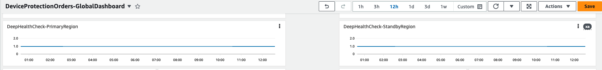
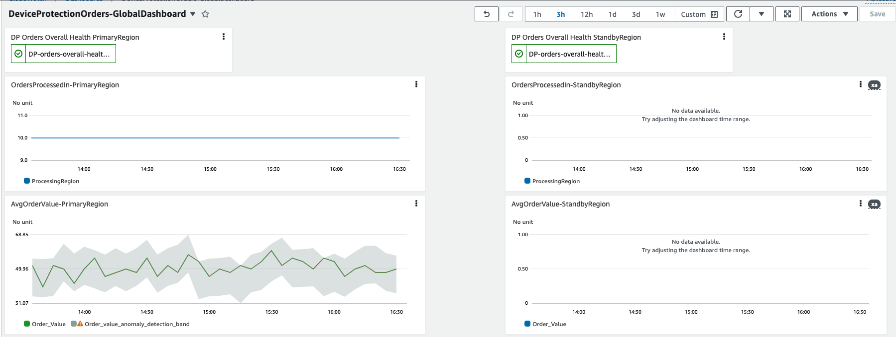

# When Should I failover? How do I know failover happened?

As a professional working in the software space, you've probably been on one or more "war rooms", where it's all hands on deck to get the systems back up and running. The first question that gets asked in those meetings is, “what’s the business impact?”. That’s the part many of us struggle with the most. I can tell you that the application is down and not taking orders but don’t ask me beyond that. When the application is failed over, the question becomes, “are we good to declare if business is back to normal?”. Many times, the answers come with a hesitation as no one knows clearly that business has been restored to normal state.

In this blog, I will walk you through a server-less application and through that application I will show you a way to build observability to answer those questions confidently.
 

## Application overview:

Let’s assume that you tech care company and offer different plans like single device plan, multiple device plan and family device plan. Anytime your customer adds protection for their device(s), either directly through your website or through your clients, you receive a request via an API call which processes this device protection order and saves the information in your system. One of the ways you can architect this is using sever-less technologies- API Gateway, Lambda Functions and DynamoDB where AWS does the undifferentiated heavy lifting of infrastructure management. All these services are regional in scope meaning, you don’t have to worry about which AZ(s) you should deploy it to. AWS deploys them to multiple AZs, taking that complexity away from you.

Since this is a critical application, you have deployed it 2 regions- us-east-1 (primary) and us-west2 (standby) following the warm- standby DR strategy. Under normal circumstances, all requests will go to the primary region and in case of service impairments at region level, the requests would failover to the standby region. Shown below is the multi-region architecture for this DeviceProtectionOrders service:

## Adding layers of observability

Going back to the opening remark on identifying the business impact, you need to design for instrumentation (like which region the request is being processed from, what’s the order value, etc.) and deep health checks that validates all layers in the application. In the architecture diagram below, I show an approach for implementing instrumentation as well as deep health check using CloudWatch custom metric and metric filters with CloudWatch logs.

### Metrics for each component:

You can use the out of the box provided metrics for API Gateway, Lambda, and DynamoDB to see how each of these individual services are doing. For example, “PutItem” latency can show how long DynamoDB writes are taking. Based your normal operations, you can establish a baseline. Anything beyond that threshold could be a symptom of an issue with DynamoDB. Similarly, “5XX Error”, “Latency” metrics from API Gateway can tell you any service degradation. You can create a  CloudWatch Dashboard and include these metrics. As shown below, I have created a Dashboard- “DeviceProtectionOrders-GlobalDashboard’ and I am pulling metrics from both primary region and standby region so that I can see state of my system holistically in one place.

### Deep health check with Synthetics Canary

While these out of the box service metrics are good indicators of health of individual service, you might not have view into what we call ‘gray failures’ (link to gray failure). In this example, I am using CloudWatch Syntehtics Canary which will invoke another API endpoint- ‘/health’ which in turn invokes a separate Lambda function, called ‘HealthCheck’ function. This function queries a dummy record from the DynamoDB table. If successful, it pushes a custom metric to CloudWatch. If Synthetic canary is successful that means all layers of the application are working as expected. 
Note that the Canary hits the regional endpoint of the ‘/health’ API. This is on purpose so that you can independently check the health of your application in both the regions regardless of which region is primary. 
The reason behind separate endpoint is that it won’t skew your business metrics like request count, etc.
So far, we have a deep health check which runs every 2 minutes. I will use this for an alarm which will go off if health check fails for 2 consecutive times. Due to the business criticality of my service, I want to failover if my application isn’t able to process device registrations for more than 10 mins.

### Building business level health checks

So far, we have built observability from systems point of view. But the question still remains- How do you quantify the impact of service impairment? For that, you can instrument your micro-service code in Lambda- every time your request is processed, you push a custom metric- ‘OrderValue’ which is the amount of the order from the request. From your business case, based on which plan customer chooses (single device plan- $29.99, multiple device plan- $49.99 and family device plan- $69.99. If you get 2 such orders every minute, you can expect the average order value to be between $29.99 and $69.99 in 5 minute interval. You can add this custom metric to the dashboard as shown below:

In normal state all orders will be processed in the primary region as shown in the first graph- ‘OrderProcessedIn-PrimaryRegion’. The corresponding graph from the other region on the right side-‘OrderProcessedIn-PrimaryRegion’ shows no data.
Silimarly, ‘AvgOrderValue-PrimaryRegion’ graph shows that dollar value of orders processed in the primary region. This shows the business value of the application and you can easily quantify the impact if your service is impaired.

## Composite view of the system as a whole from both regions

From operations point of view, it would be important to be able to view both system level metrics, health checks as well as business metrics in single dashboard that too pulling metrics from both primary region and standby region. I have created a CloudWatch Dashboard with all metrics (system & business), health checks and an alarm which depicts overall health of this application:

## Detecting region-level service impairment & failing over

For failing over from primary region to standby region, you can create composite alarm based on all the above metrics and associate it with the Router53 health check. When the alarm goes off, Route53 will stop sending requests to primary region and will start sending them to the standby region. For this example, I created a composite alarm using deep health check and avg order value metrics. You can specify a static threshold or can use anomaly bands powered by AI. For health check alarm, I have used static value (count less than 2 in 5 mins for 2 consecutive times) and for business metric alarm, I have used anomaly detection- i.e. order value lower that average order value band. 
You can see that the alarm is green in both the regions in the dashboard:

Based on your use case, you can have the system fail over to standby (like I have done in this example) or you can decide that in the war-room bridge and initiate the failover manually using R53 ARC or STOP. In either case, having layers of observability, including business level metrics, you will not only be able to tell what the business impact is but also be able to make that decision easier.

## Verifying system normal state after failing over:

To simulate a region-level service impairment, I stopped the Sythentic Canary which was generating the custom health check metric. As soon as health checks are missed 2 consecutive times, the alarm goes off and Route53 starts sending traffic to the standby region as captured in the picture below:

For the final question- “are we good to declare if business is back to normal?”, apart from the system metrics, you can look at the business metrics from the standby region which is now serving all of your customer requests. When you observe the business metric, in this case, average order amount goes back to normal range, you can infer that the system has been restored to normal state and you can close the war room bridge:

## Conclusion:

It is important to detect service impairments and be able to translate them into business terms so that business stakeholders can understand the impact. Through this blog, I showed you a way to build the level of observability to tell clear business impact. To learn more about the services mentioned in the blog, check out these resources:

- [CloudWatch Synthetic Canary](https://docs.aws.amazon.com/AmazonCloudWatch/latest/monitoring/CloudWatch_Synthetics_Canaries.html)
- [Disaster recovery options in the cloud](https://docs.aws.amazon.com/whitepapers/latest/disaster-recovery-workloads-on-aws/disaster-recovery-options-in-the-cloud.html)
 
Happy building!
