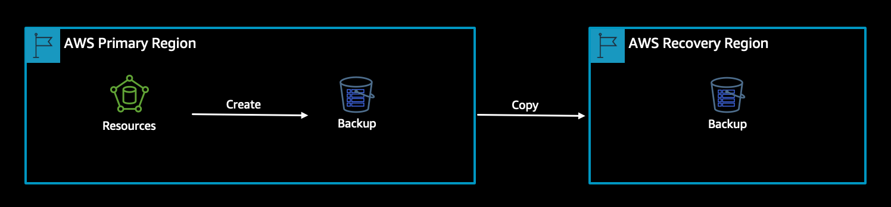
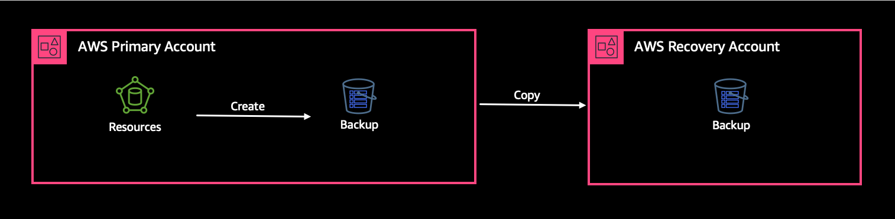

|ToC|
|---|

Data is critical for organizations and they are creating and storing more data than ever before. Creating backups of your data might seem like a no-brainer but if organizations are not being intentional about where backups are stored, that data may not be available when needed. In this blog post, I will talk about the different failure modes to consider when thinking about data backups and where organizations should be storing the backups in order to have confidence data can be recovered when necessary.

 There are two categories of risk to your data. *Loss* occurs when the underlying datastore is compromised, and the data can no longer be retrieved from it, such as a hard drive crash (when there is no backup). *Deletion or corruption* of data is another category of risk that can occur, even when the underlying datastore is healthy. Loss of data happens when there are technical failures or natural disasters, and deletion or corruption of data can happen from inadvertent misconfigurations, user error or unauthorized/outside party access. Because of these different types of failures, we need to define strategies for mitigating both data loss and data deletion or corruption. Creating backups of your data is a strategy that mitigates both categories of risks. Creating backups allow organizations to get back to a *last known good state of data* and is a best practice for any business continuity plan.

## Two important decisions

 There are two primary decisions that need to be made by organizations in regards to their data and data backups. 1) Does this data need to be backed up? 2) And if so, where is the destination of this backup?

### Does this data need to be backed up?

 A colleague recently asked me whether or not I recommend to organizations that they back up every data source that is in their workload. My immediate thought was ‘yes of course’. Organizations will need to access and restore a backup to mitigate the failure modes stated above and ultimately would need to get data back to a good state. But then I took a pause and really thought about the why around the risk mitigation. Why do organizations need to mitigate this risk and why do organizations need to get data back to a good state? Does an organization need to backup data that is on a development or test environment? How is that data created in the first place? Couldn’t the organization just recreate data from production? Organizations usually think about data from a production standpoint, which is critical for [business continuity](https://aws.amazon.com/blogs/mt/learn-how-the-flexibility-of-aws-opens-new-doors-for-business-continuity/?sc_channel=el&sc_campaign=resiliencewave&sc_content=where-do-i-put-my-backups-in-the-cloud&sc_geo=mult&sc_country=mult&sc_outcome=acq), however, organizations still need to understand how data is accessed and what the best data backup plan is. For example, oftentimes, development and test data doesn’t have a backup plan. But if productivity of developers and testers or even test automation within your CI/CD pipelines rely on the ability to use data then it is essential there is are data restoration plan. This plan can be to either restore data from a backup or recreate it from production. If data cannot be restored and must be backed up, organizations can cost optimize by having a lower data retention policy, which mandates how long data needs to be retained, for test data. So, to answer the first question of does this data need to be backed up is to consider how the organization is accessing that data and what the effects would be if that data was lost or deleted.

### Where is the destination of this backup?

 Once an organization has determined they do need a backup now the decision becomes where to store that backup? The answer depends on what failure mode they are trying to mitigate. Some of the most common questions around failure modes are:

1. What if data is accidentally deleted?
2. What if the cloud workload is unable to operate in the primary location and a recovery needs to occur?
3. What if data is maliciously  deleted?

## Single AWS Region

If an organization is trying to mitigate an accidental deletion or corruption of data, then keeping a backup close to the primary location is going to be the main goal so access and restoration can occur quickly. Having the backup within the same AWS Account and AWS Region is recommended (Figure 1-①). All services that support backups and snapshots will allow you to keep a ‘local’ copy of your data.

Figure 1. Create a backup in the primary AWS Region

## Multiple AWS Regions

If an organization is trying to mitigate for business continuity or disaster recovery then keeping a backup outside of that fault isolation boundary, which may be an AWS region, is recommended (Figure 1-②). Copying data across to another region allows for the recovery of that data in the case where a workload is unable to run in the primary region and a disaster recovery plan may need to be invoked and the workload needs to be run in a recovery region.

Figure 2. Keep a copy of backup in a secondary AWS Region

## Multiple AWS Accounts

If an organization is trying to mitigate a deletion by an outside party with unintended access then copying the backup outside the boundary of the AWS account is recommended (Figure 1-③). This can be another AWS account and more importantly a process should be in place to be able to conduct forensic analysis on your data to verify if or when the data was compromised.

Figure 3. Keep a copy of backup in another AWS Account

 When organizations are thinking about these different failure modes, in order to be the most resilient, organizations should consider mitigation of all of these failure modes. By incorporating multiple layers of defense into your backup strategy and creating multiple copies of your backups across multiple fault isolation boundaries, this will offer the most protection and confidence that data will be recovered no matter what the failure mode.

All AWS services have backup and snapshot capabilities built into the service, however, AWS offers a managed service, [AWS Backup](https://docs.aws.amazon.com/aws-backup/latest/devguide/whatisbackup.html?sc_channel=el&sc_campaign=resiliencewave&sc_content=where-do-i-put-my-backups-in-the-cloud&sc_geo=mult&sc_country=mult&sc_outcome=acq), that can provide a single pane of glass view for all backups. AWS Backup provides capabilities to easily manage and group backups that match the same retention policy and can copy backups across region and across account for use cases that require that. AWS Backup uses the concept of vaults, which are used to store and organize backups. Vaults can have access policies assigned to them, allowing organizations to have granular control over who can access backups. [AWS Backup Vault Lock](https://docs.aws.amazon.com/aws-backup/latest/devguide/vault-lock.html?sc_channel=el&sc_campaign=resiliencewave&sc_content=where-do-i-put-my-backups-in-the-cloud&sc_geo=mult&sc_country=mult&sc_outcome=acq), is an additional optional feature, which can be helpful in giving you additional security and control over your backup vaults.

## Conclusion

Backing up data is one of the first and most critical steps for protecting data against failure, however choosing where the backup resides is also just as critical. Organization should consider the different failure modes when it comes to their data and understand what recovery looks like in order to make this decision. In this post, I have outlined three of the most common failure modes that I have seen working with customers around data and the recommendations on where to put the backup.
