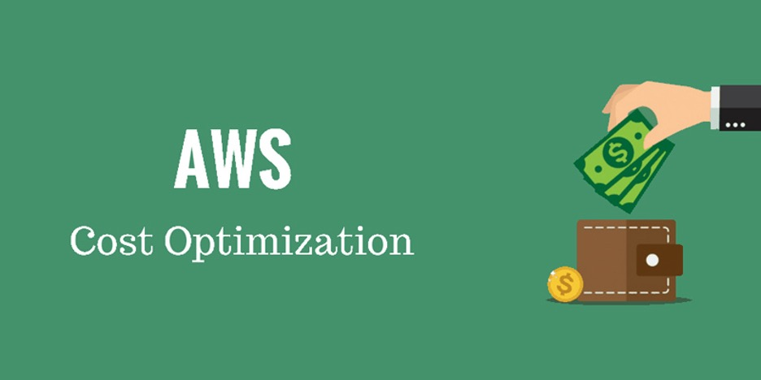
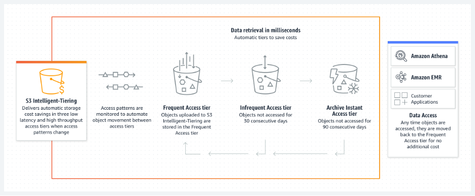
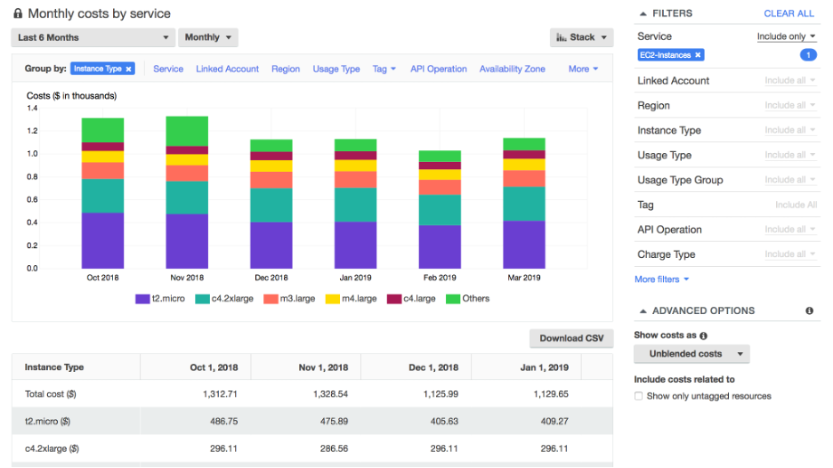
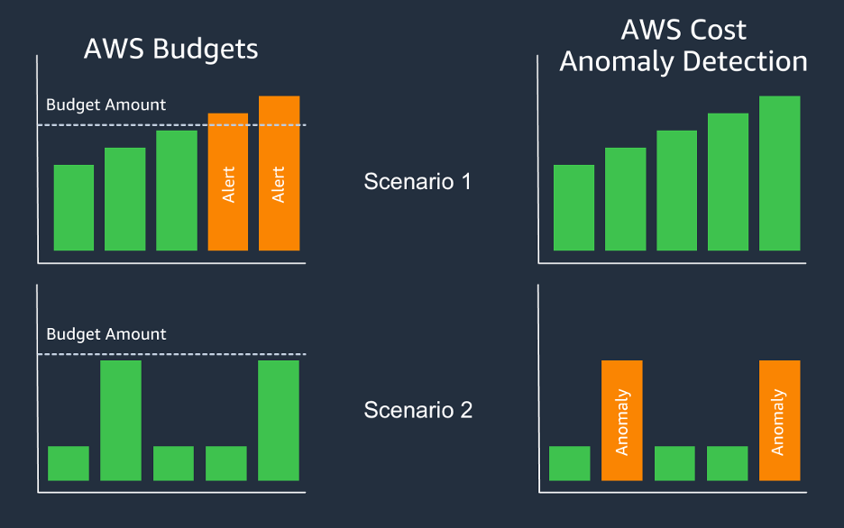

## I think you said the wrong team

(Movie narrator voice) In a world powered by digital innovation, where cloud spend is out of control, one team of unsung heroes hold the keys to successful AWS cost optimization: Finance.

(Record Scratch) Wait no, that’s not right. It’s actually YOU – the engineers!

This blog will delve into the pivotal role that engineers play in driving intelligent AWS spending. I will offer some in-depth exploration of optimization plays for developers, as well as outline actionable strategies that engineers can seamlessly integrate into their development workflow.

Worst case is you read the blog and learn something! You might even get a couple laughs along the way. Best case is that I sell you on the value of optimization. Your mission, should you choose to accept it, will be to turn my advice into actual savings for your organization.

## But… I just want to code!

Take a break from the coding and listen to me ramble for a minute. In the context of AWS cloud spending, the engineering role extends beyond just crafting functional code. Developers are now stewards of cost optimization, ensuring that the technological strides they make align harmoniously with financial prudence. That’s the fanciest sentence of the entire blog, I promise.

Successful engineers shift their mindset from “just code” to “code plus cost”. Transitioning from a singular focus on code quality to a broader perspective that encompasses cost implications has become hallmark of the modern engineer. Developers must recognize that the efficiency of their code directly influences AWS spending.

Empowering engineers with an intimate understanding of AWS's complex cost structure equips them with the tools needed to make informed decisions. These decisions have a direct impact to the bottom line. By architecting applications that maximize resource utilization, minimize waste, and scale elastically, they can influence substantial (and sometimes perpetual) financial savings, as well as more efficient cloud usage. These are some of the metrics that folks up your management chain will care about as well!

## You sold me, how can I optimize my AWS costs and usage?

I had a feeling… it’s an easy sell. Both AWS are customers are aligned – run as efficiently as possible to gain as much value as you can from AWS. 

There are MANY ways you can optimize, just do a quick google search and you will see there are optimization recommendations EVERYWHERE.

For this blog, I’ll list the first 5 common optimization levers (that pop into my head) that engineers can pull to save significant spend:

1.	**Right Sizing Instances**: [Right sizing](https://aws.amazon.com/aws-cost-management/aws-cost-optimization/right-sizing/) is the process of matching instance types and sizes to your workload performance and capacity requirements at the lowest possible cost. Ideally this would be done before ever launching the instance, but sometimes you need to see the actual performance of the instance to be able to accurately measure metrics. I am also counting terminating idle instances as a Right sizing opportunity, so go check and see if there’s anything running that shouldn’t be!

2.	**Leveraging Spot Instances**: [Spot Instances](https://aws.amazon.com/ec2/spot/) offer cost-effective compute capacity for fault-tolerant and flexible workloads. Engineers can design applications to leverage Spot Instances where possible, optimizing costs while still meeting performance requirements. Spot Instances work well for big data, containerized workloads, CI/CD, stateless web servers, high performance computing (HPC), and rendering workloads. Reminder – there’s no bidding for spot anymore.

3.	**Storage Tiers and Lifecycle Policies**: By implementing storage tiering and [lifecycle policies](https://docs.aws.amazon.com/AmazonS3/latest/userguide/object-lifecycle-mgmt.html), engineers can move data between different storage classes based on access patterns, optimizing costs while ensuring data availability. If those access patterns are dynamic, you can use [S3 Intelligent Tiering](https://aws.amazon.com/s3/storage-classes/intelligent-tiering/). Amazon S3 Intelligent-Tiering storage class is designed to optimize storage costs by automatically moving data to the most cost-effective access tier when access patterns change. See below for an Intelligent Tiering breakdown:

4.	**Serverless Architectures**: Embracing [serverless](https://aws.amazon.com/serverless/) (and modernized) architectures eliminates the need to manage infrastructure, leading to cost savings through billing based on actual usage (and not just because a server is running). Also, who wants to manage servers anyway? What’s next, will I have to power my own servers?! I’m trying to get out of the data center business and into the cloud business!

5.	**Reserved Instances and Savings Plans**: Engineers can optimize costs by strategically utilizing [Reserved Instances](https://aws.amazon.com/aws-cost-management/aws-cost-optimization/reserved-instances/) and [Savings Plans](https://aws.amazon.com/savingsplans/) to reserve capacity for predictable workloads, getting significant discounts compared to on-demand pricing. As a best practice, right size and modernize your environment first, so when you move out of the more ‘technical’ levers, you can make a better decision on the commercial levers.

6.	BONUS ROUND – Who doesn’t love a good bonus? Check out our [AWS Graviton](https://aws.amazon.com/ec2/graviton/) based instances, which can provide up to 40% better price performance over compatible current generation x86 instances. The public website has a footnote, I better include it here too - 20% lower cost and up to 40% higher performance for M6g, C6g, and R6g instances over M5, C5, and R5 instances respectively, based on internal testing of workloads with varying characteristics of compute and memory requirements.

There’s plenty of other best practices around [data transfer](https://docs.aws.amazon.com/wellarchitected/latest/cost-optimization-pillar/plan-for-data-transfer.html), [Sagemaker](https://docs.aws.amazon.com/sagemaker/latest/dg/inference-cost-optimization.html), [databases](https://docs.aws.amazon.com/prescriptive-guidance/latest/strategy-database-migration/optimization-phase.html), [Auto Scaling Groups](https://docs.aws.amazon.com/autoscaling/ec2/userguide/auto-scaling-groups.html), and more. Take a look around the AWS whitepapers and documentation to learn more about optimization!

## There has to be tooling to help me right?

Absolutely! You can incorporate cost optimization into your daily work using a range of AWS tools! I won’t go over all of them, but sticking with the theme from before, let’s roll through the first 5 I think of:

1.	**AWS Cost Explorer**: [Cost Explorer](https://aws.amazon.com/aws-cost-management/aws-cost-explorer/) offers interactive visualizations of cost and usage data, enabling engineers to identify spend trends and opportunities for optimization. See the screenshot below for a sample report showing EC2 Spend by Instance Type:

2.	**AWS Budgets**: Engineers can set custom [budgets](https://aws.amazon.com/aws-cost-management/aws-budgets/) and receive alerts when costs exceed predefined thresholds, fostering proactive cost management. In some cases, you can even automate an [action](https://docs.aws.amazon.com/cost-management/latest/userguide/budgets-controls.html) to be taken once a threshold is crossed (I.E. turn off an EC2 instance).
3.	**[AWS Cost Anomaly Detection](https://aws.amazon.com/aws-cost-management/aws-cost-anomaly-detection/)**: This tool employs machine learning to detect and notify engineers about unusual spending patterns, enabling swift corrective action. This is similar to budgets, but different in terms of when you get alerted. See the below screenshot:

4.	**AWS Compute Optimizer**: Focused on compute resources, [Compute Optimizer](https://aws.amazon.com/compute-optimizer/) offers recommendations to improve resource utilization, aiding engineers in optimizing instance types and sizes. You can even now integrate your Application Performance Management data to get a more holistic picture of what’s running in your environment.
5.	**[AWS Cost and Usage Report](https://docs.aws.amazon.com/cur/latest/userguide/what-is-cur.html)** – the most detailed billing artifact you can get. Once enabled, this is stored in an S3 bucket, and you can query and visualize the data in any way you choose. One common way is to utilize the [Cloud Intelligence Dashboards](https://wellarchitectedlabs.com/cost/200_labs/200_cloud_intelligence/) – check them out! You will need to set those up yourself, but it’s a simple deployment.
6. ANOTHER BONUS ROUND: YOU GET A BONUS! AND YOU GET A BONUS! Don’t forget about [Amazon CloudWatch](https://aws.amazon.com/cloudwatch/)! You can collect and track metrics, monitor log files, set alarms, and automatically react to changes in AWS resources. It’s in the name, you watch your cloud.

## Has anyone already done this?

I’m glad you asked! There are quite a few case studies out there on optimization, but one of my favorites is [Airbnb](https://aws.amazon.com/solutions/case-studies/airbnb-optimizes-usage-and-costs-case-study/). You can check out the full case study, where Airbnb used some of the best practices and tooling listed above to save BIG. (How big? Read the case study and find out!) Spoiler alert – They reduced OpenSearch costs by **60%**.

## Conclusion

(Movie Narrator voice again) In a world where… ok forget the movie narrator thing. Engineers truly are the unsung heroes of cost optimization! Beyond just crafting lines of code, they are the champions of efficient spending, holding the keys to unlocking the full potential of AWS while staying cost conscious throughout the entire development workflow. Remember, optimization is a marathon, not a sprint, so stay vigilant along your [Cloud Financial Management](https://aws.amazon.com/aws-cost-management/) journey!

Ok, you can go back to coding now. So long, and thanks for all the fish.
