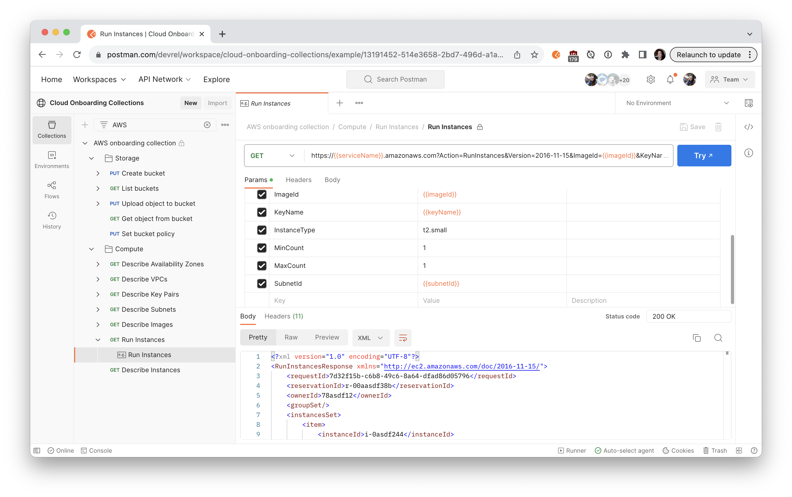
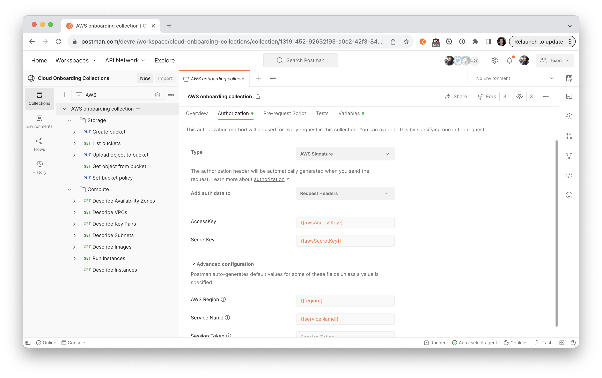
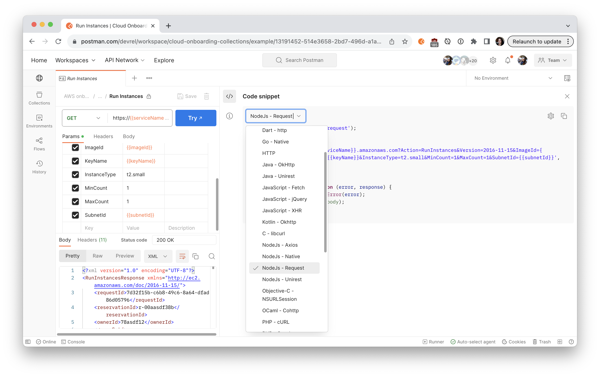
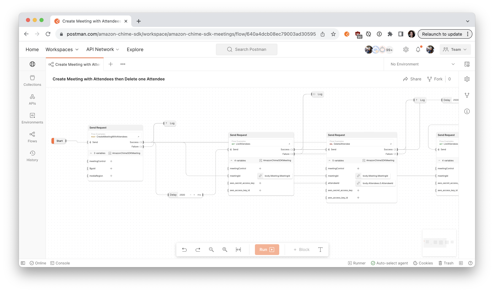

Most AWS users rely on the graphic user interface (GUI) of the [AWS Management Console](https://aws.amazon.com/console/) for manual operations, like provisioning new resources or deploying applications. AWS also has developer resources to enable programmatic access to cloud services for more flexibility, automation, and extensibility.

- [AWS Command Line Interface (AWS CLI)](https://aws.amazon.com/cli/) to provide direct access to the public APIs of AWS services.
- [AWS software development kits (SDKs) & toolkits](https://aws.amazon.com/developer/tools/) to build on AWS.
- [AWS Service Catalog API](https://docs.aws.amazon.com/servicecatalog/latest/dg/what-is-service-catalog.html) to provide programmatic control over all end-user actions as an alternative to using the AWS Management Console.

Let’s examine the reasons why, and when, some developers choose to use APIs over the console to manage AWS cloud services.

## Flexibility, automation, and extensibility of AWS cloud services

APIs are helpful when you’re looking for more control and customization. According to [the AWS documentation](https://docs.aws.amazon.com/servicecatalog/latest/dg/what-is-service-catalog.html), you can do the following using their APIs.

- Write your own custom interfaces and applications
- Utilize fine-grained control of end user provisioning operations
- Integrate resource provisioning into your orchestration pipelines
- Access a central location that hosts your application with their resources

Besides automation and integration, you can experiment with the APIs to gain deeper insights into how different services function. By breaking down abstracted services into the underlying API calls, new users better understand what’s happening “under the hood” when they swiftly click through the management console. 

In the next section, let’s get started with AWS APIs.

## Get started with AWS APIs

Amazon provides a wide range of cloud services to build, deploy, and scale applications and services on AWS infrastructure. If you are using AWS APIs for the first time, follow [this step-by-step tutorial](https://quickstarts.postman.com/guide/aws/index.html?index=..%2F..index#0) to call the APIs using requests sent through the Postman client. 

### What you’ll learn
- How to authenticate to AWS APIs
- How to set up cloud instances and cloud storage
- How to troubleshoot unexpected API behavior
- How to set permissions on AWS users
- How to grant access to cloud resources
- How to automate API workflows for AWS in Postman

In the tutorial, explore S3, EC2, and setting up an AWS authorization signature in Postman. You can use those requests to experiment with an API before you develop your own applications and integrations. 

Follow these three steps to get started with AWS APIs.

1. Fork the example collection
1. Add the AWS authorization signature
1. Generate code samples

#### Step 1. Fork the example collection 

Use this **Run in Postman** button to fork the collection to your own workspace.
    
    

#### Step 2. Add the AWS authorization signature

One of the first stumbling blocks developers encounter when working with APIs is authorization. Learn how to add an AWS signature to each API call to authorize access for each endpoint.
    

#### Step 3. Generate code samples

Once you have an API call working the way you want in Postman, you can continue running the API calls in Postman. Or you can generate the code, to then copy and paste into your own applications and integrations.
    

## Additional Resources

If you’ve only ever used the AWS Management Console to engage with AWS services, it’s not too late to explore the APIs and deepen your understanding of the cloud services. Using APIs as a practical learning tool allows you to build more robust and efficient applications that take full advantage of cloud services.

Check out these additional resources to get started.

- Step-by-step tutorial to [Get Started with Amazon Web Services APIs](https://quickstarts.postman.com/guide/aws/index.html?index=..%2F..index#0) 
- Example [AWS onboarding collection](https://www.postman.com/devrel/workspace/cloud-onboarding-collections/collection/13191452-92632f93-a0c2-42f3-847e-ff7ffdfe688b)
- API reference for other Amazon services, such as the [Amazon Chime workspace](https://www.postman.com/amazon-chime-sdk/workspace/amazon-chime-sdk-meetings/overview) and the [Amazon Payment Services workspace](https://www.postman.com/aps-intg-team/workspace/aps-api-workspace/overview)

