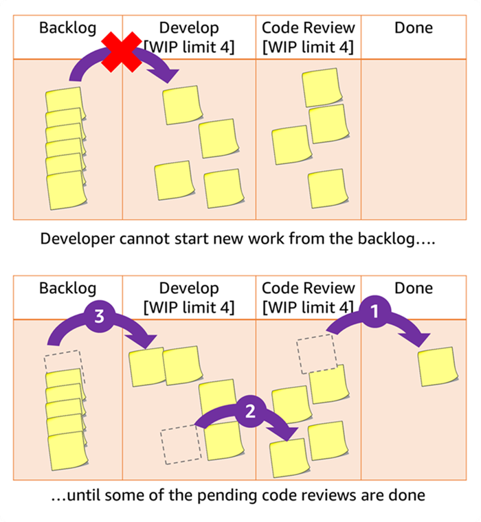

Kanban has gained popularity as a tool for improving the productivity for software development teams. But many builders implementing it may not understand why we do the practices that Kanban is known for. One key practice that is necessary to achieve Kanban’s benefits is limiting work in process, also known as limiting WIP. 

What is limiting WIP? Essentially it just means setting a limit on the number of items that can be in each step in your workflow. It sounds simple — and I've heard complaints before that such limits feel artificial or silly — but limiting WIP actually improves flow, drives collaboration, and aids the team's commitment to completing valuable features.

In short, limiting work in process helps you manage your overall workflow, enabling your team to get more done. Here's how — and why — it works.

> Kanban aside
> 
> Sometimes WIP is said to stand for "work in progress". However I will use "work in process" for the [reasons described here](https://www.projectmanagement.com/blog/blogPostingView.cfm?blogPostingID=63334&thisPageURL=/blog-post/63334/Why-Disciplined-Agile-Uses-Work-in-Process-and-not-Work-in-Progress). 

“Limit WIP” means limit the work in process — for any given step in your workflow you limit how many items can be in that state. So a WIP Limit of 2 on your “Develop” step, as shown in Figure 2, means once two items are at that step, the team cannot start to develop any more items until at least one of the current items moves to the next step.

 [[image source](http://blog.crisp.se/2009/06/26/henrikkniberg/1246053060000)] by Henrik Kniberg, licensed under [CC BY-ND 4.0](https://creativecommons.org/licenses/by-nd/4.0/)

This diagram in Figure 2 comes from [**One day in Kanban land**](http://blog.crisp.se/2009/06/26/henrikkniberg/1246053060000), by the always-awesome Henrik Kniberg – you should bookmark it and check it out.

A developer on one of my teams using Kanban once complained to me that the WIP limit seemed artificial, and that when he was ready to start new work it seemed silly to restrict him from doing so. That got me thinking about how to explain why we limit WIP and how limiting WIP helps teams get more stuff done. In this blog I will explain how:

1. Limiting WIP improves flow, and helps us produce more quickly and reliably
2. Limiting WIP drives collaboration, and gets the team working together
3. Limiting WIP aids our commitment to completing valuable features

## Limiting WIP improves flow

You have a workflow where items come in, are developed, tested, deployed, and other steps towards getting “done” (or “Live!” in Figure 2). You want your workflow to... well... *flow*. That is, as items come in, you don't spend too much time in any given workflow step, and continuously and quickly emerge out the other end into the *Done* state.
You have a workflow where items come in, are developed, tested, deployed, and other steps towards getting “done” (or “Live!” in Figure 2). You want your workflow to... well... *flow*. That is, as items come in, you don't spend too much time in any given workflow step, and continuously and quickly emerge out the other end into the *Done* state.

> Kanban Aside:
>
> Items continuously reaching done is measured by “throughput,” the number of items done per time.
>
> Items quickly reaching done is measured by “cycle time,” the amount of time it takes from starting an item coming into the workflow, until it reaches done.

Figure 3 shows an example of a workflow without WIP limits. The team is busily working on Development (such as design and coding) of many items. Everyone is busy and working hard. But look at the flow. Are items getting done continuously or are they just accumulating under *Develop*? It reminds me of something like Figure 4.

What then if we applied a WIP limit to the Develop state? It might look like Figure 5.

You can imagine that the WIP limit of four on the *Develop* state “squeezed” all the work downstream to more evenly distribute it along the work states and drive more of it to done. This “squeeze” visualization is OK as a thought exercise, but in reality what has occurred is one of the following actions:

1. Developers unable to take on new work into the already full Develop column either collaborated with other developers working on items already being developed (see the next section).
2. Or they moved their focus downstream to work on code review or validation. In this latter case, this moves those items downstream creating “open slots” in Code Review and Validate.

Action 1 does not necessarily help in this case as there is nowhere for an item to move to once *Develop* is complete, since Code Review is also full. So developers instead focus on action number 2 and move items downstream towards the Done state as shown in Figure 6. This creates space for items to move on from Develop and therefore creates space for items to move from Backlog to Develop. This is the “pull model” of Kanban in action. So perhaps non-intuitively, it is applying WIP limits that opens up that valve in the bulging water line figure 4, focusing work downstream rather than continuously stuffing it into “the bulge”.

> Kanban Aside:
>
> There are also other actions besides 1 and 2 identified. Another one is called “slack” where developers take on tasks outside of the main workflow to improve things such as efficiency, operations, or addressing technical debt. Developers might even just read a book or take training, this is called “sharpening the saw”. Slack in excess is a sign of a problem, but a little slack is a good thing.

## Limiting WIP Drives Collaboration

As mentioned earlier, when a developer cannot pull a new item into *Develop* due to a WIP limit, one way she can continue to be productive is by collaborating with other developers on an item already being *Developed*. Or perhaps she looks downstream and sees QA needs help, and she can pitch in there and help the QA Engineer out (perhaps helping to build out some automation). The power of collaboration is getting multiple talents and multiple perspectives so that we arrive at the best outcome (pair programming also leverages this advantage of collaboration). But another advantage of collaboration is that stuff gets done faster, and getting stuff done faster was one of our goals (and a sign of good flow).

To illustrate how collaboration (driven by lower WIP limits) gets things done faster, see the following workflows in figure 7. One has a WIP limit of 1 and the other has a WIP limit of 2. Assume for simplicity that each item takes two developer-days to complete (and that all developers are equivalent). Note that the overall amount of work done (throughput) is the same — one item per day. But look at an individual item like “Item 2.” With a WIP Limit of 2 it takes two days of work to complete (this is the Cycle Time). But with developers collaborating under a WIP limit of 1, it only takes one day to complete. Completing items faster is preferred because:

* The code doesn’t rot as team members check in new code
* The developer doesn’t lose the context he or she gained in writing the original code
* And we get feedback on the item faster, speeding up our ability to inspect and adapt

> Kanban Aside:
>
> There is mathematical rigor behind the assertion that lower WIP (driving collaboration) gets stuff done faster (reduces cycle time). It is called [Little’s Law](https://brooker.co.za/blog/2018/06/20/littles-law.html) and can be stated as
> 
> `CycleTime = WIP​ / Throughput`

## Limiting WIP Aids Our Commitment to Completing Valuable Features

In Scrum we plan a sprint and as a team commit to completing the stories in that sprint, thereby delivering value with every sprint completion. In Kanban we usually do not have sprints, instead using a continuous flow model. WIP limits are how we provide this same level of commitment that Scrum provides.

In Scrum we plan a sprint based on past velocity, and then as a team commit that we will complete the selected stories for that sprint by sprint end. This commitment is an important part of Scrum, but I have observed that it is a very common problem among teams world-wide that they fail to complete all the planned stories for a given sprint. “Punting” unfinished stories from one sprint to the next is supposed to be a practice to be avoided, but it is in actuality common among even the best-intentioned scrum teams.

In Kanban, we often have a continuous flow model and not a sprint one, so the Scrum method of committing to a set of sprint stories will not work. We take a different approach to team commitment. By limiting WIP we commit to ensure that the most important things (the things the top of the backlog) get the teams’ attention, and that often multiple members of the team will collaborate to deliver those items.

So in Scrum we might recognize half-way through the sprint that stories will not be finished, and then swarm on a select few stories in order to finish those and meet at least part of our commitment. In Kanban we limit WIP and we ALWAYS swarm to ensure we *Stop Starting and Start Finishing*.

## Conclusion

Hopefully now you understand why limiting WIP is not just a thing we do, but is a key part of the Kanban process, and necessary so as to improve flow of value through the system.  Limiting WIP improves flow and helps us produce more quickly and reliably, drives collaboration, gets the team working together, and aids our commitment to completing valuable features.

| Let me know what you think of this post|  |
| ----------- | ----------- |
| Twitter:      | [@setheliot](https://twitter.com/setheliot)       |
| LinkedIn:   | [setheliot](https://www.linkedin.com/in/setheliot/)        |
