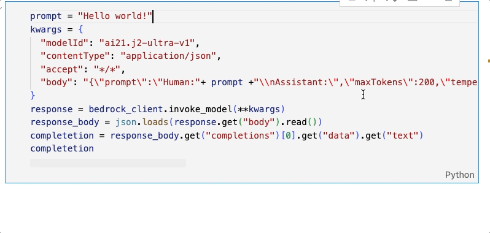

|ToC|
|---|

When building applications leveraging large language models (LLM), providing the full conversation context in each prompt is crucial for coherence and natural dialogue. Rather than treating each user input as an isolated question (Fig 1), the model must understand how it fits into the evolving conversation.


Storing every new entry and response in the message(Fig. 2) makes it bigger and requires more memory and processing. Without optimizing the storage of dialogue history using appropriate techniques to balance performance and natural interaction, resources would quickly stagnate.


In this blog post, I will show you how to use techniques to efficiently provide conversation context to models with [LangChain](https://www.langchain.com/) to create a conversational agent that can engage in natural dialogue, maintain the context of the conversation by appending each generated response into the prompt to inform the next response. This allows us to have extended, coherent conversations with the agent across multiple turns. By the end, you will have the skill to create your own conversational application powered by the latest advances in generative AI.

## Let’s get started!

### 1 - Install The [LangChain](https://www.langchain.com/) Library

```bash
pip install langchain
```

Once installed, you can include [all these modules](https://python.langchain.com/docs/get_started) to your application.

### 2 - Create the LLM Invocation

The invocation is made using [Amazon Bedrock](https://docs.aws.amazon.com/bedrock/latest/userguide/what-is-service.html?sc_channel=el&sc_campaign=genaiwave&sc_content=working-with-your-live-data-using-langchain&sc_geo=mult&sc_country=mult&sc_outcome=acq), a fully managed service that makes base models from Amazon and third-party model providers accessible through an API.

[Anthropic Claude V2 100K](https://www.anthropic.com/index/claude-2) Model is used in this example.

To use Amazon Bedrock’s capabilities with LangChain import:

```python
from langchain.llms.bedrock import Bedrock
```

Then create the Amazon Bedrock Runtime Client:

```python
bedrock_client = boto3.client(
    service_name='bedrock-runtime'
)
```

> 📚**Note:** Learn more about Amazon Bedrock and LangChain [here](https://python.langchain.com/docs/integrations/llms/bedrock), the Amazon Bedrock client [here](https://boto3.amazonaws.com/v1/documentation/api/latest/reference/services/bedrock-runtime.html) and [here](https://boto3.amazonaws.com/v1/documentation/api/latest/reference/services/bedrock.html?sc_channel=el&sc_campaign=genaiwave&sc_content=working-with-your-live-data-using-langchain&sc_geo=mult&sc_country=mult&sc_outcome=acq).

A [Chain](https://python.langchain.com/docs/modules/chains/), the tool to call the components of the application, is need it to generate conversation with the model, set `verbose = True` to make debug and see the internal states of the Chain:  

```python
from langchain.chains import ConversationChain
model_parameter = {"temperature": 0.0, "top_p": .5, "max_tokens_to_sample": 2000} #parameters define
llm = Bedrock(model_id="anthropic.claude-v2", model_kwargs=model_parameter,client=bedrock_client) #model define
conversation = ConversationChain(
    llm=llm, verbose=True
)
```

Test the Chain with this line:

```python
conversation.predict(input="Hello world!")
```


Additionally, you can invoke the Amazon Bedrock API directly with the [Invoke Model API](https://boto3.amazonaws.com/v1/documentation/api/latest/reference/services/bedrock-runtime/client/invoke_model.html?sc_channel=el&sc_campaign=genaiwave&sc_content=working-with-your-live-data-using-langchain&sc_geo=mult&sc_country=mult&sc_outcome=acq):

```python
prompt = "Hello world!"
kwargs = {
  "modelId": "ai21.j2-ultra-v1",
  "contentType": "application/json",
  "accept": "*/*",
  "body": "{\"prompt\":\"Human:"+ prompt +"\\nAssistant:\",\"maxTokens\":200,\"temperature\":0.7,\"topP\":1,\"stopSequences\":[],\"countPenalty\":{\"scale\":0},\"presencePenalty\":{\"scale\":0},\"frequencyPenalty\":{\"scale\":0}}"
}
response = bedrock_client.invoke_model(**kwargs)
response_body = json.loads(response.get("body").read())
completetion = response_body.get("completions")[0].get("data").get("text")
completetion
```



### 3 - Add Chat Memory To The Chain

There are different memory types in [LangChain](https://python.langchain.com/docs/modules/memory/types/), but in this blog we are going to review the following:

#### 3.1 ConversationBufferMemory

Using this memory allows you to store all the messages in the conversation.

```python
from langchain.memory import ConversationBufferMemory
memory = ConversationBufferMemory(return_messages=True)
```

#### 3.2 ConversationBufferWindowMemory

Limits the dialogue history size to the most recent K interactions. Older interactions are discarded as new ones are added to keep the size fixed at K.

```python
from langchain.memory import ConversationBufferWindowMemory
memory = ConversationBufferMemory(k=1,return_messages=True)
```

#### 3.3 ConversationSummaryMemory

This uses a LLM model to created a summary of the conversation and then injected into a prompt, useful for a large conversations.

```python
from langchain.memory import ConversationSummaryMemory
memory = ConversationSummaryMemory(llm=llm,return_messages=True)
```

#### 3.4 ConversationSummaryBufferMemory

Use both the buffer and the summary, stores the full recent conversations in a buffer and also compiles older conversations into a summary.

```python
from langchain.memory import ConversationSummaryBufferMemory
memory = ConversationSummaryBufferMemory(llm=llm, max_token_limit=10,return_messages=True)
```

#### 3.5 ConversationTokenBufferMemory

Keeps a buffer of recent interactions in memory, and uses token length rather than number of interactions to determine when to flush interactions.

```python
from langchain.memory import ConversationTokenBufferMemory
memory = ConversationTokenBufferMemory(llm=llm, max_token_limit=10,return_messages=True)
```

> 📚**Note:** In all types of memory belong the parameter return_messages=True is present, this to get the history as a list of messages

### 4 - Try it!

To try the different memory configurations, add them as a parameter in the Chain.

```python

#add the memory to the Chain
conversation = ConversationChain(
    llm=llm, verbose=True, memory=memory
)
```

Test the Chain:

```python
conversation.predict(input="Hi, my name is Elizabeth!")
conversation.predict(input="what's up?")
conversation.predict(input="cool, What is my name?")

memory.load_memory_variables({}) #To print the memory
```

In the following gif you see an example of the ConversationBufferMemory.


Try the different memory types and check the difference.

## 5 - Save The Conversation Memory In An Amazon DynamoDB Table

Do this using the LangChain integration [module](https://python.langchain.com/docs/integrations/memory/aws_dynamodb?sc_channel=el&sc_campaign=genaiwave&sc_content=working-with-your-live-data-using-langchain&sc_geo=mult&sc_country=mult&sc_outcome=acq) with [Amazon DynamoDB](https://docs.aws.amazon.com/amazondynamodb/latest/developerguide/Introduction.html?sc_channel=el&sc_campaign=genaiwave&sc_content=working-with-your-live-data-using-langchain&sc_geo=mult&sc_country=mult&sc_outcome=acq)

Following the instructions in the LangChain documentation:

- Create the Amazon DynamoDB:

```python
# Get the service resource.
dynamodb = boto3.resource("dynamodb")

# Create the DynamoDB table.
table = dynamodb.create_table(
    TableName="SessionTable",
    KeySchema=[{"AttributeName": "SessionId", "KeyType": "HASH"}],
    AttributeDefinitions=[{"AttributeName": "SessionId", "AttributeType": "S"}],
    BillingMode="PAY_PER_REQUEST",
)
```

- Add Chat Memory To The Chain:

```python
from langchain.memory.chat_message_histories import DynamoDBChatMessageHistory
message_history = DynamoDBChatMessageHistory(table_name="SessionTable", session_id="1")
memory = ConversationBufferMemory(
    memory_key="history", chat_memory=message_history, return_messages=True,ai_prefix="A",human_prefix="H"
)
#add the memory to the Chain
conversation = ConversationChain(
    llm=llm, verbose=True, memory=memory
)
```

- Try It!

```python
conversation.predict(input="Hi, my name is Elizabeth!")
conversation.predict(input="what's up?")
conversation.predict(input="cool, What is my name?")

# Print the memory
memory.load_memory_variables({}) 

# Print item count
print(table.item_count)
```

See, you have a new record in the DynamoDB table:


## Conclusion

Thank you for joining me on this journey in which you gained the skills to maintain a coherent conversation with the LLMs and engage in a natural dialogue using the [LangChain](https://www.langchain.com/) memory module, using the Amazon Bedrock API to invoke LLMs models and storing memory: history of conversations in an Amazon DynamoDB.

Some links for you to continue learning and building:

- [Integrating Foundation Models into Your Code with Amazon Bedrock](https://www.youtube.com/watch?v=ab1mbj0acDo)

- [Amazon Bedrock Workshop](https://github.com/aws-samples/amazon-bedrock-workshop)

- [AWS Kendra LangChain Extensions](https://github.com/aws-samples/amazon-kendra-langchain-extensions/tree/main)

- [Prompt Engineering Techniques](https://www.promptingguide.ai/techniques)

- [Learn the fundamentals of generative AI for real-world applications](https://www.deeplearning.ai/courses/generative-ai-with-llms/)

- [LangChain for LLM Application Development](https://www.deeplearning.ai/short-courses/langchain-for-llm-application-development/)
