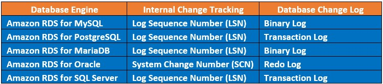
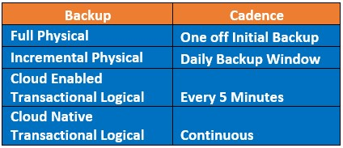
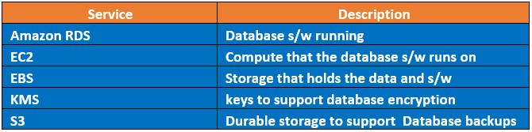
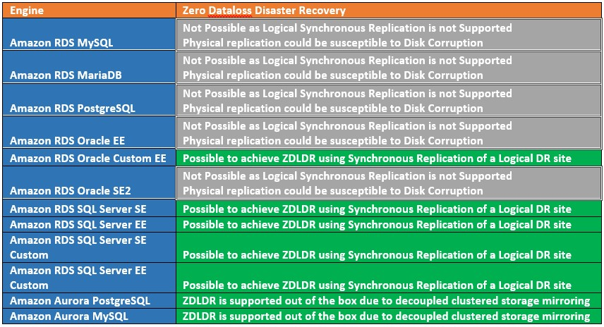

|ToC|
|---|

## Introduction
This article will look at how Amazon RDS databases support recovery from failure or disaster. We will cover the internal database mechanisms that facilitate database recovery from an AWS service failure as well as the AWS offerings that facilitate complete RDS database disaster recovery. Finally we will bring all of this information together to form an idea of what is possible utilising Amazon RDS to architect for a Zero Data loss solution.

## What does Zero Data Loss Disaster Recovery (ZDLDR) actually mean and why would it be needed?
Disaster Recovery is the act of recovering an impaired service after a failure event that effects the primary Availability Zone(s), Data Centre(s) or Region(s). That event could range from natural disasters, power cuts, and network outages to political activism stopping or impacting the data centres where servers and services are physically run from.

Recovery from failure and Testing of recovery procedures also forms part of the [AWS Well-Architected Framework](https://docs.aws.amazon.com/wellarchitected/latest/reliability-pillar/plan-for-disaster-recovery-dr.html) falling under the 'Reliability' Pillar. This is a core component of any AWS architected design so should be well understood.

 > Your resiliency strategy should also include Disaster Recovery (DR) objectives based on strategies to recover your workload in case of a disaster event.

 Amazon RDS Disaster Recovery (DR) Data Loss scope is at the database level and measureable in time or database system change. We recovery the database and everything contained within to the same consistent point.

 Recovery from a Disaster, with Zero Data Loss or ZDLDR means that once the database is back in service it will carry on from the point of failure and hold all transactional history up until the point of failure. For instance if we lost an Availability Zone at 9:00am UTC, For a ZDLDR Solution we would want a DR Solution that could reinstate that database service as if it were 09:00am UTC again anything less could imply loss of new or changed data.

 A database with missing or out of date data may cause an application to cease to function as it should, report incorrect or missing data and could require complex manual intervention to rectify. The issue could further be impacted if the system continued to operate with the missing or incorrect data which then causes additional logical cascading data corruptions. 

 ## Cloud Enabled vs Cloud Native Databases
One of the key reasons to use a relational database service such as Amazon RDS is to ensure data is highly available and recoverable at all times. This is all provided by a managed service (PaaS) that facilitates the simple setup, configuration and administration of this called Amazon RDS.

Amazon RDS supports 5 different database engines as below:

These Amazon RDS Databases engines generally fall into 2 categories
- Cloud Enabled
-	Cloud Native

Cloud Enabled Databases run using similar infrastructure and setup as if they were running on premise. In a way they are databases designed for an on premise environment and tailored to run on the cloud and utilise those great services that AWS provides. Amazon RDS which caters for engines Oracle, SQL Server, Postgres, MySQL and MariaDB can be considered Cloud Enabled offerings.

As depicted below these databases write to a standard non clustered EBS volume(s). Disaster Recovery can be provided by replication of the Physical SAN or the logical Database to a second Availability Zone.

Cloud Native Database are designed from the ground up to utilise cloud features that are generally only available on the cloud. Amazon Aurora Postgres and Amazon Aurora MySQL (both of which are still part of the RDS family) can be considered cloud native database offerings. Aurora decouples the compute from the storage layer. The storage layer has extra efficiencies, safe guards and utilises multiple AZs to enhance high availability and DR. 

As depicted below Amazon Aurora RDS writes to a clustered storage volume that spans across all 3 Availability Zones. The data is striped such that an Aurora database can be stood up for Disaster Recovery at any time in any Availability Zone within the same Region with no further replication or overhead. 

## Amazon RDS database Transaction Logging
Database engines journal change using their own internal tracking sequence. This internal Change or Sequence number can also be used as the target to restore databases or derive the clock time to restore a database if needed. In RDS Oracle this is known as the System Change Number (SCN) and other RDS Engines it’s referred to as Log Sequence Number (LSN). For a ZDLDR solution the SCN or LSN for a database would match prior to the disaster and after as well as the data.

Cloud Enabled Databases capture all change in logs also known as transaction or redo logs depending on the database engine. These logs are generally write ahead logs (WAL) so all data manipulation is first persisted to these logs then the underlying database files using a process known as Check pointing. This provides a mechanism for a database to roll forward all SCN or LSN changes in the WAL and recover its underlying files to be consistent after an ungraceful outage or server crash. Though any inflight transactions would be rolled back as they were not committed, this is a generally accepted model amongst Cloud Enabled database vendors and applications which results in Zero Data Loss.

RDS Cloud Native databases namely Amazon Aurora uses a clustered log structured distributed storage system. Once a change has occurred in the database, the log records are sent to the storage tier and added to an in memory queue. The database is then freed from any other overhead regarding management of these records. It falls to the Storage tier to take responsibility for persisting those records to disk and data page updates to reflect the change. As there is no transaction log or WAL as such on the database tier, there is no crash recovery phase when recovering from an ungraceful shutdown or crash, the data on disk is always upto date or log records to recreate current images exist on disk so again this results in Zero Data Loss.

## High Availability vs Backups vs Disaster Recovery 
One of the strengths of Amazon RDS is simplified and configurable Backup Automation, High Availability and Disaster Recovery options. This provides the capability to reinstate a failed database environment. But there are clear differences in their implementation, usage and potential for data loss.

The industry standard term for the amount of data loss a system can tolerate is known as the Recovery Point Objective (RPO). This is measured as a unit of time it could be seconds, hours or even days. An RPO of 0 would mean that a database could not tolerate any data loss.

High Availability is resilience to failure of individual services such as compute and storage. AWS by nature is highly available, if an EC2 fails due to an h/w issue this can be respawned on new h/w. EBS disks are resilient and striped. So we can expect Amazon RDS to be highly available as it's built using this same reliable, fault tolerant infrastructure. As we have discussed earlier if there is an issue that crashes the database, the database should still restart with zero data loss. If an RDS Database is setup to run Multi AZ, RDS will automatically failover to a Disaster Recovery Site if one exists as well under many conditions.

Backups in Amazon RDS are based on EC2 Storage level Snapshots and for Cloud Enabled offerings this is coupled with transaction log backups every 5 minutes all automated when enabled and implicitly written to S3 Object bucket Storage. The initial Snapshot of a database will perform a full storage backup with subsequent Snapshots being forever incremental copying only changed disk blocks for speed and efficiency.

The Cloud Native Amazon Aurora backups are continuous and based on its intelligent storage clustered setup and how data changes are recorded, due to this we should be able to restore an Aurora database with no data loss as there is no transaction log backup needed, the transactions are part of the data persisted to disk across all 3 AZs mentione earlier. 

To restore a RDS Cloud Enabled database would need a restore of the full backup + incremental backup(s) + for Cloud Enabled database the roll forward of the transaction logs. Potentially the RPO using Amazon Cloud Enabled RDS backups would be 5 minutes at most (the cadence of transaction log backups). 

To restore a RDS Cloud Native database would need a restore of the full backup + incremental backup(s), there are no transaction logs to restore, we should expect an RPO of 0 i.e. no data loss.

Disaster Recovery in Amazon RDS is based on Multi AZ or Multi Region database copies where we have a physically separate database copy located in a different physical location. This Database copy could be replicated using SAN or Database technologies with the latter protecting against disk corruptions. The replication used between database copies to keep them identical or near identical as possible could use asynchronous or synchronous replication depending on the replication technology used.

## Logical Replication vs Physical Replication
 'How' we replicate RDS Database replication for DR is generally considered to be either Synchronous (SYNC) where we wait for data to be committed on both the primary RDS database in its AZ and standby RDS database in a different AZ before continuing or Asynchronous(ASYNC) where we  send the data from the primary RDS database in its AZ to the standby RDS database in a different AZ but do not wait for data to be committed. Amazon Aurora also provides Synchronous Clustered where we allow the decoupled storage to perform replication with no direct waiting once handed to the storage tier to complete.
These 3 types of replication are depicted below:

'What' we replicate could be either:

Using a physical DR copy, where the replication is at the SAN Level tracking disk block changes. This type of replication is always synchronous. Within Amazon RDS this is referred to as Multi AZ replication and only supports Multi AZ not Multi Region. One of the drawbacks of physical replication is that it will replicate disk corruptions. Persisted disk corruptions should be considered a very rare occurrence but never the less they need to be catered for. As a physically replicated DR uses synchronous replication we can assume an RPO of 0 when not dealing with disk corruptions.

Using a logical DR copy, where the replication is at the DB level tracking DB transactional changes. This can be either synchronous where supported or asynchronous replication. One of the key advantages of logical replication is that it supports both cross AZ and cross Region replication. Logical database copies are referred to as Replica copies. For a logical DR copy disk corruption should not be replicated and this is key point for any ZDLDR solution. If the logical replication is asynchronous it has the potential to drift (Lag) behind the Primary site, but this doesn't necessarily mean data loss if site switches are planned or graceful.

Using a clustered physical copy, where the replication is handled by the intelligent storage tier mirroring multiple copies of data across all available AZs. This is only supported for Amazon Aurora which uses a clustered decoupled storage layer, here the physical replication must be replicated at least 4 ways across all available AZs to be considered in sync and eventually 6 ways, its uses what's called a 4 of 6 Quorum for writes. Due to the always synchronous clustered storage replication of Aurora we can assume an RPO of 0. We should note that Amazon Aurora clustered replication is only supported within the same region, though cross regions replication is supported asynchronously. Disk corruptions present on Amazon Aurora will selfheal from one of the healthy copies of the data, there will be a minimum of 4 copies and eventually 6 so this is very effective against disk corruption. 

'What' and 'How' we replicate with regard to Amazon RDS can be a Logically Replicated Replica for Amazon RDS or a Physically Replicated Replica if using Amazon Aurora or lastly a Physically Replicated Multi AZ copy for Amazon RDS.

A replica in Amazon RDS or Amazon Aurora represents a database that also has the potential to be used as an additional Read Only copy of the live database while still being kept in sync with all changes. Using Amazon RDS Oracle there is an extra license fee  to use a Read Only copy known as Active Dataguard, hence with this database engine we can also have the replica in a recovery mode only not accessible for Read Only access where that license fee is then not required this is called a mounted replica. Amazon Aurora Replica are based on the decoupled clustered storage that is automatically replicated across all AZs. This allows Amazon Aurora replica's to be stood up with no extra overhead or copying of transactions. Furthermore for Amazon Aurora we don't even need to stand up replica as the potential to create one is still there at any time as the data is clustered across all available AZ to facilitate that.

Logical replication runs asynchronously for Cloud Enabled RDS Replica's RDS Oracle, RDS Postgres, RDS MySQL and RDS MariaDB. One exception is RDS SQL Server which utilises a feature called 'Always On' or 'Mirroring' where the replication to the secondary site is a logical synchronous apply under the covers. The other exception is Oracle RDS Custom, using RDS Custom users are able to access the underlying operating system and also make certain customisations that are not possible under normal Amazon RDS Regular. One of the customisations that is possible for Oracle is to setup logical synchronous replication to the replica database.

We can see below which database engines support SYNC replication so therefore RPO 0 depending on the replication type.

It worth stating the Database Edition can impact what choices are available, for RDS Oracle Logical replicas are only available using Enterprise Edition. For other Amazon engines including SQL Server logical replicas are available under both standard and enterprise editions. 

We should also note that logical and physical DR databases are not mutually exclusive. We could have both a logical replica(s) and a multi AZ physical copy for the same source database and in fact this may provide a more complete DR setup.

## Disaster Blast Radius
Not all failures require disaster recovery on Amazon RDS. For an RDS Database the implicit services that support the database are:

Let's refer to this as Level 1, a failure at Level 1 should not require disaster recovery in general, but may invoke it for a faster recovery if using a multi AZ is setup. There should be zero data loss as each of these services is generally self-healing or highly redundant. 

EBS where our database s/w and data is stored is redundant and highly available, but there is an edge case where it could be susceptible to disk corruption. With modern disk drives, implicit integrity checks by database s/w, o/s and actual drives themselves this should be considered very rare, but still a possibility. The ability to deal with disk corruption will form a crucial role in achieving a ZDLDR solution.

In general a Level 1 failure should not result in potential data loss unless there is a disk corruption, but even disk corruption to some degree can be minimised depending on how Multi AZ copies are created.

The next level of failure would be an entire Availability Zone failure, let's call this a failure at Level 2. A Level 2 failure would need a disaster recovery site to continue the operation of the database service. If using a Multi AZ database setup then there should be no data loss for synchronously replicated databases. For asynchronously replicated database there could be some lag and potential data loss. If there is no multi AZ RDS database then it's also possible to use backups to reinstate the database service but these could be upto 5 minutes behind the lost site.

The next level of failure would be loss of an entire Region(s), let's call this a failure at Level 3. A Level 3 failure always has the potential for data loss, as database replication across regions will be asynchronous due to the distances data must travel to be replicated.  Multi region backups will lag even further behind the live Region as well. We could possibly assume an RPO of minutes for cross region DR, though this is dependent as mentioned on speed, distance and database load activity.

The last level of failure would be an entire AWS outage of all regions let's call this a Level 4 failure. This should be extremely rare but can be mitigated by a hybrid or multi cloud DR strategy. There would also be a higher likelihood of data loss due to such replication being asynchronous. Also for Amazon RDS this would only be supported using a RDS Custom Engines as it would require low level customisations for such DR that only the Custom offering of RDS supports. Though regular RDS could take manual backups and push these to a target environment as well but RPO will be very high for that.

It should be evident that a true ZDLDR solution is only possible at a Level 1 and Level 2 events as the other Levels utilise asynchronous replication. 

## Architecting for Zero Data Loss Conclusions
Now we know how Amazon RDS databases work and what options are available we can define the possible solutions for architecting a ZDLDR solution. For Amazon RDS databases the DR copy must be a logical replica to cater for edge case disk corruption issues. For Amazon Aurora databases ZDLDR is there out of the box due to its unique cloud native storage layer.

Using Amazon RDS only Amazon RDS Custom for Oracle (and also SQL Server) or Amazon RDS SQL Server support logical synchronous replication and therefore ZDLDR.

We can only achieve ZDLDR at level 1 single AZ or level 2 multi AZ events as these are the only events that are either self-healing or support synchronous replication. Multi Region replication will usually be asynchronous due to large distances we must replicate across.

Putting all of this together we can derive which RDS configuration will support ZDLDR as detailed in the table below.

## Architecting for Near Zero Data Loss
The purpose of this article is architecting for ZDLDR, but we can reduce the likelihood of data loss for those Engines that do not support a logical synchronous replica or run on Amazon Aurora. We have alluded to this earlier as well, those RDS Engines of Oracle, PostgreSQL, MySQL, MariaDB also support Multi AZ with one standby replica. This setup would create a defence against disaster with the Multi AZ SAN copy being used in the majority of DR scenarios. The replica would exist to support edge case disk corruption with the acceptance it will run ASYNC so could lag behind, but even so it would provide extra recoverability options and also potentially provide the opportunity to off load reporting if used as a Read Replica. Also the database using this setup would have the protection of 3 AZ's providing further protection against disaster.

## Summary
Architecting for Zero Data Loss is certainly a possibility utilising Amazon RDS, due to edge case disk corruption only logical synchronous replicas or Amazon Aurora can be considered to cater for this. The cloud enabled enterprise class database giants that are Oracle and SQL Server both support this. But what truly stands out is the cloud native offering from Amazon Aurora which is out of the box ready to support zero data loss disaster recovery from day 0. If a ZDRDL solution can't be used then we can achieve a near ZDLDR solution utilising Multi AZ replication with an additional replica across all 3 AZs.

## Further Reading and References
https://aws.amazon.com/rds/ha/
https://aws.amazon.com/rds/features/multi-az/
https://www.mysql.com/products/enterprise/high_availability.html
https://docs.aws.amazon.com/whitepapers/latest/disaster-recovery-workloads-on-aws/disaster-recovery-options-in-the-cloud.html
https://docs.aws.amazon.com/AmazonRDS/latest/UserGuide/Concepts.MultiAZ.html
https://docs.aws.amazon.com/AmazonRDS/latest/UserGuide/Concepts.MultiAZSingleStandby.html
https://docs.aws.amazon.com/AmazonRDS/latest/UserGuide/multi-az-db-clusters-concepts.html
https://docs.aws.amazon.com/AmazonRDS/latest/UserGuide/USER_SQLServerMultiAZ.html
https://docs.aws.amazon.com/AmazonRDS/latest/UserGuide/custom-sqlserver-multiaz.html
https://aws.amazon.com/what-is/disaster-recovery/
https://docs.aws.amazon.com/wellarchitected/latest/reliability-pillar/welcome.html
https://www.youtube.com/watch?v=0IeLKyBl3CM
https://www.youtube.com/watch?v=ZKOo2OFloYs
