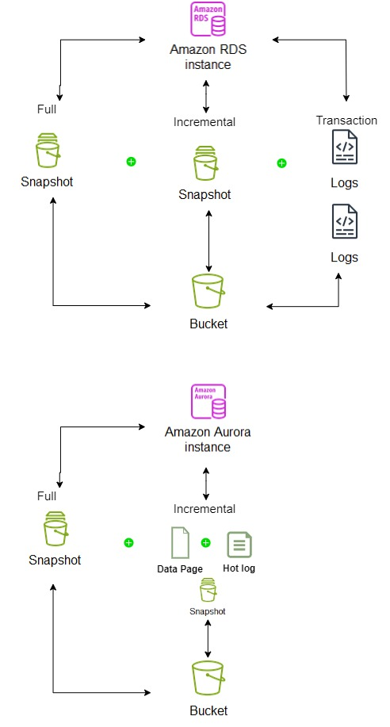

|ToC|
|---|

## Introduction
This article will look at how Amazon RDS databases support recovery from failure or disaster. We will cover the internal database mechanisms that facilitate database recovery from an AWS service failure as well as the AWS offerings that facilitate complete RDS database Disaster Recovery. Finally we will bring all of this information together to form an idea of what is possible utilising Amazon RDS to architect for a Zero Data loss solution.

## What does Zero Data Loss Disaster Recovery (ZDLDR) actually mean and why would it be needed?
Disaster Recovery is the act of recovering an impaired service after a failure event that effects the primary Availability Zone(s), Data Centre(s) or Region(s). That event could range from natural disasters, power cuts, and network outages to political activism stopping or impacting the data centres where servers and services are physically run from.

Recovery from failure and Testing of recovery procedures also forms part of the AWS Well-Architected Framework falling under the ‘Reliability’ Pillar. This is a core component of any AWS architected design so should be well understood.

 ‘Your resiliency strategy should also include Disaster Recovery (DR) objectives based on strategies to recover your workload in case of a disaster event.’ 

 Amazon RDS Disaster Recovery (DR) Data Loss scope is at the database level and measureable in time or database system change. We recovery the database and everything contained within to the same consistent point.

 Recovery from a Disaster, with Zero Data Loss or ZDLDR means that once the database is back in service it will carry on from the point of failure and hold all transactional history up until the point of failure. For instance if we lost an Availability Zone at 9:00am UTC, For a ZDLDR Solution we would want a DR Solution that could reinstate that database service as if it were 09:00am UTC again anything less could imply loss of new or changed data.

 A database with missing or out of date data may simply cause an application to cease to function as it should, report incorrect or missing data and could require complex manual intervention to rectify. The issue could further be impacted if the system continued to operate with the missing or incorrect data which then causes additional logical cascading data corruptions. 

 ## Cloud Enabled vs Cloud Native Databases
One of the key reasons to use a relational database service such as Amazon RDS is to ensure data is highly available and recoverable at all times. This is all provided by a managed service (PaaS) that facilitates the simple setup, configuration and administration of this called Amazon RDS.

Amazon RDS supports 5 different database engines as below:

These Amazon RDS Databases engines running generally fall into 2 categories
- Cloud Enabled
-	Cloud Native

Cloud Enabled Databases run using similar infrastructure and setup as if they were running on premise. In a way they are databases designed for an on premise environment and tailored to run on the cloud and utilise those great services that AWS provides. Amazon RDS which caters for engines Oracle, SQL Server, Postgres, MySQL and MariaDB can be considered Cloud Enabled offerings.

As depicted below these databases write to a standard non clustered EBS volume. Disaster Recovery can be provided by replication of the SAN or the Database to a second Availability Zone.

Cloud Native Database are designed from the ground up to utilise cloud features that are generally only available on the cloud. Amazon Aurora Postgres and Amazon Aurora MySQL (both of which are still part of the RDS family) can be considered cloud native database offerings. Aurora decouples the compute from the storage layer. The storage layer has extra efficiencies, safe guards and utilises multiple AZs to enhance high availability and DR. 

As depicted below Amazon Aurora RDS writes to clustered storage volume that spans across all 3 Availability Zones. The data is striped such that an Aurora database can be stood up for Disaster Recovery at any time in any Availability Zone within the same Region with no further replication or overhead. 

## Amazon RDS database Transaction Logging
Database engines journal change using their own internal tracking sequence. This internal Change or Sequence number can also be used as the target to restore databases or derive the clock time to restore a database if needed. In RDS Oracle this is known as the System Change Number (SCN) and other RDS Engines it’s referred to as Log Sequence Number (LSN). For a ZDLDR solution the SCN or LSN for a database would match prior to the disaster and after as well as the data.

Cloud Enabled Databases capture all change in logs also known as transaction or redo logs depending on the database engine. These logs are generally write ahead logs (WAL) so all data manipulation is first persisted to these logs then the underlying database files using a process known as Check pointing. This provides a mechanism for a database to roll forward all SCN or LSN changes in the WAL and recover its underlying files to be consistent after an ungraceful outage or server crash. Though any inflight transactions would be rolled back as they were not committed, this is a generally accepted model amongst Cloud Enabled database vendors and applications which results in Zero Data Loss.

RDS Cloud Native databases namely Amazon Aurora uses a clustered log structured distributed storage system. Once a change has occurred in the database, the log records are sent to the storage tier and added to an in memory queue. The database is then freed from any other overhead regarding management of these records. It falls to the Storage tier to take responsibility for persisting those records to disk and data page updates to reflect the change. As there is no transaction log or WAL as such on the database tier, there is no crash recovery phase when recovering from an ungraceful shutdown or crash, the data on disk is always upto date or log records to recreate current images exist on disk so again this results in Zero Data Loss.

## High Availability vs Backups vs Disaster Recovery 
One of the strengths of Amazon RDS is simplified and configurable Backup Automation, High Availability and Disaster Recovery options. This provides the capability to reinstate a failed database environment. But there are clear differences in their implementation, usage and potential for data loss.

The industry standard term for the amount of data loss a system can tolerate is known as the Recovery Point Objective (RPO). This is measured as a unit of time it could be seconds, hours or even days. An RPO of 0 would mean that a database could not tolerate any data loss.

High Availability is resilience to failure of individual services such as compute and storage. AWS by nature is highly available, if an EC2 fails due to an h/w issue this can be respawned on new h/w. EBS disks are resilient and striped. So we can expect Amazon RDS to be highly available as it’s built using this same reliable, fault tolerant infrastructure. As we have discussed earlier if there is an issue that crashes the database, the database should still restart with zero data loss. If an RDS Database is setup to run Multi AZ, RDS will automatically failover to a Disaster Recovery Site if one exists as well under many conditions.

Backups in Amazon RDS are based on EC2 Storage level Snapshots and for Cloud Enabled offerings this is coupled with transaction log backups every 5 minutes all automated when enabled and implicitly written to S3 Object bucket Storage. The initial Snapshot of a database will perform a full storage backup with subsequent Snapshots being forever incremental copying only changed disk blocks for speed and efficiency.

The Cloud Native Amazon Aurora backups are continuous and based on its intelligent storage clustered setup and how data changes are recorded, due to this we should be able to restore an Aurora database with no data loss as there is no transaction log backup needed, the transactions are part of the data persisted to disk across all 3 AZs. 

To restore a RDS Cloud Enabled database would need a restore of the full backup + incremental backup(s) + for Cloud Enabled database roll forward transaction logs. Potentially the RPO using Amazon Cloud Enabled RDS backups would be 5 minutes at most (the cadence of transaction log backups). 

To restore a RDS Cloud Native database would need a restore of the full backup + incremental backup(s), there are no transaction logs to restore, we should expect an RPO of 0 i.e. no data loss.

Disaster Recovery in Amazon RDS is based on Multi AZ or Multi Region database copies where we have a physically separate database copy located in a different physical location. This Database copy could be replicated using SAN or Database technologies with the latter protecting against disk corruptions. The replication used between database copies to keep them identical or near identical as possible could use asynchronous or synchronous replication depending on the replication technology used.

## Logical Replication vs Physical Replication
