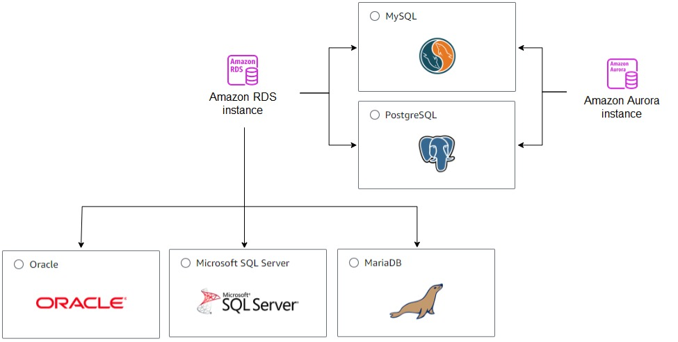
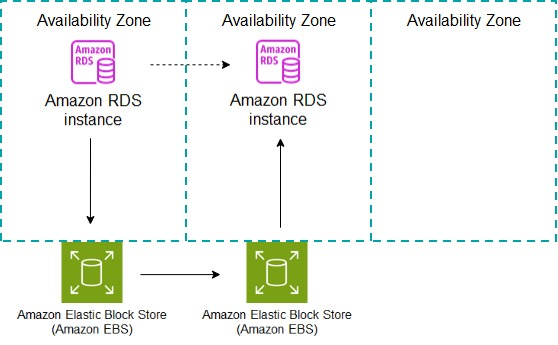
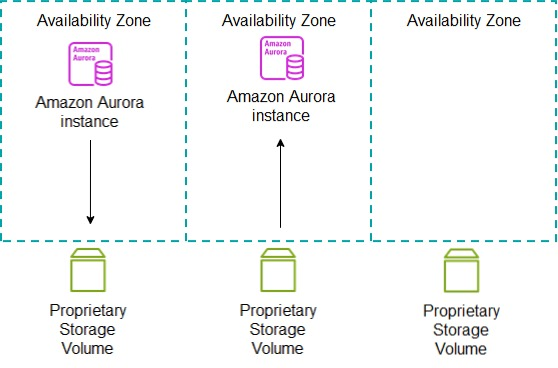
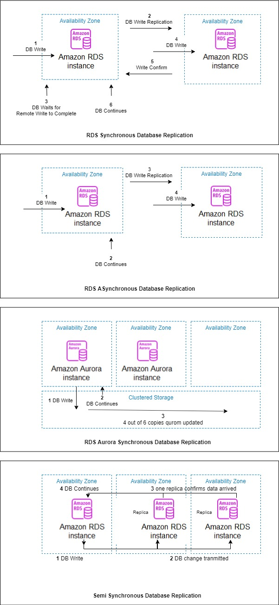
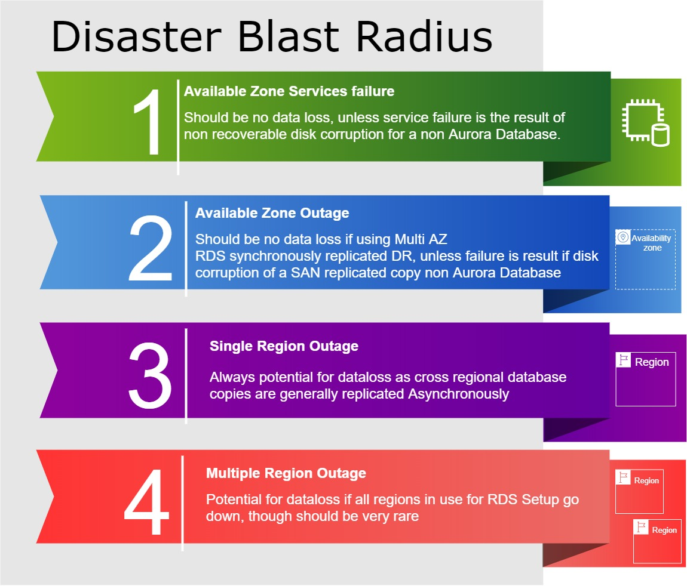

|ToC|
|---|

## Introduction
This article will look at how Amazon RDS databases support recovery from failure or disaster. We will cover the internal database mechanisms that facilitate database recovery from a service failure as well as the offerings that facilitate complete database disaster recovery. Finally we will bring all of this information together to form an idea of what is possible utilising Amazon RDS to architect for a zero data loss solution.

## What does Zero Data Loss Disaster Recovery (ZDLDR) actually mean and why would it be needed?
Disaster recovery is the act of recovering an impaired service after a failure event that effects the primary availability zone(s), data centre(s) or region(s). That event could range from natural disasters, power cuts, and network outages to political activism stopping or impacting the data centres where servers and services are physically run from.

Recovery from failure and testing of recovery procedures also forms part of the [AWS Well-Architected Framework](https://docs.aws.amazon.com/wellarchitected/latest/reliability-pillar/plan-for-disaster-recovery-dr.html) falling under the 'Reliability' Pillar. This is a core component of any AWS architected design so should be well understood.

 > Your resiliency strategy should also include Disaster Recovery (DR) objectives based on strategies to recover your workload in case of a disaster event.

 Amazon RDS disaster recovery data loss scope is at the database level and measureable in time or database system change. By database system change we are referring to the internal mechanism databases use to track change which will also be discussed later in this blog. We recover the database and everything contained within to the same consistent point in time or database system change number.

 Recovery from a disaster, with zero data loss or ZDLDR means that once the database is back in service it will carry on from the point of failure and hold all transactional history up until the point of failure. For instance if we lost an availability zone at 9:00am UTC, For a ZDLDR solution we would want a solution that could reinstate that database service as if it were 09:00am UTC again anything less could imply loss of new or changed data.

 A database with missing or out of date data may cause an application to cease to function as it should, report incorrect or missing data and could require complex manual intervention to rectify. The issue could further be impacted if the system continued to operate with the missing or incorrect data which then causes additional logical cascading data corruptions. 

 ## Cloud Enabled vs Cloud Native Databases
One of the key reasons to use a relational database service such as Amazon RDS is to ensure data is highly available and recoverable at all times. This is all provided by a managed service that facilitates the simple setup, configuration and administration of this.

Amazon RDS supports 5 different database engines as below:

These Amazon RDS Databases engines generally fall into 2 categories
- Cloud Enabled
- Cloud Native

Cloud enabled databases run using similar infrastructure and setup as if they were running on premise. In a way they are databases designed for an on premise environment and tailored to run on the cloud and utilise those great services that AWS provides. Amazon RDS which caters for engines Oracle, SQL Server, Postgres, MySQL and MariaDB can be considered cloud enabled offerings.

As depicted below these databases write to a standard non clustered EBS volume(s). Disaster recovery can be provided by replication of the physical SAN or the logical database to a second availability zone. Note we can also perform logical replication within the same availability zone as well.
  

  

Cloud native databases are designed from the ground up to utilise cloud features that are generally only available on the cloud. Amazon Aurora Postgres and Amazon Aurora MySQL (both of which are still part of the RDS family) can be considered a hybrid cloud native database offering. Aurora decouples the compute from the storage layer. The storage layer has extra efficiencies, safe guards and utilises multiple AZs to enhance high availability. 

As depicted below Amazon Aurora RDS writes to a clustered proprietary storage volume that spans across all 3 availability zones where 6 copies of the data will be present. The data is striped such that an Aurora database can be stood up for disaster recovery at any time in any availability zone within the same Region with no further replication or overhead. 
  

  
## Amazon RDS database Transaction Logging
Database engines journal change using their own internal tracking sequence. This internal change or sequence number can also be used as the target to restore databases or derive the clock time to restore a database if needed. In RDS Oracle this is known as the System Change Number (SCN) and other RDS Engines it's referred to as Log Sequence Number (LSN). For a ZDLDR solution the SCN or LSN for a database would match prior to the disaster and after as well as the data.
  
| Database Engine            | Internal Change Tracking   | Database Change log  |
|----------------------------|----------------------------|----------------------|
| Amazon RDS for MySQL       | Log Sequence Number (LSN)  | Binary/Redo Log           |
| Amazon RDS for PostgresSQL | Log Sequence Number (LSN)  | Transaction Log      |
| Amazon RDS for MariaDB     | Log Sequence Number (LSN)  | Binary/Redo Log           |
| Amazon RDS for Oracle      | System Change Number (SCN) | Redo Log             |
| Amazon RDS for SQL Server  | Log Sequence Number (LSN)  | Transaction Log      |

Cloud enabled databases capture all changes in logs also known as transaction, binary or redo logs depending on the database engine. These logs are generally [write ahead logs  (WAL)](https://en.wikipedia.org/wiki/Write-ahead_logging) so all data manipulation is first persisted to these logs then the underlying database files using a process known as check pointing. This provides a mechanism for a database to roll forward all SCN or LSN changes in the WAL(s) and recover its underlying files to be consistent after an ungraceful outage or server crash. Though any inflight transactions would be rolled back as they were not committed, this is a generally accepted model amongst cloud enabled database vendors and applications which results in zero data Loss. This is depicted below in Figure 4.
  

  
RDS Cloud Native databases namely Amazon Aurora uses a clustered log structured distributed storage system. This means once a change has occurred in the database, the log records are sent to the storage tier and added to an in memory queue. The database is then freed from any other overhead regarding management of these records. It falls to the Storage tier to take responsibility for persisting those records to disk and data page updates to reflect the change. As there is no transaction log or WAL as such on the database tier, the crash recovery phase is minimal when recovering from an ungraceful shutdown or crash. The data on disk is always upto date or log records to recreate current images exist on disk to be applied in parallel and asynchronously this results in Zero Data Loss. This is depicted below in Figure 5. It should also be noted Auroras database working memory area called a page cache is also decoupled from the database so it can independently survive a database crash and be reused once the database is back.
  

  
## High Availability vs Backups vs Disaster Recovery 
One of the strengths of Amazon RDS is a simple and configurable backup solution, high availability and disaster recovery options. This provides the capability to reinstate a failed database environment. But there are clear differences in their implementation, usage and potential for data loss.

The industry standard term for the amount of data loss a system can tolerate is known as the [Recovery Point Objective (RPO)](https://docs.aws.amazon.com/wellarchitected/latest/reliability-pillar/disaster-recovery-dr-objectives.html). This is measured as a unit of time it could be seconds, hours or even days. An RPO of 0 would mean that a database could not tolerate any data loss.

High availability is resilience to failure of individual services such as compute and storage. AWS by nature is highly available ([as long as best practices are followed](https://docs.aws.amazon.com/whitepapers/latest/disaster-recovery-workloads-on-aws/shared-responsibility-model-for-resiliency.html)), if an EC2 Instance fails due to an hardware issue this can be respawned on new hardware. EBS disks are resilient and striped. So we can expect Amazon RDS to be highly available as it's built using this same reliable, fault tolerant infrastructure. As we have discussed earlier if there is an issue that crashes the database, the database should still restart with zero data loss. If an RDS database is setup to run as Multi AZ, RDS will automatically failover to the disaster recovery site as well under many conditions. Using Multi AZ will provide an RPO of 0 due to synchronous replication.

Backups in Amazon RDS are based on EC2 instance storage level snapshots and for cloud enabled offerings this is coupled with transaction log backups every 5 minutes all automated when enabled and implicitly written to S3 object bucket Storage. The initial snapshot of a database will perform a full storage backup with subsequent snapshots being forever incremental copying only changed disk blocks for speed and efficiency.
  
| Backup                              | Cadence                 |
|-------------------------------------|-------------------------|
| Full Physical                       | One off Initial Backup  |
| Incremental Physical                | Daily Backup Window     |
| Cloud Enabled Transactional Logical | Every 5 Minutes         |
| Cloud Native Transactional Logical  | Continuous              |

  
The hybrid cloud native Amazon Aurora backups are continuous and based on its intelligent storage clustered setup and how data changes are recorded. Though the earliest restore time using these backups for Aurora is also typlically 5 minutes minus the current time. Due to the very high availability of Amazon Aurora storage the use of backups as a last resort should be a very rare occurance.

To restore a RDS Cloud enabled database would need a restore of the full backup + incremental backup(s) + for cloud enabled database the roll forward of the transaction logs. Potentially the RPO using Amazon cloud enabled RDS backups would be 5 minutes at most (the cadence of transaction log backups). This would only be applicable if not using Multi AZ to reinstate the database.

To restore a RDS hybrid cloud native database would need a restore of the full backup + incremental backup(s), there are no transaction logs to restore, we should expect an RPO of 0 under normal circumstances as the data is highly available and replicated, though as noted above backups could be 5 minutes behind, so as long as Aurora is still available that 5 minutes is less of an issue due to the high availability of data across 3 availability zones.
  

  
Disaster recovery in Amazon RDS is based on Multi AZ or Multi Region database copies where we have a physically separate database copy located in a different physical location. This database copy could be replicated using SAN or database technologies with the latter protecting against disk corruptions. The replication used between database copies to keep them identical or near identical as possible could use asynchronous, synchronous, semi-synchronous or synchronous clustered replication depending on the replication technology used and DR setup.

| Replication Method    | Description                                                                                                                   |
|-----------------------|-------------------------------------------------------------------------------------------------------------------------------|
| Asynchronous          | Send changes to a second site but do not wait for them to be applied                                                          |
| Synchronous           | Send changes to a second site but  wait for them to be applied                                                                |
| Semi-Synchronous      | Send changes to two sites but  wait for them to be received by at least one of the sites                                        |
| Synchronous-Clustered | Send changes too clustered disk across 3 AZ's, at least 4 copies of the changes must persist on disk with eventually 6 copies  |
  
## Logical Replication vs Physical Replication
 'How' we replicate RDS databases for DR as described above is generally considered to be either 
 - Synchronous (SYNC) where we wait for data to be committed on both the primary RDS database in its AZ and standby RDS database in a different AZ before continuing
 - Asynchronous(ASYNC) where we  send the data from the primary RDS database in its AZ to the standby RDS database in a different AZ but do not wait for data to be committed.
 - Semi-Synchronous (SEMI-SYNC) which requires 2 replica's to support the primary database, the commit is only considered persisted when 1 of the 2 replica's has confirmed the changes have been received. Note we say received not applied so in theory a double outage of both the primary and replica in receipt of change may still have a chance of data loss.

  Amazon Aurora also provides a 4th method
  - Synchronous Clustered (SYNC-CLUST) where the decoupled storage performs replication with no direct waiting by the compute tier.

These 4 types of replication are depicted below:
  

  
'What' we replicate could be either:

- Using a physical DR copy, where the replication is at the SAN Level tracking disk block changes. This type of replication is always synchronous. Within Amazon RDS this is referred to as Multi AZ replication and is only supported using Multi AZ not Multi Region. One of the drawbacks of physical replication is that it will replicate disk corruptions. Persisted disk corruptions should be considered a very rare occurrence but never the less they need to be catered for. As physical replication uses SYNC replication we can assume an RPO of 0 when not dealing with disk corruptions.

- Using a logical DR copy, where the replication is at the database level tracking transactional changes. This can be either synchronous, asynchronous or semi-synchronous where supported. One of the key advantages of logical replication is that it supports both cross AZ and cross region replication. Logical database copies are referred to as replica copies. For a logical DR copy disk corruption should not be replicated and this is key point for any ZDLDR solution. If the logical replication is asynchronous it has the potential to drift (lag) behind the primary site, but this doesn't necessarily mean data loss if site switches are planned or graceful.

- Using a clustered physical copy, where the replication is handled by the intelligent storage tier mirroring multiple copies of data across all available AZs. This is only supported for Amazon Aurora which uses a clustered decoupled storage layer, here the physical replication must be replicated at least 4 ways across all available AZs to be considered in sync and eventually 6 ways, it uses what's called a 4 of 6 Quorum for writes. Due to the always synchronous clustered storage replication of Aurora we can assume an RPO of 0. We should note that Amazon Aurora clustered replication is only supported within the same region, though cross regions replication is supported asynchronously. Disk corruptions present on Amazon Aurora will selfheal from one of the healthy copies of the data, there will be a minimum of 4 copies and eventually 6 so this is very effective against disk corruption. 

## RDS Replicas
A replica in Amazon RDS or Amazon Aurora represents a database that also has the potential to be used as an additional read only copy of the live database while still being continually updated with all changes. Using Amazon RDS Oracle there is an extra license fee to provision a read only replica known as Active Dataguard. Hence with this database engine we can also have the replica in recovery mode only not accessible for read only access where that license fee is then not required this is called a mounted replica. Amazon Aurora replicas are based on the decoupled clustered storage that is automatically replicated across all AZs but the replication thereafter is considered asynchronous as the replicas are kept updated with native database replication. For disaster recovery though Aurora would rely on its decoupled storage for an RPO of 0. Furthermore for Amazon Aurora we don't even need to stand up a replica as the potential to create one is still there at any time as the data is clustered across all available AZs to facilitate that.

Logical replication can be 
- Asynchronously for cloud enabled RDS replica's RDS Oracle, RDS Postgres, RDS MySQL and RDS MariaDB.
- Semi-Synchronously if using RDS Postgres or RDS MySQL with 2 replica's
- Synchronous using RDS SQL Server which utilises a feature called 'Always On' or 'Mirroring' where the replication to the secondary site is a logical synchronous apply under the covers.
- Synchronous using Oracle RDS Custom, where we are able to access the underlying operating system and also make certain customisations that are not possible under normal Amazon RDS Regular. One of the customisations that is possible for Oracle is to setup for logical synchronous replication.
 
## Database support for Logical Synchronous Replication
We can see below which database engines support SYNC and SEMISYNC replication so therefore potentially an RPO 0 depending on the replication type. Note if using Oracle RDS Custom we could setup a similar setup to emulate SEMI-SYNC if needed.

| Database Engine              | Storage Sub System | Multi AZ SAN Physical Replication Support (SYNC) | Multi AZ DB Replica Logical Replication Support (SYNC) | Multi AZ DB Replica Logical Replication Support (SEMI-SYNC)  |
|------------------------------|--------------------|--------------------------------------------------|--------------------------------------------------------|--------------------------------------------------------------|
| Amazon Aurora MySQL          | Multi AZ Clustered | Implicit                                         | No                                                    | No                                                           |
| Amazon Aurora Postgres       | Multi AZ Clustered | Implicit                                         | No                                                    | No                                                           |
| Amazon RDS for MySQL         | Single AZ Striped  | Yes                                              | No                                                     | Yes                                                          |
| Amazon RDS for PostgresSQL   | Single AZ Striped  | Yes                                              | No                                                     | Yes                                                          |
| Amazon RDS for MariaDB       | Single AZ Striped  | Yes                                              | No                                                     | No                                                           |
| Amazon RDS for Oracle        | Single AZ Striped  | Yes                                              | No                                                     | No                                                           |
| Amazon RDS for SQL Server    | Single AZ Striped  | Yes                                              | No                                                     | No                                                           |
| Amazon RDS Custom Oracle     | Single AZ Striped  | No                                               | Yes                                                    | Yes                                                          |
| Amazon RDS Custom SQL Server | Single AZ Striped  | Yes                                              | Yes                                                    | No                                                           |

  
Its worth stating the database edition can impact what choices are available, for RDS Oracle logical replicas are only available using enterprise edition. For other Amazon engines including SQL Server logical replicas are available under both standard and enterprise editions.

We should also note that logical and physical DR databases are not mutually exclusive. We could have both a logical replica(s) and a Multi AZ physical copy for the same source database and in fact this may provide a more complete DR setup.

## RDS Custom for Oracle and SQLServer
Amazon RDS provides a lower level offering called RDS Custom for database engines Oracle and SQLServer. With this offering we gain access to the underlying compute servers o/s. Being able to access the compute also allows us to make customisations to the RDS Engine and its configuration not possible under normal RDS. With regard to disaster recovery the ability to configure synchronous logical replication for Oracle is relevant for us as a ZDLDR Solution. RDS Custom also gives SQLServer the ability for physical synchronous Multi AZ configurations which is not possible under standard RDS, but this won't protect against disk corruptions.

## Disaster Blast Radius
Not all failures require disaster recovery on Amazon RDS. For an RDS database the implicit services that support the database are:
  
  | Service    | Description                            |
|------------|----------------------------------------|
| Amazon RDS | Database s/w running                   |
| EC2        | Compute that the database s/w runs on  |
| EBS        | Storage that holds the data and s/w    |
| KMS        | keys to support database encryption    |
| S3         | storage to support  Database backups   |

Let's refer to this as Level 1, a failure at Level 1 should not require disaster recovery in general, but may invoke it for a faster recovery if using a Multi AZ is setup. There should be zero data loss as each of these services is generally self-healing or highly redundant. 

EBS volumes where our database s/w and data is stored is redundant and highly available, but there is an edge case where it could be susceptible to disk corruption. With modern disk drives, implicit integrity checks by the database software, operating systems and actual drives themselves this should be considered very rare, but still a possibility. The ability to deal with disk corruption will form a crucial role in achieving a ZDLDR solution.

In general a Level 1 failure should not result in potential data loss unless there is a disk corruption, but even disk corruption to some degree can be minimised depending on how Multi AZ copies or replicas are created.

The next level of failure would be an entire availability zone failure, let's call this a failure at Level 2. A Level 2 failure would need a disaster recovery site to continue the operation of the database service. If using a Multi AZ database setup then there should be no data loss for synchronously, semi-synchronously or synchronously-clustered replicated databases. For asynchronously replicated database there could be some lag and potential data loss. For semi-synchronously replicated databases there should be zero dataloss if no further impacting issue on the site that has confirmed receipt of the changes. If there is no multi AZ RDS database then it's also possible to use backups to reinstate the database service but these could be upto 5 minutes behind the lost site.

The next level of failure would be loss of an entire region(s), let's call this a failure at Level 3. A Level 3 failure always has the potential for data loss, as database replication across regions will most likely be asynchronous due to the distances data must travel to be replicated. Multi region backups will lag even further behind the live Region as well. We could possibly assume an RPO of minutes for cross region DR, though this is dependent on speed, distance and database load activity.

The last level of failure would be an entire AWS outage of all regions let's call this a Level 4 failure. This should be extremely rare but can be mitigated by a hybrid or multi cloud DR strategy. There would also be a higher likelihood of data loss due to such replication being asynchronous. Also for Amazon RDS this would only be supported using a RDS Custom Engine as it would require low level customisations for such DR that only the Custom offering of RDS supports. Though regular RDS could take manual backups and push these to a target environment as well but the RPO could be very high for that.
  

  
It should be evident that a true ZDLDR solution is only possible at a Level 1 and Level 2 events as the other Levels utilise asynchronous replication. 

## Architecting for Zero Data Loss Conclusions
Now we know how Amazon RDS databases work and what options are available we can define the possible solutions for architecting a ZDLDR solution. For Amazon RDS databases the DR copy must be a logical synchronous or semi-synchronous replica to cater for edge case disk corruption issues. For Amazon Aurora databases ZDLDR is there out of the box due to its unique cloud native storage layer.

For Oracle Using Amazon RDS Custom there is support for logical synchronous replication and therefore ZDLDR can be achieved.

We can only achieve ZDLDR at level 1 single AZ or level 2 multi AZ events as these are the only events that are either self-healing or support synchronous replication. Multi Region replication will usually be asynchronous due to large distances we must replicate across.

Putting all of this together we can derive which RDS configuration will support ZDLDR as detailed in the table below.

| Engine                          | Zero Dataloss Disaster Recovery                                                                                                 |
|---------------------------------|---------------------------------------------------------------------------------------------------------------------------------|
| Amazon RDS MySQL                | Possible to achieve ZDLDR using Semi-Synchronous Replication of a Logical DR t o 2 sites                                         |
| Amazon RDS MariaDB              | Not Possible as Logical Synchronous Replication is not Supported Physical replication could be susceptible  to Disk Corruption  |
| Amazon RDS PostgreSQL           | Possible to achieve ZDLDR using Semi-Synchronous Replication of a Logical DR t o 2 sites                                         |
| Amazon RDS Oracle EE            | Not Possible as Logical Synchronous Replication is not Supported Physical replication could be susceptible  to Disk Corruption  |
| Amazon RDS Oracle Custom EE     | Possible to achieve ZDLDR using Synchronous Replication of a Logical DR site                                                    |
| Amazon RDS Oracle SE2           | Not Possible as Logical Synchronous Replication is not Supported Physical replication could be susceptible  to Disk Corruption  |
| Amazon RDS SQL Server SE        | Possible to achieve ZDLDR using Synchronous Replication of a Logical DR site                                                    |
| Amazon RDS SQL Server EE        | Possible to achieve ZDLDR using Synchronous Replication of a Logical DR site                                                    |
| Amazon RDS SQL Server SE Custom | Possible to achieve ZDLDR using Synchronous Replication of a Logical DR site                                                    |
| Amazon RDS SQL Server EE Custom | Possible to achieve ZDLDR using Synchronous Replication of a Logical DR site                                                    |
| Amazon Aurora PostgreSQL        | ZDLDR is supported out of the box due to decoupled clustered storage                                                            |
| Amazon Aurora MySQL             | ZDLDR is supported out of the box due to decoupled clustered storage                                                            |

  
## Architecting for Near Zero Data Loss
The purpose of this article is architecting for ZDLDR, but we can reduce the likelihood of data loss for those Engines that do not support a logical synchronous or semi-synchronous replica or run on Amazon Aurora. Using a Multi AZ with one standby replica. This would create a defence against disaster with the Multi AZ SAN copy being used in the majority of DR scenarios. The replica would exist to support edge case disk corruption with the acceptance it will run ASYNC so could lag behind, but even so it would provide extra recoverability options and also potentially provide the opportunity to off load reporting if used as a read replica. Databases using this setup would have the protection of 3 AZ's providing further protection against disaster. This is similar to semi-synchronous replication supported by RDS MySQL and RDS Postgres but you have then benefit of both types of DR SAN and DB replication supporting your HA. Though the SAN replicated site won't protect against disk corruption it could be used to reinstate data that is not corrupt into the DB replicated database using database native export tools.
  

  
## Summary
Architecting for Zero Data Loss is certainly a possibility utilising Amazon RDS, due to edge case disk corruption only logical synchronous replicas, semi-synchronous replicas or Amazon Aurora can be considered to cater for this. The cloud enabled enterprise class database giants that are Oracle and SQL Server both support this using one extra DR Site. RDS MySQL and RDS Postgres also support ZDLDR under most circumstances but requires 2 replica DR Sites. But what truly stands out is the hybrid cloud native offering from Amazon Aurora which is out of the box ready to support zero data loss disaster recovery from day 0 across 3 sites. If a ZDLDR solution can't be used then we can achieve a near ZDLDR solution utilising Multi AZ replication with an additional replica across all 3 AZs.

## Further Reading and References
- Documentation
  - [Amazon RDS: High Availability](https://aws.amazon.com/rds/ha/)
  - [Amazon RDS: High Multi AZ Overview](https://aws.amazon.com/rds/features/multi-az/)
  - [Amazon RDS: High Multi AZ Concepts](https://docs.aws.amazon.com/AmazonRDS/latest/UserGuide/Concepts.MultiAZ.html) 
  - [Amazon RDS: High Multi AZ Single Standby](https://docs.aws.amazon.com/AmazonRDS/latest/UserGuide/Concepts.MultiAZSingleStandby.html)     
  - [Amazon RDS: High Multi AZ Clusters](https://docs.aws.amazon.com/AmazonRDS/latest/UserGuide/multi-az-db-clusters-concepts.html)   
  - [Amazon RDS: High Multi AZ SQLServer User Guide](https://docs.aws.amazon.com/AmazonRDS/latest/UserGuide/USER_SQLServerMultiAZ.html)    
  - [Amazon RDS: High Multi AZ SQLServer RDS Custom User Guide](https://docs.aws.amazon.com/AmazonRDS/latest/UserGuide/custom-sqlserver-multiaz.html)
  - [Amazon: What is Disaster Recovery](https://aws.amazon.com/what-is/disaster-recovery/)    
  - [AWS: Well-Architected Framework Reliability Pillar](https://docs.aws.amazon.com/wellarchitected/latest/reliability-pillar/welcome.html)
- White Papers
  - [Amazon: Disaster Recovery options in the Cloud](https://docs.aws.amazon.com/whitepapers/latest/disaster-recovery-workloads-on-aws/disaster-recovery-options-in-the-cloud.html)
- Videos
  - [AWS re:Invent 2020: Amazon Aurora storage demystified](https://www.youtube.com/watch?v=0IeLKyBl3CM)  
  - [AWS: Exploring High Availability Using RDS for SQL Server Always On](https://www.youtube.com/watch?v=ZKOo2OFloYs)
- How To Guides
  - [Amazon RDS: Multi AZ Single Standby](https://docs.aws.amazon.com/AmazonRDS/latest/UserGuide/Concepts.MultiAZSingleStandby.html)
  - [Amazon RDS: Read Replica](https://docs.aws.amazon.com/AmazonRDS/latest/UserGuide/USER_ReadRepl.html#USER_ReadRepl.Create)
  - [Amazon RDS: Multi AZ Cluster](https://docs.aws.amazon.com/AmazonRDS/latest/UserGuide/create-multi-az-db-cluster.html)
  - [Amazon RDS: Oracle Replica using RDS Custom](https://aws.amazon.com/blogs/database/build-high-availability-for-amazon-rds-custom-for-oracle-using-read-replicas/)  