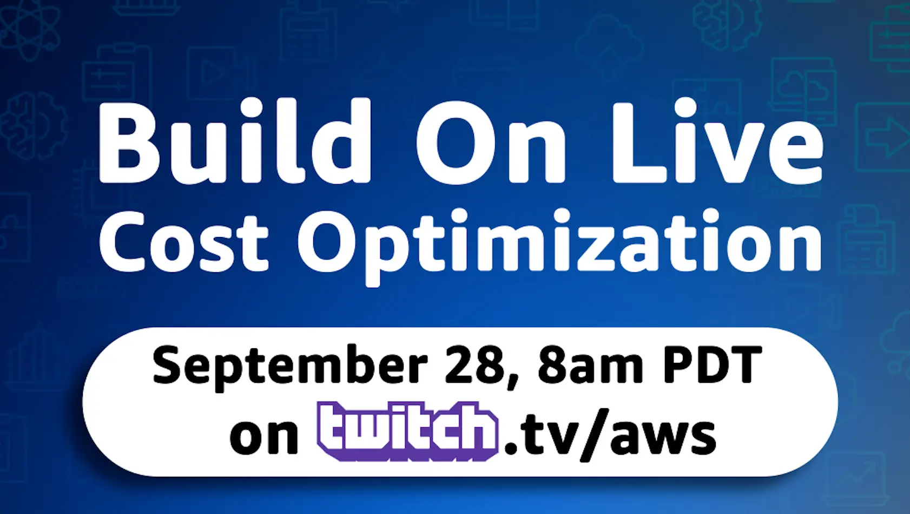
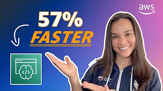

#### Upcoming Build On Live Events 📆

Build On Live | Cost Optimization is coming coming **September 28th** LIVE on Twitch 🥳

Make sure to click the 'Remind me' [here](https://bit.ly/3qPXTVT) to get notified when we go live!

#### Hungry for some On Demand Videos? 🤔

Interested in checking out how [Amazon CodeWhisperer](https://aws.amazon.com/codewhisperer/?sc_channel=el&sc_campaign=livestreams&sc_geo=mult&sc_country=mult&sc_outcome=acq&sc_content=livestream-spaces) works? Looking to learn how generative AI can help you code? Make sure to check [this series of videos](https://www.youtube.com/playlist?list=PLDqi6CuDzubxQNgWvIA641SBSsbEVuVmt) by the most amazing Tiffany, over at the [Build On AWS YouTube Channel](https://www.youtube.com/@BuildOnAWS/playlists). (Do not forget to hit like 👍 and subscribe ♥️).

#### Stream with us

Have you built something interesting recently that you’d like to show the world about? Have you solved some niche, yet critical, aspect of the entire workflow for foundation models on AWS? Did you write a cool program to generate millions of images or anything in-between?

Join us as a guest speaker on our weekly Twitch show, [Build on Generative AI](https://community.aws/livestreams/build-on-generative-ai). Every Monday at 9am PST / 12pm EST / 5pm BST we cover new angles about foundation models on AWS. Last season, available here, covered 20+ topics across the entire lifecycle.

Submit your ideas [**HERE**](https://www.pulse.aws/application/TJIL4871s)

