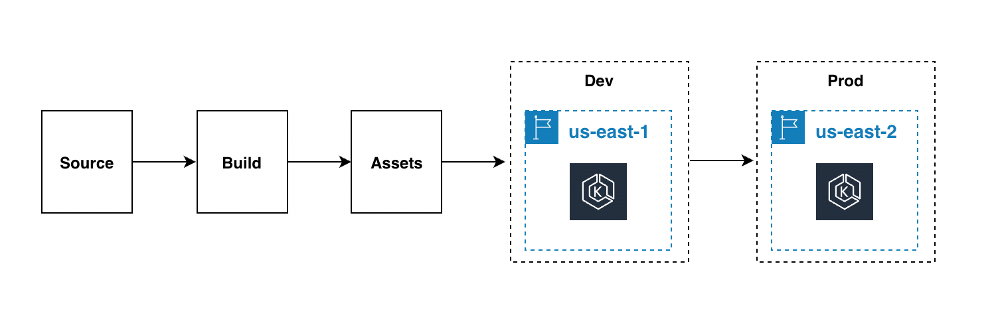
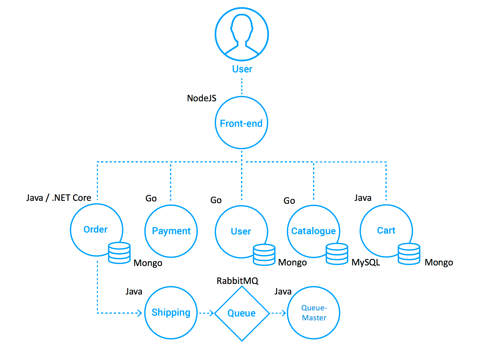
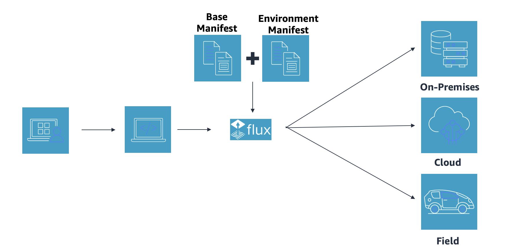
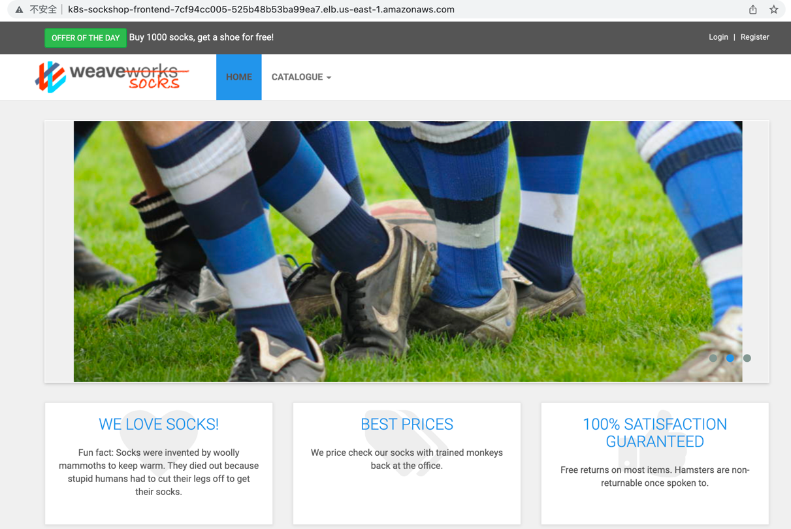
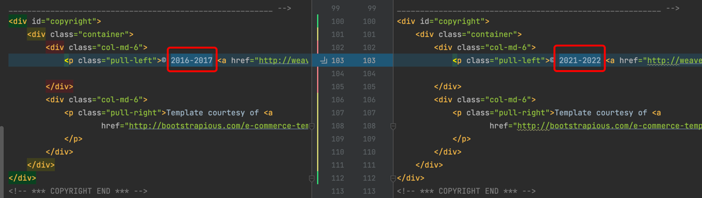
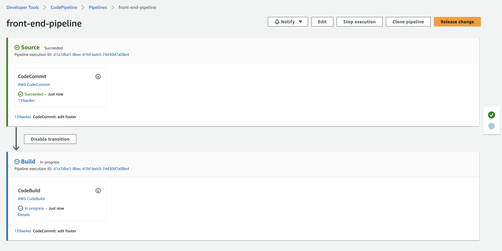
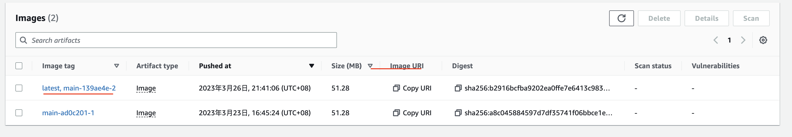
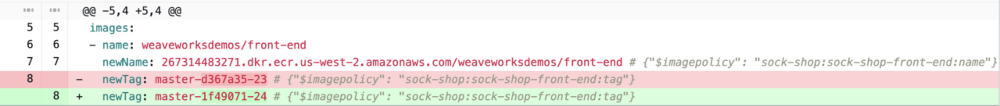

While many enterprise companies have adopted Kubernetes in their production, they are often confused about how to achieve continuous deployment, high security, permission separation, and auditing - all while ensuring business agility with multiple Kubernetes clusters running at different stages simultaneously. Using GitOps can enable such continuous deployment based on Kubernetes clusters, while meeting enterprise-level requirements such as security and permission separation.

In this blog, we will implement GitOps in an Amazon EKS environment using AWS CodeCommit, AWS CodePipeline, and Flux. We will demonstrate in detail how to set up a GitOps workflow that meets production requirements in this Amazon EKS environment, and we'll show how microservice applications acheive continuous integration and continuous delivery on the GitOps-style CI/CD pipeline.

But before we get into the best practices and the tutorial itself, let's synchronize on what GitOps is and why GitOps best practices matter in the first place.

## What is GitOps?

GitOps is a way of implementing Continuous Deployment for cloud native applications. It focuses on a developer-centric experience when operating infrastructure by using tools with which developers are already familiar - including Git and Continuous Deployment tools.

The core idea of GitOps is to have a Git repository that always contains declarative descriptions of the infrastructure currently desired in the production environment and an automated process to make the production environment match the described state in the repository. If you want to deploy a new application or update an existing one, you only need to update the repository. The automated process handles everything else. It’s like having cruise control for managing your applications in production.

GitOps has the following features compared to traditional continuous deployment.

| Traditional CD                                               | **GitOps**                                             |
| :----------------------------------------------------------- | ------------------------------------------------------ |
| Triggered by push events, such as code commits, timed tasks, manual, etc. | System constantly polls for changes                    |
| Deployment of changes only                                   | Declared the entire system for any deployment          |
| System would drift between deployments                       | The system will correct any drift                      |
| Access to the deployment environment is a requirement        | Deployment pipeline is authorized to run within system |

## Why use GitOps?

GitOps is the best way to implement continuous deployment of Kuberentes-based clusters. The main reason is that we can go through the details of GitOps specific practices on Kuberentes.

Based on the GitOps method, Git is the only actual source of the required state for the system. It supports repeatable and automated deployment, cluster management, and monitoring. Developers reuse Git workflows that are well-established in the enterprise for building, testing, scanning, and other continuous integration steps. Once the final state of the system is declared in the main Git repository branch, the GitOps tool chain is used to verify/deployment, observe/alerts, and fix/operations. The process is like below:

)

## Amazon EKS-based Best Practices for GitOps 

The overall CI/CD pipeline, according to best practices, is shown in the figure below.


There are three code repositories under the CodeCommit repository. One is `flux-repo`, the configuration repository for Flux CD, which is used to define Flux-related resources. The other is `microservices-repo`, which saves microservice application configurations and deployment files. The third one is the source repository `app-repo` for business services. In this post, a front-end project will be used as an example. We used CodePipeline for continuous integration in the CI/CD pipeline, built and stored the docker image in Amazon ECR, and deployed the CD engine Flux as a pod in the Amazon EKS environment.

**The basic workflow is:**

1. Coding engineers write code and push the final code to app-repo.
2. Code changes in the app-repo trigger AWS CodePipeline.
3. AWS CodePipeline edits and packages code, generates container images, and pushes them to the container image repository/Amazon ECR.
4. The CD engine Flux, running in the EKS environment, regularly scans the ECR container image repository and pulls container image metadata for applications.
5. The new container image address is automatically synced to the application deployment file stored in microservices-repo via git commit/push when a new version of the container image detected.
6. Flux regularly pulls application configurations and deployment files from the Flux-repo. Since the Flux-repo repository references the microservices-repo, Flux checks the consistency of the workload running state of the cluster with the expectations described in the microservices-repo files. If there is any difference, Flux will automatically enable the EKS cluster to synchronize the differences to ensure that workloads run in the expected state.

**Table of Best Practices**

Since we have explained the GitOps concept and the architecture of the CI/CD pipeline, we will use a case to complete this practice by going through the four modules below:

1. Deploy the cloud infrastructure using Infrastructure as Code (IaC)
2. Deploy Flux CD on AWS EKS cluster
3. Deploy GitOps workflow using Flux CD
4. Implement automatic deployment based on images using GitOps workflow

### 1．Deploy Cloud Infrastructure with IaC

One of the fundamental principles of DevOps is that infrastructure gets **equal status** with codes. Infrastructure as Code (IaC) uses code to enable cloud infrastructure deployment and governance of the cloud environment. Coding engineers use configuration files or codes to define the infrastructure and create it by coding to ensure the consistency and repeatability. With IaC, coding engineers also manage the lifecycle of resources, such as hosting infrastructure definitions in version control repositories, and using Continuous Integration/Continuous Deployment (CI/CD) that is compatible with app coding for changing the definition of IaC, synchronizing the environments (e.g., development, testing, production) with the changes of the IaC codes. Additionally, automatic rollback is possible in case of failures, and drift detection helps to identify differences from the expected state.

In the cloud, coding engineers can use the AWS Cloud Development Kit (CDK) to build their infrastructure model with Python, Java, and Typescript. CDK provides advanced components called Constructs, which preconfigure cloud resources with validated default values. It also allows engineers to write and share their custom constructs according to their organization's requirements. All of these will accelerate projects.

#### 1.1 Create a Project with CDK CLI

Create a TypeScript CDK project with cdk init, which will create the folder structure and install the modules that TypeScript CDK project needs.

```shell
cdk init --language typescript 
```

#### 1.2 Create an EKS Cluster with EKS Blueprints

**[EKS Blueprints](https://aws-quickstart.github.io/cdk-eks-blueprints/)** helps you compose complete EKS clusters that are fully bootstrapped with the operational software that is needed to deploy and operate workloads. With EKS Blueprints, you describe the configuration for the desired state of your EKS environment, such as the control plane, worker nodes, and Kubernetes add-ons, as an IaC blueprint. Once a blueprint is configured, you can use it to stamp out consistent environments across multiple AWS accounts and Regions using continuous deployment automation.

You can use EKS Blueprints to easily bootstrap an EKS cluster with Amazon EKS add-ons as well as a wide range of popular open-source add-ons, including Prometheus, Karpenter, Nginx, Traefik, AWS Load Balancer Controller, Fluent Bit, Keda, ArgoCD, and more. EKS Blueprints also helps you implement relevant security controls needed to operate workloads from multiple teams in the same cluster.

Run the following codes to install project dependencies.

```shell
npm install @aws-quickstart/eks-blueprints
```

Open `lib/quickstart-stack.ts` and write the EKS Blueprints codes.

```ts
import * as cdk from 'aws-cdk-lib';
import { Construct } from 'constructs';
import * as blueprints from '@aws-quickstart/eks-blueprints';
import { KubernetesVersion } from 'aws-cdk-lib/aws-eks';

export class QuickstartStack extends cdk.Stack {
  constructor(scope: Construct, id: string, props?: cdk.StackProps) {
    super(scope, id, props);
    const account = props?.env?.account!;
    const region = props?.env?.region!;

    const clusterProvider = new blueprints.GenericClusterProvider({
      version: KubernetesVersion.V1_23,
      managedNodeGroups: [
        {
          id: "default-ng",
          desiredSize: 2,
          minSize: 1,
          maxSize: 2,
        }
      ]
    });

    const cluster = blueprints.EksBlueprint.builder()
      .clusterProvider(clusterProvider)
      .account(account)
      .region(region)
      .addOns(
        new blueprints.AwsLoadBalancerControllerAddOn,
      )
      .teams();
  }
}

```

In the above codes, we created an EKS cluster, defined its NodeGroup, and added the AwsLoadBalancerController plugin.

> **Note**
> 
> **Best Practice:** We recommend customizing the cluster parameters via clusterProvider and adding plugins through the built-in addOns in EKS Blueprints.



While deploying a stack with a CDK command-line tool is convenient, we recommend setting up an automated pipeline for deploying and updating the EKS infrastructure. This makes it easier to deploy development, testing, and production across regions.

CodePipelineStack is a structure for continuous delivery of AWS CDK applications. When the source code of an AWS CDK application is uploaded to Git, the stack automatically builds, tests, and deploys new versions. If any application stage or stack is added, it will automatically reconfigure itself to deploy these new stages or stacks.

> **Note**
> 
> **Best Practice:** Defining infrastructure with CDK code and using pipelines to manage changes across multiple clusters that is also a manifestation the GitOps concept.

Then, we execute the `cdk deploy` command to deploy the stack.

Finally, we used a command to check whether the AWS Application Load Balancer has been installed successfully.
```shell
$ kubectl get pod -n kube-system
NAME                                           READY   STATUS    RESTARTS   AGE
aws-load-balancer-controller-6bd49cfb7-2cvlk   1/1     Running   0          5m31s
aws-load-balancer-controller-6bd49cfb7-7lcwd   1/1     Running   0          5m31s
aws-node-9hsvz                                 1/1     Running   0          99m
coredns-66cb55d4f4-gdcqg                       1/1     Running   0          106m
coredns-66cb55d4f4-gmzjt                       1/1     Running   0          106m
kube-proxy-wr5jn                               1/1     Running   0          99m
```

#### 1.3 Summary

This section introduced the concept of IaC and helped create a custom EKS cluster with CDK while installing the AWS Application Load Balancer plugin, providing a prerequisite for accessing the web pages of microservices in the future. The following is a summary of this section:

- Initialized a CDK project using cdk init.

- Defined an EKS cluster quickly with EKS Blueprint while adding the AWS Application Load Balancer plugin.

### 2．Deploy Flux CD on Amazon EKS Cluster

Flux CD is a continuous delivery tool that was developed by Weaveworks and open sourced to CNCF. Today it is widely used because of its easy setup and its ability to sense Kubernetes changes. One important feature is also that it allows teams to manage their Kubernetes deployments in a declarative way. Flux CD synchronizes the Kubernetes manifest files stored in the source repository with the Kubernetes cluster by regularly polling the repository, and teams don't have to worry about running kubectl or monitoring the environment to see if they have deployed the right workload. Flux CD ensures that the Kubernetes cluster always stays in sync with the configuration defined in the source repository.

So let's install Flux.

#### 2.1 Flux CLI Installation

The Flux CLI is a binary executable file for all platforms, which can be downloaded from the GitHub release page.
```shell
curl -s https://fluxcd.io/install.sh | sudo bash
```

#### 2.2 Prepare AWS CodeCommit Credentials
Create a user in our experiment and use CodeCommit as the Git source, we need HTTPS Git credentials for AWS CodeCommit.

#### 2.3 Install Flux on the Cluster
Clone the prepared GitOps codes. The project structure is as follows:

```shell
.
├── apps                // Define Application
│   ├── base            // Application Infrastructure Layer
│   └── overlays        // Application Overlays Layer
├── clusters            // Cluster configuration portal
│   └── dev-cluster
├── infrastructure      // Infrastructure Shared Components
│   ├── base            // Infrastructure Infrastructure layer
│   └── overlays        // Infrastructure Overlays layer
└── README.md

```

> **Note**
> 
> **Best Practice:** The project structure we recommend is dividing Flux-related resources into the infrastructure layer, cluster management layer, and application layer. We support multi-cluster deployment with Kustomization (base, overlays).

Install Flux on the Kubernetes cluster and configure it to manage itself from the Git repository with flux bootstrap. If there are Flux components on the cluster, the bootstrapping command will perform an upgrade as needed. The bootstrapper is idempotent, and the command can be safely run any number of times. Replace `username` and `password` in the command below with the HTTPS Git credentials for AWS CodeCommit.

```shell
flux bootstrap git \
  --url=https://git-codecommit.us-west-2.amazonaws.com/v1/repos/gitops \
  --username=__replace_with_your_Git_credential_username__ \
  --password=__replace_with_your_Git_credential_password__ \
  --token-auth=true \
  --path="./clusters/dev-cluster" \
  --components-extra=image-reflector-controller,image-automation-controller

```

> **Warning** 
> Enable the image automatic update feature, add the --components-extra=image-reflector-controller,image-automation-controller parameter when bootstrapping Flux.

Use **git pull** to check the updates pushed by the bootstrapper. Three new files will appear in the clusters/dev-cluster/flux-system directory of the Git repository:

- **gotk-components.yaml**: defined the six controllers of Flux: helm, kustomize, source, notification, image-automation, and image-reflector.

- **gotk-sync.yaml**: the Git source of Flux, the Source Controller in the cluster monitoring code changes in the GitOps repository and making the corresponding changes.

- **kustomization.yaml**: multi-cluster configuration.

Check if Flux is installed successfully with **flux get kustomizations --watch**. The output will look similar to:
```shell
$ flux get kustomizations --watch
NAME            REVISION        SUSPENDED       READY   MESSAGE                          
flux-system     master/83b7e66  False           True    Applied revision: master/83b7e66
infrastructure  master/83b7e66  False           True    Applied revision: master/83b7e66
```
Check the components deployed by flux-system with **kubectl -n flux-system get pod,services**. The output will be as follows:

```shell
$ kubectl -n flux-system get pod,services
NAME                                               READY   STATUS    RESTARTS   AGE
pod/helm-controller-88f6889c6-sblvd                1/1     Running   0          11m
pod/image-automation-controller-6c5f7bbbd9-8xskk   1/1     Running   0          11m
pod/image-reflector-controller-78949bb4b4-bqn4m    1/1     Running   0          11m
pod/kustomize-controller-784bd54978-s82dq          1/1     Running   0          11m
pod/notification-controller-648bbb9db7-627zs       1/1     Running   0          11m
pod/source-controller-79f7866bc7-gdt95             1/1     Running   0          11m

NAME                              TYPE        CLUSTER-IP       EXTERNAL-IP   PORT(S)   AGE
service/notification-controller   ClusterIP   172.20.60.72     <none>        80/TCP    11m
service/source-controller         ClusterIP   172.20.133.44    <none>        80/TCP    11m
service/webhook-receiver          ClusterIP   172.20.196.178   <none>        80/TCP    11m
```

#### 2.4 Summary 

In this section, we used the flux bootstrap command to install Flux on the Kubernetes cluster and introduced the three most important configuration files: **gotk-components.yaml**, **gotk-sync.yaml**, and **kustomization.yaml**. The following is a summary of this section:

- Flux client installation

- Creating an IAM user and CodeCommit credentials

- Installing Flux on an Amazon EKS cluster and enabling the image automatic update feature

### 3．Deploy GitOps Workflow with Flux CD

For a GitOps CI/CD pipeline, configuration modifications and status changes to EKS clusters and workloads running on it stem from the code changes in Git (triggered by git push or pull requests. GitOps recommends pull request). The traditional CI/CD pipeline works by the CI engine triggering kubectl create/apply or helm install/upgrade to deploy the cluster. Therefore, GitOps builds a more efficient and concise CI/CD pipeline.


> **Note**
> 
> **Best Practice:** Flux regularly pulls the configurations and deployment files from the repository, compares the current application load status of the cluster with the expected state described in the files, and when differences are detected, Flux will automatically synchronize the differences to the EKS cluster, ensuring that the workloads always run as expected.

We will demonstrate a specific application - "sock shop" - and practical exercises to show how it achieves continuous integration and delivery on a GitOps CI/CD pipeline.

#### 3.1 About Sock Shop

We will use the user-facing section of the **[sock shop](https://github.com/microservices-demo/microservices-demo)** online store as an sample. It is built with Spring Boot, Go Kit, and Node - and it is packaged in Docker containers. As a "Microservice Standard Demo", it will show:

- Best practices for microservices deployment (including examples of mistakes)

- Capabilities for Cross-platform deployment 

- The advantages of continuous integration/deployment

- The complementary nature of DevOps and microservices

- A "real" testable application for various orchestration platforms

The reference architecture is as follows:



#### 3.2 About Kustomize

In addition to setting up the GitOps workflow, we also need to understand how to configure Kubernetes. Traditional resource inventory-based management (yaml) becomes increasingly difficult to maintain as system complexity and environment complexity increase. Complex business use cases, multiple environments (development, testing, pre-release, production), and a large number of yaml resource inventories need to be maintained and managed. Although Helm can solve some pain points, such as unified management of scattered resource files, application distribution, upgrade, rollback, etc., Helm makes dealing with small differences between environments more difficult. It also requires mastering complex DSL (template syntax) syntax, which is a high  barrier to start. Therefore, the declarative configuration management tool Kustomize was born. Kustomize helps teams manage large amounts of Kubernetes YAML resources across different environments and teams. It helps teams manage small differences across environments in a lightweight way, making resource configurations reusable, reducing copy and change effort, and also greatly reducing configuration errors. The entire application configuration process requires no additional learning of template syntax.

**Kustomize solves the above problems in the following ways:**

- Kustomize maintains application configuration across different environments through Base & Overlays.

- Kustomize uses Patch to reuse Base configuration and implementation, and resource reuse is achieved through the difference section between the Overlay description and the Base application configuration.

- Kustomize manages native Kubernetes YAML files, without requiring learning DSL syntax.

According to the official website, Kustomize has become a native configuration management tool for Kubernetes, allowing users to customize application configurations without templates. Kustomize uses native K8s concepts to help create and reuse resource configurations (YAML), allowing users to use an application description file (YAML) as the basis (Base YAML) and then generate the required description file for the final deployed application through Overlays.



#### 3.3 Multi-Cluster Configuration

With the understanding of the configuration management tool Kustomize, we use Kustomization (base, overlays) to enable a multi-cluster deployment transformation.

We created two directories in the microservice project: the base directory to store the complete resource configuration (YAML) files, and the overlays directory to store the different environment or cluster's differential configuration.

For example, in this case, the complete configuration file for the microservice is complete-demo.yaml, and we copy it to the base directory.
```shell
cp deploy/kubernetes/complete-demo.yaml deploy/kubernetes/base/complete-demo.yaml
```

Then we reference the file through kustomization.yaml:
```
# deploy/kubernetes/base/kustomization.yaml

apiVersion: kustomize.config.k8s.io/v1beta1
kind: Kustomization
resources:
  - ./complete-demo.yaml

```

For the development environment, if there are differential requirements, such as changing the number of service ports and replica, just configure the differential settings in the overlays/development/kustomization.yaml file, without copying and modifying the existing complete-demo.yaml.

> **Note**
> 
> **Best Practice:** Flux will automatically merge the base configuration with the overlays configuration according to the environment during service deployment. What we recommend is to define differential configurations across multiple environments, such as development, testing, and prod under overlays. The Support for clusters across multi-environment does not adopt the multiple repository/multiple branch strategy, but rather different paths to manage different clusters. This is also the strategy that Flux recommended, which will make the code maintenance and merging less difficult.

#### 3.4 Deploy Microservices with GitOps Workflow
After completing the multi-cluster support for microservices, we need Flux to be aware that microservices’ configuration has been changed, so we register the CodeCommit address of the microservices repository (microservices-repo) in the Flux repository (flux-repo).

##### 3.4.1 Adding the Microservices Repository Address 
We return to the Flux repository, under the application layer/apps directory:
```shell
.
├── base
│   ├── kustomization.yaml
│   └── sock-shop
│       ├── kustomization.yaml
│       ├── namespace.yaml
│       ├── rbac.yaml
│       └── tenant.yaml
└── overlays
    └── development
        ├── kustomization.yaml
        └── sock-shop
            └── kustomization.yaml

```
Open the tenant.yaml file under apps/base/sock-shop/, and replace MICRO_SERVICES_REPO with the microservices address: https://git-codecommit.xxx.amazonaws.com/v1/repos/microservices-repo.

```shell
apiVersion: source.toolkit.fluxcd.io/v1beta1
kind: GitRepository
metadata:
  name: sock-shop-tenant
  namespace: sock-shop
spec:
  interval: 1m
  url: __MICRO_SERVICES_REPO__
  ref:
    branch: main
  secretRef:
    name: microservices-basic-access-auth
......

```

##### 3.4.2 Adding CodeCommit Credentials

Find the account and password for "Prepare AWS CodeCommit Credentials". Convert the value of the data to base64 encoding before executing the command.

Then open the file base/sock-shop/basic-access-auth.yaml, and replace **BASE64_USERNAME** and **BASE64_PASSWORD** with the generated base64 encoding:

```shell
---
apiVersion: v1
kind: Secret
metadata:
  name: microservices-basic-access-auth
  namespace: sock-shop
type: Opaque
data:
  username: __BASE64_USERNAME__
  password: __BASE64_PASSWORD__

```

##### 3.4.3 Deployment

With the microservice's Git address added in the Flux configuration repository, Flux will automatically scan for its configuration changes. If the code is committed, and Flux will find no microservices deployed in the cluster, and there is a mismatch with the Git repository definition, Flux will automatically deploy microservices in the cluster.

After committing the code, execute the command "flux get kustomizations -watch" and wait for Flux to update. When the READY status of all kustomizations is True, the deployment is complete.

Query the **pods and services** in the sock-shop namespace, shown as below:

```shell
$ kubectl get pod,service -n sock-shop
NAME                                READY   STATUS    RESTARTS   AGE
pod/carts-b4d4ffb5c-z4jrj           1/1     Running   0          5m28s
pod/carts-db-6c6c68b747-jl5pd       1/1     Running   0          5m28s
pod/catalogue-759cc6b86-qdmvc       1/1     Running   0          5m28s
pod/catalogue-db-96f6f6b4c-zgp5z    1/1     Running   0          5m28s
pod/front-end-5c89db9f57-cvbdl      1/1     Running   0          5m28s
pod/orders-7664c64d75-lqwbm         1/1     Running   0          5m28s
pod/orders-db-659949975f-qv7pl      1/1     Running   0          5m28s
pod/payment-7bcdbf45c9-szrfq        1/1     Running   0          5m28s
pod/queue-master-5f6d6d4796-nkktx   1/1     Running   0          5m28s
pod/rabbitmq-5bcbb547d7-gzhn4       2/2     Running   0          5m28s
pod/session-db-7cf97f8d4f-9mz6v     1/1     Running   0          5m28s
pod/shipping-7f7999ffb7-95rlc       1/1     Running   0          5m27s
pod/user-68df64db9c-kh247           1/1     Running   0          5m27s
pod/user-db-6df7444fc-jlkp9         1/1     Running   0          5m27s

NAME                   TYPE           CLUSTER-IP       EXTERNAL-IP                                                                     PORT(S)             AGE
service/carts          ClusterIP      172.20.33.124    <none>                                                                          80/TCP              5m29s
service/carts-db       ClusterIP      172.20.75.163    <none>                                                                          27017/TCP           5m29s
service/catalogue      ClusterIP      172.20.92.254    <none>                                                                          80/TCP              5m29s
service/catalogue-db   ClusterIP      172.20.242.255   <none>                                                                          3306/TCP            5m29s
service/front-end      LoadBalancer   172.20.55.188    k8s-sockshop-frontend-12345678910-012345678910abc.elb.us-east-1.amazonaws.com   80:30001/TCP        5m29s
service/orders         ClusterIP      172.20.8.252     <none>                                                                          80/TCP              5m29s
service/orders-db      ClusterIP      172.20.40.212    <none>                                                                          27017/TCP           5m29s
service/payment        ClusterIP      172.20.6.218     <none>                                                                          80/TCP              5m29s
service/queue-master   ClusterIP      172.20.153.80    <none>                                                                          80/TCP              5m29s
service/rabbitmq       ClusterIP      172.20.99.37     <none>                                                                          5672/TCP,9090/TCP   5m29s
service/session-db     ClusterIP      172.20.37.111    <none>                                                                          6379/TCP            5m29s
service/shipping       ClusterIP      172.20.43.252    <none>                                                                          80/TCP              5m29s
service/user           ClusterIP      172.20.220.174   <none>                                                                          80/TCP              5m29s
service/user-db        ClusterIP      172.20.70.57     <none>                                                                          27017/TCP           5m29s

```

Access the DNS name of AWS Load Balancer.



#### 3.5 Summary

In this section, we introduced a microservice business application, the Sock Shop online store, and completed its multi-cluster configuration. We also built a standard GitOps workflow based on Flux, which automatically synchronizes the target cluster with the changes in the configuration files to complete the microservice deployment in the EKS cluster. Meanwhile, we introduced a practical K8s configuration management tool-Kustomize, and how to manage the resource files of the application. Here is summary of this section:

- Sock Shop Introduction

- Learn a configuration management tool- Kustomize (base, overlays) and how to modify the microservice multi-cluster deployment

- Build a GitOps workflow and deploy microservices

### 4．Image-Based Automated Deployment with GitOps Workflow

We chose the front-end microservice of Sock Shop as an example to demonstrate the detailed process of code changes, image building, and customized release with GitOps workflow.

#### 4.1 Defining the CodePipeline CI

Front-end is a pure front-end service of Node.js to support Docker image packaging. Add a buildspec.yml file to the front-end project source code to define the CI process executed in the CodePipeline:
```yaml
version: 0.2

phases:
  pre_build:
    commands:
      - echo Logging in to Amazon ECR...
      - aws --version
      - AWS_ACCOUNT_ID=`echo $REPOSITORY_URI|cut -d"." -f1`
      - AWS_DEFAULT_REGION=`echo $REPOSITORY_URI|cut -d"." -f4`
      - echo $AWS_ACCOUNT_ID $AWS_DEFAULT_REGION
      - aws ecr get-login-password --region $AWS_DEFAULT_REGION | docker login --username AWS --password-stdin $REPOSITORY_HOST
      - COMMIT_HASH=$(echo $CODEBUILD_RESOLVED_SOURCE_VERSION | cut -c 1-7)
      - IMAGE_TAG=main-$COMMIT_HASH-$CODEBUILD_BUILD_NUMBER
      - echo $IMAGE_TAG
  build:
    commands:
      - echo Build started on `date`
      - echo Building the Docker image...
      - docker build -t $REPOSITORY_URI:latest .
      - docker tag $REPOSITORY_URI:latest $REPOSITORY_URI:$IMAGE_TAG
  post_build:
    commands:
      - echo Build completed on `date`
      - echo Pushing the Docker images...
      - docker push $REPOSITORY_URI:latest
      - docker push $REPOSITORY_URI:$IMAGE_TAG

```

> **Note**
> 
> **Best Practice:** We took the CI steps in CodePipeline with CodeBuild, and the buildspec.yml file was required for this step in CodeBuild.

This CI process will automatically build an image and upload it to the ECR repository weaveworksdemos/front-end if any front-end code changed. The format of the image tag is **[branch]-[commit]-[build number]**.

#### 4.2 Image Auto-Updating

In an agile environment of continuous integration, such as development testing, it is too cumbersome to update a GitOps repository manually or via scripts after building and releasing new service images. Flux provides comprehensive and powerful automatic Git repository image upgrading feature. The automatic image updating feature requires Flux to enable the image updating component in configuration. If not, it can be enabled by adding the parameters --components-extra=image-reflector-controller,image-automation-controller when repeating Flux bootstrap.

To achieve image-based automatic updating, we need to take the following steps:

- Register the image repository of the front-end microservice to allow Flux to periodically scan the ECR image repository correspondent to the front-end project.

- Configure the credentials for accessing the image repository. Flux needs the credentials to access ECR image repository to read the image information.

- Set the image updating policy. In most cases, we do not want all the image versions changes to trigger CD every time. Instead, we only want the specified branch (main) code changes to trigger CD. A special update policy is needed to fulfill this need.

Next, we will complete the above operations one by one.

##### 4.2.1 Adding an image policy to the front-end of Git repository

In the microservices-repo project, we will use Kustomization overlays in the DEV environment to replace the front-end microservice with a customized and updated version. Modify the file deploy/kubernetes/overlays/development/kustomization.yaml. (Note: replace `ACCOUNT_ID` with your own ACCOUNT_ID).
```yaml
apiVersion: kustomize.config.k8s.io/v1beta1
kind: Kustomization
resources:
  - ../../base
images:
  - name: weaveworksdemos/front-end
    newName: __ACCOUNT_ID__.dkr.ecr.us-west-2.amazonaws.com/weaveworksdemos/front-end # {"$imagepolicy": "sock-shop:sock-shop-front-end:name"}
    newTag: latest # {"$imagepolicy": "sock-shop:sock-shop-front-end:tag"}

```

> **Note**
> Warning: The annotation `$imagepolicy`, which is for locating, is mandatory. If Flux discovers the image version is changed, it will locate and modify the file content according to this annotation.

##### 4.2.2 Registing the Front-end of a Microservice Under Flux-repo 

In the project flux-repo, create a new file apps/overlays/development/sock-shop/registry.yaml, and replace ACCOUNT_ID with your own ACCOUNT_ID.
```yaml
---
apiVersion: image.toolkit.fluxcd.io/v1beta1
kind: ImageRepository
metadata:
  name: sock-shop-front-end
  namespace: sock-shop
spec:
  image: __ACCOUNT_ID__.dkr.ecr.xxxx.amazonaws.com/weaveworksdemos/front-end
  interval: 1m0s

```

##### 4.2.3 Configuring the access credentials for AWS ECR 

There are two methods available for AWS ECR credentials in Flux.

- Automatic authentication mechanism (image-reflector-controller retrieves credentials by itself, only applicable to: AWS ECR, GCP GCR, Azure ACR)

- Regularly refreshing credentials (stored in the cluster through Secret) with CronJob

```yaml
apiVersion: kustomize.config.k8s.io/v1beta1
kind: Kustomization
resources:
  - gotk-components.yaml
  - gotk-sync.yaml
patches:
  - patch: |-
      - op: add
        path: /spec/template/spec/containers/0/args/-
        value: --aws-autologin-for-ecr
    target:
      version: v1
      group: apps
      kind: Deployment
      name: image-reflector-controller
      namespace: flux-system

```

> **Note**
> 
> **Best Practice:** We used AWS ECR to choose the automatic authentication mechanism, modify `clusters/dev-cluster/flux-system/kustomization.yaml` and add the `--aws-autologin-for-ecr` parameter through patching.

##### 4.2.4 Setting image update policy

Add file `gitops/apps/overlays/development/sock-shop/policy.yaml`. The following rules match image versions such as master-d480788-1, master-d480788-2, and master-d480788-3.
```yaml
---
apiVersion: image.toolkit.fluxcd.io/v1beta1
kind: ImagePolicy
metadata:
  name: sock-shop-front-end
spec:
  imageRepositoryRef:
    name: sock-shop-front-end
  filterTags:
    pattern: '^main-[a-fA-F0-9]+-(?P<buidnumber>.*)'
    extract: '$buidnumber'
  policy:
    numerical:
      order: asc

```

Add file `gitops/apps/overlays/development/sock-shop/image-automation.yaml`. Flux's automatic image configuration will specify a Git repository for the application configuration, including branch, path, and other information.
```yaml
---
apiVersion: image.toolkit.fluxcd.io/v1beta1
kind: ImageUpdateAutomation
metadata:
  name: sock-shop-front-end
spec:
  git:
    checkout:
      ref:
        branch: main
    commit:
      author:
        email: fluxcdbot@users.noreply.github.com
        name: fluxcdbot
      messageTemplate: '{{range .Updated.Images}}{{println .}}{{end}}'
    push:
      branch: main
  interval: 5m0s
  sourceRef:
    kind: GitRepository
    name: sock-shop-tenant
    namespace: sock-shop
  update:
    path: ./deploy/kubernetes/overlays/development
    strategy: Setters

```

#### 4.3 Release and Verify 

We verify the entire process of automatic image updates by modifying the front-end source code.

##### 4.3.1 Update the Front-end Code

Change the footer of the front-end page, and modify the file: front-end/public/footer.html.



##### 4.3.2 Check CodePipeline 

Code changes to the front-end will automatically get CodePipeline to run.



##### 4.3.3 ECR Image Version Changing Confirmation

When the CodePipeline is completed, log in the AWS ECR console and query the weaveworksdemos/front-end image version:



##### 4.3.4 Verify Flux Image Information 

Through Flux CLI, check if the ImageRepository and ImagePolicy successfully retrieved the latest version.
```shell
$ flux get images all --all-namespaces
NAMESPACE       NAME                                    LAST SCAN               SUSPENDED       READY   MESSAGE                        
sock-shop       imagerepository/sock-shop-front-end     2022-09-18T14:46:45Z    False           True    successful scan, found 20 tags

NAMESPACE       NAME                            LATEST IMAGE                                                                                    READYMESSAGE                                                                                                                      
sock-shop       imagepolicy/sock-shop-front-end 267314483271.dkr.ecr.us-west-2.amazonaws.com/weaveworksdemos/front-end:master-1f49071-24        True Latest image tag for '267314483271.dkr.ecr.us-west-2.amazonaws.com/weaveworksdemos/front-end' resolved to: master-1f49071-24

NAMESPACE       NAME                                            LAST RUN                SUSPENDED       READY   MESSAGE                                                      
sock-shop       imageupdateautomation/sock-shop-front-end       2022-09-18T14:43:51Z    False           True    no updates made; last commit 1ff6d91 at 2022-09-18T14:34:40Z

```
##### 4.3.5 Microservice Source Code Automatically Updates 

Flux automatically updated the front-end image version. The latest commit was made by fluxcdbot, and the image tag was successfully modified to the latest version: master-1f49071-24.



##### 4.3.6 Verify Pod Image Version

Verify the pod name with kubectl get pod -n sock-shop \| grep front-end. Check the pod details with kubectl describe pod/front-end-759476784b-9r2rt -n sock-shop \| grep Image: to confirm that the image version is updated. It shows as follows:
```shell
$ kubectl describe pod/front-end-759476784b-9r2rt -n sock-shop | grep Image:
    Image:          267314483271.dkr.ecr.us-west-2.amazonaws.com/weaveworksdemos/front-end:master-1f49071-24

```

##### 4.3.7 Confirm the Static Page is Up-to-Date.


#### 4.5 Summary

In this section, we have detailed the entire process of automatic deployment based on images. To summarize it, we use Flux's continuous monitoring capability for image repositories. When a change in image version is detected, it automatically modifies the image configuration in the Git repository, and completes automatic deployment by connecting to the standard GitOps workflow in the previous section. To summarize this section:

- Implementing the CI process through CodePipeline to achieve continuous integration of front-end code.
- Locating and modifying business configuration file by annotating Flux.
- Configuring Flux's image update policy to enable Flux to monitor the specific versions of images and complete automatic deployment.

## Conclusion

This blog focuses on how to use FluxCD to automate the publishing of microservices in the Amazon EKS cluster on cloud, as well as best practices for GitOps pipelines. GitOps is a continuous delivery method that encompasses a series of best practices. There are no strict restrictions on building CI/CD tools if they conform to the basic principles of GitOps. I hope you take some things from this blog to build your GitOps technology stack. For more diverse and complex production scenarios, we need to continuously optimize these practices, for example:

- How to Gray-Release with security and increments for critical online-production-systems?

- How to improve the GitOps Key Management on cloud when Sealed Secrets introduced additional private key management requirements.

- How to Coordinate manage for Coding of IaC and EKS GitOps

- How to develop Kubernetes manifests (YAML) more efficiently

We will explore each of these issues in subsequent blogs.

## References

- [GitOps: Cloud-native Continuous Deployment](https://www.gitops.tech/)
- [GitOps on Kubernetes: Deciding Between Argo CD and Flux](https://thenewstack.io/gitops-on-kubernetes-deciding-between-argo-cd-and-flux/)
- [[Tech Blog\] Bootstrapping clusters with EKS Blueprints ](https://aws.amazon.com/cn/blogs/containers/bootstrapping-clusters-with-eks-blueprints/)
- [Amazon EKS Blueprints for CDK ](https://github.com/aws-quickstart/cdk-eks-blueprints)
- [Microservices Demo](https://github.com/microservices-demo/microservices-demo)
