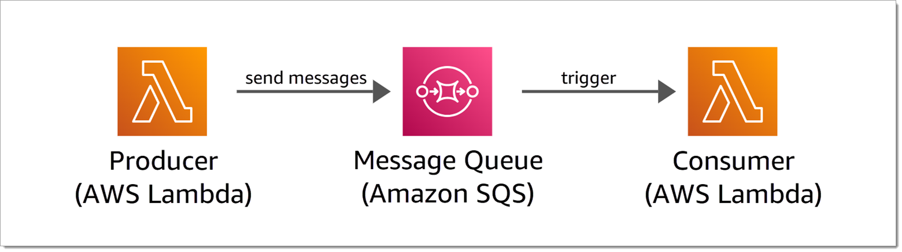
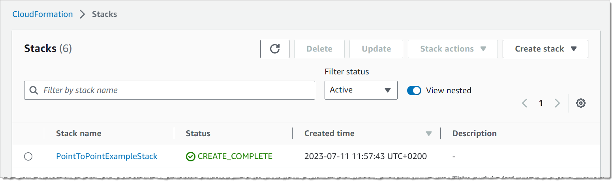
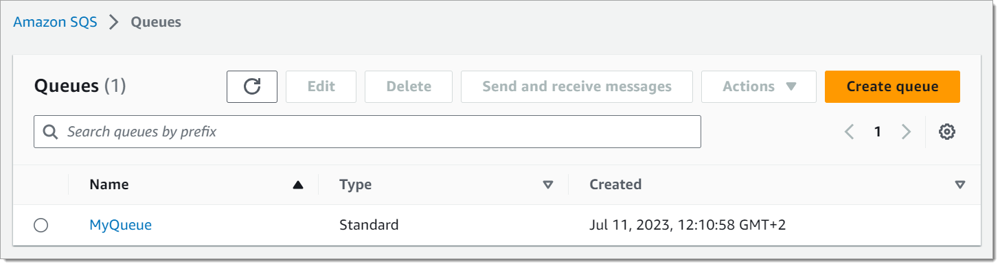
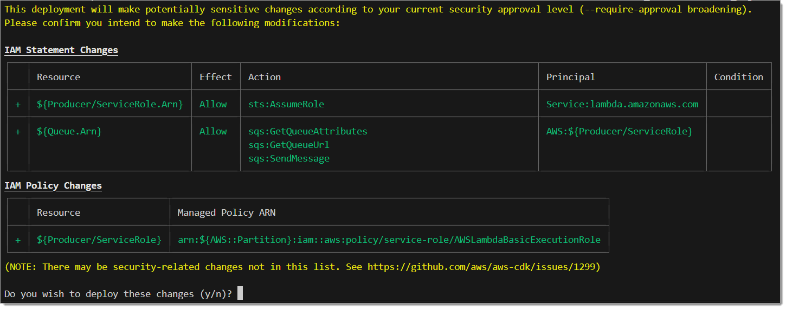
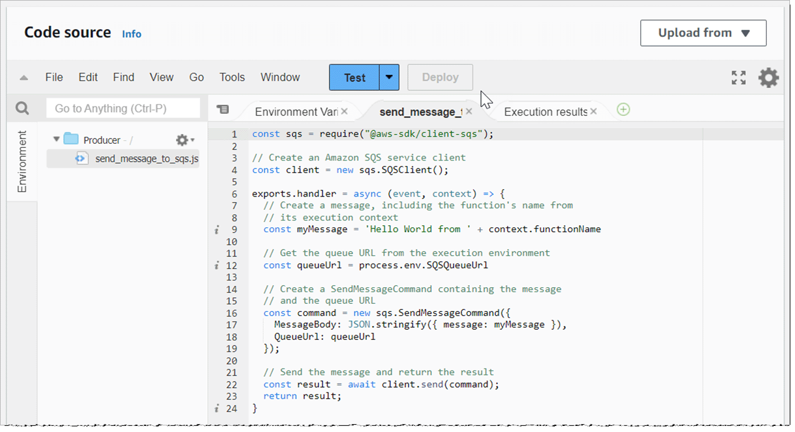
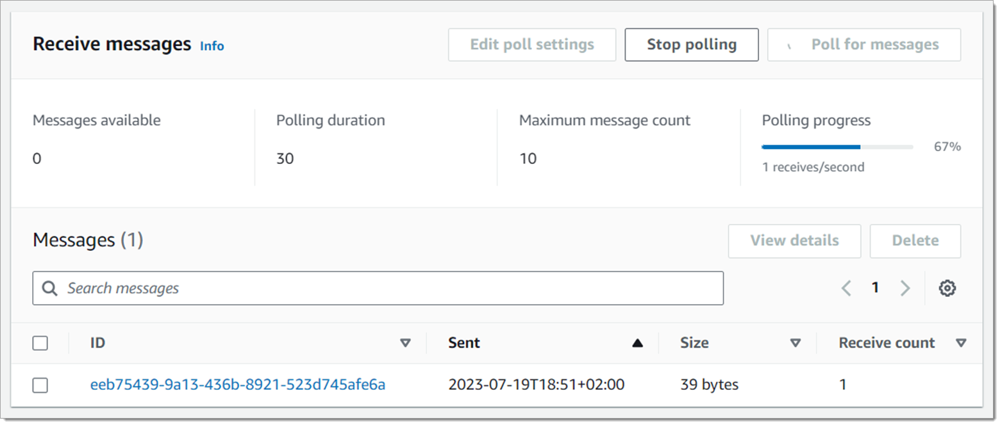
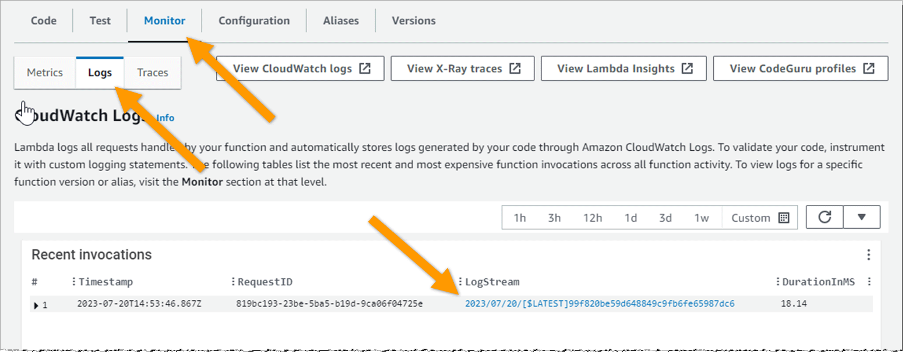
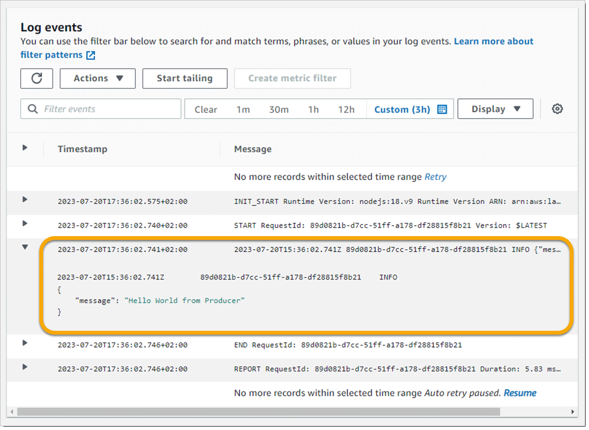
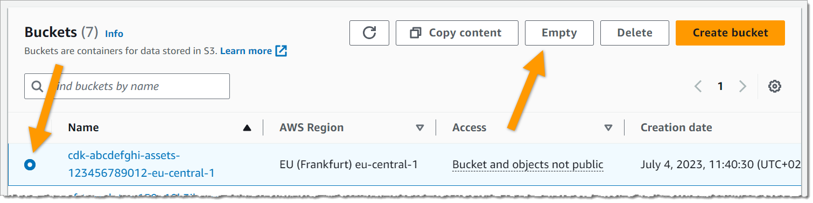

| Attributes| |
| ---- | ---- |
| ✅ AWS Level | Intermediate - 200 |
| ⏱ Time to complete | 30 minutes |
| 💰 Cost to complete | Free when cleaning up after the tutorial (instructions below) |
| 🧩 Prerequisites | - [AWS Account](https://aws.amazon.com/getting-started/guides/setup-environment/?sc_channel=el&sc_campaign=tutorial&sc_geo=mult&sc_country=mult&sc_outcome=acq&sc_content=point-to-point-sqs)<br />- [AWS Cloud Development Kit](https://aws.amazon.com/getting-started/guides/setup-cdk/?sc_channel=el&sc_campaign=tutorial&sc_geo=mult&sc_country=mult&sc_outcome=acq&sc_content=point-to-point-sqs) |
| 💻 Code Repository | The code for this tutorial is available on [GitHub](https://github.com/build-on-aws/point-to-point-messaging-with-amazon-sqs) |
| 📢 Feedback            | <a href="https://pulse.buildon.aws/survey/DEM0H5VW" target="_blank">Any feedback, issues, or just a quick star rating?</a>    |
| ⏰ Last Updated     | 2023-08-14                             |

| ToC |
|-----|

## Introduction

The point-to-point messaging pattern is commonly used communication model in modern web and cloud architectures. It is designed to enable asynchronous interactions between different components, e.g. serverless functions or microservices, allowing them to exchange messages without requiring an immediate response.

In this pattern, the component that sends the message is called the *producer*, while the component that receives and processes the message is called the *consumer*. The producer and consumer can be located on the same system or in different systems, making it a flexible and scalable approach for communication.

Similar to how emails are delivered to individual recipients, messages are sent from the producer to a specific consumer. This allows for efficient and reliable communication, even in complex distributed systems. It is commonly used in scenarios where the producer knows exactly which consumer needs to receive the message, but it is not necessary for the producer to get an immediate response.

The point-to-point messaging pattern effectively facilitates communication and coordination between components, improving the overall performance, reliability, and scalability of modern web and cloud architectures.

## What We Will Build

In this step-by-step tutorial, we will implement this pattern using two AWS Lambda functions and an Amazon SQS queue

In this step-by-step tutorial, we will implement a simple example using two AWS Lambda functions and an Amazon SQS queue.

You will build the example using TypeScript and the AWS Cloud Development Kit (AWS CDK).

The example will consist of three components:
- A *producer* that can send messages to the consumer
- A *consumer* that can receive messages from the producer
- A *message queue* establishing the communication channel between the producer and the consumer



In addition to implementing this pattern, we will also highlight the power of the AWS Cloud Development Kit (CDK) to define the entire infrastructure as code. If you want to learn more about the AWS CDK, have a look at the [AWS CDK Developer Guide](https://docs.aws.amazon.com/cdk/v2/guide/home.html?sc_channel=el&sc_campaign=tutorial&sc_geo=mult&sc_country=mult&sc_outcome=acq&sc_content=point-to-point-sqs).

By the end of this tutorial, you will have gained a solid understanding of the individual components of queue-based point-to-point messaging, successfully implemented asynchronous communication between two Lambda functions using SQS, and acquired some hands-on experience building infrastructure as code with CDK.

But before we start coding, let's have a quick look at the pros and cons of the asynchronous point-to-point messaging pattern. 

## Pros and Cons of the Asynchronous Point-to-Point Messaging Pattern

### Pros
- **Loose coupling:** The asynchronous point-to-point messaging pattern promotes loose coupling between applications, allowing them to communicate independently without having to be tightly integrated. This flexibility makes it easier to scale and modify individual components without impacting the entire system.
- **Scalability:** This pattern allows for efficient horizontal scaling, as multiple consumer applications can be added to handle the workload asynchronously. This enables the system to handle high volumes of messages and concurrent requests more effectively.
- **Reliability:** In asynchronous messaging, if a message fails to be delivered or processed, it can be retried or sent to an error queue for later processing, enhancing the reliability of the system.
- **Fault tolerance:** Asynchronous messaging provides fault tolerance by decoupling the producers and consumers of messages. If one application or component fails, messages can be stored for future processing once the system is back online, ensuring that no data is lost.

### Cons
- **Complexity:** Implementing the asynchronous point-to-point messaging pattern can be more complex compared to other integration patterns, requiring additional message handling logic.
- **Message dependencies and possible duplication:** Managing dependencies between messages and ensuring proper message deduplication can be challenging in an asynchronous messaging system. It requires careful design and implementation to handle potential issues such as message order, message duplicates, and message processing dependencies.
- **Increased latency:** Asynchronous messaging introduces a delay between sending a message and receiving a response, as the processing of messages may take longer. This delay can impact real-time interactions and might not be suitable for applications requiring immediate feedback.

When making architectural decisions, it is always important to consider these trade-offs and choose the communication pattern that aligns best with your specific requirements and constraints. Many modern applications rely on multiple integration patterns, including asynchronous point-to-point messaging, as well as synchronous request-response, and event-based communication.

But now, let's start the tutorial and learn how to implement this pattern using AWS Lambda and Amazon SQS.

**A note on resource costs when coding along:** This tutorial uses only a minimal amount of resources, all of which are included in the [Free Tier provided by AWS](https://aws.amazon.com/free?sc_channel=el&sc_campaign=tutorial&sc_geo=mult&sc_country=mult&sc_outcome=acq&sc_content=point-to-point-sqs) for the first 12 months after creation of each account:

- A few kilobytes of code will be stored in Amazon S3, which provides 5 GB of free storage.
- We will call SQS a couple of times, which provides 1 million free requests per month.
- We will invoke two functions on AWS Lambda, which also provides 1 million free invocations per month.

So if you follow the step-by-step guide, you'll definitely stay within the free tier. I've also added a section to the end that helps you remove all the resources created during this tutorial.

## Prerequisites

If the CLI and CDK are installed, you should see the respective versions of your installations. If it isn't, you'll get an error telling you that the command can't be found.

Before starting this tutorial, you will need the following:

- AWS Account: If you don't have one, you can [sign up for free](https://aws.amazon.com/getting-started/guides/setup-environment/?sc_channel=el&sc_campaign=tutorial&sc_geo=mult&sc_country=mult&sc_outcome=acq&sc_content=point-to-point-sqs). The AWS Free Tier gives you plenty of resources to play around with, including AWS Lambda and Amazon SQS, which is what we will be using.
- The AWS Cloud Development Kit (AWS CDK): [How to setup and bootstrap the AWS CDK](https://aws.amazon.com/getting-started/guides/setup-cdk/?sc_channel=el&sc_campaign=tutorial&sc_geo=mult&sc_country=mult&sc_outcome=acq&sc_content=point-to-point-sqs)

This tutorial requires at least version 2 of the AWS CLI and AWS CDK.

You can tell the version of the AWS CLI by executing the following command in a terminal:

```bash
aws --version
```

And the version of the AWS CDK by executing the following command:

```bash
cdk --version
```

## Step 1 - Create the CDK App

### 1.1 - Initialize the CDK app

First, you'll have to take care of the initial setup and let CDK auto-generate some code that establishes the project.

From the command line create a directory for the project, cd into the directory, and initialize the project:

```bash
mkdir point-to-point-example
cd point-to-point-example
cdk init app --language typescript
```

This will create the basic file structure for the project and install the required packages.

Now is a good time to open the project in your favorite IDE and have a look at the generated project, and specifically the following two files:

```
point-to-point-example/
├── bin/
│   └── point-to-point-example.ts
├── lib/
│   └── point-to-point-example-stack.ts
└── ...
```

The file `bin\point-to-point-example.ts` is the entrypoint of the CDK application. In this tutorial we won’t need to look at this file anymore.

The file `lib\point-to-point-example-stack.ts` is where the application’s main stack is defined. This file is where we’ll be spending most of our time. 

As we move forward through this tutorial, we will add the infrastructure for our application to the `PointToPointExampleStack` class in this file. Open it in your editor and have a look:

```typescript
import * as cdk from 'aws-cdk-lib';
import { Construct } from 'constructs';
// import * as sqs from 'aws-cdk-lib/aws-sqs';

export class PointToPointExampleStack extends cdk.Stack {
  constructor(scope: Construct, id: string, props?: cdk.StackProps) {
    super(scope, id, props);

    // The code that defines your stack goes here
    // ...
  }
}
```

### 1.2 - Bootstrap the Environment

The first time you deploy an AWS CDK app into an environment, i.e. a specific AWS Account and Region, you need to bootstrap the environment with a **CDKToolkit** stack. This stack will deploy an S3 bucket that is used to store templates and assets during the deployment process of the actual application.

To bootstrap the environment, make sure you're still in the `point-to-point-example` directory, and execute the following command:

```bash
cdk bootstrap
```

This will take some time and will be completed once you see the following output on your command line:

```bash
✅  Environment aws://[account_id]/[region] bootstrapped.
```

> Note: If this leads to an error, it is likely that either you haven't [configured the AWS CLI](https://docs.aws.amazon.com/cli/latest/userguide/cli-authentication-user.html?sc_channel=el&sc_campaign=tutorial&sc_geo=mult&sc_country=mult&sc_outcome=acq&sc_content=point-to-point-sqs), or have already bootstrapped the environment. In the latter case you can simply continue to the next step.

### 1.3 - Deploy the Initial Stack

To deploy the stack, make sure you're still in the `point-to-point-example` directory, and execute the following command:

```bash
cdk deploy
```

This command will *synthesize* the app into an [AWS CloudFormation](https://aws.amazon.com/cloudformation/?sc_channel=el&sc_campaign=tutorial&sc_geo=mult&sc_country=mult&sc_outcome=acq&sc_content=point-to-point-sqs) template, and deploy it in your AWS account.

> If you can't find the stack, make sure to choose the correct region by clicking on the name of the currently displayed Region in the navigation bar, and then choosing the Region to which you want to switch. Make sure it is the one that you used when configuring the AWS CLI.



Now open and explore the stack details. In  the **Resources** tab you can see that it hasn't deployed anything, except for a resource called **CDKMetadata**, which are just some basic configuration details for our stack.

##  Step 2 - Create the SQS Queue

Once everything has been set up, you can create your first real resource, which will be an SQS queue.

### 2.1 - Add the Queue to the Stack

To get started, open the file `lib\point-to-point-example-stack.ts`.

Depending on the version of the CDK template, it may already have added a few import statements, including `aws-cdk-lib/aws-sqs` in a comment. If this is the case, remove the comment symbols `//` in front of `import * as sqs from 'aws-cdk-lib/aws-sqs'`, otherwise add it yourself, so that the first three lines of the file look like this:

```typescript
import * as cdk from 'aws-cdk-lib';
import { Construct } from 'constructs';
import * as sqs from 'aws-cdk-lib/aws-sqs';
```

Now remove the comments inside the `PointToPointExampleStack` class, and replace them with the following code snippet and save your changes:

```typescript
const queue = new sqs.Queue(this, 'Queue', {
  queueName: 'MyQueue',
});
```

#### 2.2 - Deploy the Queue

To deploy the queue, run the following command in your project directory:

```bash
cdk deploy
```

You can now monitor the deployment process in the terminal output, and after a minute or two it should be completed.

Once the deployment has finished, navigate to your [list of SQS queues](https://console.aws.amazon.com/sqs/v2/home#/queues) in the AWS Management Console and find the queue named  **SqsTutorialStack-Queue...**:

#### 2.3 - Inspect the Deployed Queue

Navigate to the [SQS Dashboard](console.aws.amazon.com/sqs/v2/home) in the AWS Management Console and look at the list of queues. If you can't find your queue, make sure you are in the correct region.



## Step 3 - Create the Producer Function and Connect it to the Queue

### 3.1 - Write the Producer Function Source Code

We'll use JavaScript for the Lambda function and store the source code in its own folder inside the CDK application. We'll later point from our CDK stack to this folder so that it can automatically package, upload, and deploy the contents to AWS.

Make sure you are in the project directory and create the following directories and the file itself:

```bash
mkdir lambda-src
mkdir lambda-src/producer
touch lambda-src/producer/send_message_to_sqs.js
```

The directory structure of your project should now look like this:

```
point-to-point-example/
├── bin/
│   └── point-to-point-example.ts
├── lambda-src/
│   └── producer/
│       └── send_message_to_sqs.js
├── lib/
│   └── point-to-point-example-stack.ts
└── ...
```

Open the newly created file `lambda-src/producer/send_message_to_sqs.js` in your editor and add the following code:

```javascript
const sqs = require("@aws-sdk/client-sqs");

// Create an Amazon SQS service client
const client = new sqs.SQSClient();

exports.handler = async (event, context) => {
  // Create a message, including the function's name from
  // its execution context
  const myMessage = 'Hello World from ' + context.functionName

  // Get the queue URL from the execution environment
  const queueUrl = process.env.SQSQueueUrl

  // Create a SendMessageCommand containing the message
  // and the queue URL
  const command = new sqs.SendMessageCommand({
    MessageBody: JSON.stringify({ message: myMessage }),
    QueueUrl: queueUrl
  });

  // Send the message and return the result 
  const result = await client.send(command);
  return result;
}
```

This is a simple Lambda function handler that sends a message to our SQS queue and returns the result.

Note that, since we don't necessarily know which queue to use when building this function, or may want to change it at a later point without having to change the function code, we retrieve the queue's URL from the execution environment. This way, we can dynamically define it during the Lambda function's deployment in the CDK stack.

### 3.2 - Add the Producer Function to the Stack

To create the actual Lambda function in AWS, you need to add it to the stack. To do this, open `lib/point-to-point-example-stack.ts`.

First, add another import statement to the top of the file:

```typescript
import * as lambda from 'aws-cdk-lib/aws-lambda';
```

Next, add the following snippet inside the constructor, underneath the queue:

```typescript
const producerFunction = new lambda.Function(this, 'Producer', {
  functionName: 'Producer',
  runtime: lambda.Runtime.NODEJS_18_X,
  code: lambda.Code.fromAsset('lambda-src/producer'),
  handler: 'send_message_to_sqs.handler',
  environment: {
    SQSQueueUrl: queue.queueUrl,
  }
});
```

This will create a function, packages and the content of the `lambda-src/producer` directory, and configures the function to use the handler defined in `send_message_to_sqs.js` when it gets invoked.

It also dynamically sets the environment variable `SQSQueueUrl` to the actual URL of the SQS queue, so that it can be accessed using `process.env.SQSQueueUrl` from within the function.

### 3.3 - Grant Permissions to the Producer Function

Every Lambda function requires a few fundamental IAM permissions, that CDK will provide by default using a basic execution role. 

However, our producer function need the additional permission to send messages to the queue. Luckily, in CDK we don't need to manage IAM policies by hand. We can use the SQS queue's `grantSendMessages` method with our Lambda function. 

To do this, add the following line below your `producerFunction`:

```typescript
queue.grantSendMessages(producerFunction);
```

### 3.4 - Deploy the Producer Function

To deploy the function along with its source code, run the following command in the project directory:

```bash
cdk deploy
```

This will prepare the deployment of any new or modified resources. 

If any changes to your stack require the creation or modification of IAM permissions, CDK will prompt you to double-check these changes for security reasons. 

In the screenshot below, you can see that CDK wants to deploy three changes that affect IAM permissions:

- Allow the Lambda Service (`lambda.amazon.aws`) to assume the execution role attached to the Producer function.
- Directly add the necessary permissions allowing the execution role to access and send messages to the SQS queue.
- Add a managed policy with basic permissions to the execution role.



Type `y` to confirm, and CDK will deploy the new Lambda function along with its IAM Role.

### 3.5 - Test the Producer Function

Once the function has been deployed, navigate to the Functions list in the [AWS Lambda Dashboard](https://console.aws.amazon.com/lambda).

The function name is the one we defined in the stack: **Producer**. If you can't find the function, make sure you are in the correct region.

Click on the function name to open its details, and scroll down to the **Code source** section.

The folder in the file explorer on the left contains a file called `send_message_to_sqs.js`.

Double-click on on the file name to open its source where you can see that it's an exact copy of the file we created in the `lambda-src/producer` folder in our CDK project.



Now let's configure a test event.

To do this, click on the **Test** button. If you haven't configured a test event yet, this wil open the test configuration screen. Enter an **Event name**, e.g. "test-event", and click on **Save**.

Once the test event has been configured, click on **Test** again, which will then directly invoke the Lambda function.

This creates an **Execution results** tab, including the response:

```json
{
  "$metadata": {
    "httpStatusCode": 200,
    "requestId": "cb033b2a-1234-5678-9012-66188359d280",
    "attempts": 1,
    "totalRetryDelay": 0
  },
  "MD5OfMessageBody": "b5357af0c1c816b2d41275537cc0d1af",
  "MessageId": "4a76e538-1234-5678-9012-749f0f4b9294"
}
```

Remember the code snippet in the Lambda function?

```javascript
const result = await client.send(command);
return result;
```

The JSON object in the execution results above is exactly what SQS returned as a response to  `client.send(command)`, including some interesting information, like `"httpStatusCode": 200`,  which means that the queue has successfully received the message.

### 3.6 - Manually Retrieve the Message from SQS

Currently, the queue isn't connected to a consumer, so the message won't be picked up. However, we can manually retrieve the message.

Navigate to the [SQS Dashboard](console.aws.amazon.com/sqs/v2/home), click on the queue to open its details page, and click the **Send and receive messages** button.

On the next page scroll down to the **Receive messages** section, and click the button labeled **Poll for messages**, which should show all messages that are currently in flight, including the one that your producer function has sent when we tested it:



Click on the message ID to open it. It should contain the following body:

```json
{"message":"Hello World from Producer"}
```

Congratulations! You've successfully deployed and tested a Lambda function that sends messages to an SQS queue.

In the next step, we will build the consumer function and configure it so that it is automatically invoked whenever a new message arrives in the queue.

## Step 4 - Create the Consumer Function and Connect it to the Queue

### 4.1 - Write the Consumer Function Source Code

The consumer function code will be stored in its own folder inside of `lambda-src`, so that CDK can automatically package and upload it into the new Lambda function.

Make sure you are in the project directory (not in _bin/_ or _lib/_) and create the following directory, along with the source file:

```bash
mkdir lambda-src/consumer
touch lambda-src/consumer/receive_message_from_sqs.js
```

Open `lambda-src/consumer/receive_message_from_sqs.js` in your editor and enter the following piece of code:

```javascript
exports.handler = async (event) => {
  // Retrieve the message from the event and log it to the console
  const message = event.Records[0].body;
  console.log(message);
}
```

This is a very simple Lambda function handler that unwraps the SQS message and prints it to the log.

### 4.2 - Add the Consumer Function to the Stack

To create the actual Lambda function in AWS, you need to add it to the stack. To do this, open `lib/point-to-point-example-stack.ts`.

Add the following snippet inside the constructor, underneath `queue.grantSendMessages(producerFunction)`:

```typescript
    const consumerFunction = new lambda.Function(this, 'Consumer', {
      functionName: 'Consumer',
      runtime: lambda.Runtime.NODEJS_18_X,
      code: lambda.Code.fromAsset('lambda-src/consumer'),
      handler: 'receive_message_from_sqs.handler'
    });
```

This will create the consumer function, packages and the content of the `lambda-src/consumer` directory, and configures the function to use the handler defined in `receive_message_from_sqs.js` when it gets invoked.

### 4.3 - Add the SQS Queue as an Event Source to The Consumer

We want the function to be triggered whenever there is a new message on our queue. To do this, we need to add the queue as the function's *Event Source*, and also grant the function all necessary permissions to consume the messages.

First, add another `import`  statement to the top of the file:

```typescript
import { SqsEventSource } from 'aws-cdk-lib/aws-lambda-event-sources';
```

Next, add the following two lines underneath the `consumerFunction` definition:

```typescript
consumerFunction.addEventSource(new SqsEventSource(queue));
queue.grantConsumeMessages(consumerFunction);
```

### 4.4 - Deploy the Consumer Function

To deploy the function along with its source code, run the following command in the project directory:

```bash
cdk deploy
```

This will prepare the deployment of any new or modified resources, and -- again -- ask you to double-check the new IAM permissions.

Type `y` to confirm, and CDK will deploy the new Lambda function, along with its execution role, and connect it to the SQS queue.

Once the deployment is done, everything will be ready and connected. Let's see if it works.

## Step 5 - End-to-End Test of the Application

To test the application, we will manually invoke the producer function to send another message to the queue. Then we will check the execution logs of the consumer function to see if it has automatically been triggered and processed the message.

### 5.1 - Invoke the Producer Function

Follow the steps outlined in **3.5 - Test the Producer Function** to invoke the producer function again. Here's a short summary:

- Navigate to the function list in the [AWS Lambda Dashboard](https://console.aws.amazon.com/lambda).
- Open the **Producer** function by clicking on its name.
- Scroll down to the **Code source** section.
- Click on the **Test** button.
- Make sure the function successfully executes.

### 5.2 - Check the Consumer Function's Log

Go back to the function list in the [AWS Lambda Dashboard](https://console.aws.amazon.com/lambda) and, this time, open the **Consumer** function.

Scroll down, open the tab called **Monitor**, inside this tab, open the **Logs** tab, and have a look at the **Recent Invocations**, where you should find a link to the function's latest **LogStream**.


> Please note that it may take some time for the log to be aggregated into the a log stream. If it doesn't show up, just wait a minute or so and then click the refresh button on the right.



Once it's there, click on the log stream link. This will show the log entry itself, which may look a bit confusing if you aren't used to the format.

Simply look for the entry right in the middle between the two that start with `START RequestId: ...` and `END  Request Id: ...`.

Click on the arrow to expand the entry where you should find the original message:



And that's it!

**Congratulations!** You've created everything you need to set up asynchronous point-to-point messaging between two Lambda functions, using SQS.

There's so much more you can do with SQS, like batching messages, ensuring message order, and automatically sending faulty messages to a dead-letter queue (DLQ). If you want to learn more, check out the [Amazon SQS Developer Guide](https://docs.aws.amazon.com/AWSSimpleQueueService/latest/SQSDeveloperGuide/welcome.html?sc_channel=el&sc_campaign=tutorial&sc_geo=mult&sc_country=mult&sc_outcome=acq&sc_content=point-to-point-sqs)

##  Clean-up

Feel free to continue experimenting with the app. Once you're done, you can remove everything that has been deployed by executing:

```bash
cdk destroy
```

After a confirmation step, this will delete all resources that have been created as part of the stack. 

The only remaining resource will be the Lambda functions' source code, which has been uploaded to an assets bucket in Amazon S3. 

If you want, you can delete this directly in the [S3 Dashboard](https://s3.console.aws.amazon.com/s3/buckets) of the AWS Management Console:

Look for an S3 bucket called `cdk-XXXXXXXXX-assets-YOUR_ACCOUNT_ID-YOUR_REGION`. This is the bucket that was created when you bootstrapped the account with AWS CDK.

You can delete everything inside the bucket by selecting the radio button next to its name, and clicking on **Empty**:



This will open a confirmation dialog. Double-check to make sure it is the asset bucket, type _permanently delete_ into the text box, and click on **Empty**.

Now you can also delete the bucket. However, I recommend keeping the bucket for further experiments with AWS CDK. Don't worry about costs, empty S3 buckets are free of charge.

## Recap

Throughout this tutorial we have built a simple application that implements the asynchronous point-to-point messaging pattern. It consists of two Lambda functions -- a producer and a consumer -- that are loosely coupled via an SQS queue. When the producer places a message on the queue, the consumer automatically picks it up and processes it by unwrapping the message and printing it to the log. 

The asynchronous point-to-point messaging pattern is a widely used communication model in modern web and cloud architectures, and I hope that by following this tutorial, you were able to gain a clear understanding of how you can implement this pattern using Amazon SQS and AWS Lambda.

If you want to learn more, check out these additional resources:

- The [Amazon Simple Queue Service (SQS) Developer Guide](https://docs.aws.amazon.com/AWSSimpleQueueService/latest/SQSDeveloperGuide/welcome.html?sc_channel=el&sc_campaign=tutorial&sc_geo=mult&sc_country=mult&sc_outcome=acq&sc_content=point-to-point-sqs)
- All articles tagged [architectural-patterns](https://community.aws/tags/architectural-patterns)
- More [tutorials](https://community.aws/tags/tutorials) on community.aws
- More [SQS messaging examples on ServerlessLand](https://serverlessland.com/search?search=sqs)

## The Complete Source Code

Here is the final source code for the CDK stack defined in `point-to-point-example/lib/point-to-point-example-stack.ts`. 


```typescript
import { Construct } from 'constructs';
import { SqsEventSource } from 'aws-cdk-lib/aws-lambda-event-sources';
import * as cdk from 'aws-cdk-lib';
import * as sqs from 'aws-cdk-lib/aws-sqs';
import * as lambda from 'aws-cdk-lib/aws-lambda';

export class PointToPointExampleStack extends cdk.Stack {
  constructor(scope: Construct, id: string, props?: cdk.StackProps) {
    super(scope, id, props);

    // Create the message queue
    const queue = new sqs.Queue(this, 'Queue', {
      queueName: 'MyQueue',
      visibilityTimeout: cdk.Duration.seconds(300),
    });

    // Create the producer function that will send messages
    const producerFunction = new lambda.Function(this, 'Producer', {
      functionName: 'Producer',
      runtime: lambda.Runtime.NODEJS_18_X,
      code: lambda.Code.fromAsset('lambda-src/producer'),
      handler: 'send_message_to_sqs.handler',
      environment: {
        SQSQueueUrl: queue.queueUrl,
      }
    });

    // Grant the producer function permission to send messages
    queue.grantSendMessages(producerFunction);

    // Create the consumer function that will receive messages
    const consumerFunction = new lambda.Function(this, 'Consumer', {
      functionName: 'Consumer',
      runtime: lambda.Runtime.NODEJS_18_X,
      code: lambda.Code.fromAsset('lambda-src/consumer'),
      handler: 'receive_message_from_sqs.handler'
    });

    // Grant the consumer function permission to receive messages
    queue.grantConsumeMessages(consumerFunction);

    // Add the SQS queue as an event source so that it invokes
    // the consumer function whenever there is a new message
    consumerFunction.addEventSource(new SqsEventSource(queue));

  }
}
```

Here's the source code for the producer function located in `point-to-point-example/lambda-src/producer/send_message_to_sqs.js`:

```javascript
const sqs = require("@aws-sdk/client-sqs");

// Create an Amazon SQS service client
const client = new sqs.SQSClient();

exports.handler = async (event, context) => {
  // Create a message, including the function's name from
  // its execution context
  const myMessage = 'Hello World from ' + context.functionName

  // Get the queue URL from the execution environment
  const queueUrl = process.env.SQSQueueUrl

  // Create a SendMessageCommand containing the message
  // and the queue URL
  const command = new sqs.SendMessageCommand({
    MessageBody: JSON.stringify({ message: myMessage }),
    QueueUrl: queueUrl
  });

  // Send the message and return the result 
  const result = await client.send(command);
  return result;
}
```

And here's the source code for the consumer function located in `point-to-point-example/lambda-src/consumer/receive_message_from_sqs.js`:

```javascript
exports.handler = async (event) => {
  // Retrieve the message from the event and log it to the console
  const message = event.Records[0].body
  console.log(message);
}
```

### GitHub Repository

The code for this example is also available as a [GitHub repository](https://github.com/build-on-aws/point-to-point-messaging-with-amazon-sqs), including branches for the individual steps outlined in this tutorial. To clone it, simply execute:

```bash
git clone https://github.com/build-on-aws/point-to-point-messaging-with-amazon-sqs.git
```
