## Prerequisites

Before starting this tutorial, you will need the following:

 - An AWS Account: [How to create a free AWS account](https://aws.amazon.com/getting-started/guides/setup-environment/)
  - The AWS Cloud Development Kit (AWS CDK): [How to setup and bootstrap the AWS CDK](https://aws.amazon.com/getting-started/guides/setup-cdk/)

| Attributes| |
| ---- | ---- |
| ✅ AWS Level | Intermediate - 200 |
| ⏱ Time to complete | 30 minutes |
| 💰 Cost to complete | Free when cleaning up after the tutorial (instructions below) |
| 🧩 Prerequisites | - [AWS Account](https://aws.amazon.com/getting-started/guides/setup-environment/)<br>- [AWS Cloud Development Kit](https://aws.amazon.com/getting-started/guides/setup-cdk/) |
| 📢 Feedback            | <a href="https://pulse.buildon.aws/survey/DEM0H5VW" target="_blank">Any feedback, issues, or just a quick star rating?</a>    |
| ⏰ Last Updated     | 2023-07-04                             |

| ToC |
|-----|

## Introduction

The request-response pattern is a widely used communication model in modern web and cloud architectures. It facilitates synchronous interactions between clients and servers, providing real-time responses and immediate feedback when needed.

This pattern is straightforward, easy to understand, and serves as the foundation for the largest distributed system in the world: the Internet itself. Whenever you open a web page or click on a link in your browser, your browser sends a request to the server, which in turn responds with an HTML document.

In this step-by-step tutorial, we will implement this pattern using Amazon API Gateway and an AWS Lambda function.

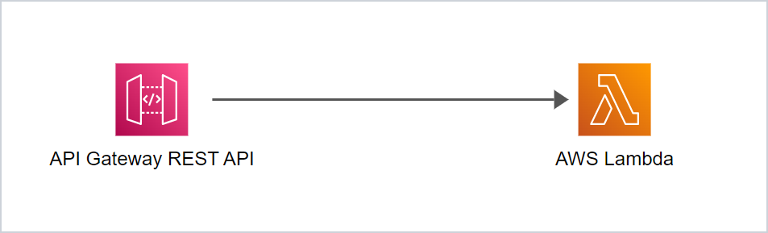

We will also higlight the power of the AWS Cloud Development Kit (CDK) to define the entire infrastructure as code.

> If you want to learn more about the AWS Cloud Development Kit, have a look at the [AWS CDK Developer Guide](https://docs.aws.amazon.com/cdk/v2/guide/home.html).

By the end of this tutorial, you will have gained a solid understanding of the individual components of an HTTP-based request-response API, successfully implemented synchronous communication between Amazon API Gateway and AWS Lambda, and acquired some hands-on experience building infrastructure as code with CDK.

But before we start building the API, let's have a quick look at the pros and cons of the synchronous request-response pattern.

## Pros and Cons of the Synchronous Request-Response Pattern:

### Pros:

- **Real-time interaction:** The synchronous request-response pattern enables instant feedback to the client, enhancing real-time interactions and improving the user experience.
- **Simplicity:** The request-response pattern is straightforward to implement and understand, making it accessible, especially for developers new to building APIs.
- **Error handling:** Synchronous communication simplifies error and exception handling, allowing for prompt notifications to clients.

### Cons:

- **Scalability:** The synchronous pattern can become a bottleneck when dealing with a large number of concurrent requests, potentially impacting the scalability of your application.
- **Increased Latency:** Clients have to wait for a response before proceeding, introducing latency, especially when processing times are longer.
- **Vulnerability to failures:** Disruptions or failures in the downstream service or network can result in delays or failures in delivering responses. This can affect the overall reliability and availability of the system.

When making architectural decisions, it is important to consider these trade-offs and choose the communication pattern that aligns best with your specific requirements and constraints. Many modern applications rely on multiple integration patterns, including synchronous request-response as well as asynchronous point-to-point messaging and event-based communication.

But now, let's start the tutorial and learn how to implement the synchronous request-response pattern using Amazon API Gateway and AWS Lambda.

**A note on resource costs when coding along:** This tutorial uses only a minimal amount of resources, all of which are included in the [Free Tier provided by AWS](https://aws.amazon.com/free) for the first 12 months after creation of each account:
- A few kilobytes of code will be stored in Amazon S3, which provides 5 GB of free storage.
- We will call API Gateway a couple of times, which provides 1 million free calls per month.
- We will run a Lambda function for a few time, which also provides 1 million free invocations per month.

So if you follow the step-by-step guide, you'll definitely stay within the free trier. However, I've also added a section to the end that helps you remove all the resources created during this tutorial.

## Step 1 - Create and Deploy the CDK App

### 1.1 Initialize the CDK app

Open a terminal of your choice (I like to use the integrated terminal in VS Code), then create and navigate to a new directory for the project:

```bash
mkdir request-response-example
cd request-response-example
```

Initialize a new CDK app using the following command. We'll be using TypeScript for this example.

```bash
cdk init app --language=typescript
```

This will create a CDK app with an empty stack. 

Take a look at the file structure, where you will find the required scaffolding and configuration, along with the following two TypeScript files:

- The CDK app: _bin/request-response/example.ts_
- The empty stack definition: _lib/request-response-example-stack.ts_, which will be the file we will be working with today.

### 1.2 Deploy the empty stack

Before adding any new resources, we can deploy the empty stack to make sure that everything has been set up.

To do this, type:
```
cdk deploy
```

This command will "synthesize" the app into an [AWS CloudFormation](https://aws.amazon.com/cloudformation/) template, and deploy it in your AWS account.

> If `cdk deploy` throws an error, make sure that you have bootstrapped your AWS account following the instructions in the [CDK setup guide](https://aws.amazon.com/getting-started/guides/setup-cdk/module-two/).

Once the deployment has been completed, let's navigate to the [AWS CloudFormation dashboard](https://console.aws.amazon.com/cloudformation) in the AWS Management Console, and have a look at the new CloudFormation stack

> If you can't find the stack, make sure to choose the correct region by clicking on the name of the currently displayed Region in the navigation bar, and then choosing the Region to which you want to switch. Make sure it is the one that you used when configuring the AWS CLI.

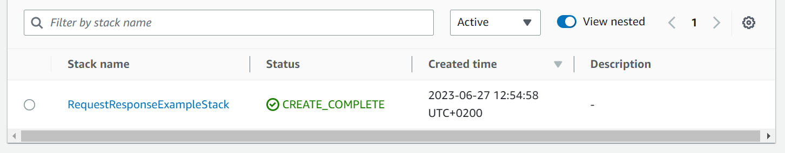

Now open and explore the stack details. In  the **Resources** tab you can see that it has deployed **CDKMetadata**, which are some configuration details for the stack.

## Step 2 - Create and Deploy the API

Once everything has been set up, you can create your first real resource. 

Let's create an API Gateway that simply redirect any request to an existing URL.

> **Pro tip:** This method is often used as a first step when migrating from a monolithic application to one using microservices and/or serverless functions. Deploying an API Gateway between the client and server creates an abstraction layer, allowing a gradual migration of individual endpoints without having to modify and redeploy the client after every single change. You can start by simply redirecting every route to the legacy app and subsequently switch individual routes to newly creates services, one by one.

To get started, open _lib/request-response-example-stack.ts_ in an editor. 

After removing a few introductory comments it should look similar to this:

```typescript
import * as cdk from 'aws-cdk-lib';
import { Construct } from 'constructs';

export class RequestResponseExampleStack extends cdk.Stack {
  constructor(scope: Construct, id: string, props?: cdk.StackProps) {
    super(scope, id, props);

    // Add your resources here
    
  }
}
```

> **Note:** In case you're stuck or something doesn't work, I've added the complete source code of _lib/request-response-example-stack.ts_ to the bottom of this article. So feel free to take a peak whenever you like.

### 2.1 Create a simple API

Let's start by adding an additional `import` statement to the top of the file:

```typescript
import * as apigw from 'aws-cdk-lib/aws-apigateway';
```

Now you can create a REST API resource inside the `constructor`:

```typescript
const api = new apigw.RestApi(this, 'SimpleApi', {
  restApiName: 'Simple API'
});
```

AWS API Gateway uses _Integrations_ to define the behaviour for the individual routes of an API. To implement a redirect (more specifically, a proxy that redirects to a URL), CDK provides a preconfigured `HttpIntegration`, that can be initialized with the target URL: 

```typescript
const redirect = new apigw.HttpIntegration('https://aws.amazon.com')
```

To apply the integration to the API, we need to connect the integration with a route and an HTTP method. In this example, we're adding the `GET` method to the API's `root` path and connect it to the `redirect` integration.

```typescript
api.root.addMethod('GET', redirect);
```

With this configuration, a request to the root path of the stage, e.g. `https://your-invoke-url/prod/`, will be redirected to `https://aws.amazon.com`.

### 2.2 Deploy the API

To deploy the API, run the following terminal command from within the project directory:

```bash
cdk deploy
```

You can now monitor the status of the individual resources in the terminal output, and after some time the deployment should be completed.

### 2.3 Inspect the deployed API

Navigate to the API Gateway Dashboard in in the AWS Management Console and look at the list of APIs. If you can't find your resources, make sure you are in the correct region again.

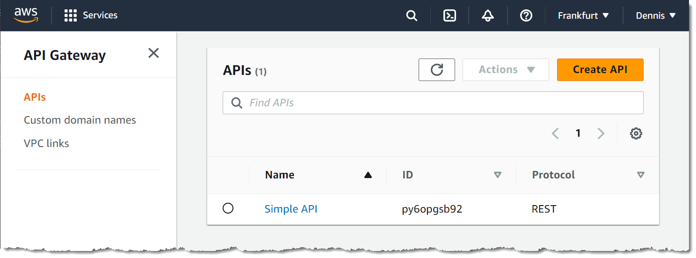

Click on the API name to open the details with the root resource **/** and its **GET** method.

Click on **GET** to open the method details and have a look at the **Integration Request** on the : 

The `new HttpIntegration('https://aws.amazon.com')` statement in our stack has led to the deployment of an integration of type **HTTP_PROXY** that sends a **GET** request to the specified URL:

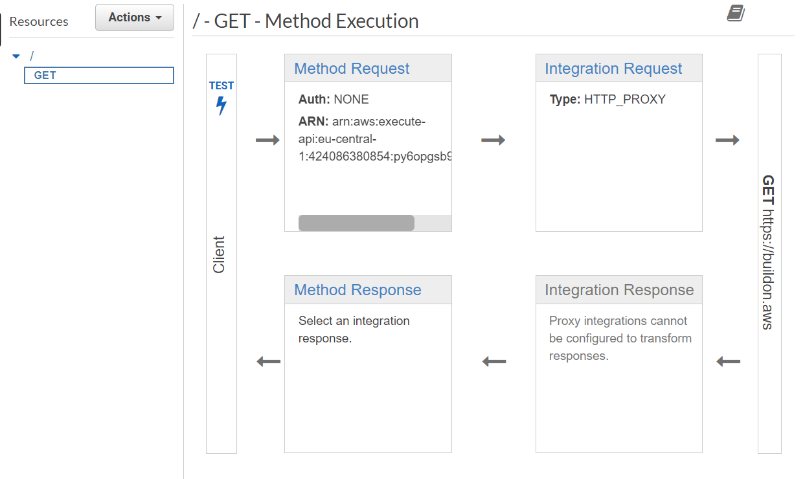

### 2.4 Test the API

Now that everything has been deployed, let's manually test the API. 

Click on **Stages** in the navigation menu on the left. 

On, this page, you should be able to see a "prod" stage.

> **API Gateway Stages:** On AWS, APIs are deployed in stages, like `dev`, `test`, and `prod`, representing the respective environments, or `v1`, `v2`, etc., for versioning. If you don't define a stage, the `RestApi` construct of the AWS CDK will create stage called `prod` by default.

Clicking on **prod** will reveal the stage's details, including what we're most interested in: The **Invoke URL**. 

This URL has been automatically created for the API. Of course, in a real-life scenario, the environment can be configured to use a much more readable, custom domain.

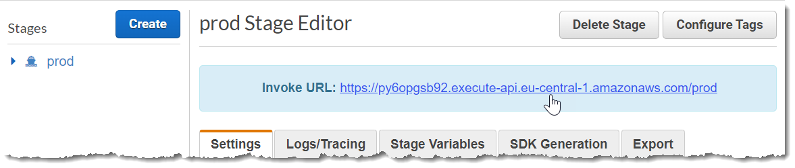

Now let's click on the link, and if everything has been correctly configuredcorrectly, the browser will immediately be redirected to the target URL.

Now that the API has been set up, let's create a simple AWS Lambda function.

## Step 3 - Create a Lambda Function

### 3.1 Write the Lambda function source code

We'll store the Lambda function code in an assets folder inside the CDK application, so that CDK can automatically package the source and upload it into the new Lambda function. 

Make sure you are in the project directory (not in _bin/_ or _lib/_) and create the following directories, as well as the file itself:

```bash
mkdir lambda-src
mkdir lambda-src/backend-function
touch lambda-src/backend-function/index.js
```

Open the newly created _lambda-src/test-function/index.js_ in your editor and enter the following piece of code:

```javascript
exports.handler = async function (event, context) {
  return {
    statusCode: 200,
    body: JSON.stringify('Hello from Lambda')
  };
};
```

This is a very simple Lambda function handler that returns a JSON object containing the HTTP status code and a body.

### 3.2 Add the Lambda function to the stack

To create the actual Lambda function in AWS, you need to add it to the stack. To do this, go back to _lib/request-response-example-stack.ts_.

First, add another `import` statement to the top:

```typescript
import * as lambda from 'aws-cdk-lib/aws-lambda';
```

Then add the following snippet inside the constructor, above `const api = ...`:

```typescript
const backendFunction = new lambda.Function(
  this, 'BackendFunction', {
    runtime: lambda.Runtime.NODEJS_18_X,
    code: lambda.Code.fromAsset('lambda-src/backend-function'),
    handler: 'index.handler'
});
```

This will create a Lambda function that uses the Node.js runtime, packages and uploads everything inside the assets directory we've created above (_lambda-src/backend-function_), and configures the environment to use the `handler` function of the `index` file (_index.js_).

### 3.3 Deploy the function on AWS

To deploy the function along with its source code, run the following command in the project directory:

```bash
cdk deploy
```

A Lambda function requires a few fundamental IAM permissions, provided by default through a basic execution role. However, if any changes to your stack require the creation or modification of IAM permissions, CDK will prompt you to double-check for security reasons. 

In the screenshot below, you can see that CDK wants to deploy two changes that affect IAM permissions:

- Allow the Lambda Service (`lambda.amazon.aws`) to assume the IAM Role attached to the Lambda function.
- Add the `AWSLambdaBasicExecutioRole` permissions to that same IAM Role.

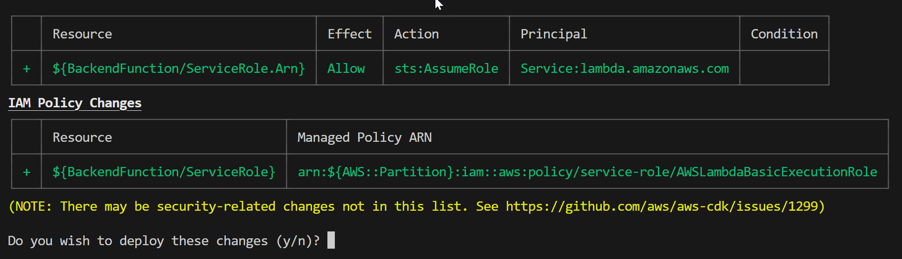

Type `y` to confirm, and CDK will deploy the new Lambda function along with its IAM Role.

> **Lambda permissions:** Just like every other resource in AWS, a Lambda function doesn't have any permissions by default, i.e. it can't access any other resources in AWS. The steps above are necessary for the Lambda function to have access to the most basic functionality: The permission to send logs to AWS CloudWatch.

### 3.4. Test the Lambda function

Once the function has been deployed, navigate to the Functions list in the [AWS Lambda Dashboard](console.aws.amazon.com/lambda).

The function name has been automatically generated from the stack name, the function name, and a random postfix, so it should start with _BackendResponseExample..._.

Click on the function name to open its details, and scroll down to the **Code source** section.

The folder in the file explorer on the left contains a file called _index.js_. 

Double-click on on the file name to open its source and you can see that it's an exact copy of the file we created in our assets folder.

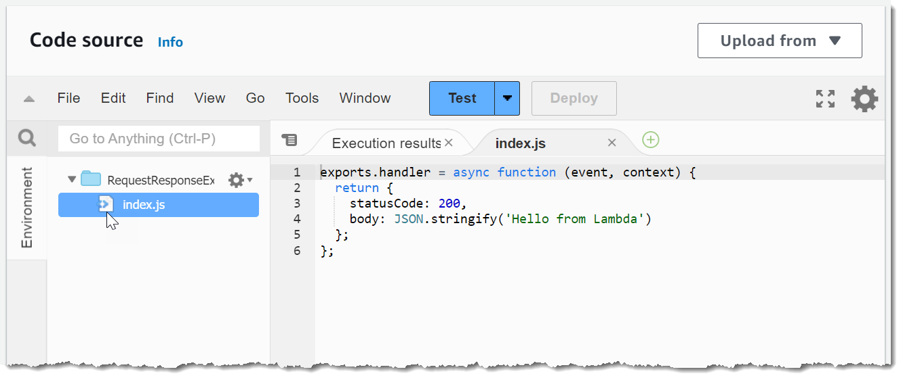

Now let's configure a test event. 

To do this, click on the **Test** button. If you haven't configured a test event yet, this wil open the test configuration screen. Enter an **Event name**, e.g. "test-event", and click on **Save**.

Once the test event has been configured, click on **Test** again, which will now directly invoke the Lambda function.

This also creates an **Execution results** tab, including the test event name, the response, and some additional information.

Have a look at the **Response**, which should contain the JSON object returned by the Lambda function:

```json
{
  "statusCode": 200,
  "body": "\"Hello from Lambda\""
}
```

Congratulations! You've successfully deployed and tested a Lambda function.

Now that both the API and the Lambda function work, let's connect them so that a request to the API will automatically be forwarded to the function.

## Step 4 - Connect the Lambda Function to the API

### 4.1 Create a new resource and connect it to the Lambda function

First, in our stack definition file, let's add a new resource: 

```typescript
const backendResource = api.root.addResource('backend')
```

Now, you can connetc the resource, this time using a `LambdaItegration`:

```typescript
backendResource.addMethod(
  'GET', new apigw.LambdaIntegration(backendFunction)
);
```

### 4.2 Deploy everything

Run `cdk deploy` again:
```
cdk deploy
```

The `LambdaIntegration` will automatically create all the necessary resources, including permissions for the API to invoke the function. This means that CDK will automatically ask you to double-check again, just to make sure all permission changes are actually intended.

Type y to confirm and CDK will deploy the changes, along with some additional resources that plug it all together.

### 4.3 Explore and test the new API

When exploring the deployment in the AWS Management Console, you will find the new **/backend** route, along with its **GET** method. 

Click on **GET** to inspect the method execution. There is a new **Integration Request** of type **LAMBDA_PROXY**, pointing at the backend function that we have created in step 3:

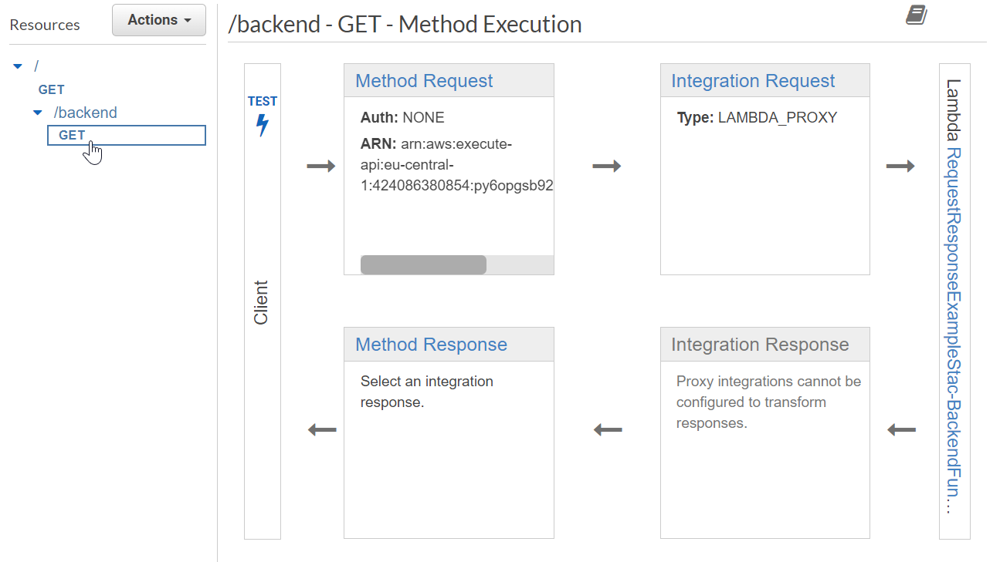

Click on **TEST** to access the integrated test configuration, leave all the defaults, scroll down, and click the **Test** button.

This will send a request to the API endpoint, and if everything has been set up correctly, the response will have the HTTP status code 200, as well as a body, containing the text from our function: "Hello from Lambda".

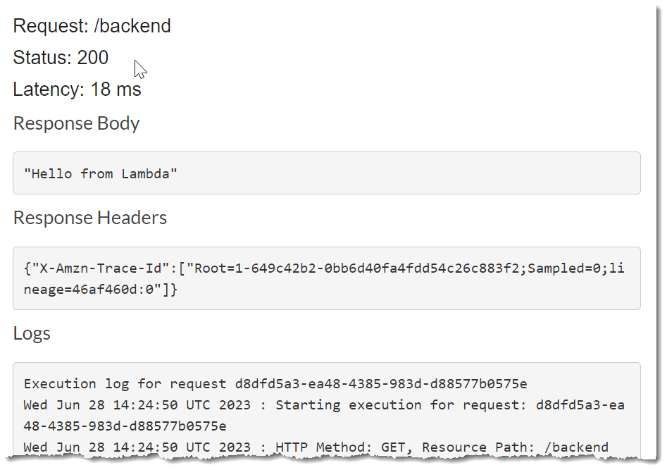

To test the endpoint in a browser, select **Stages** in the left menu, expand the **prod** stage, and click on the **/backend GET** method to display the **Invoke URL** of the new endpoint:

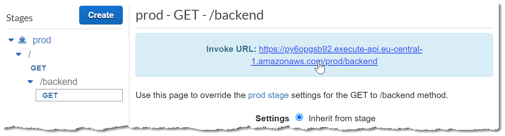

Open the URL in a new browser window and check the response, which also should be "Hello from Lambda".

And that's it!

**Congratulations!** You've created everything you need to set up a REST API using AWS API Gateway, that triggers a Lambda function on a specific endpoint, and redirects every other request to a predefined URL.

There's so much more you can do with API Gateway, like authentication, throttling, API keys, etc. If you want to learn more, check out the [AWS API Gateway Developer Guide](https://docs.aws.amazon.com/apigateway/latest/developerguide/welcome.html).

## Final Step - Clean-up

Feel free to continue experimenting with the API. Once you're done, you can remove everything that has been deployed by typing:

```bash
cdk destroy
```

After a confirmation step, this will delete all resources that have been created as part of our stack. 

The only remaining resource will be the Lambda function's source code, which has been uploaded to an assets bucket in Amazon S3. 

You can delete this directly in the [S3 Dashboard](https://s3.console.aws.amazon.com/s3/buckets) of the AWS Management Console:

Look for an S3 bucket called _cdk-XYZ-assets-XYZ-your-region_. This is the bucket that has been created when you bootstrapped the account with AWS CDK. 

I'd recommend keeping the bucket for further experiments with AWS CDK. Don't worry about costs, empty S3 buckets are completely free of charge.

You can delete everything inside the bucket by selecting the radio button next to its name, and clicking on **Empty**:

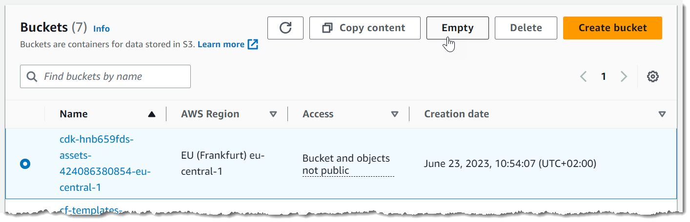

This will open a confirmation dialog. Double-check if it's the asset bucket, type _permanently delete_ into the text box and click on **Empty**.

## Conclusion

The synchronous request-response pattern is a widely used communication model in modern web and cloud architectures, and I hope that by following this tutorial, you were able to gain a clear understanding of how you can implement this pattern using Amazon API Gateway and AWS Lambda. 

If you want to learn more, look out for more [AWS community articles tagged api-gateway](https://community.aws/tags/api-gateway), the [AWS API Gateway Developer Guide](https://docs.aws.amazon.com/apigateway/latest/developerguide/welcome.html), and the many great API Gateway resources on [Serverless Land](https://serverlessland.com/search?search=api+gateway).

## The Complete Source Code

Here is the final source code for the CDK stack (_lib/request-response-example-stack.ts_): 

```typescript
import { Construct } from 'constructs';
import * as cdk from 'aws-cdk-lib';
import * as apigw from 'aws-cdk-lib/aws-apigateway';
import * as lambda from 'aws-cdk-lib/aws-lambda';

export class RequestResponseExampleStack extends cdk.Stack {
  constructor(scope: Construct, id: string, props?: cdk.StackProps) {
    super(scope, id, props);

    const backendFunction = new lambda.Function(
      this, 'BackendFunction', {
        runtime: lambda.Runtime.NODEJS_18_X,
        code: lambda.Code.fromAsset('lambda-src/backend-function'),
        handler: 'index.handler'
    });

    const api = new apigw.RestApi(this, 'SimpleApi', {
      restApiName: 'Simple API',
    })

    const redirect = new apigw.HttpIntegration('https://buildon.aws')
    
    api.root.addMethod('GET', redirect);

    const backendResource = api.root.addResource('backend')
    
    backendResource.addMethod(
      'GET', new apigw.LambdaIntegration(backendFunction)
    );

  }
}
```

And here's the source code for the Lambda function (_lambda-src/backend-function/index.js_):

```javascript
exports.handler = async function (event, context) {
  return {
    statusCode: 200,
    body: JSON.stringify('Hello from Lambda')
  };
};
```
