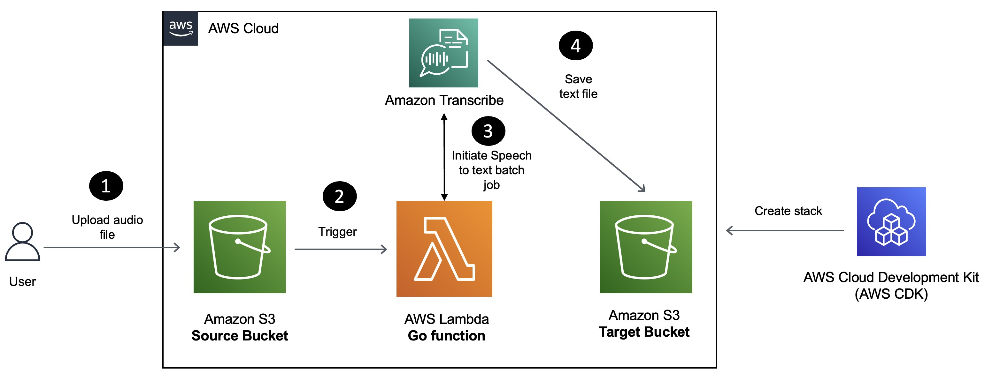
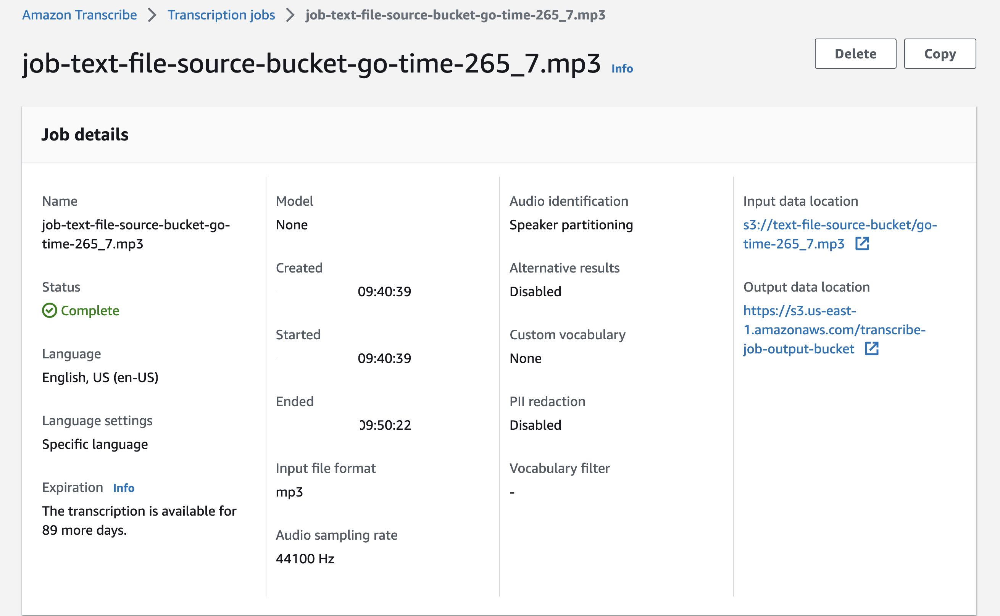

[Amazon Transcribe](https://docs.aws.amazon.com/transcribe/latest/dg/what-is.html?sc_channel=el&sc_campaign=datamlwave&sc_content=audio-to-text-transcribe-lambda-golang&sc_geo=mult&sc_country=mult&sc_outcome=acq) is a service that utilizes machine learning models to convert speech to text automatically. It offers various features that can enhance the accuracy of the transcribed text, such as language customization, content filtering, multi-channel audio analysis, and individual speaker speech partitioning. Amazon Transcribe can be used as a standalone transcription service or to add speech-to-text capabilities to any application. You can transcribe media in real time (streaming) or you can transcribe media files located in an [Amazon S3](https://docs.aws.amazon.com/AmazonS3/latest/userguide/Welcome.html?sc_channel=el&sc_campaign=datamlwave&sc_content=audio-to-text-transcribe-lambda-golang&sc_geo=mult&sc_country=mult&sc_outcome=acq) bucket (batch).

In this tutorial, you will learn how to build a Serverless application for speech (audio) to text conversion using Amazon Transcribe, [AWS Lambda](https://aws.amazon.com/lambda/?sc_channel=el&sc_campaign=datamlwave&sc_content=audio-to-text-transcribe-lambda-golang&sc_geo=mult&sc_country=mult&sc_outcome=acq) and the [Go](https://go.dev/) programming language.

We will cover how to:

- Deploy the solution using [AWS CloudFormation](https://aws.amazon.com/cloudformation/?sc_channel=el&sc_campaign=datamlwave&sc_content=audio-to-text-transcribe-lambda-golang&sc_geo=mult&sc_country=mult&sc_outcome=acq).
- Verify the solution.

We will be using the following Go libraries:

- [AWS Lambda for Go](https://github.com/aws/aws-lambda-go).
- [AWS Go SDK](https://pkg.go.dev/github.com/aws/aws-sdk-go-v2/service/rekognition), specifically for Amazon Rekognition.
- [Go bindings for AWS CDK](https://docs.aws.amazon.com/cdk/v2/guide/work-with-cdk-go.html?sc_channel=el&sc_campaign=datamlwave&sc_content=audio-to-text-transcribe-lambda-golang&sc_geo=mult&sc_country=mult&sc_outcome=acq) to implement "Infrastructure-as-code" (IaC) for the entire solution and deploy it with the [AWS Cloud Development Kit (CDK) CLI](https://docs.aws.amazon.com/cdk/v2/guide/cli.html?sc_channel=el&sc_campaign=datamlwave&sc_content=audio-to-text-transcribe-lambda-golang&sc_geo=mult&sc_country=mult&sc_outcome=acq).

## Application overview



Here is how the application works:

1. MP3 audio files uploaded to a `S3` bucket will trigger a Lambda function.
2. The Lambda function will submit an asynchronous job to Amazon Transcribe which will finally store the resulting file (containing the converted text) in another `S3` bucket.

## Prerequisites

Before starting this tutorial, you will need the following:

- An AWS Account (if you don't yet have one, you can create one and [set up your environment here](https://aws.amazon.com/getting-started/guides/setup-environment/?sc_channel=el&sc_campaign=datamlwave&sc_content=audio-to-text-transcribe-lambda-golang&sc_geo=mult&sc_country=mult&sc_outcome=acq)).
- [Go programming language](https://go.dev/dl/) (**v1.18** or higher).
- [AWS CDK](https://docs.aws.amazon.com/cdk/v2/guide/getting_started.html#getting_started_install?sc_channel=el&sc_campaign=datamlwave&sc_content=audio-to-text-transcribe-lambda-golang&sc_geo=mult&sc_country=mult&sc_outcome=acq).
- [AWS CLI](https://docs.aws.amazon.com/cli/latest/userguide/getting-started-install.html?sc_channel=el&sc_campaign=datamlwave&sc_content=audio-to-text-transcribe-lambda-golang&sc_geo=mult&sc_country=mult&sc_outcome=acq).
- [Git](https://git-scm.com/downloads).

| Attributes                |                                   |
| ------------------- | -------------------------------------- |
| ✅ AWS Level        | 100 - Beginner                          |
| ⏱ Time to complete  | 20 minutes                             |
| 💰 Cost to complete | Free when using the AWS Free Tier      |
| 💻 Code Sample         | Code sample used in tutorial on [GitHub](https://github.com/build-on-aws/amazon-transcribe-lambda-golang-example)                             |
| 📢 Feedback            | <a href="https://pulse.buildon.aws/survey/DEM0H5VW" target="_blank">Any feedback, issues, or just a</a> 👍 / 👎 ?    |
| ⏰ Last Updated     | 2023-06-28                             |

| ToC |
|-----|

## Use AWS CDK to deploy the solution

Clone the project and change to the right directory:

```bash
git clone https://github.com/build-on-aws/amazon-transcribe-lambda-golang-example

cd amazon-transcribe-lambda-golang-example
```

The AWS Cloud Development Kit (AWS CDK) is a framework that lets you define your cloud infrastructure as code in one of its supported programming and provision it through [AWS CloudFormation](https://aws.amazon.com/cloudformation/?sc_channel=el&sc_campaign=datamlwave&sc_content=audio-to-text-transcribe-lambda-golang&sc_geo=mult&sc_country=mult&sc_outcome=acq).

To start the deployment, simply invoke `cdk deploy` and wait for a bit. You will see a list of resources that will be created and will need to provide your confirmation to proceed.

```bash
cd cdk

cdk deploy

# output

Bundling asset LambdaTranscribeAudioToTextGolangStack/audio-to-text-function/Code/Stage...

✨  Synthesis time: 4.42s

//.... omitted

Do you wish to deploy these changes (y/n)? y
```

Enter `y` to start creating the AWS resources required for the application.

> If you want to see the AWS CloudFormation template which will be used behind the scenes, run `cdk synth` and check the `cdk.out` folder

You can keep track of the stack creation progress in the terminal or navigate to AWS console: `CloudFormation > Stacks > LambdaTranscribeAudioToTextGolangStack`.

Once the stack creation is complete, you should have:

- Two `S3` buckets: Source bucket to upload audio files and the target bucket to store the transcribed text files.
- A Lambda function to convert audio to text using Amazon Transcribe.
- And a few other resources (such as `IAM` roles etc.)

You will also see the following output in the terminal (resource names will differ in your case). In this case, these are the names of the S3 buckets created by CDK:

```bash
✅  LambdaTranscribeAudioToTextGolangStack

✨  Deployment time: 98.61s

Outputs:
LambdaTranscribeAudioToTextGolangStack.audiofilesourcebucketname = lambdatranscribeaudiotot-audiofilesourcebucket05f-182vj224hnpfl
LambdaTranscribeAudioToTextGolangStack.transcribejobbucketname = lambdatranscribeaudiotot-transcribejoboutputbucke-1gi0bu6r1d1jn
.....
```

You are ready to verify the solution.

## Convert speech to text

To try the solution, you can use a `MP3` audio file of your own. Since, I really enjoy listening to the [Go Time podcast](https://changelog.com/gotime), I will simply use one of its episodes and upload it (the MP3 file) to the `S3` source bucket using the AWS CLI.

```bash
export SOURCE_BUCKET=<enter source S3 bucket name - check the CDK output>

curl -sL https://cdn.changelog.com/uploads/gotime/267/go-time-267.mp3 | aws s3 cp - s3://$SOURCE_BUCKET/go-time-267.mp3

# verify that the file was uploaded
aws s3 ls s3://$SOURCE_BUCKET
```

This will invoke a Transcription Job. You can check its status in the AWS console: `Amazon Transcribe > Jobs`. Once it completes, you should see a new file in the output `S3` bucket with the same name as the audio file you uploaded, but with a `.txt` extension. This is the output file generated by Amazon Transcribe.



Download and open the output file.

```bash
export TARGET_BUCKET=<enter target S3 bucket name - check the CDK output>

# list contents of the target bucket
aws s3 ls s3://$TARGET_BUCKET

# download the output file
aws s3 cp s3://$TARGET_BUCKET/go-time-267.txt .
```

Interestingly enough, it has a `JSON` payload that looks like this:

```json
{
    "jobName": "job-go-time-267",
    "accountId": "1234566789",
    "results": {
        "transcripts": [
            {
                "transcript": "<transcribed text output...>"
            }
        ]
    },
    "status": "COMPLETED"
}
```

You can use the `transcript` property to extract the actual text.

Now that you have verified the end-to-end solution, you can clean up the resources and explore the Lambda function logic.

## Clean up

Once you're done, to delete all the services, simply use:

```bash
cdk destroy

#output prompt (choose 'y' to continue)

Are you sure you want to delete: LambdaTranscribeAudioToTextGolangStack (y/n)?
```

## Lambda function code walk through

Here is a quick overview of the Lambda function logic. Please note that some code (error handling, logging etc.) has been omitted for brevity since we only want to focus on the important parts.

```go
func handler(ctx context.Context, s3Event events.S3Event) {
	for _, record := range s3Event.Records {

		sourceBucketName := record.S3.Bucket.Name
		fileName := record.S3.Object.Key

		err := audioToText(sourceBucketName, fileName)
	}
}
```

The Lambda function is triggered when a new file is uploaded to the source bucket. The handler function iterates over the `S3` event records and calls the `audioToText` function.

Let's go through the `audioToText` function.

```go
func audioToText(sourceBucketName, fileName string) error {

	inputFileNameFormat := "s3://%s/%s"
	inputFile := fmt.Sprintf(inputFileNameFormat, sourceBucketName, fileName)

	languageCode := "en-US"
	jobName := "job-" + sourceBucketName + "-" + fileName

	outputFileName := strings.Split(fileName, ".")[0] + "-job-output.txt"

	_, err := transcribeClient.StartTranscriptionJob(context.Background(), &transcribe.StartTranscriptionJobInput{
		TranscriptionJobName: &jobName,
		LanguageCode:         types.LanguageCode(languageCode),
		MediaFormat:          types.MediaFormatMp3,
		Media: &types.Media{
			MediaFileUri: &inputFile,
		},
		OutputBucketName: aws.String(outputBucket),
		OutputKey:        aws.String(outputFileName),
		Settings: &types.Settings{
			ShowSpeakerLabels: aws.Bool(true),
			MaxSpeakerLabels:  aws.Int32(5),
		},
	})

	return nil
}
```

- The `audioToText` function submits a transcription job to Amazon Transcribe.
- The transcription job is configured to output the results to a file in the target `S3` bucket.

> Note that the name of the output file is derived from the name of the input file.

## Conclusion

In this tutorial, you used AWS CDK to deploy a Go Lambda function to convert audio to text using Amazon Transcribe and store the results in another `S3` bucket. Here are a few things you can try out to extend this solution:

- Build another Lambda function that's triggered by the transcribed file in the output bucket, parse the `JSON` content and extract the transcribed text.
- Try to generate transcriptions in real-time with [Amazon Transcribe streaming](https://docs.aws.amazon.com/transcribe/latest/dg/streaming.html?sc_channel=el&sc_campaign=datamlwave&sc_content=audio-to-text-transcribe-lambda-golang&sc_geo=mult&sc_country=mult&sc_outcome=acq).
