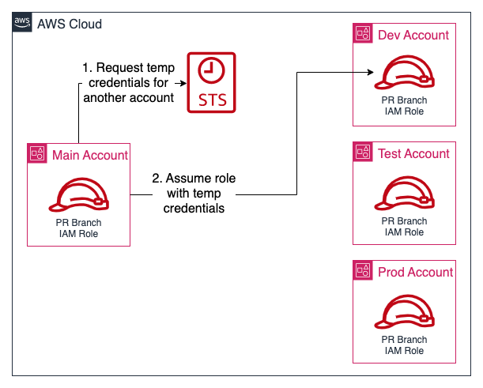
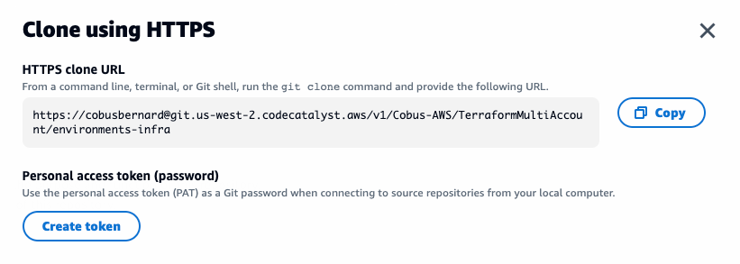
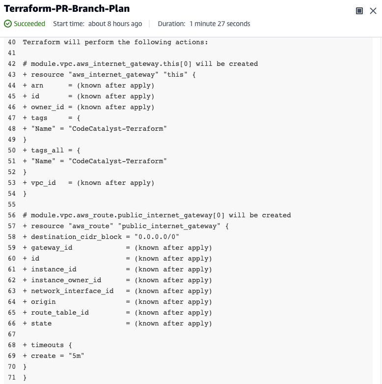

As teams grow, so does the complexity of managing and coordinating changes to the application environment. While having a single account to provision all your infrastructure and deploy all systems works well for a small group of people, you will probably hit a point where there are too many people making changes at the same time to be able to manage it all. Additionally, with all your infrastructure in a single account, it becomes very difficult to apply the principle of least privilege, not to even mention the naming convention of resources. This tutorial will guide you how to split your infrastructure across multiple accounts by creating a `main` account for all common infrastructure shared by all environments (for example: users, build pipeline, build artifacts, etc.), and then an environment account for the three stages of your application: `dev`, `test`, and `prod`. The approach will make use of Terraform, Amazon CodeCatalyst, and assuming IAM roles between these accounts. It is an evolution of the [2020 HashTalks session](https://www.youtube.com/watch?v=qVcdO3OeTZo) I did. We will address the following:

* How to split our infrastructure between multiple accounts and code repositories
* How to set up a build and deployment pipeline to manage all changes in the environment account with Terraform
* How to keep `dev`, `test`, and `prod` infrastructure in sync without needed to copy files around

## Table of Contents

| Attributes             |                                                                 |
|------------------------|-----------------------------------------------------------------|
| ✅ AWS experience      | 300 - Advanced                                              |
| ⏱ Time to complete     | 60 minutes                                                      |
| 💰 Cost to complete    | Free tier eligible                                               |
| 🧩 Prerequisites       | - [AWS Account](https://portal.aws.amazon.com/billing/signup#/start/email)<br>- [CodeCatalyst Account](https://codecatalyst.aws)<br>- [Terraform](https://terraform.io/) 1.3.7+<br>- (Optional) [GitHub](https://github.com) account|
| 💻 Code         | [Download here the full guide](https://github.com/build-on-aws/manage-multiple-environemnts-with-terraform) |
| 📢 Feedback            | <a href="https://pulse.buildon.aws/survey/DEM0H5VW" target="_blank">Any feedback, issues, or just a</a> 👍 / 👎 ?    |
| ⏰ Last Updated        | 2023-03-07                                                      |

| ToC |
|-----|

## Setting up a CI/CD pipeline for the Main account

As a first step, we need to set up a CI/CD pipeline for all the shared infrastructure in our `main` account. We will be using the approach from [Terraform bootstrapping tutorial](https://www.buildon.aws/tutorials/bootstrapping-terraform-automation-amazon-codecatalyst/) - we won't be covering any of the details here, just following the steps, if you would like to understand more, we recommend working through that tutorial first. You can continue with this tutorial after finishing the bootstrapping one, just don't follow the cleanup steps - just skip to the [next section](#setting-up-the-new-aws-environment-accounts). Here is a condensed version of all the steps.

To set up our pipeline, make sure you are logged into your AWS and CodeCatalyst accounts to set up our project, environment, repository, and CI/CD pipelines. In CodeCatalyst:

1. Create a new Project called `TerraformMultiAccount` using the "Start from scratch" option
1. Create a code repository called `main-infra` in the project, using Terraform for the `.gitignore file`
1. Link an AWS account to our project via the CI/CD -> Environments section with the name "MainAccount"
1. Create a Dev environment using Cloud9 under CI/CD -> Environments, and cloning the `main-infra` repository using the `main` branch
1. Launch the `dev environment`, and configure the AWS CLI using `aws configure` with the credentials of an IAM user in your AWS account

### Bootstrapping Terraform

We first need to bootstrap Terraform in our account, please follow these steps in your Cloud9 dev environment's terminal:

```bash
# Install specific Terraform version
TF_VERSION=1.3.7
wget -O terraform.zip https://releases.hashicorp.com/terraform/${TF_VERSION}/terraform_${TF_VERSION}_linux_amd64.zip
unzip terraform.zip
rm terraform.zip
sudo mv terraform /usr/bin/terraform
sudo chmod +x /usr/bin/terraform
```

For the next commands, please run them in the `main-infra` directory:

```bash
# Set up required resources for Terraform to use to bootstrap
mkdir -p _bootstrap
wget -P _bootstrap/ https://raw.githubusercontent.com/build-on-aws/bootstrapping-terraform-automation/main/_bootstrap/codecatalyst/main_branch_iam_role.tf
wget -P _bootstrap/ https://raw.githubusercontent.com/build-on-aws/bootstrapping-terraform-automation/main/_bootstrap/codecatalyst/pr_branch_iam_role.tf
wget -P _bootstrap/ https://raw.githubusercontent.com/build-on-aws/bootstrapping-terraform-automation/main/_bootstrap/codecatalyst/providers.tf
wget -P _bootstrap/ https://raw.githubusercontent.com/build-on-aws/bootstrapping-terraform-automation/main/_bootstrap/codecatalyst/state_file_resources.tf
wget -P _bootstrap/ https://raw.githubusercontent.com/build-on-aws/bootstrapping-terraform-automation/main/_bootstrap/codecatalyst/variables.tf
```

We will now create the required infrastructure to store our state file using S3 as a backend, DynamoDB for managing the lock to ensure only one change is made at a time, and setting up two IAM roles for our workflows to use. Edit `variables.tf` and change the `state_file_bucket_name` value to a unique value - for this tutorial, we will use `tf-multi-account` - you should use a different, unique bucket name. We need to initialize the Terraform backend, and then apply these changes to create the state file, lock table, and IAM roles for our CI/CD pipeline. If you would like to use a different AWS region, you can update the `aws_region` variable with the appropriate string. Run the following commands for this:

```bash
terraform init
terraform apply
```

We now have our resources tracked in a state file, but it stored locally in our Dev environment, and we need to configure it to use the S3 backend. We first need to add a backend configuration, and then migrate the state file to it. Use the following command to add it:

```bash
wget -P _bootstrap/ https://raw.githubusercontent.com/build-on-aws/bootstrapping-terraform-automation/main/_bootstrap/codecatalyst/terraform.tf
```

Edit `_bootstrap/terraform.tf` and change the `bucket` key to the name of your bucket - Terraform variables cannot be used in backend configuration, so this needs to be done by hand. If you changed the region being used in the `provider` block, please also update the `region` key in `terraform.tf`. We are now ready to migrate our state file to the S3 bucket by running the following:

```bash
terraform init -migrate-state
```

Next, we need to allow the two new IAM roles access to our CodeCatalyst Space and projects. In your Space, navigate to the `AWS accounts` tab, click your AWS account number, and then on Manage roles from the AWS Management Console. This will open a new tab, select `Add an existing role you have created in IAM`, and select `Main-Branch-Infrastructure` from the dropdown. Click `Add role`. This will take you to a new page with a green `Successfully added IAM role Main-Branch-Infrastructure.` banner at the top. Click on `Add IAM role`, and follow the same process to add the `PR-Branch-Infrastructure` role. Once done, you can close this window and go back to the CodeCatalyst one.

Lastly, we need to create the workflows that will run `terraform plan` for all pull requests (PRs), and then `terraform apply` for any PRs that are merged to the `main` branch. Run the following commands:

```bash
mkdir -p .codecatalyst/workflows

wget -P .codecatalyst/workflows .codecatalyst/workflows https://raw.githubusercontent.com/build-on-aws/manage-multiple-environemnts-with-terraform/main/.codecatalyst/workflows/main_branch.yml
wget -P .codecatalyst/workflows https://raw.githubusercontent.com/build-on-aws/manage-multiple-environemnts-with-terraform/main/.codecatalyst/workflows/pr_branch.yml

wget https://raw.githubusercontent.com/build-on-aws/bootstrapping-terraform-automation/main/providers.tf
wget https://raw.githubusercontent.com/build-on-aws/bootstrapping-terraform-automation/main/terraform.tf
wget https://raw.githubusercontent.com/build-on-aws/bootstrapping-terraform-automation/main/variables.tf
```

Now edit `.codecatalyst/workflows/main_branch.yml` and `.codecatalyst/workflows/pr_branch.yml`, replacing the `123456789012` AWS account ID with your one. In `terraform.tf`, change the `bucket` value to match your state file bucket created earlier, and optionally `region` if you are using a different region - this should match the region you used in the `_bootstrap/terraform.tf` backend configuration as we are using the same bucket. You can change the `aws_region` variable in `variables.tf` to set the region to create infrastructure in. Finally, we need to commit all the changes after making sure our Terraform code is properly formatted:

```bash
terraform fmt

git add .
git commit -m "Setting main infra ci-cd workflows"
git push
```

Navigate to `CI/CD` -> `Workflows` and confirm that the `main` branch workflow `MainBranch` is running and completes successfully. We now have the base of our infrastructure automation for a single AWS account. Next, we will set up additional environment accounts.

## Setting up the new AWS environment accounts

Similar to the bootstrapping of the base infrastructure, we need to bootstrap the three new AWS account for our `dev`, `test`, and `prod` environments. We will use our `main-infra` repository to manage this for us. Since we already have a bucket for storing state files in, we will use the same one, but change the `key` in the `backend` configuration block for our environment accounts to ensure we don't overwrite the current one. As we will be using different AWS accounts, we need a mechanism for our workflows to be able to access them. We will be using the IAM role [assume](https://docs.aws.amazon.com/IAM/latest/UserGuide/id_roles_use.html) functionality. This works by adding a trust policy to the IAM roles in each of the environment accounts by specifying that our `main` account may assume the roles in our environment accounts, and only perform actions as defined by this role. We then add an additional policy to our existing IAM workflow roles in our `main` account allowing them to assume the equivalent role in each environment account. This means that the PR branch role can only assume the PR branch role in each account to prevent accidental infrastructure changes, and similarly the `main` branch role can only assume the equivalent `main` branch role. The diagram below visualizes the process:



We need to create and modify the following resources:

1. **New AWS accounts**: We will create three new accounts using AWS Organizations
1. **New IAM roles**: Provides the roles for our workflow to assume in the environment accounts - one for the `main` branch, one for any pull requests (PRs), with a trust policy for access from our `main` account.
1. **New IAM policies**: Set the boundaries of what the workflow IAM roles may do in the environment account - full admin access for `main` branch allowing creation of infrastructure, `ReadOnly` for the PR branches to allow validating any changes
1. **IAM policies**: One each for the `main` and PR branch roles allowing them to assume the equivalent IAM role in environment accounts
1. **IAM roles**: Add the policy to assume the new environment account IAM roles

To do this, add the following to the `variables.tf` file in the root of `main-infra` to define the three email addresses we will use to create child accounts, and also the name of the IAM role to create to allow access to the account. This IAM role is created in each of the environment accounts with admin permissions, and can be [assumed](https://docs.aws.amazon.com/IAM/latest/UserGuide/id_roles_use.html) from the top-level account. We will be setting up additional IAM roles for our workflows in the environment accounts further down.

> 💡 Tip: You can use `+` in an email address to set up additional, unique email strings that will all be delivered to the same email inbox, e.g. if your email is `john@example.com`, you can use `john+aws-dev@example.com`. This is useful as each AWS account needs a globally unique email address, but managing multiple inboxes can become a problem.

```bash
variable "iam_account_role_name" {
  type    = string
  default = "Org-Admin"
}

variable "account_emails" {
  type = map(any)
  default = {
    dev : "tf-demo+dev@example.com",
    test : "tf-demo+test@example.com",
    prod : "tf-demo+prod@example.com",
  }
}
```

Create a new file called `aws_environment_accounts.tf` to create the accounts using AWS Organizations, and also to add them to OUs (Organizational Units) - this is a useful way to organize multiple AWS accounts if you need to apply specific rules to each one. Add the following to the file:

```bash
# Set up the organization
resource "aws_organizations_organization" "org" {
  aws_service_access_principals = [
    "cloudtrail.amazonaws.com",
    "config.amazonaws.com",
    "sso.amazonaws.com",
  ]

  feature_set = "ALL"
}

# Create a new OU for environment accounts
resource "aws_organizations_organizational_unit" "environments" {
  name      = "environments"
  parent_id = aws_organizations_organization.org.roots[0].id
}

# Create a new AWS account called "dev"
resource "aws_organizations_account" "dev" {
  name      = "dev"
  email     = lookup(var.account_emails, "dev")
  role_name = var.iam_account_role_name
  parent_id = aws_organizations_organizational_unit.environments.id

  depends_on = [aws_organizations_organization.org]
}

# Create a new AWS account called "test"
resource "aws_organizations_account" "test" {
  name      = "test"
  email     = lookup(var.account_emails, "test")
  role_name = var.iam_account_role_name
  parent_id = aws_organizations_organizational_unit.environments.id

  depends_on = [aws_organizations_organization.org]
}

# Create a new AWS account called "prod"
resource "aws_organizations_account" "prod" {
  name      = "prod"
  email     = lookup(var.account_emails, "prod")
  role_name = var.iam_account_role_name
  parent_id = aws_organizations_organizational_unit.environments.id

  depends_on = [aws_organizations_organization.org]
}
```

> 💡 Tip: If you are applying this strategy to existing AWS accounts and using the [import](https://developer.hashicorp.com/terraform/cli/import) function of Terraform, take note of the instructions on how to avoid recreating the account when importing in the [resource page](https://registry.terraform.io/providers/hashicorp/aws/latest/docs/resources/organizations_account#import). You will also need to import the AWS Organization if you already one set up in your account by running `terraform import aws_organizations_organization.org 123456789012`, and replacing the number with your AWS account ID.

Let's look at these changes and then apply them by running `terraform init` first, and then `terraform plan` in your CodeCatalyst environment's terminal.  (**Please note: If you are following on from the [previous tutorial](https://www.buildon.aws/tutorials/bootstrapping-terraform-automation-amazon-codecatalyst/), you can still run these steps, it will not cause any issues**):

```bash
terraform init
terraform plan
```

The proposed changes should be similar to this list:

```bash
Terraform used the selected providers to generate the following execution plan. Resource actions are indicated with the following symbols:
  + create

Terraform will perform the following actions:

  # aws_organizations_account.dev will be created
  + resource "aws_organizations_account" "dev" {
      + arn               = (known after apply)
      + close_on_deletion = false
      + create_govcloud   = false
      + email             = "tf-demo+dev@example.com"
      + govcloud_id       = (known after apply)
      + id                = (known after apply)
      + joined_method     = (known after apply)
      + joined_timestamp  = (known after apply)
      + name              = "dev"
      + parent_id         = (known after apply)
      + role_name         = "Org-Admin"
      + status            = (known after apply)
      + tags_all          = (known after apply)
    }

  # aws_organizations_account.prod will be created
  + resource "aws_organizations_account" "prod" {
      + arn               = (known after apply)
      + close_on_deletion = false
      + create_govcloud   = false
      + email             = "tf-demo+prod@example.com"
      + govcloud_id       = (known after apply)
      + id                = (known after apply)
      + joined_method     = (known after apply)
      + joined_timestamp  = (known after apply)
      + name              = "prod"
      + parent_id         = (known after apply)
      + role_name         = "Org-Admin"
      + status            = (known after apply)
      + tags_all          = (known after apply)
    }

  # aws_organizations_account.test will be created
  + resource "aws_organizations_account" "test" {
      + arn               = (known after apply)
      + close_on_deletion = false
      + create_govcloud   = false
      + email             = "tf-demo+test@example.com"
      + govcloud_id       = (known after apply)
      + id                = (known after apply)
      + joined_method     = (known after apply)
      + joined_timestamp  = (known after apply)
      + name              = "test"
      + parent_id         = (known after apply)
      + role_name         = "Org-Admin"
      + status            = (known after apply)
      + tags_all          = (known after apply)
    }

  # aws_organizations_organization.org will be created
  + resource "aws_organizations_organization" "org" {
      + accounts                      = (known after apply)
      + arn                           = (known after apply)
      + aws_service_access_principals = [
          + "cloudtrail.amazonaws.com",
          + "config.amazonaws.com",
          + "sso.amazonaws.com",
        ]
      + feature_set                   = "ALL"
      + id                            = (known after apply)
      + master_account_arn            = (known after apply)
      + master_account_email          = (known after apply)
      + master_account_id             = (known after apply)
      + non_master_accounts           = (known after apply)
      + roots                         = (known after apply)
    }

  # aws_organizations_organizational_unit.environments will be created
  + resource "aws_organizations_organizational_unit" "environments" {
      + accounts  = (known after apply)
      + arn       = (known after apply)
      + id        = (known after apply)
      + name      = "environments"
      + parent_id = (known after apply)
      + tags_all  = (known after apply)
    }

Plan: 5 to add, 0 to change, 0 to destroy.
```

Now go ahead and apply them with `terraform apply`:

```bash
terraform apply
```

While running the `apply`, or shortly after, you will start to receive the welcome emails from the new accounts. There will be a mail with the subject `AWS Organizations email verification request` that you need to look out for, and click the `Verify email address` if this is the first time you are using an AWS Organization in your account.

You may be wondering why we are running these commands directly instead of using our workflow we set up earlier. The reason is that we will be making quite a few changes to the `main-infra` repo to set up the environment accounts where we need to apply the changes before we can move on to the next set.
While you could do this with pull requests, it will add quite a bit of time for a process you should only be doing once.

### Set up permission for Terraform in environment accounts

Next, we need to create the IAM roles and policies in the new accounts, and update our existing IAM roles with additional policies to allow them to assume these new roles in the environment accounts. First, we need to define additional `AWS` providers to allow Terraform to create infrastructure in our new accounts. Terraform provider [aliases](https://developer.hashicorp.com/terraform/language/providers/configuration#alias-multiple-provider-configurations) allow you to configure multiple providers with different configurations. In our case, we will create the default provider to use our Main account, and then set up 3 additional ones for `dev`, `test`, and `prod`, and use IAM role switching to access them. We will use the IAM role created as part of our new accounts to do this. Add the following to the `providers.tf` file in the root of `main-infra` - since we created the new AWS accounts using Terraform, we can reference the account IDs via those resources:

```bash
provider "aws" {
  alias  = "dev"
  region = var.aws_region
  assume_role {
    role_arn     = "arn:aws:iam::${aws_organizations_account.dev.id}:role/${var.iam_account_role_name}"
    session_name = "dev-account-from-main"
  }
}

provider "aws" {
  alias  = "test"
  region = var.aws_region
  assume_role {
    role_arn     = "arn:aws:iam::${aws_organizations_account.test.id}:role/${var.iam_account_role_name}"
    session_name = "test-account-from-main"
  }
}

provider "aws" {
  alias  = "prod"
  region = var.aws_region
  assume_role {
    role_arn     = "arn:aws:iam::${aws_organizations_account.prod.id}:role/${var.iam_account_role_name}"
    session_name = "prod-account-from-main"
  }
}
```

Now that we can access the environment accounts with these new providers, we need to also create IAM roles for the `main` and PR branches inside each account for our workflows to use, as well as a read-only one for all users. This will ensure that the `ReadOnly` role we use for PR branches in the `main` account can only assume the equivalent `ReadOnly` role in each of the environment accounts, the `AdministratorAccess` one the same in each one, and the a `ReadOnly` role for our team members in each of the environment accounts - they should not be changing anything by hand via the AWS Console, AWS CLI, or API calls. To add these roles in each account, run the following commands:

```bash
wget https://raw.githubusercontent.com/build-on-aws/manage-multiple-environments-with-terraform/main/env_accounts_main_branch_iam_role.tf
wget https://raw.githubusercontent.com/build-on-aws/manage-multiple-environments-with-terraform/main/env_accounts_pr_branch_iam_role.tf
wget https://raw.githubusercontent.com/build-on-aws/manage-multiple-environments-with-terraform/main/env_accounts_users_read_only_iam_role.tf
```

The contents of each file that we downloaded should be the following:

* env_accounts_main_branch_iam_role.tf
    ```bash
    # Policy allowing the PR branches in our repo to assume the role from each environment account.
    data "aws_iam_policy_document" "env_accounts_pr_branch_assume_role_policy" {
      statement {
        actions = ["sts:AssumeRole"]
        effect  = "Allow"
        principals {
          type = "AWS"
          identifiers = [
            "arn:aws:iam::${data.aws_organizations_organization.org.master_account_id}:root"
          ]
        }
      }
    }

    # Dev Account IAM Roles
    # =====================

    # Role to allow the PR branch to use this dev AWS account
    resource "aws_iam_role" "dev_pr_branch" {
      provider           = aws.dev
      name               = "PR-Branch-Infrastructure"
      assume_role_policy = data.aws_iam_policy_document.env_accounts_pr_branch_assume_role_policy.json
    }

    # Allow role read-only rights in the account to run "terraform plan"
    resource "aws_iam_role_policy_attachment" "dev_readonly_policy_pr_branch" {
      provider   = aws.dev
      role       = aws_iam_role.dev_pr_branch.name
      policy_arn = "arn:aws:iam::aws:policy/ReadOnlyAccess"
    }


    # Test Account IAM Roles
    # ======================

    # Role to allow the PR branch to use this test AWS account
    resource "aws_iam_role" "test_pr_branch" {
      provider           = aws.test
      name               = "PR-Branch-Infrastructure"
      assume_role_policy = data.aws_iam_policy_document.env_accounts_pr_branch_assume_role_policy.json
    }

    # Allow role read-only rights in the account to run "terraform plan"
    resource "aws_iam_role_policy_attachment" "test_readonly_policy_pr_branch" {
      provider   = aws.test
      role       = aws_iam_role.test_pr_branch.name
      policy_arn = "arn:aws:iam::aws:policy/ReadOnlyAccess"
    }


    # Prod Account IAM Roles
    # ======================

    # Role to allow the PR branch to use this prod AWS account
    resource "aws_iam_role" "prod_pr_branch" {
      provider           = aws.prod
      name               = "PR-Branch-Infrastructure"
      assume_role_policy = data.aws_iam_policy_document.env_accounts_pr_branch_assume_role_policy.json
    }

    # Allow role read-only rights in the account to run "terraform plan"
    resource "aws_iam_role_policy_attachment" "prod_readonly_policy_pr_branch" {
      provider   = aws.prod
      role       = aws_iam_role.prod_pr_branch.name
      policy_arn = "arn:aws:iam::aws:policy/ReadOnlyAccess"
    }

    # Adding permission to the PR-Branch role in the Main account to assume the 
    # PR-Branch role in each environment account.
    data "aws_iam_policy_document" "pr_branch_assume_role_in_environment_account_policy" {
      statement {
        actions = ["sts:AssumeRole"]
        effect  = "Allow"
        resources = [
          aws_iam_role.dev_pr_branch.arn,
          aws_iam_role.test_pr_branch.arn,
          aws_iam_role.prod_pr_branch.arn
        ]
      }
    }

    # Since the IAM role was created as part of the bootstrapping, we need to 
    # reference it using a data source to add the additional policy to allow
    # role switching.
    data "aws_iam_role" "pr_branch" {
      name = "PR-Branch-Infrastructure"
    }

    resource "aws_iam_policy" "pr_branch_role_assume_environment_accounts_roles" {
      name        = "PR-Branch-Assume-Environment-Account-Role"
      path        = "/"
      description = "Policy allowing the PR branch role to assume the equivalent role in the environment accounts."
      policy      = data.aws_iam_policy_document.pr_branch_assume_role_in_environment_account_policy.json
    }

    resource "aws_iam_role_policy_attachment" "pr_branch_role_assume_environment_accounts_roles" {
      role       = data.aws_iam_role.pr_branch.name
      policy_arn = aws_iam_policy.pr_branch_role_assume_environment_accounts_roles.arn
    }
    ```
* env_accounts_pr_branch_iam_role.tf
    ```bash
    # Policy allowing the PR branches in our repo to assume the role from each environment account. 
    data "aws_iam_policy_document" "env_accounts_pr_branch_assume_role_policy" {
      statement {
        actions = ["sts:AssumeRole"]
        effect  = "Allow"
        principals {
          type = "AWS"
          identifiers = [
            "arn:aws:iam::${data.aws_organizations_organization.org.master_account_id}:root"
          ]
        }
      }
    }


    # Dev Account IAM Roles
    # =====================

    # Role to allow the PR branch to use this dev AWS account
    resource "aws_iam_role" "dev_pr_branch" {
      provider           = aws.dev
      name               = "PR-Branch-Infrastructure"
      assume_role_policy = data.aws_iam_policy_document.env_accounts_pr_branch_assume_role_policy.json
    }

    # Allow role read-only rights in the account to run "terraform plan"
    resource "aws_iam_role_policy_attachment" "dev_readonly_policy_pr_branch" {
      provider   = aws.dev
      role       = aws_iam_role.dev_pr_branch.name
      policy_arn = "arn:aws:iam::aws:policy/ReadOnlyAccess"
    }


    # Test Account IAM Roles
    # ======================

    # Role to allow the PR branch to use this test AWS account
    resource "aws_iam_role" "test_pr_branch" {
      provider           = aws.test
      name               = "PR-Branch-Infrastructure"
      assume_role_policy = data.aws_iam_policy_document.env_accounts_pr_branch_assume_role_policy.json
    }

    # Allow role read-only rights in the account to run "terraform plan"
    resource "aws_iam_role_policy_attachment" "test_readonly_policy_pr_branch" {
      provider   = aws.test
      role       = aws_iam_role.test_pr_branch.name
      policy_arn = "arn:aws:iam::aws:policy/ReadOnlyAccess"
    }


    # Prod Account IAM Roles
    # ======================

    # Role to allow the PR branch to use this prod AWS account
    resource "aws_iam_role" "prod_pr_branch" {
      provider           = aws.prod
      name               = "PR-Branch-Infrastructure"
      assume_role_policy = data.aws_iam_policy_document.env_accounts_pr_branch_assume_role_policy.json
    }

    # Allow role read-only rights in the account to run "terraform plan"
    resource "aws_iam_role_policy_attachment" "prod_readonly_policy_pr_branch" {
      provider   = aws.prod
      role       = aws_iam_role.prod_pr_branch.name
      policy_arn = "arn:aws:iam::aws:policy/ReadOnlyAccess"
    }
    ```
* env_accounts_users_read_only_iam_role.tf
    ```bash
    # Policy allowing users in our repo to assume the role. 
    data "aws_iam_policy_document" "env_accounts_users_assume_role_policy" {
      statement {
        actions = ["sts:AssumeRole"]
        effect  = "Allow"
        principals {
          type = "AWS"
          identifiers = [
            "arn:aws:iam::${data.aws_organizations_organization.org.master_account_id}:root"
          ]
        }
      }
    }


    # Dev Account IAM Roles
    # =====================

    # Role to allow a user to use this dev AWS account
    resource "aws_iam_role" "dev_users" {
      provider           = aws.dev
      name               = "Users-Read-Only"
      assume_role_policy = data.aws_iam_policy_document.env_accounts_users_assume_role_policy.json
    }

    # Allow role read-only rights in the account to run "terraform plan"
    resource "aws_iam_role_policy_attachment" "dev_users_read_only" {
      provider   = aws.dev
      role       = aws_iam_role.dev_users.name
      policy_arn = "arn:aws:iam::aws:policy/ReadOnlyAccess"
    }


    # Test Account IAM Roles
    # ======================

    # Role to allow a user to use this test AWS account
    resource "aws_iam_role" "test_users" {
      provider           = aws.test
      name               = "Users-Read-Only"
      assume_role_policy = data.aws_iam_policy_document.env_accounts_users_assume_role_policy.json
    }

    # Allow role read-only rights in the account to run "terraform plan"
    resource "aws_iam_role_policy_attachment" "test_users_read_only" {
      provider   = aws.test
      role       = aws_iam_role.test_users.name
      policy_arn = "arn:aws:iam::aws:policy/ReadOnlyAccess"
    }


    # Prod Account IAM Roles
    # ======================

    # Role to allow a user to use this test AWS account
    resource "aws_iam_role" "prod_pr_branch" {
      provider           = aws.prod
      name               = "Users-Read-Only"
      assume_role_policy = data.aws_iam_policy_document.env_accounts_pr_branch_assume_role_policy.json
    }

    # Allow role read-only rights in the account to run "terraform plan"
    resource "aws_iam_role_policy_attachment" "prod_readonly_policy_pr_branch" {
      provider   = aws.prod
      role       = aws_iam_role.prod_pr_branch.name
      policy_arn = "arn:aws:iam::aws:policy/ReadOnlyAccess"
    }
    ```

We are creating a default, read-only role for users (developers, DevOps/SRE teams, etc) to use as all changes should be via Terraform, but we need to provide them with access to look at the console. We'll be setting up the users further down. The IAM roles above will look very similar to the original ones we created, but with the trust policy changed to allow assuming these roles from our `main-infra` account instead of being assumed by the CodeCatalyst task runner - the runner will assume a role in the main account, and from there assume another role in each of our environment accounts.

```bash
  statement {
    actions = ["sts:AssumeRole"]
    effect  = "Allow"
    principals {
      type = "AWS"
      identifiers = [
        "arn:aws:iam::${data.aws_organizations_organization.org.master_account_id}:root"
      ]
    }
  }
```

We also don't need to specify the main account's AWS account ID as we can use the `aws_organizations_organization` data source to do the lookup for us.

You will notice that the read-only roles do not have permission to access the S3 state file bucket, DynamoDB table for locks, or KMS key for state file encryption. There will be two roles at play in our workflows, the base IAM role that the workflow runs with, and then the role we specify in the `AWS` provider. We configure our Terraform backend without specifying the role, so it will use the one supplied by the workflow, whereas the `AWS` providers for each account (that creates the resources) uses the role we specify in each of the provider configurations. This allows the state files to be updated without additional permissions inside each environment account as the state isn't stored in the environment accounts, but inside our `main-infra` account. We will use this same approach when setting up our new `environments-infra` repository further down.

We can now add our new IAM roles by running `terraform apply`, you should see 12 new resources to add. After adding them, we need to set up IAM roles for our developers to use in the different environment accounts. Before we continue, let's commit our changes to ensure we don't lose them accidentally:

```bash
terraform apply
# accept changes with "yes"

git add .
git commit -m "Adding providers and IAM roles for workflows for environment accounts"
git push
```

## Setting up workflows for environment accounts

We have everything in place now to start adding infrastructure to our environment accounts, and need to create a new repository to store any infrastructure in. While we could use the `main-infra` account to do this, we treat that as a sensitive repository since it controls all the infrastructure we need to manage our AWS accounts, and want to limit access to it. We will use a new repository called `environments-infra` to manage the day-to-day infrastructure. First, create a new repository in CodeCatalyst under `Code` -> `Source repositories` by clicking the `Add repository` button. Use `environments-infra` for the name, `Manages the dev, test, and prod accounts' infrastructure.` for the description, and select `Terraform` for the `.gitignore` file. Once created, click on the `Clone repository` button, then on the `Copy` button to copy the `git clone` URL:



The Dev environment is configured to use the AWS CodeCommit credentials helper, you can leave it as-is and generate a Personal access token to use from the `Clone repository` dialog we just used, or edit `~/.gitconfig` and change the credentials helper under `[credential]` from `helper = !aws codecommit credential-helper $@` to `helper = /aws/mde/credential-helper`. This enables you to clone CodeCatalyst repositories without needing to specify a Personal access token every time.

To clone the new repo, in your terminal, change to the `/projects` directory to clone the `environments-infra` repo, and then type `git clone `, and paste the URL from the dialog (yours will be different based on your user alias, Space, and Project name):

```bash
# Ensure to replace the URL with your one without the "< >" brackets.
git clone <Your clone URL>
```

If you didn't change the credentials helper, it will now prompt you for a password, in the `Clone repository` dialog in CodeCatalyst, use the `Create token` button, and then click on the `Copy` button next to it, and paste that into the terminal as your password:

```bash
Cloning into 'environments-infra'...
remote: Counting objects: 4, done.
Unpacking objects: 100% (4/4), 1.11 KiB | 567.00 KiB/s, done.
```

### Configuring Terraform

We need to define a backend for environment accounts first, please create `terraform.tf` in the `environments-infra` with the following - it is the same as for the `main-infra` repo, except we changed the `key` by adding in `-enviroments`:

```bash
terraform {
  backend "s3" {
    bucket         = "tf-state-files"
    key            = "terraform-environments-state-file/terraform.tfstate"
    region         = "us-east-1"
    dynamodb_table = "TerraformMainStateLock"
    kms_key_id     = "alias/s3" # Optionally change this to the custom KMS alias you created - "alias/terraform"
  }

  required_providers {
    aws = {
      source  = "hashicorp/aws"
      version = "~> 4.33"
    }
  }

  required_version = "= 1.3.7"
}
```

Let's confirm the backend configuration is correct by initializing Terraform by changing into the `environment-infra` directory, and then running `terraform init`:

```bash
$ terraform init

Initializing the backend...

Successfully configured the backend "s3"! Terraform will automatically
use this backend unless the backend configuration changes.

Initializing provider plugins...
- Finding hashicorp/aws versions matching "~> 4.33"...
- Installing hashicorp/aws v4.57.0...
- Installed hashicorp/aws v4.57.0 (signed by HashiCorp)

Terraform has created a lock file .terraform.lock.hcl to record the provider
selections it made above. Include this file in your version control repository
so that Terraform can guarantee to make the same selections by default when
you run "terraform init" in the future.

Terraform has been successfully initialized!

You may now begin working with Terraform. Try running "terraform plan" to see
any changes that are required for your infrastructure. All Terraform commands
should now work.

If you ever set or change modules or backend configuration for Terraform,
rerun this command to reinitialize your working directory. If you forget, other
commands will detect it and remind you to do so if necessary.
```

We will use `variables.tf` again to manage our variables, this time in the `environments-infra` directory, and the first ones we need to add is `aws_region` and `tf_caller` - we will be using the `aws_caller_identity` data source to determine who is calling `terraform plan` and using the appropriate role for a user vs our workflows. Create `variable.tf` with the following content:

```bash
variable "aws_region" {
  default = "us-east-1"
}

variable "tf_caller" {
  default = "User"
}
```

We default the IAM role to `User` and add an environment variable to our workflows to indicate if we are running for the `main` branch (and need permissions to create/updated/delete infrastructure) using a role with `AdministratorAccess`, or if it is a pull request, and only needs `ReadOnly` access.

Next, we will create `providers.tf` to configure our provider to use in a one of environment accounts, and we need to provide the AWS account ID. Previously, we were able to reference them directly via the `aws_organizations_account` resource, and we created a provider per AWS environment account. The `aws_organizations_account` resource is not referenceable as it is not managed in this repo, so we need a different solution. We will use Terraform's [data source](https://developer.hashicorp.com/terraform/language/data-sources) to do a lookup of the AWS Organization accounts, and store the values in a [`local`](https://developer.hashicorp.com/terraform/language/values/locals) value using an [aliased](https://developer.hashicorp.com/terraform/language/providers/configuration#alias-multiple-provider-configurations) 2nd `AWS` provider that uses the credentials in which the command is run. When it is in a workflow, this will be the IAM role of that workflow, and for a user, their IAM user. We will also not be configuring a provider per account, instead we will configure the default `AWS` provider, and change the account based on which Terraform Workspace is selected - we'll cover workspaces in the next section. This is why it is important to keep our workspace names the same as our environment names.

Add the following to the `providers.tf` file:

```bash
# Configuring the main account AWS provider
provider "aws" {
  alias  = "main"
  region = var.aws_region
}

# Look up environment account using main account provider
data "aws_organizations_organization" "org" {
  provider = aws.main
}

# Retrieve the caller identity to append it to the assume role session name.
data "aws_caller_identity" "current" {
  provider = aws.main
}

locals {
  # Set environment account ID as local value based on selected Terraform 
  # workspace.
  account_id = data.aws_organizations_organization.org.accounts[
    index(data.aws_organizations_organization.org.accounts.*.name, terraform.workspace)
  ].id
  
  # Sets the role to assume based on the calling identity, if it is a user, 
  # default to read-only, otherwise use the role passed by the environment
  # variable (this should only be the CI runner).
  iam_role_name = startswith(var.tf_caller, "User") ? "Users-Read-Only" : var.tf_caller
}

provider "aws" {
  region = var.aws_region
  
  assume_role {
    role_arn     = "arn:aws:iam::${local.account_id}:role/${local.iam_role_name}"
    session_name = "dev-account-from-main-${local.iam_role_name}"
  }
}
```

Before we can test that everything is working, we need to cover Terraform Workspaces, and how we will be using them.

### Workspace configuration

A Terraform [Workspaces](https://developer.hashicorp.com/terraform/language/state/workspaces) allows you to store the state file associated with that workspace in a different location, allowing you to reuse the same infrastructure definition for multiple sets of infrastructure. To clarify, we will be creating a single folder with Terraform files, but applying those to our three environments, and each one will need to store the state file independently so we don't overwrite the state by using the same backend configuration. Workspaces simplify this for us as it will change the location of the state file defined in our backend relative to the workspace name. To use this, we will name our workspaces the same as our environments by running the following commands:

```bash
terraform workspace new dev
terraform workspace new test
terraform workspace new prod

terraform workspace select dev
```

You should see the following output:

```bash
$ terraform workspace new dev
Created and switched to workspace "dev"!

You're now on a new, empty workspace. Workspaces isolate their state,
so if you run "terraform plan" Terraform will not see any existing state
for this configuration.

$ terraform workspace new test
Created and switched to workspace "test"!

You're now on a new, empty workspace. Workspaces isolate their state,
so if you run "terraform plan" Terraform will not see any existing state
for this configuration.

$ terraform workspace new prod
Created and switched to workspace "prod"!

You're now on a new, empty workspace. Workspaces isolate their state,
so if you run "terraform plan" Terraform will not see any existing state
for this configuration.

$ terraform workspace select dev 
Switched to workspace "dev".
```

We now have the ability to create and store the infrastructure state, but since we are using a single repo to store the infrastructure definition for all three of our environment accounts (dev, test, prod), we need a way to provide different configurations. The approach is to ensure that the infrastructure is the same in all three, but the quantities and sizes are different. We will use a [variable definition file](https://developer.hashicorp.com/terraform/language/values/variables#variable-definitions-tfvars-files) per environment to do this to store the values. To illustrate how we will use this further down in this guide, let's create the empty files and set up the rest of our CI/CD pipeline first. Run the following commands to create the empty variable files:

```bash
mkdir -p env_accounts_vars

touch env_accounts_vars/dev.tfvars
touch env_accounts_vars/test.tfvars
touch env_accounts_vars/prod.tfvars
```

To use these, we would define a new variable in `variable.tf`, and set different values based on the environment account in each file. These would be a `key=value` pair added to each of the `.tfvars` files corresponding with the variable name. As an example, if we needed a variable called `db_instance_size`, we could set `db_instance_size=db.t3.micro` in `dev.tfvars`, `db_instance_size=db.m5.large` for `test.tfvars`, `db_instance_size=db.m5.8xlarge` for `prod.tfvars`, and then include the `.tfvars` file with the `plan` or `apply` commands:

```bash
# Example, do not run
terraform plan -var-file="env_accounts_vars/dev.tfvars"
```

One snag here: we didn't make sure we had the correct Terraform Workspace selected. To ensure that, we would need to run the following:

```bash
# Example, do not run
terraform workspace select dev
terraform plan -var-file="env_accounts_vars/dev.tfvars"
```

While this solves handling multiple environments, this is a lot of typing, or copy-pasting to do, and we need to hope (really hard) that someone doesn't make a mistake by combining the wrong variable file with an environment, for example:

```bash
# Example, do not run
terraform workspace select dev
terraform plan -var-file="env_accounts_vars/prod.tfvars"
```

This would use the `prod` environment's values on the `dev` one. Luckily, there is a way to make it simpler and safer for people to use this approach.

### Makefile for commands

We will be creating a [Makefile](https://opensource.com/article/18/8/what-how-makefile) to wrap our commands and provide a single command for `init`, `plan`, and `apply`. Create a `Makefile` (no file extension) in the root of the project with the following command:

```bash
wget https://raw.githubusercontent.com/build-on-aws/manage-multiple-environments-with-terraform-environment-infra/main/Makefile
```

Our `Makefile` should have the following content - please note that tabs and not spaces are required for indentation:

```bash
.PHONY: default validate plan apply destroy

default:
	@echo ""
	@echo "Runs Terraform validate, plan, and apply wrapping the workspace to use"
	@echo ""
	@echo "The following commands are available:"
	@echo " - plan               : runs terraform plan for an environment"
	@echo " - apply              : runs terraform apply for an environment"
	@echo " - destroy            : will delete the entire project's infrastructure"
	@echo ""
	@echo "The "ENV" environment variable needs to be set to dev, test, or prod."
	@echo ""
	@echo "Exmple usage:"
	@echo "  EVN=dev make plan"
	@echo ""

validate:
	$(call check_defined, ENV, Please set the ENV to plan for. Values should be dev, test, or prod)

	@echo "Initializing Terraform ..."
	@terraform init
	
	@echo 'Creating the $(value ENV) workspace ...'
	@-terraform workspace new $(value ENV)

	@echo 'Switching to the [$(value ENV)] environment ...'
	@terraform workspace select $(value ENV)

	@terraform validate -no-color

plan:
	$(call check_defined, ENV, Please set the ENV to plan for. Values should be dev, test, or prod)

	@echo "Initializing Terraform ..."
	@terraform init
	
	@echo 'Creating the $(value ENV) workspace ...'
	@-terraform workspace new $(value ENV)

	@echo 'Switching to the [$(value ENV)] workspace ...'
	@terraform workspace select $(value ENV)

	@terraform plan  \
  	  -var-file="env_accounts_vars/$(value ENV).tfvars" -no-color -input=false \
  	  -out $(value ENV).plan


apply:
	$(call check_defined, ENV, Please set the ENV to apply. Values should be dev, test, or prod)

	@echo 'Creating the $(value ENV) workspace ...'
	@-terraform workspace new $(value ENV)

	@echo 'Switching to the [$(value ENV)] workspace ...'
	@terraform workspace select $(value ENV)

	@terraform apply -auto-approve -no-color -input=false \
	  -var-file="env_accounts_vars/$(value ENV).tfvars"


destroy:
	$(call check_defined, ENV, Please set the ENV to apply. Values should be dev, test, or prod)

	@echo "Initializing Terraform ..."
	@terraform init
	
	@echo 'Creating the $(value ENV) workspace ...'
	@-terraform workspace new $(value ENV)

	@echo 'Switching to the [$(value ENV)] workspace ...'
	@terraform workspace select $(value ENV)

	@echo "## 💥💥💥💥💥💥💥💥💥💥💥💥💥💥💥💥💥💥💥💥💥💥💥💥💥💥💥💥💥💥💥💥💥💥💥💥💥💥💥 ##"
	@echo "Are you really sure you want to completely destroy [$(value ENV)] environment ?"
	@echo "## 💥💥💥💥💥💥💥💥💥💥💥💥💥💥💥💥💥💥💥💥💥💥💥💥💥💥💥💥💥💥💥💥💥💥💥💥💥💥💥 ##"
	@read -p "Press enter to continue"
	@terraform destroy \
		-var-file="env_vars/$(value ENV).tfvars"


# Check that given variables are set and all have non-empty values,
# die with an error otherwise.
#
# Params:
#   1. Variable name(s) to test.
#   2. (optional) Error message to print.
check_defined = \
    $(strip $(foreach 1,$1, \
        $(call __check_defined,$1,$(strip $(value 2)))))
__check_defined = \
    $(if $(value $1),, \
      $(error Undefined $1$(if $2, ($2))))
```

Let's take a look at the commands and syntax used in the `Makefile`:

* `.PHONY`:  `make` is intended to compile file, and it will fail if we ever create a file called `plan`, `apply`, or `destroy`. Using `.PHONY` addresses this - you can read more in the [GNU documentation for make](https://www.gnu.org/software/make/manual/html_node/Phony-Targets.html)
* `@`: prefixing a command with `@` tells `make` to not print the command before running it
* `-`: by also adding `-` to a command, it tells `make` to continue even if it fails, more on this below
* `$(call check_defined, ENV ...`: calls the function defined at the bottom of the file to ensure the `ENV` environment variable is set, it will exit with an error if it is not specified.

When looking at the different targets (`validate`, `plan`, `apply`, `destroy`), you will see that we call `init`, `workspace new`, and `workspace select` every time, and may wonder why would we do this if it is only needed once? The reason is to avoid depending on running steps in certain sequence, whether this is in the workflow, or for a new team member that has just onboarded. While it takes a bit longer to run, it avoids issues if people forget to follow the required steps.

This now allows us to run `terraform plan` with the correct Workspace and `.tfvars` file using the following:

```bash
ENV=dev make plan
```

It is recommended to test the `Makefile` now by running `ENV=dev make plan` - if you get an error, please ensure that you use tabs to indent the lines, not spaces. We are now ready to set up our workflows for our `main` and PR branches to test and apply changes to our infrastructure. The output should have the following:

```bash
$ ENV=dev make plan

Initializing Terraform ...
Initializing modules...

Initializing the backend...

Initializing provider plugins...
- Reusing previous version of hashicorp/aws from the dependency lock file
- Using previously-installed hashicorp/aws v4.57.0

Terraform has been successfully initialized!

You may now begin working with Terraform. Try running "terraform plan" to see
any changes that are required for your infrastructure. All Terraform commands
should now work.

If you ever set or change modules or backend configuration for Terraform,
rerun this command to reinitialize your working directory. If you forget, other
commands will detect it and remind you to do so if necessary.
Creating the dev workspace ...
Workspace "dev" already exists
make: [plan] Error 1 (ignored)
Switching to the [dev] workspace ...
```

For subsequent runs, you will notice there is an error in the output highlighted in red, this is normal due to how we set up our `Makefile` to always run the `terraform workspace new` command with each run, and can be safely ignored.

```bash
# Example of error output

Creating the dev workspace ...
Workspace "dev" already exists
make: [plan] Error 1 (ignored)
Switching to the [dev] workspace ...
```

### Workflows

Similar to before with the `Main-Infra` repository, we will be creating a workflow to trigger on changes to the `main` branch to apply changes to our infrastructure, and then also one for any new pull request opened to run `plan` to ensure there aren't any errors. Let's create the workflows using the following commands:

```bash
mkdir -p .codecatalyst/workflows

wget https://raw.githubusercontent.com/build-on-aws/manage-multiple-environments-with-terraform-environment-infra/main/.codecatalyst/workflows/main_branch.yml
wget https://raw.githubusercontent.com/build-on-aws/manage-multiple-environments-with-terraform-environment-infra/main/.codecatalyst/workflows/pr_branch.yml
```

Here is the content of each file:

* main_branch.yml
    ```bash
    Name: Environment-Account-Main-Branch
    SchemaVersion: "1.0"

    Triggers:
      - Type: Push
        Branches:
          - main

    Actions:
      Terraform-Main-Branch-Apply:
        Identifier: aws/build@v1
        Inputs:
          Sources:
            - WorkflowSource
          Variables:
            - Name: TF_VAR_tf_caller
              Value: Main-Branch-Infrastructure
        Environment:
          Connections:
            - Role: Main-Branch-Infrastructure
              Name: "123456789012" # Replace with your AWS Account ID here.
          Name: MainAccount
        Configuration:
          Steps:
            - Run: export TF_VERSION=1.3.7 && wget -O terraform.zip "https://releases.hashicorp.com/terraform/${TF_VERSION}/terraform_${TF_VERSION}_linux_amd64.zip"
            - Run: unzip terraform.zip && rm terraform.zip && mv terraform /usr/bin/terraform && chmod +x /usr/bin/terraform
            # We will run plan for each environment before we run apply as mistakes 
            # can still happen, and we don't want plan for test or prod to fail
            # after we applied changes to dev.
            - Run: ENV=dev make plan
            - Run: ENV=test make plan
            - Run: ENV=prod make plan
            - Run: ENV=dev make apply
            - Run: ENV=test make apply
            - Run: ENV=prod make apply
        Compute:
          Type: EC2
    ```
 * pr_branch.yml
    ```bash
    Name: Environment-Account-PR-Branch
    SchemaVersion: "1.0"

    Triggers:
      - Type: PULLREQUEST
        Events:
          - OPEN
          - REVISION

    Actions:
      Terraform-PR-Branch-Plan:
        Identifier: aws/build@v1
        Inputs:
          Sources:
            - WorkflowSource
          Variables:
            - Name: TF_VAR_tf_caller
              Value: PR-Branch-Infrastructure
        Environment:
          Connections:
            - Role: PR-Branch-Infrastructure
              Name: "123456789012" # Replace with your AWS Account ID here.
          Name: MainAccount
        Configuration: 
          Steps:
            - Run: export TF_VERSION=1.3.7 && wget -O terraform.zip "https://releases.hashicorp.com/terraform/${TF_VERSION}/terraform_${TF_VERSION}_linux_amd64.zip"
            - Run: unzip terraform.zip && rm terraform.zip && mv terraform /usr/bin/terraform && chmod +x /usr/bin/terraform
            - Run: ENV=dev make plan
            - Run: ENV=test make plan
            - Run: ENV=prod make plan
        Compute:
          Type: EC2
    ```   

To use these workflows, please update the AWS Account Id from `123456789012` to your one in both of these files.

Before we commit and push all the changes to kick off the workflows, we first need to include our `*.tfvars` files. As you will see in the comment in the file, it is generally not recommended as the typical use-case for them is developer / local specific overrides. In our case, we want them to be maintained in version control, so we will be adding them with the `-f` flag to force git to add them. Any future changes will be picked up by git, but any new ones that are added will still be ignored, providing a way for users to still use them locally. Use the following to add them in the `environments-infra` directory:

```bash
git add -f env_accounts_vars/*.tfvars
```

We now have all the base setup completed, let's commit all the changes, and then continue. Run the following:

```bash
git add .
git commit -m "Base workflows and bootstrapping added"
git push
```

You can now navigate to `CI/CD` -> `Workflows`, and then select `All repositories` in the first dropdown. You should see four build jobs, a `main` and PR branch for both `Main-Account` and `Environment-Accounts`.

## Using our workflow

Now that we have everything set up, let's create a VPC in each of our environment accounts. First, let's create a branch to work on and use our PR workflow to test. In the `environments-infra` repo, run the following:

```bash
git checkout -b add-vpc
```

We will be using the `terraform-aws-modules/vpc/aws` module to help us, create a new file `vpc.tf`, and add the following to it:

```bash
module "vpc" {
  source = "terraform-aws-modules/vpc/aws"

  name = "CodeCatalyst-Terraform"
  cidr = var.vpc_cidr

  azs            = ["${var.aws_region}a", "${var.aws_region}b", "${var.aws_region}c"]
  public_subnets = var.public_subnet_ranges

  enable_nat_gateway = false
  enable_vpn_gateway = false
}
```

We will need to add the two new variables used, `vpc_cidr` and `public_subnet_ranges`, so let's add them to our `variables.tf`:

```bash
variable "vpc_cidr" {
  type = string
}

variable "public_subnet_ranges" {
  type = list
}
```

Lastly, we need to set the values for the two new variables in each of the environment `tfvars` files. We will be using different IP ranges for each accounts to show the difference, but it is also good practice if you intent to set up [VPC peering](https://docs.aws.amazon.com/vpc/latest/peering/what-is-vpc-peering.html) between them at some point - you cannot have overlapping IP ranges when using peering. Add the following to each of the `.tfvars` files - the content is split with a tab per file below:

* dev.tfvars
    ```bash
    vpc_cidr="10.0.0.0/16"
    public_subnet_ranges=[ "10.0.10.0/24", "10.0.11.0/24", "10.0.12.0/24"]
    ```
* test.tfvars
    ```bash
    vpc_cidr="10.30.0.0/16"
    public_subnet_ranges=[ "10.30.10.0/24", "10.30.11.0/24", "10.30.12.0/24"]
    ```
* prod.tfvars
    ```bash
    vpc_cidr="10.50.0.0/16"
    public_subnet_ranges=[ "10.50.10.0/24", "10.50.11.0/24", "10.50.12.0/24"]
    ```

We will now commit the VPC changes to our branch, and then create a new PR:

```bash
git add .
git commit -m "Add new VPC"
git push --set-upstream origin add-vpc
```

Navigate to `Code` -> `Source repositories`, click on `environments-infra`, and then on the `Actions` dropdown, selecting `Create pull request`. Set the `Source branch` to `add-vpc`, and the `Destination branch` to `main`, and add a descriptive `Pull request title` and `Pull request description`. Once created, navigate to `CI/CD`, `Workflow`, and select `All repositories` in the first dropdown. You should see the workflow for `Environment-Account-PR-Branch` for the `add-vpc` branch running under `Recent runs`. You can click on it to watch the progress. Once all the steps have completed successfully, expand the `ENV=dev make plan` step to view the output of the `plan` step - it should show you the proposed infrastructure to create the VPC. Similarly, you will see the `test` and `prod` infrastructure in each of their respective steps.



Once you have reviewed the changes, merge the PR by navigating to `Code`, `Pull requests`, and then clicking on the PR. Finally, click the `Merge` button, and accept the merge. You can now navigate to `CI/CD`, `Workflows`, and again select `All repositories` from the first dropdown, then select the currently running workflow for the `Environment-Account-Main-Branch` on the `main` branch under `Recent runs`. It should complete successfully, and create a VPC in each account.

## Clean up

We have now reached the end of this tutorial, you can either keep the current setup and expand on it, or delete all the resources created if you are not. To clean up your environment, we will follow the following steps:

1. In `environments-infra`, run `git checkout main` and `git pull` to ensure you have the latest version, then:
    1. `ENV=prod make destroy` and confirm
    1. `ENV=test make destroy` and confirm
    1. `ENV=dev make destroy` and confirm
1. In `main-infra`, run `git checkout main` and `git pull` to ensure you have the latest version, then:
    1. Run `terraform destroy` and confirm
    1. Edit `_bootstrap/state_file_resources.tf` to replace the `aws_s3_bucket` resource with:
      ```bash
      resource "aws_s3_bucket" "state_file" {
        bucket = var.state_file_bucket_name

          force_destroy = true

          lifecycle {
            prevent_destroy = false
          }
      }
      ```
1. Run `cd _bootstrap && terraform destroy` - this will error as you are removing the S3 bucket and the DynamoDB table during the run and it tries to save the state afterwards, but the resources no longer exists.

## Conclusion

Congratulations! You've now set up a multi-AWS environment CI/CD pipeline using Terraform with CodeCatalyst, and can deploy any infrastructure changes using a pull request workflow. If you enjoyed this tutorial, found an issues, or have feedback us, <a href="https://pulse.buildon.aws/survey/DEM0H5VW" target="_blank">please send it our way!</a>
