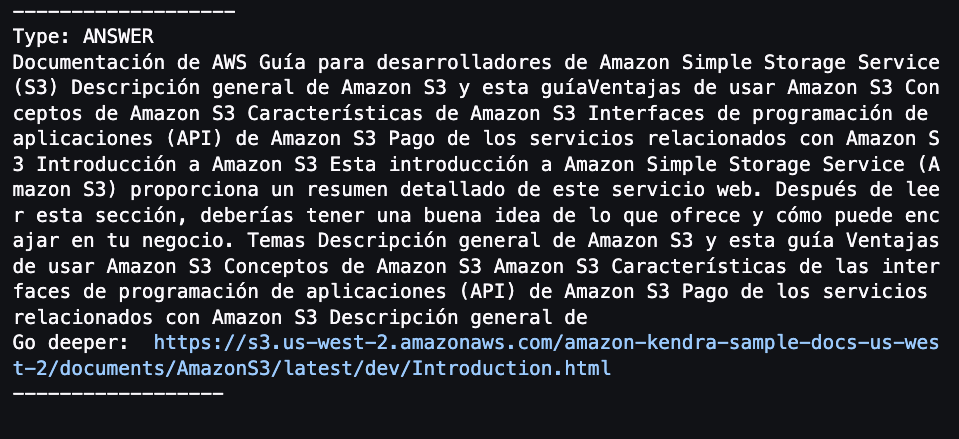
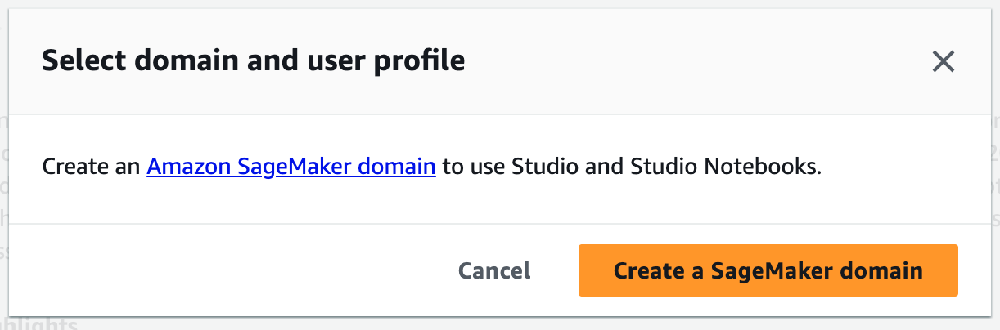

|ToC|
|---|

Organizations often accumulate a wide range of documents, including project documentation, manuals, tenders, Salesforce data, code repositories, and more. When searching through this vast amount of information, it can be a tedious process of locating the specific document and then conducting the search within it. Once you find the desired document, it may be lengthy, and you might prefer a summary of its content.

Web applications are available to summarize, however you should watch out! Using them could mean sharing your organization's sensitive information: 🚨DANGER🚨.

Join me in this blog as I guide you through the process of building a comprehensive knowledge base using multiple sources. With this knowledge base you can seek answers to your queries and receive concise summaries along with links for further study. To ensure accessibility, we will facilitate this process through a convenient question-and-answer format available in multiple languages.

We will build it in two parts:

- Build a multilingual Q&A intelligent knowledge base.
- Summarize answers from an intelligent multilingual question and answer database..

## Build a multilingual Q&A intelligent knowledge base 🤖🌎

### 1. Build the smart database with [Amazon Kendra](https://aws.amazon.com/pm/kendra), using the sample data.🤖

Kendra is an intelligent search service powered by machine learning, where you can add, update, or delete automatically synchronize [multiples data source](https://docs.aws.amazon.com/kendra/latest/dg/hiw-data-source.html), and also index web pages by providing the URLs to crawling.

First you need to create a Kendra Index, to hold the contents of your documents and structured them in a way to make the documents searchable, follow the steps to create a [Kendra](https://console.aws.amazon.com/kendra/) Index in the console [here](https://docs.aws.amazon.com/kendra/latest/dg/gs-console.html)


Once the Index is **Active**, add a data source to an Index (Fig. 2), select **Add data source** and then select **Add dataset**, add a name and select English(en) in Language.


At the end of the data synchronization, you will have the knowledge base ready for queries.

[Here](https://docs.aws.amazon.com/kendra/latest/dg/getting-started.html) you can see more ways to upload sources to Kendra.

### 2.Queries to an index in Amazon Kendra - [Documentation](https://docs.aws.amazon.com/kendra/latest/dg/searching.html)

To search an Amazon Kendra index, you use the [Query](https://docs.aws.amazon.com/kendra/latest/APIReference/API_Query.html) API and it returns information about the indexed documents of Data sources.

Amazon Kendra utilizes various factors to determine the most relevant documents based on the search terms entered. These factors include the text/body of the document, document title, searchable custom text fields, and other relevant fields.

Additionally, filters can be applied to the search to narrow down the results, such as filtering documents based on a specific custom field like "department" (e.g., returning only documents from the "legal" department). For more information, see [Custom fields or attributes](https://docs.aws.amazon.com/kendra/latest/dg/custom-attributes.html).

You can query the Kendra API in several ways:

#### With the console

Go to the navigation panel on the left, choose the **Search indexed content** option, then enter a query in the text box and then press **enter** (Fig. 3).


**With AWS SDK for [Python(Boto3)](https://boto3.amazonaws.com/v1/documentation/api/latest/reference/services/kendra.html)** use this code:

``` python
import boto3

kendra = boto3.client("kendra")

def QueryKendra(index_id,query): 
    response = kendra_client.query(
        QueryText = query,
        IndexId = index_id)
    return response
```

#### Others

With [AWS SDK for Java](https://sdk.amazonaws.com/java/api/latest/software/amazon/awssdk/services/kendra/KendraClient.html) and [Postman](https://docs.aws.amazon.com/kendra/latest/dg/searching-example.html).

### 3. Add multilingual features

In this segment, you will use two AI/ML services that you can use with an API call:

- [Amazon Comprehend](https://aws.amazon.com/comprehend/) to detect determines the dominant language in which the question is asked, using [DetectDominantLanguage](https://boto3.amazonaws.com/v1/documentation/api/latest/reference/services/comprehend/client/detect_dominant_language.html#detect-dominant-language) from [Boto3 Comprehend client](https://boto3.amazonaws.com/v1/documentation/api/latest/reference/services/comprehend.html):

- [Amazon Translate](https://aws.amazon.com/translate/) to translate the question to the language of the Kendra knowledge base (English in this case) and translate the answer back to the language of the original question, using [TranslateText](https://boto3.amazonaws.com/v1/documentation/api/latest/reference/services/comprehend/client/detect_dominant_language.html#detect-dominant-language) from [Boto3 Translate client](https://boto3.amazonaws.com/v1/documentation/api/latest/reference/services/comprehend.html):

The TranslateText API needs the following parameters:

- **Text (string)**: The text to translate.
- **SourceLanguageCode (string):** One of the [supported language codes](https://docs.aws.amazon.com/translate/latest/dg/what-is-languages.html) for the source text, if you specify **auto** , Amazon Translate will call Amazon Comprehend to determine the source language.
- **TargetLanguageCode (string):** One of the supported language codes for the target text.

This will be the function that you will use to perform the translation:

```python
import boto3

translate_client = boto3.client('translate')

def TranslateText(text,SourceLanguageCode,TargetLanguage):
    response = translate_client.translate_text(
    Text=text,
    SourceLanguageCode=SourceLanguageCode,
    TargetLanguageCode=TargetLanguage
)
translated_text = response['TranslatedText']
source_language_code = response['SourceLanguageCode'] #you need it to answer in the original language
    return translated_text, source_language_code
```

If you want to know more about these services as API calls you can visit this blog: [All the things that Comprehend, Rekognition, Textract, Polly, Transcribe, and Others Do](/posts/all-the-things-that-comprehend-rekognition-textract-polly-transcribe-and-others-do)

The code of the multilingual Q&A intelligent knowledge base is:

```python
text = "¿que es s3?"
index_id = "xxxxxxxx-xxxx-xxxx-xxxx-xxxxxxxxxxxx"
TargetLanguage = "en" #English language code

query,source_language_code = TranslateText(text,"auto",TargetLanguage)
response = QueryKendra(index_id,query)

#print the result

for query_result in response["ResultItems"]:

        print("-------------------")
        print("Type: " + str(query_result["Type"]))

        if query_result["Type"]=="ANSWER" or query_result["Type"]=="QUESTION_ANSWER":
            answer_text = query_result['AdditionalAttributes'][0]['Value']['TextWithHighlightsValue']['Text'].replace('\n',"")
            answer_text_translated, language = TranslateText(answer_text,TargetLanguage,SourceLanguage)
            answer_text_translated, language = TranslateText(answer_text,TargetLanguage,SourceLanguage)
            print(answer_text_translated)
            print("Go deeper: ", query_result['DocumentURI'])

        if query_result["Type"]=="DOCUMENT":
            if "DocumentTitle" in query_result:
                document_title = query_result["DocumentTitle"]["Text"]
                document_title_translated,language = TranslateText(document_title,TargetLanguage,SourceLanguage)
                print("Title: " +document_title_translated)
            document_text = query_result["DocumentExcerpt"]["Text"]
            answer_text_translated,language = TranslateText(document_text,TargetLanguage,SourceLanguage)
            print(answer_text_translated)
            print("Go deeper: ", query_result['DocumentURI'])

        print("------------------\n\n")  
```

Amazon Kendra delivers two results: Answer and Documents, and the answer could be big (Fig. 4), but wouldn't a summarized result be better?. Which leads us to the next step.



## Summarize answers from an intelligent multilingual question and answer database. 🤖🌎🚀

### 1. Create ENDPOINT to invoke model of summarization using Sagemaker Jumpstart 🚀

In this part you are going to use a [Amazon SageMaker Domain](https://docs.aws.amazon.com/sagemaker/latest/dg/sm-domain.html) as [Machine Learning Environments](https://docs.aws.amazon.com/sagemaker/latest/dg/machine-learning-environments.html), where AWS provides all the necessary infrastructure to train and deploy the model, which once ready you can discard on that environment you will use [SageMaker JumpStart](https://docs.aws.amazon.com/sagemaker/latest/dg/studio-jumpstart.html) which provides pre-trained, open-source models for a wide range of problem types (as our problem to summarize) to help you get started with machine learning, and the best is you can also access a models using the [SageMaker Python SDK](https://sagemaker.readthedocs.io/en/stable/overview.html#use-sagemaker-jumpstart-algorithms-with-pretrained-models).

Now that I've introduced you to [SageMaker JumpStart](https://docs.aws.amazon.com/sagemaker/latest/dg/studio-jumpstart.html), let's start working with it:

_||

1. Open the [Amazon Sagemaker console](https://console.aws.amazon.com/sagemaker/)
_||


_==

_||

2. Find JumpStart on the left-hand navigation panel and choose Foundation models.

_||


_==

_||

3. Search for a [**Flan UL2**](https://huggingface.co/google/flan-ul2) model, and then click on **View model**.

_||


_==

_||

4. Open notebook in [Studio](https://aws.amazon.com/sagemaker/studio/)

_||


_==

_||

5. Create a [Sagemaker Domain](https://docs.aws.amazon.com/sagemaker/latest/dg/gs-studio-onboard.html) using [Quick setup](https://docs.aws.amazon.com/sagemaker/latest/dg/onboard-quick-start.html), this takes a few minutes⏳... or **Select domain and user profile** if you already have one created.

_||



_==

_||

6. Follow the steps in jupyter notebook, explore it, and wait for me in step **5**

_||


_==

In the jupyter notebook you can use FLAN-T5 model for many NLP tasks, without fine-tuning the model, such as:

- Text summarization
- Common sense reasoning / natural language inference
- Question and answering
- Sentence / sentiment classification
- Translation
- Pronoun resolution

Go to part 3 in jupyter notebook to deploy a [sagemaker endpoint](https://docs.aws.amazon.com/sagemaker/latest/dg/inference-recommender.html), this is the call to do [real-time inference](https://docs.aws.amazon.com/sagemaker/latest/dg/realtime-endpoints.html) to ML model as an API call, using Boto3 and AWS credentials.

You can get the Sagemaker Endpoint in two ways:

- [SageMaker Python SDK](https://sagemaker.readthedocs.io/en/stable/overview.html#use-prebuilt-models-with-sagemaker-jumpstart):

```code
model_predictor.endpoint_name
```

- Console:

Find **Inference** on the left-hand navigation panel and choose **Endpoints**.

> 🚨**Note:** You have to be careful, because while the endpoint is active, the EC2 instance is also active, so you are billing, check [pricing here](https://aws.amazon.com/es/sagemaker/pricing/).

### 2. 👩🏻‍🔬 Add summarization features

In **[step 5](https://github.com/aws/amazon-sagemaker-examples/blob/main/introduction_to_amazon_algorithms/jumpstart-foundation-models/text2text-generation-flan-t5-ul2.ipynb)** on Jupyter notebook you can see the advanced parameters to control the generated text while performing inference definition that this model supports.

Let's define the parameters as follows:

```python
import json
num_return_sequences = 3
parameters = {
    "max_length": 50,
    "max_time": 50,
    "num_return_sequences": num_return_sequences,
    "top_k": 50,
    "top_p": 0.95,
    "do_sample": True,
}
```

To get inferences from the model hosted at the specified endpoint you need to use the [InvokeEndpoint API](https://docs.aws.amazon.com/sagemaker/latest/APIReference/API_runtime_InvokeEndpoint.html) from the [Amazon SageMaker Runtime](https://boto3.amazonaws.com/v1/documentation/api/latest/reference/services/sagemaker-runtime.html), you do it with the following function:

```python
def query_endpoint_with_json_payload(encoded_json, endpoint_name):
    client = boto3.client("runtime.sagemaker")
    response = client.invoke_endpoint(
        EndpointName=endpoint_name, ContentType="application/json", Body=encoded_json
    )
    return response
```

[InvokeEndpoint API parameters](https://boto3.amazonaws.com/v1/documentation/api/latest/reference/services/sagemaker-runtime/client/invoke_endpoint.html)

To make the response human readable, with the following function:

```python
def parse_response_multiple_texts(query_response):
    model_predictions = json.loads(query_response["Body"].read())
    generated_text = model_predictions["generated_texts"]
    return generated_text
```

```python
def summarization(text):
    
    payload = {"text_inputs": f"Briefly summarize this sentence: {text}", **parameters}
    query_response = query_endpoint_with_json_payload(
            json.dumps(payload).encode("utf-8"), endpoint_name=endpoint_name
        )

    generated_texts = parse_response_multiple_texts(query_response)

    print(f"{bold} The {num_return_sequences} summarized results are{unbold}:{newline}")

    for idx, each_generated_text in enumerate(generated_texts):
        #Translate the answer to the original language of the question
        answer_text_translated,language = TranslateText(each_generated_text,TargetLanguage,SourceLanguage)

        print(f"{bold}Result {idx}{unbold}: {answer_text_translated}{newline}")  

    return
```

With the following function print the summarized result of Amazon Kendra:

```python
def show_result_answer (response):
    for query_result in response["ResultItems"]:

        if query_result["Type"]=="ANSWER" or query_result["Type"]=="QUESTION_ANSWER":
            answer_text = query_result['AdditionalAttributes'][0]['Value']['TextWithHighlightsValue']['Text']
            resume(answer_text)
            print("Go deeper: ", query_result['DocumentURI'])
```

Bring all the code together and *Build your own knowledge base with multilingual Q&A powered by generative AI*

```python
text = "Que es S3?"
#SourceLanguage = DetectDominantLanguage(text)
query,source_language_code = TranslateText(text,"auto",TargetLanguage)
response = QueryKendra(index_id,query)
show_result_answer(response)
```

In Fig 5 you can see 3 results of the summarized text, this is because you set num_return_sequences parameter to 3:


## Conclusion

Thank you for joining me on this journey, where you Gather all the code and build your own knowledge base with multilingual Q&A powered by generative AI. This database allows you to make inquiries in any language, receiving summarized responses in the desired language, all prioritizing data privacy.

To enhance the performance of this application, you can introduce a caching mechanism by incorporating an Amazon DynamoDB table. In this table, you can store the responses obtained from Amazon Kendra, utilizing the response as the partition key and the summary as the sort key. By implementing this approach, you can first consult the table before generating the summary, thereby delivering faster responses and optimizing the overall user experience.

Some links for you to continue learning:

- [Welcome to Kendra Essentials+](https://catalog.us-east-1.prod.workshops.aws/workshops/df64824d-abbe-4b0d-8b31-8752bceabade/en-US)

- [Integrate Amazon Kendra and Amazon Lex using a search intent](https://aws.amazon.com/es/blogs/machine-learning/integrate-amazon-kendra-and-amazon-lex-using-a-search-intent/)

- [Amazon SageMaker Examples - Introduction to Amazon Algorithms](https://github.com/aws/amazon-sagemaker-examples/tree/main/introduction_to_amazon_algorithms)
